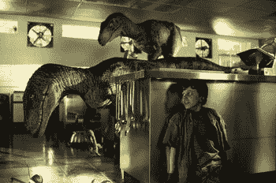

# 3 种类型的图像搜索引擎:元数据搜索、实例搜索和混合搜索

> 原文：<https://pyimagesearch.com/2014/01/15/the-3-types-of-image-search-engines-search-by-meta-data-search-by-example-and-hybrid/>

你想建立什么类型的图像搜索引擎？你的搜索引擎会依赖与图片相关的标签、关键词和文本吗？那么你可能正在建立一个通过元数据搜索图片的搜索引擎。

你真的在检查图像本身并试图理解图像包含的内容吗？你是否正在尝试*量化图像*并提取一组数字来表示图像的颜色、纹理或形状？然后，你可能会建立一个搜索的例子图像搜索引擎。

还是你*结合了上面的两种方法*？你是否依赖与图像相关的文本信息，然后量化图像本身？听起来像一个混合图像搜索引擎。

让我们继续下去，分解这些类型的图片搜索引擎，并试图更好地理解它们。

## 按元数据搜索

你去谷歌一下。你会看到一个非常熟悉的图标，一个可以输入关键词的文本框，以及两个按钮:“谷歌搜索”和“我感觉很幸运”。这就是我们喜欢和崇拜的文本搜索引擎。手动输入关键字并查找相关结果。

事实上，元数据图像搜索引擎与上面提到的文本搜索引擎只有微小的不同。元数据图像搜索引擎的搜索很少检查实际图像本身。相反，它依赖于文本线索。这些线索可以来自各种来源，但两种主要方法是:

### **1。手动标注:**

在这种情况下，管理员或用户提供建议图像内容的标签和关键字。例如，让我们来看看我最喜欢的电影《侏罗纪公园》中的一个片头。

**Figure 1:** Let’s assign some keywords and tags to this image: *dinosaur, velociraptors, kitchen, restaurant kitchen, boy, scared*

我们会将什么类型的标签或关键词与这张图片联系起来？嗯，我们看到有两只*恐龙*，但更准确地说，它们是*迅猛龙*。显然，这是某种类型的*厨房*，但它不像你家或公寓里的厨房。一切都是不锈钢和工业级的——这显然是一个*餐厅厨房*。最后，我们看到提姆，一个看起来很害怕的男孩。仅仅看了这张图片一两秒钟，我们就想出了六个标签来描述这个图片:*恐龙、*迅猛龙、厨房、** *工业厨房、男孩*和*惊吓*。这是一个手动注释图像的例子。我们正在做这项工作，我们向计算机提供暗示图像内容的关键词。

### **2。上下文提示:**

通常，上下文提示仅适用于网页。与手工注释不同，在手工注释中，我们必须用手想出标签，上下文提示会自动检查图像周围的文本或图像出现的文本。这种方法的缺点是，我们假设图像的内容与网页上的文本相关。这可能适用于维基百科等网站，页面上的图像与文章内容相关，但如果我在这个博客上实现元数据搜索算法，它会(错误地)将上面的侏罗纪公园图像与一堆与图像搜索引擎相关的关键词关联起来。虽然我个人认为这很有趣，但它展示了上下文暗示方法的局限性。

通过使用文本关键词(无论是上下文提示的手动注释)来表征图像，我们实际上可以将一个*图像搜索引擎*构建为一个*文本搜索引擎*，并应用来自[信息检索](http://en.wikipedia.org/wiki/Information_retrieval)的标准实践。正如我上面提到的，图像搜索引擎通过元数据实现搜索的最好例子是标准的 Google、Bing 或 Yahoo 搜索，它们利用文本关键字而不是图像本身的内容。接下来，让我们研究一下考虑图像实际内容的图像搜索引擎。

## 按示例搜索

想象你是谷歌或者 TinEye。你有数十亿张可以搜索的图片。你要手动标记每一张图片吗？不会吧。那太费时、乏味而且昂贵。语境提示呢？这是一个自动的方法，对吗？当然，但是记住我上面提到的限制。你可能会得到一些非常奇怪的结果，如果你仅仅依靠图片所在网页上的文字。

相反，你可以建立一个“按例子搜索”的图像搜索引擎。这些类型的图像搜索引擎试图量化图像本身，被称为基于内容的图像检索系统。一个简单的例子是通过图像中像素强度的平均值、标准偏差和偏斜度来表征图像的颜色。(*快速提示:如果您正在构建一个简单的图片搜索引擎，在许多情况下，这种方法实际上工作得相当好)*。

给定一个图像数据集，我们将计算数据集中所有图像的这些[矩](http://en.wikipedia.org/wiki/Moment_(mathematics))，并将它们存储在磁盘上。当我们量化一幅图像时，我们是*描述*一幅图像并提取*图像特征*。这些图像特征是图像的抽象，用于表征图像的内容。从图像集合中提取特征的过程被称为*索引*。

好了，现在我们已经从数据集中的每张图片中提取了特征。如何执行搜索？嗯，第一步是为我们的系统提供一个*查询图像*，一个我们在数据集中寻找的例子。查询图像的描述方式与我们的索引图像完全相同。然后，我们使用一个距离函数，例如[欧几里德距离](http://en.wikipedia.org/wiki/Euclidean_distance)，将我们的查询特征与我们的索引数据集中的特征进行比较。然后根据相关性对结果进行排序(欧几里德距离越小意味着越“相关”)并呈现给我们。

通过示例图片搜索引擎进行搜索的例子有 [TinEye](http://www.tineye.com) 、 [Incogna](http://www.incogna.com/) 以及我自己的 [Chic Engine](http://www.chicengine.com) 和 [ID My Pill](http://www.idmypill.com) 。在所有这些示例中，从查询图像中提取特征，并将其与特征数据库进行比较。

## 混合工艺

让我们假设我们正在为 Twitter 构建一个图像搜索引擎。Twitter 允许你在推文中加入图片。当然，Twitter 允许你为你的推文提供标签。

如果我们使用标签来建立一个元数据图片搜索引擎，然后分析和量化图片本身来建立一个示例图片搜索引擎呢？如果我们采用这种方法，我们将构建一个*混合图像搜索引擎*，它包括文本关键词以及从图像中提取的特征。

我能想到的这种混合方法的最好例子是谷歌图片搜索。谷歌图片搜索实际上是分析图片本身吗？你打赌它是。但谷歌首先主要是一个文本搜索引擎，所以它也允许你通过元数据进行搜索。

## 摘要

如果你依赖于由真实的人提供的标签和关键词，你正在建立一个通过元数据搜索的图像搜索引擎。如果您的算法分析图像本身，并通过提取特征来量化图像，那么您正在创建一个按示例搜索的搜索引擎，并正在执行基于内容的图像检索(CBIR)。如果你同时使用关键字提示和特性，你就建立了两者的混合方法。