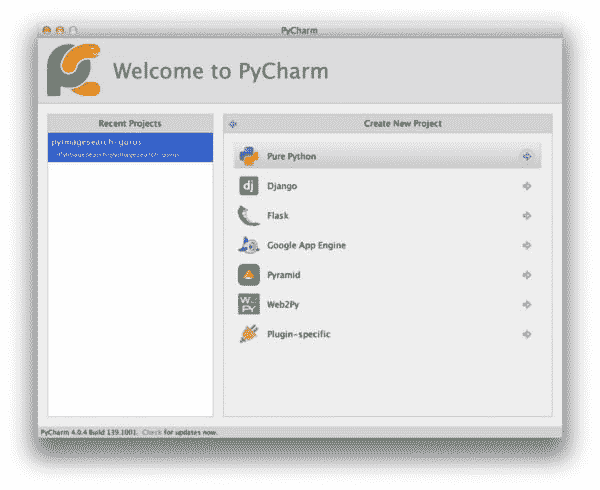
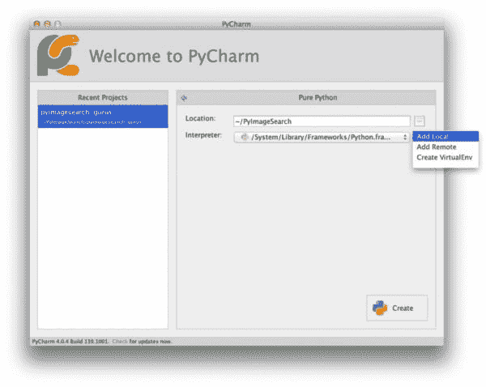
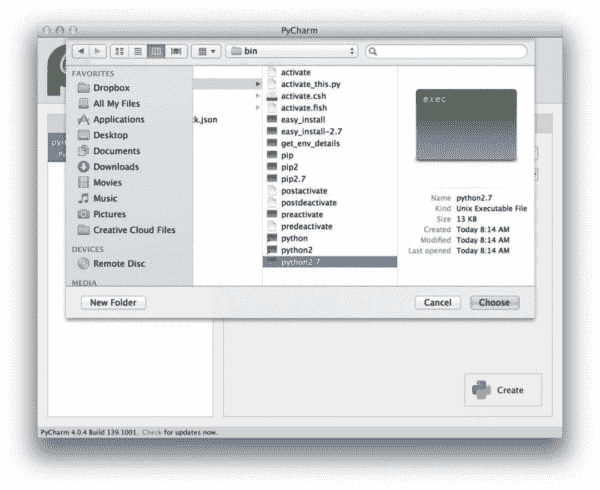
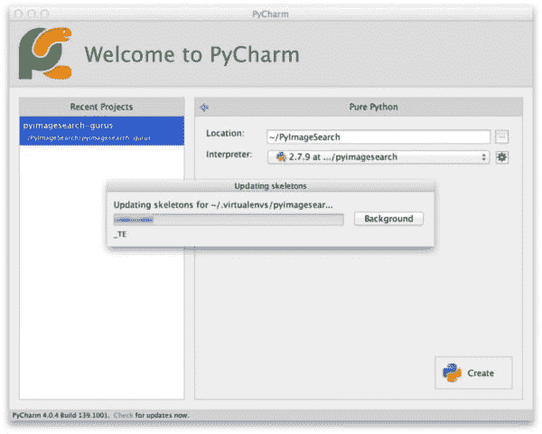
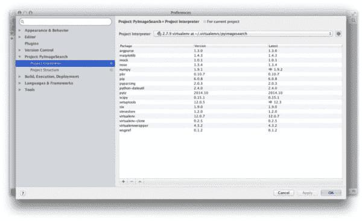

# 完美的计算机视觉环境:PyCharm、OpenCV 和 Python 虚拟环境

> 原文：<https://pyimagesearch.com/2015/08/17/the-perfect-computer-vision-environment-pycharm-opencv-and-python-virtual-environments/>

[](https://pyimagesearch.com/wp-content/uploads/2015/03/pycharm_opencv_logos.jpg)

你知道是什么造就了一个(不那么)有趣的周末吗？

在 MacBook Pro 上重新配置和安装 OSX。显然，我旅行时用的 13 英寸 MacBook Pro 决定拉屎了。

不过不用担心，我用的是[复写克隆器](https://bombich.com/)和[备份器](https://www.backblaze.com/)，所以没有数据丢失。老实说，我考虑在我的旅行系统上重建开发环境已经有一段时间了。当我在旅行中使用我的 13 英寸 MacBook Pro 时，我有第二个 MacBook Pro，我每天都用它作为我的主要开发系统。在过去的两年里，两者之间的开发环境变得非常不同步，几乎无法使用。

周日晚上，当我坐下来，看着铁砧形状的雷雨云在长岛海峡翻滚，我花了一秒钟，啜饮了一些茶(掺有一些薄荷杜松子酒；这是周末，当然)从我的杯子里，看着闪电随意地划过天空。

看着雷雨滚滚而来，你会有一种平静的安详——当你设置 PyCharm 来玩 OpenCV 和虚拟环境时，希望本指南的其余部分能给你一些平静的安详。

# PyCharm、虚拟环境和 OpenCV

这篇博文的其余部分将假设您已经在系统上安装了 OpenCV 和适当的 Python 绑定。我还将假设您已经安装了 [virtualenv](https://virtualenv.pypa.io/en/latest/) 和 [virtualenvwrapper](https://virtualenvwrapper.readthedocs.org/en/latest/) 。

这些安装说明和相关的截屏是在我的 OSX 机器上收集的，但是这些说明在 Linux 和 Windows 上都可以工作(对于 Windows，你当然必须改变文件的不同路径，但是没关系)。

我还会用 Python 2.7 和 OpenCV 2.4.X 来设置我的系统。然而，您也可以使用相同的指令来设置 Python 3 和 OpenCV 的环境，您只需要更改 Python 和 OpenCV 文件的路径。

## 步骤 1:创建您的虚拟环境

我们要做的第一件事是设置我们的虚拟环境。打开一个终端，创建你的虚拟环境。对于本例，我们将虚拟环境命名为`pyimagesearch`:

```py
$ mkvirtualenv pyimagesearch

```

现在我们的虚拟环境已经设置好了，让我们安装 NumPy、Scipy、matplotlib、scikit-learn 和 scikit-image，它们都是计算机视觉开发中常用的工具:

```py
$ pip install numpy
$ pip install scipy
$ pip install matplotlib
$ pip install scikit-learn
$ pip install -U scikit-image

```

## 第二步:符号链接你的 cv2.so 和 cv.py 文件

我相信您已经知道，OpenCV 不是 pip 可安装的。您需要手动将您的`cv2.so`和`cv.py`文件符号链接到`pyimagesearch`虚拟环境的站点包目录中。

在我的系统上，OpenCV 安装在`/usr/local/lib/python2.7/site-packages/`

对于您的系统来说可能不是这样，所以一定要找到您的 OpenCV 安装路径并记下来——在接下来的步骤中您将需要这个路径。

现在我们有了 OpenCV 安装的路径，我们可以将它符号链接到我们的虚拟环境中:

```py
$ cd ~/.virtualenvs/pyimagesearch/lib/python2.7/site-packages/
$ ln -s /usr/local/lib/python2.7/site-packages/cv.py cv.py
$ ln -s /usr/local/lib/python2.7/site-packages/cv2.so cv2.so

```

## 步骤 3:配置 PyCharm

如果你还没有使用 [PyCharm IDE](https://www.jetbrains.com/pycharm/) 来编辑你的代码，它绝对值得一看。他们有一个免费的社区版和一个付费版，都有一些漂亮的铃铛和哨子。

很难相信，但多年来我在 PyCharm 都是反其道而行之，不予理会。

你看，在大学的时候，我被迫使用 Eclipse 进行 Java 开发——由于我从来不喜欢 Java 或 Eclipse，我(无知地)拒绝了任何让我想起它的 IDE。伙计，那是个巨大的错误。

大约六个月前，我决定给皮查姆一个真正的机会，不要让我以前的经历影响我的看法。简而言之，这是我在开发环境方面做出的最好的选择之一。

不管怎样，现在我们的虚拟环境已经设置好了，让我们将它连接到 PyCharm 项目。

打开 PyCharm 并创建一个新的“纯 Python”项目:

[](https://pyimagesearch.com/wp-content/uploads/2015/03/pycharm_new_project.jpg)

**Figure 1:** Creating a new Pure Python project in PyCharm.

在这里，我们需要设置 Python 解释器的位置。在大多数情况下，这个位置将指向您的 Python 系统安装。但是，我们不想使用系统 Python —我们想使用属于我们的`pyimagesearch`虚拟环境的 Python，所以单击齿轮图标并选择“添加本地”:

[](https://pyimagesearch.com/wp-content/uploads/2015/03/pycharm_add_local.jpg)

**Figure 2:** Specifying that we want to use a local Python environment rather than the default system Python.

接下来，我们需要指定虚拟环境中 **Python 二进制文件** **的路径。**

在我的例子中，`pyimagesearch`虚拟环境位于`~/.virtualenvs/pyimagesearch/`中，而实际的 Python 二进制文件位于`~/.virtualenvs/pyimagesearch/bin`中。

在任何情况下，请确保导航到适用于您的虚拟环境的 Python 二进制文件，然后单击“选择”:

[](https://pyimagesearch.com/wp-content/uploads/2015/03/pycharm_select_path.jpg)

**Figure 3:** Selecting the pyimagesearch Python binary.

选择虚拟环境后，PyCharm 将花几秒钟时间更新项目框架:

[](https://pyimagesearch.com/wp-content/uploads/2015/03/pycharm_updating_skeletons.jpg)

**Figure 4:** PyCharm updating the project skeletons for our computer vision virtual environment.

一旦骨骼更新完成，点击“创建”按钮启动你的项目。

这就是全部了！

# 搞定了。

在这之后，你都设置好了。PyCharm 将使用您的`pyimagesearch`虚拟环境，并将识别 OpenCV 库。

如果您想要更新您正在使用的项目的虚拟环境，只需在 PyCharm 首选项面板中，选择左侧栏中的项目选项卡，然后选择“项目解释器”:

[](https://pyimagesearch.com/wp-content/uploads/2015/03/pycharm_preferences.jpg)

**Figure 5:** Updating the virtual environment for a project already created with PyCharm.

# 摘要

在这篇博文中，我向您展示了如何在我最喜欢的 IDE[py charm](https://www.jetbrains.com/pycharm/)中利用虚拟环境和 OpenCV。

我希望这篇文章对你设置下一个 Python + OpenCV 项目有用！

如果您还没有使用 PyCharm，它绝对值得一看。