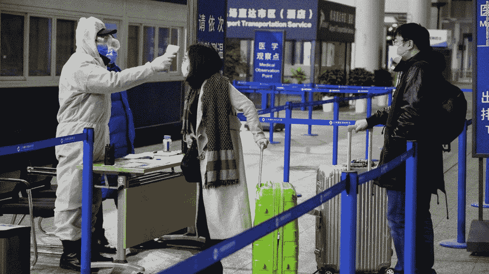
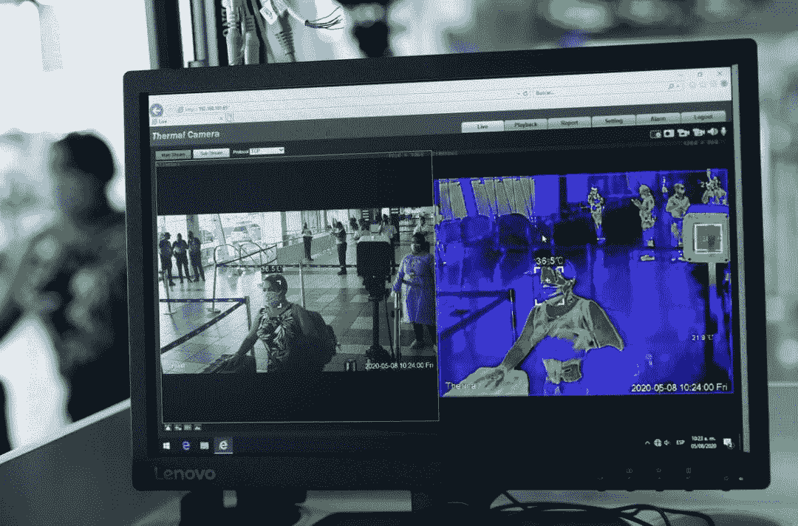
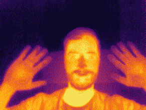
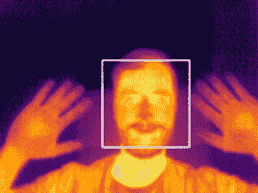
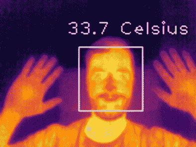
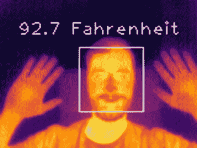

# 热视觉:带 Python 和 OpenCV 的发热探测器(入门项目)

> 原文：<https://pyimagesearch.com/2022/10/24/thermal-vision-fever-detector-with-python-and-opencv-starter-project/>

* * *

## **目录**

* * *

## [**热视觉:带 Python 和 OpenCV 的发热探测器(入门项目)**](#TOC)

在本课中，您将把上两节课学到的知识应用到一个入门项目中，包括:

*   热图像中的简单人脸检测
*   发热检测(近似解决方案)
*   实时发烧检测您的树莓皮在 3 个步骤

本教程是关于**红外视觉基础知识**的 4 部分系列中的第 3 部分:

1.  [*红外视觉介绍:近中远红外图像*](https://pyimg.co/oj6kb)
2.  [*热视觉:用 Python 和 OpenCV* 从图像中测量你的第一个温度 ](https://pyimg.co/mns3e)
3.  ***[热视觉:用 Python 和 OpenCV 实现的发热探测器(入门项目)](http://pyimg.co/6nxs0)* (今日教程)**
4.  *热视觉:用 PyTorch 和 YOLOv5 探测夜间物体(真实项目)*

本课结束时，您将能够通过估计人脸的温度，在热图像、视频或摄像机视频流中实时检测人脸。

我们希望本教程能启发您将温度测量应用到项目中的图像。

* * *

***免责声明* :** *本教程试图利用热像来估计人体温度。这并不意味着新冠肺炎或其他疾病可以用建议的方法检测出来。我们鼓励您遵循美国美国食品药品监督管理局(FDA)* *[*指南*](https://www.fda.gov/regulatory-information/search-fda-guidance-documents/enforcement-policy-telethermographic-systems-during-coronavirus-disease-2019-covid-19-public-health)* *来更深入地了解这个主题。*

* * *

### [**热图像中简单的人脸检测**](#TOC)

* * *

#### [**简介**](#TOC)

您可能已经注意到，由于 COVID 疫情的出现，用于大众门禁控制的热红外摄像机和热红外温度计的需求大幅增长。

我们可以找到这种设备，例如，在机场或其他群体事件中，如图**图 1** 所示。

[](https://pyimagesearch.com/wp-content/uploads/2022/09/figure-1-a-manual-thermal-thermometer-control-in-an-airport-scaled.jpg)[](https://pyimagesearch.com/wp-content/uploads/2022/09/figure-1-b-automatic-thermal-camera-control-in-anairport-scaled.jpg)

**Figure 1:** *Top*: Manual thermal thermometer control in an airport ([source](https://edition.cnn.com/2020/02/19/health/coronavirus-airport-temperature-checks/index.html)). *Bottom*: Automatic thermal camera control in an airport ([source](https://www.reviewjournal.com/business/casinos-gaming/thermal-cameras-latest-eyes-in-the-sky-at-las-vegas-casinos-2039614/)).

正如我们已经了解到的，热感相机让我们能够通过应用我们作为计算机视觉初学者/从业者/研究人员/专家的知识，为这个现实生活中的问题做出贡献。

因此，让我们从我们的热图像中的面部检测开始！

计算机视觉为我们提供了许多方法来检测标准彩色可见光/RGB 图像中的人脸:哈尔级联、梯度方向直方图(HOG) +线性支持向量机(SVM)、深度学习方法等。

有大量的在线教程，但在这里[你可以找到 4 种最流行的面部检测方法，并以简单明了的方式进行解释。](https://pyimagesearch.com/2021/04/26/face-detection-tips-suggestions-and-best-practices/)

但是热成像发生了什么呢？

我们将尝试快速回答这个问题。

让我们通过将上述方法分为两组来简化问题:

*   **人脸检测的传统机器学习:** Haar 级联和梯度方向直方图(HOG) +线性支持向量机(SVM)。
*   **深度学习(卷积神经网络)人脸检测方法:**最大间隔对象检测器(MMOD)和单镜头检测器(SSD)。

乍一看，我们可以考虑使用其中任何一种。

尽管如此，看看面部检测技巧、建议和最佳实践，我们应该验证所使用的库 OpenCV 和 Dlib 是否实现了在热图像上训练的算法。

或者，我们可以训练自己的面部检测器模型，这显然超出了我们红外视觉基础课程的范围。

此外，我们应该考虑到，作为本教程的起始项目，我们希望将我们的解决方案集成到一个 Raspberry Pi 中。所以，我们需要一个又快又小的模型。

因此，出于这些原因并为了简化本教程，我们将使用**哈尔级联**方法(**图 2** )。

* * *

#### [**热人脸检测与哈尔喀**](#TOC)

保罗·维奥拉和迈克尔·琼斯在 2001 年的[快速物体检测中提出了这个著名的物体检测器，使用简单特征的增强级联](https://www.cs.cmu.edu/~efros/courses/LBMV07/Papers/viola-cvpr-01.pdf)。

是的，2001 年，“几年前”。

是的。我们已经在热图像上测试过了，它不需要我们的任何培训就能工作！

* * *

### [**配置您的开发环境**](#TOC)

要遵循这个指南，您需要在您的系统上安装 OpenCV 库。

幸运的是，OpenCV 可以通过 pip 安装:

```py
$ pip install opencv-contrib-python
```

**如果您需要帮助配置 OpenCV 的开发环境，我们*强烈推荐*阅读我们的** [***pip 安装 OpenCV* 指南**](https://pyimagesearch.com/2018/09/19/pip-install-opencv/)——它将在几分钟内让您启动并运行。

* * *

### [**在配置开发环境时遇到了问题？**](#TOC)

说了这么多，你是:

*   时间紧迫？
*   了解你雇主的行政锁定系统？
*   想要跳过与命令行、包管理器和虚拟环境斗争的麻烦吗？
*   **准备好在您的 Windows、macOS 或 Linux 系统上运行代码*****？***

 *那今天就加入 [PyImageSearch 大学](https://pyimagesearch.com/pyimagesearch-university/)吧！

**获得本教程的 Jupyter 笔记本和其他 PyImageSearch 指南，这些指南是** ***预先配置的*** **，可以在您的网络浏览器中运行在 Google Colab 的生态系统上！**无需安装。

最棒的是，这些 Jupyter 笔记本可以在 Windows、macOS 和 Linux 上运行！

* * *

### [**项目结构**](#TOC)

首先访问本教程的 ***“下载”*** 部分，检索源代码和示例图像。

开始编码吧。

首先，看看我们的项目结构:

```py
$ tree --dirsfirst
.
├── fever_detector_image.py
├── fever_detector_video.py
├── fever_detector_camera.py
├── faces_gray16_image.tiff
├── haarcascade_frontalface_alt2.xml
└── gray16_sequence
    ├── gray16_frame_000.tiff
    ├── gray16_frame_001.tiff
    ├── gray16_frame_002.tiff
    ├── ...
    └── gray16_frame_069.tiff

1 directory, 76 files
```

我们将对热图像中的人脸应用 Haar 级联算法，然后是热视频序列，最后是使用 USB 视频类(UVC)热摄像机。这些部分分别在以下版本中实现:

1.  `fever_detector_image.py`:对输入图像应用 Haar 级联人脸检测算法(`faces_gray16_image.tiff`)。
2.  `fever_detector_video.py`:将 Haar 级联人脸检测算法应用于输入视频帧(`gray16_sequence`文件夹)。
3.  `fever_detector_camera.py`:将 Haar 级联人脸检测应用于 UVC 热感摄像机的视频输入流。

整堂课我们都将遵循这个结构。

`faces_gray16_image.tiff`是我们的 raw gray16 热像，如**图 3** 、*右*所示，提取自热像仪[**RGM vision thermal cam 1**](https://www.rgmvision.com/)。

`gray16_sequence`文件夹包含一个视频序列样本。

`haarcascade_frontalface_alt2.xml`文件是我们预先训练好的人脸检测器，由 OpenCV 库( [GitHub](https://github.com/opencv/opencv/tree/master/data/haarcascades) )的开发者和维护者提供。

* * *

## [**人脸检测**](#TOC)

* * *

#### [**热图像中的人脸检测**](#TOC)

打开您的`fever_detector_image.py`文件并导入 NumPy 和 OpenCV 库:

```py
# import the necessary packages
import cv2
import numpy as np
```

您应该已经安装了 NumPy 和 OpenCV 库。

首先，我们将开始打开热灰色图像:

```py
# open the gray16 image
gray16_image = cv2.imread("faces_gray16_image.tiff", cv2.IMREAD_ANYDEPTH)
```

`cv2.IMREAD_ANYDEPTH`标志允许我们以 16 位格式打开灰色 16 图像。

```py
# convert the gray16 image into a gray8
gray8_image = np.zeros((120,160), dtype=np.uint8)
gray8_image = cv2.normalize(gray16_image, gray8_image, 0, 255, cv2.NORM_MINMAX)
gray8_image = np.uint8(gray8_image)
```

在**第 9-11 行**上，我们分别创建一个空的`160x120`图像，我们将 gray16 图像从 0-65，553 (16 位)归一化到 0-255 (8 位)，我们确保最终图像是 8 位图像。

我们使用`160x120`分辨率，因为`faces_gray16_image.tiff` gray16 图像有这个尺寸。

然后，我们使用我们最喜欢的 OpenCV colormap*为 gray8 图像着色，以获得不同的热调色板(**图 3** ，中间):

```py
# color the gray8 image using OpenCV colormaps
gray8_image = cv2.applyColorMap(gray8_image, cv2.COLORMAP_INFERNO)
```

(*)请访问 OpenCV 中的[色彩映射表，以确保您选择的色彩映射表在您的 OpenCV 版本中可用。在这种情况下，我们使用的是 OpenCV 4.5.4。](https://docs.opencv.org/4.5.4/d3/d50/group__imgproc__colormap.html)

最后，我们实现了我们的 Haar 级联算法。

```py
# load the haar cascade face detector
haar_cascade_face = cv2.CascadeClassifier('haarcascade_frontalface_alt2.xml')
```

在**第 17 行**上，加载了由 OpenCV 库(GitHub)的开发者和维护者提供的带有我们预先训练好的人脸检测器的 XML `haarcascade_frontalface_alt2.xml`文件。

```py
# detect faces in the input image using the haar cascade face detector
faces = haar_cascade_face.detectMultiScale(gray8_image, scaleFactor=1.1, minNeighbors=5, minSize=(10, 10), flags=cv2.CASCADE_SCALE_IMAGE)
```

在**第 20 行**上，应用了哈尔级联检测器。

```py
# loop over the bounding boxes
for (x, y, w, h) in faces:
# draw the rectangles
cv2.rectangle(gray8_image, (x, y), (x + w, y + h), (255, 255, 255), 1)
```

在**第 23-25 行**上，我们循环检测到的人脸，并绘制相应的矩形。

```py
# show result
cv2.imshow("gray8-face-detected", gray8_image)
cv2.waitKey(0)
```

最后，我们展示结果(**第 28 行和第 29 行**)。

没错！我们正在检测热红外图像上的人脸(**图三**、*右图*)。

[](https://lh3.googleusercontent.com/_Xnk2VstxAkppUv8Lf3JzWPv4jo7UQasw1dQk9BvApJcRN_orfSWCaWAI_qhhUuGCtuBZ78HPzufX-nOBOn2FqQDx7-vb6l2qBwjiHcqM7GCQ6__fHygzTQ-K-IwH8WtSnMDfFcSSQEZxXwxcyPDNEkPpOpxCBRTcyxP2YWCxw6WzGbVkzQi6nTP)[](https://lh6.googleusercontent.com/wYDxpxH2hSm8qk3q1qKxS0OLfkKznIao9OPlTX8Clq05-L-INO8BILfMiUYPM1yecpnNtGCJwGkJaeCH5t1oDactqKKLhD3OJkoJSEuxp-AhwiibBfPiSZN1PRlc7NelkRi73tOL2wbGc7me6a_brBKx5Cun9oiB8CS2ADi3rDMgOr36cBtqMQF3)[](https://lh4.googleusercontent.com/fTrCjx-H3VqEsaHJ0QfY2dt6Ns5rkPaqKY-B1BvC3Iif_U07gMpqS3tDbtyC_gt48azhcgZ3TxsvDccYomxtiAZ-gXDO-GX8CWo0jGmDFE2lw67gomFJIiDt_nD2QkxGj8PqIqfI-Jse5tdeUrunGdoErUZhwmeDMY84XrvWv4KTiYfjkA6RTkux)

**Figure 3:** *Left*: Thermal gray16 image showing a face, `faces_gray16_image.tiff`. *Middle*: Thermal gray8 image after converting the gray16 `faces_gray16_image.tiff` and coloring it with the Inferno OpenCV colormap. *Right*: Haar Cascade face detector applied on the thermal gray8 image.

* * *

#### [**热视频序列中的人脸检测**](#TOC)

假设我们手头没有热感相机，并且想要检测热感视频流中的人脸，我们遵循前面相同的步骤。

为了简化，我们将使用存储在我们的`gray16_sequence`中的视频序列。此文件夹包含 TIFF 帧而不是 gray16 视频文件，因为标准压缩视频文件容易丢失信息。灰色的 16 帧保持了每个像素的温度值，我们用它来估计面部温度。

在导入必要的库之后，我们使用`fever_detector_video.py`文件来遵循我们在上一节中看到的相同过程，在每一帧上循环:

```py
# import the necessary packages
import numpy as np
import cv2
import os
import argparse
```

在本例中，我们还导入了 argparse 和 os 库。

```py
# construct the argument parse and parse the arguments
ap = argparse.ArgumentParser()
ap.add_argument("-v", "--video", required=True, help="path of the video sequence")
args = vars(ap.parse_args())
```

如果您熟悉 PyImageSearch 教程，那么您已经知道 argparse Python 库。我们用它在运行时给程序提供额外的信息(例如，命令行参数)。在这种情况下，我们将使用它来指定我们的热视频路径(**第 8-10 行**)。

```py
# load the haar cascade face detector
haar_cascade_face = cv2.CascadeClassifier("haarcascade_frontalface_alt2.xml")

# create thermal video fps variable (8 fps in this case)
fps = 8
```

让我们加载预训练的 Haar Cascade 人脸检测器，并定义每秒帧序列值(**第 13-16 行**):

```py
# loop over the thermal video frames to detect faces
for image in sorted(os.listdir(args["video"])):

    # filter .tiff files (gray16 images)
    if image.endswith(".tiff"):

        # define the gray16 frame path
        file_path = os.path.join(args["video"], image)

        # open the gray16 frame
        gray16_image = cv2.imread(args["video"], cv2.IMREAD_ANYDEPTH)

        # convert the gray16 image into a gray8
        gray8_frame = np.zeros((120, 160), dtype=np.uint8)
        gray8_frame = cv2.normalize(gray16_frame, gray8_frame, 0, 255, cv2.NORM_MINMAX)
        gray8_frame = np.uint8(gray8_frame)

        # color the gray8 image using OpenCV colormaps
        gray8_frame = cv2.applyColorMap(gray8_frame, cv2.COLORMAP_INFERNO)

        # detect faces in the input image using the haar cascade face detector
        faces = haar_cascade_face.detectMultiScale(gray8_frame, scaleFactor=1.1, minNeighbors=5, minSize=(10, 10),
                                                   flags=cv2.CASCADE_SCALE_IMAGE)
        # loop over the bounding boxes
        for (x, y, w, h) in faces:
            # draw the rectangles
            cv2.rectangle(gray8_frame, (x, y), (x + w, y + h), (255, 255, 255), 1)

        # show results
        cv2.imshow("gray8-face-detected", gray8_frame)

        # wait 125 ms: RGMVision ThermalCAM1 frames per second = 8
        cv2.waitKey(int((1 / fps) * 1000))
```

**第 19-50 行**包括检测每帧人脸的循环过程。

**图 4** 显示了视频场景中的人脸检测。

* * *

### [**发热检测**](#TOC)

* * *

#### [**热图像中的发热检测**](#TOC)

一旦我们学会了如何在我们的热图像中轻松地检测人脸，我们就需要测量每个像素的温度来决定一个人是否有正常值。

因此，我们将此过程分为两步:

1.  测量我们感兴趣区域(ROI)的温度值，即检测到的人脸的特定区域。
2.  为我们的 ROI 温度值设置一个阈值，以确定我们何时检测到发烧的人(或体温高于平时的人)。

我们继续编码吧！首先，我们打开我们的`fever_detector_image.py`文件。

```py
# loop over the bounding boxes to measure their temperature
for (x, y, w, h) in faces:

    # draw the rectangles
    cv2.rectangle(gray8_image, (x, y), (x + w, y + h), (255, 255, 255), 1)

    # define the roi with a circle at the haar cascade origin coordinate

    # haar cascade center for the circle
    haar_cascade_circle_origin = x + w // 2, y + h // 2
    # circle radius
    radius = w // 4

    # get the 8 most significant bits of the gray16 image
    # (we follow this process because we can't extract a circle
    # roi in a gray16 image directly)
    gray16_high_byte = (np.right_shift(gray16_image, 8)).astype('uint8')

    # get the 8 less significant bits of the gray16 image
    # (we follow this process because we can't extract a circle
    # roi in a gray16 image directly)
    gray16_low_byte = (np.left_shift(gray16_image, 8) / 256).astype('uint16')

    # apply the mask to our 8 most significant bits
    mask = np.zeros_like(gray16_high_byte)
    cv2.circle(mask, haar_cascade_circle_origin, radius, (255, 255, 255), -1)
    gray16_high_byte = np.bitwise_and(gray16_high_byte, mask)

    # apply the mask to our 8 less significant bits
    mask = np.zeros_like(gray16_low_byte)
    cv2.circle(mask, haar_cascade_circle_origin, radius, (255, 255, 255), -1)
    gray16_low_byte = np.bitwise_and(gray16_low_byte, mask)

    # create/recompose our gray16 roi
    gray16_roi = np.array(gray16_high_byte, dtype=np.uint16)
    gray16_roi = gray16_roi * 256
    gray16_roi = gray16_roi | gray16_low_byte

    # estimate the face temperature by obtaining the higher value
    higher_temperature = np.amax(gray16_roi)

    # calculate the temperature
    higher_temperature = (higher_temperature / 100) - 273.15
    # higher_temperature = (higher_temperature / 100) * 9 / 5 - 459.67

    # write temperature value in gray8
    if higher_temperature < fever_temperature_threshold:

        # white text: normal temperature
        cv2.putText(gray8_image, "{0:.1f} Celsius".format(higher_temperature), (x - 10, y - 10), cv2.FONT_HERSHEY_PLAIN,
                    1, (255, 255, 255), 1)
    else:
        # - red text + red circle: fever temperature
        cv2.putText(gray8_image, "{0:.1f} Celsius".format(higher_temperature), (x - 10, y - 10), cv2.FONT_HERSHEY_PLAIN,
                    1, (0, 0, 255), 2)
        cv2.circle(gray8_image, haar_cascade_circle_origin, radius, (0, 0, 255), 2)
```

同样，我们在第 36-90 行上循环检测到的面部。这次我们将定义我们的投资回报。

当前的 ISO 标准确定内眼角是使用热面部图像来确定体温的最佳位置。

为此，为了简化过程，我们将围绕 Haar 级联人脸检测的中心点定义一个圆形 ROI。

```py
# draw the rectangles
cv2.rectangle(gray8_image, (x, y), (x + w, y + h), (255, 255, 255), 1)
```

为此，首先，我们为每个检测到的人脸再次绘制一个 Haar Cascade 矩形(**行 39** )。

```py
# define the roi with a circle at the haar cascade origin coordinate

# haar cascade center for the circle
haar_cascade_circle_origin = x + w // 2, y + h // 2    
# circle radius
radius = w // 4
```

然后，我们通过建立面部的中心来定义我们的 ROI 圆，即圆心(**线 44** )和圆的半径(**线 46** )。

由于 OpenCV 不允许我们在 16 位图像中画一个圆，并且我们需要 gray16 信息来测量温度，我们将使用下面的技巧。

首先，我们将 16 位热成像的每个像素值分成两组，每组 8 位(2 个字节)，如图 5 所示。

```py
# get the 8 most significant bits of the gray16 image
# (we follow this process because we can't extract a circle
# roi in a gray16 image directly)
gray16_high_byte = (np.right_shift(gray16_image, 8)).astype('uint8')
```

我们右移第 51 行**上的 16 位，丢失 8 个较低有效位，并通过将图像转换为灰度 8 来删除新的最高有效位(8 个零)。**

```py
# get the 8 less significant bits of the gray16 image
# (we follow this process because we can't extract a circle
# roi in a gray16 image directly)
gray16_low_byte = (np.left_shift(gray16_image, 8) / 256).astype('uint16')
```

我们左移第 56 行**上的 16 位，丢失 8 个最高有效位(msb ),并通过将值除以 256 来转换新的 8 个 msb。**

```py
# apply the mask to our 8 most significant bits
mask = np.zeros_like(gray16_high_byte)
cv2.circle(mask, haar_cascade_circle_origin, radius, (255, 255, 255), -1)
gray16_high_byte = np.bitwise_and(gray16_high_byte, mask)

# apply the mask to our 8 less significant bits
mask = np.zeros_like(gray16_low_byte)
cv2.circle(mask, haar_cascade_circle_origin, radius, (255, 255, 255), -1)
gray16_low_byte = np.bitwise_and(gray16_low_byte, mask)
```

然后，我们分别对我们的 2 个分割字节应用掩码和位运算，以隔离包含温度信息的 ROI(**行 59-66** )。

如果您不熟悉这些操作，我们鼓励您遵循 [OpenCV 按位 AND、OR、XOR 和 NOT](https://pyimagesearch.com/2021/01/19/opencv-bitwise-and-or-xor-and-not/) 。

```py
# create/recompose our gray16 roi
gray16_roi = np.array(gray16_high_byte, dtype=np.uint16)
gray16_roi = gray16_roi * 256
gray16_roi = gray16_roi | gray16_low_byte
```

在第**行第 69-71** 行，我们用内眼角区域的温度值重新组合图像，获得我们的 16 位圆形 ROI。

```py
# estimate the face temperature by obtaining the higher value
higher_temperature = np.amax(gray16_roi)

# calculate the temperature
higher_temperature = (higher_temperature / 100) - 273.15
#higher_temperature = (higher_temperature / 100) * 9 / 5 - 459.67
```

最后，为了容易地确定检测到的面部是否具有高于正常范围的温度，即，超过 99-100.5 F(大约 37-38 C)，我们在第 74-78 行上计算我们的圆形 ROI 的最高温度值。

```py
# fever temperature threshold in Celsius or Fahrenheit
fever_temperature_threshold = 37.0
fever_temperature_threshold = 99.0
```

然后，如果该值(**第 88 行**)高于我们的阈值(`fever_temperature_threshold`、**第 32 行和第 33 行**)，我们将显示发烧红色警报文本(**第 81 行**)。再次我们要记住上面提到的 ***免责声明*** 。

```py
    # write temperature value in gray8
    if higher_temperature < fever_temperature_threshold:

     # white text: normal temperature
     cv2.putText(gray8_image, "{0:.1f} Celsius".format(higher_temperature), (x - 10, y - 10), cv2.FONT_HERSHEY_PLAIN, 
                 1, (255, 255, 255), 1)
    else:
        # - red text + red circle: fever temperature
        cv2.putText(gray8_image, "{0:.1f} Celsius".format(higher_temperature), (x - 10, y - 10), cv2.FONT_HERSHEY_PLAIN, 
                    1, (0, 0, 255), 2)
        cv2.circle(gray8_image, haar_cascade_circle_origin, radius, (0, 0, 255), 2)

# show result
cv2.imshow("gray8-face-detected", gray8_image)
cv2.waitKey(0)
```

就是这样:我们有了使用计算机视觉的发烧探测器！

**图 6** 显示了热灰 8 图像中的面部温度值。

[](https://lh4.googleusercontent.com/rYhFr_F5FuUOjjsvzfZkJoH4ls_URVXRXt5m7zQ_yXxrjzlepXVgYPQP9iCYXYxpzN9qs4syJ76jLO6U86GrQ3wS8jL9ebCysN-pnhRtq3LdR7jMoyqxpIDdmexOXgEGu3O6Yms6V7Qn4OjRgQ537tu_jpKG__PNQe0ABdpC0TEXrBq9As_6zpe5)[](https://lh4.googleusercontent.com/SM6-bIFrhPV1fOWc_aNcK_NAkvC7ciSFn_EvbkiQfdU7rD7MuXK_Uw028JnOnqR-L6aVnDmfUNQ8PpWX4yv5867ZiaP83vaYDwksJO-ais95GZ5V0fen07vf2sf8pxNHk9LHUbB1DNMSMKKFwvztHiISVZzykFR3QJvBvpln5IF6stqav34LR6TX)

**Figure 6:** *Left*: The face temperature measurement result in the thermal gray8 image (in °C). *Right*: The face temperature measurement result in the thermal gray8 image (in °F).

* * *

#### [**热视频序列中的发热检测**](#TOC)

同样，和前面的教程部分一样，我们遵循与“静态”图像中相同的步骤。我们循环视频序列的每一帧，测量并显示每个检测到的人脸的 ROI 的最大温度值。

**图 7** 显示了结果。

* * *

### [**分两步对您的树莓 Pi 进行实时发热检测**](#TOC)

在这堂课的最后一节，我们将运用到目前为止我们在这门课中学到的所有东西。

我们将在我们的 Raspberry Pi 上使用 OpenCV 和 Python，并使用性价比最高的热感相机之一 RGMVision ThermalCAM 1 来实现我们的 easy fever detector 流程。

无论你有这台相机或任何其他 UVC 热感相机，你会很高兴实现一个实时发热探测器。如果您手头没有热感相机，您也可以在您的 Raspberry Pi 上运行本课程中迄今为止显示的所有内容。

只要遵循以下 3 个 CPP 步骤，您就能成功实施该项目:

1.  密码
2.  插头
3.  玩

我们来编码吧！

打开`fever_detector_camera.py`并导入 NumPy 和 OpenCV 库:

```py
# import the necessary packages
import cv2
import numpy as np
```

当然，您的 Raspberry Pi 应该安装了这两个库。如果没有，请看[在树莓 Pi 4 上安装 OpenCV 4 和 Raspbian Buster](https://pyimagesearch.com/2019/09/16/install-opencv-4-on-raspberry-pi-4-and-raspbian-buster/) 。

设置热感摄像机指数和分辨率，在我们的例子中，`160x120`:

```py
# set up the thermal camera index (thermal_camera = cv2.VideoCapture(0, cv2.CAP_DSHOW) on Windows OS)
thermal_camera = cv2.VideoCapture(0)

# set up the thermal camera resolution
thermal_camera.set(cv2.CAP_PROP_FRAME_WIDTH, 160)
thermal_camera.set(cv2.CAP_PROP_FRAME_HEIGHT, 120)
```

在**第 6 行**，你应该选择你的相机 ID。如果您使用的是 Windows 操作系统，请确保指定您的后端视频库，例如，Direct Show (DSHOW): `thermal_camera = cv2.VideoCapture(0, cv2.CAP_DSHOW)`。

欲了解更多信息，请访问[带 OpenCV 概述的视频 I/O](https://docs.opencv.org/4.5.4/d0/da7/videoio_overview.html)。

将热感摄像机设置为 gray16 源，并接收 raw 格式的数据:

```py
# set up the thermal camera to get the gray16 stream and raw data
thermal_camera.set(cv2.CAP_PROP_FOURCC, cv2.VideoWriter.fourcc('Y','1','6',' '))
thermal_camera.set(cv2.CAP_PROP_CONVERT_RGB, 0)
```

**第 14 行**阻止 RGB 转换。

```py
# load the haar cascade face detector
haar_cascade_face = cv2.CascadeClassifier("haarcascade_frontalface_alt2.xml")

# fever temperature threshold in Celsius or Fahrenheit
fever_temperature_threshold = 37.0
#fever_temperature_threshold = 99.0
```

让我们加载预训练的 Haar Cascade 人脸检测器，并定义我们的发烧阈值(`fever_temperature_threshold`、**第 20 行和第 21 行**)。

```py
# loop over the thermal camera frames
while True:

    # grab the frame from the thermal camera stream
    (grabbed, gray16_frame) = thermal_camera.read()

    # convert the gray16 image into a gray8
    gray8_frame = np.zeros((120, 160), dtype=np.uint8)
    gray8_frame = cv2.normalize(gray16_frame, gray8_frame, 0, 255, cv2.NORM_MINMAX)
    gray8_frame = np.uint8(gray8_frame)

    # color the gray8 image using OpenCV colormaps
    gray8_frame = cv2.applyColorMap(gray8_frame, cv2.COLORMAP_INFERNO)

    # detect faces in the input frame using the haar cascade face detector
    faces = haar_cascade_face.detectMultiScale(gray8_frame, scaleFactor=1.1, minNeighbors=5, minSize=(10, 10),
                                               flags=cv2.CASCADE_SCALE_IMAGE)
    # loop over the bounding boxes to measure their temperature
    for (x, y, w, h) in faces:

        # draw the rectangles
        cv2.rectangle(gray8_frame, (x, y), (x + w, y + h), (255, 255, 255), 1)

        # define the roi with a circle at the haar cascade origin coordinate

        # haar cascade center for the circle
        haar_cascade_circle_origin = x + w // 2, y + h // 2

        # circle radius
        radius = w // 4

        # get the 8 most significant bits of the gray16 image
        # (we follow this process because we can't extract a circle
        # roi in a gray16 image directly)
        gray16_high_byte = (np.right_shift(gray16_frame, 8)).astype('uint8')

        # get the 8 less significant bits of the gray16 image
        # (we follow this process because we can't extract a circle
        # roi in a gray16 image directly)
        gray16_low_byte = (np.left_shift(gray16_frame, 8) / 256).astype('uint16')

        # apply the mask to our 8 most significant bits
        mask = np.zeros_like(gray16_high_byte)
        cv2.circle(mask, haar_cascade_circle_origin, radius, (255, 255, 255), -1)
        gray16_high_byte = np.bitwise_and(gray16_high_byte, mask)

        # apply the mask to our 8 less significant bits
        mask = np.zeros_like(gray16_low_byte)
        cv2.circle(mask, haar_cascade_circle_origin, radius, (255, 255, 255), -1)
        gray16_low_byte = np.bitwise_and(gray16_low_byte, mask)

        # create/recompose our gray16 roi
        gray16_roi = np.array(gray16_high_byte, dtype=np.uint16)
        gray16_roi = gray16_roi * 256
        gray16_roi = gray16_roi | gray16_low_byte

        # estimate the face temperature by obtaining the higher value
        higher_temperature = np.amax(gray16_roi)

        # calculate the temperature
        higher_temperature = (higher_temperature / 100) - 273.15
        # higher_temperature = (higher_temperature / 100) * 9 / 5 - 459.67

        # write temperature value in gray8
        if higher_temperature < fever_temperature_threshold:

            # white text: normal temperature
            cv2.putText(gray8_frame, "{0:.1f} Celsius".format(higher_temperature), (x, y - 10), cv2.FONT_HERSHEY_PLAIN,
                        1, (255, 255, 255), 1)
        else:
            # - red text + red circle: fever temperature
            cv2.putText(gray8_frame, "{0:.1f} Celsius".format(higher_temperature), (x, y - 10), cv2.FONT_HERSHEY_PLAIN,
                        1, (0, 0, 255), 2)
            cv2.circle(gray8_frame, haar_cascade_circle_origin, radius, (0, 0, 255), 2)

    # show the temperature results
    cv2.imshow("final", gray8_frame)
    cv2.waitKey(1)

# do a bit of cleanup
thermal_camera.release()
cv2.destroyAllWindows()
```

通过使用 Haar Cascade 算法检测面部，隔离圆形 ROI，并按照前面的章节设定最大温度值的阈值，循环热摄像机帧(**第 24-100 行**)。

让我们将您的热感相机插入您的 4 个 Raspberry Pi USB 插座中的一个(**图 8** )！

最后，让我们通过命令或使用您最喜欢的 Python IDE 来播放/运行代码(**图 9** )！

仅此而已！享受你的项目！

* * *

* * *

## [**汇总**](#TOC)

在本教程中，我们学习了如何实现一个简单的发热探测器作为热启动项目。

首先，为此目的，我们已经发现如何通过实现 Haar 级联机器学习算法来检测热图像/视频/相机流中的人脸。

然后，我们使用圆形遮罩在检测到的人脸中分离出感兴趣的区域(ROI ),而不会丢失灰度 16 温度信息。

之后，我们对定义的 ROI 的最大温度值进行阈值处理，以确定检测到的人脸是否属于温度高于正常范围的人。

最后，我们用 UVC 热感相机和你的 Raspberry Pi 分三步实现了一个实时发热探测器。

在下面的教程中，我们将进入应用于热视觉的深度学习，你将学会即使在晚上完全黑暗的情况下也能探测到不同的物体。

那里见！

* * *

### [**引用信息**](#TOC)

**Garcia-Martin，R.** “热视觉:使用 Python 和 OpenCV 的发热探测器(启动项目)， *PyImageSearch* ，P. Chugh，A. R. Gosthipaty，S. Huot，K. Kidriavsteva 和 R. Raha 编辑。，2022 年，【https://pyimg.co/6nxs0 

```py
@incollection{Garcia-Martin_2022_Fever,
  author = {Raul Garcia-Martin},
  title = {Thermal Vision: Fever Detector with {P}ython and {OpenCV} (starter project)},
  booktitle = {PyImageSearch},
  editor = {Puneet Chugh and Aritra Roy Gosthipaty and Susan Huot and Kseniia Kidriavsteva and Ritwik Raha},
  year = {2022},
  note = {https://pyimg.co/6nxs0},
}
```

* * *

* * *

**要下载这篇文章的源代码(并在未来教程在 PyImageSearch 上发布时得到通知)，*只需在下面的表格中输入您的电子邮件地址！****