# 热视觉:使用 Python 和 OpenCV 从图像中测量第一个温度

> 原文：<https://pyimagesearch.com/2022/10/17/thermal-vision-measuring-your-first-temperature-from-an-image-with-python-and-opencv/>

* * *

## **目录**

* * *

## [**热视觉:用 Python 和 OpenCV** 从图像中测量你的第一个温度 ](#TOC)

在今天的课程中，您将学习热/中远红外视觉的基础知识。完成本课后，您将了解如何从热图像中的每个像素测量第一个温度值，包括:

*   热成像格式:灰色 8 与灰色 16
*   从热成像中测量你的第一次体温
*   通过热感摄像机/摄像机测量您的第一次体温

本教程是关于**红外视觉基础知识**的 4 部分系列中的第 2 部分:

1.  [*红外视觉介绍:近红外与中远红外图像*](https://pyimg.co/oj6kb) (建议更好地理解今天的教程)
2.  [***热视觉:用 Python 和 OpenCV***](https://pyimg.co/mns3e) **(今日教程)**
3.  *热视觉:使用 Python 和 OpenCV 的发热探测器(初始项目)*
4.  *热视觉:用 PyTorch 和 YOLOv5 探测夜间物体(真实项目)*

本课结束时，您将通过一种非常简单的方式，仅使用 Python 和 OpenCV，测量热图像和热视频中每个像素的温度值。此外，如果你手头有这样一台神奇的摄像机，你还可以从热感摄像机获得视频流和实时温度值。

**要了解如何从热图像中的每个像素测量你的第一个温度值，** ***继续阅读。***

* * *

## [**热视觉:用 Python 和 OpenCV** 从图像中测量你的第一个温度 ](#TOC)

* * *

### [**热成像格式:灰色 8 对灰色 16**](#TOC)

* * *

#### [**灰色 8**](#TOC)

在我们开始测量每个像素的温度值之前，我们需要了解热感相机/图像提供的不同基本图像格式。

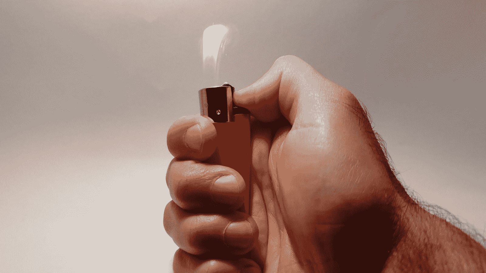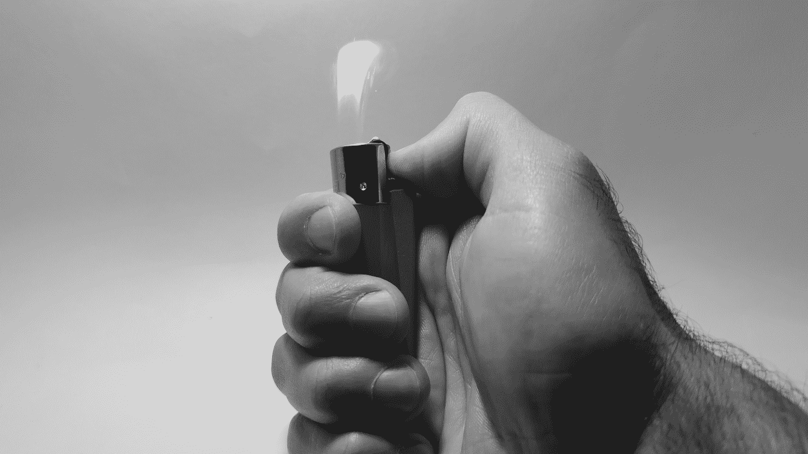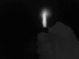

**Figure 1:** Color RGB visible-light image (*left*) vs. Black and White or Grayscale visible-light image (*center*) vs. Gray8 thermal image (*right*).

当图像在灰度空间中表示时(**图 1** 、*中心*)，每个像素仅由单个通道或值表征，通常在 0 到 255 之间(即黑白)。

这种格式如图**图 1** ( *右*)所示，被称为灰度或灰色 8 (8 位= 0 到 255 的像素值)，是热视觉中最广泛的格式。

如图**图 2** 所示，gray8 图像用不同的色图或色标着色，以增强热图像中温度分布的可视化。这些贴图被称为热调色板。

[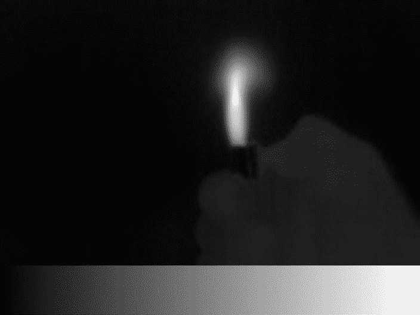](https://pyimagesearch.com/wp-content/uploads/2022/09/figure-2-a-gray8-color-palette-grayscale.jpg)[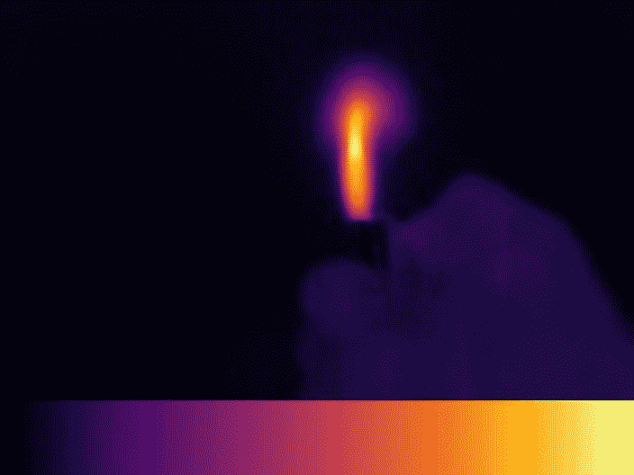](https://pyimagesearch.com/wp-content/uploads/2022/09/figure-2-b-gray8-color-palette-inferno.jpg)[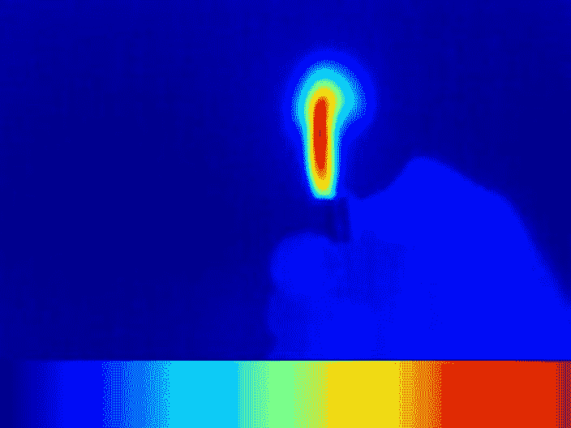](https://pyimagesearch.com/wp-content/uploads/2022/09/figure-2-c-gray8-color-palette-jet.jpg)[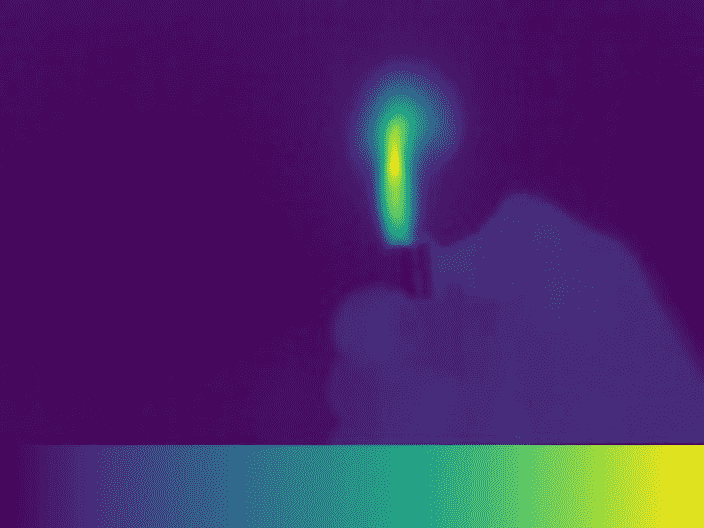](https://pyimagesearch.com/wp-content/uploads/2022/09/figure-2-d-gray8-color-palette-viridis.jpg)

**Figure 2:** Gray8 thermal colored images. Colormaps from OpenCV: Grayscale (*top-left*), Inferno (*top-right*), Jet (*bottom-left*), and Viridis (*bottom-right*). For extra information, you can visit [ColorMaps in OpenCV](https://docs.opencv.org/4.5.4/d3/d50/group__imgproc__colormap.html).

例如，Inferno 调色板显示紫色(0)和黄色(255)之间的温度变化。

* * *

#### [**灰色 16**](#TOC)

太好了，现在我们明白这些令人惊叹的彩色图像是从哪里来的了，但是我们如何计算温度呢(你可能想知道)？

出于这个目的，热感相机也提供灰度图像。这种格式不是使用从 0 到 255 的像素值(**图 3** 、*左*)，而是将信息编码为 16 位，即 0 到 65535 个值(**图 3** 、*右*)。

但是，为什么呢？

我们将在下一节中发现它，但首先，让我们应用到目前为止所学的知识。

在下面的一小段代码中，您将学习如何:

*   打开一个 gray16 热图像(`lighter_gray16_image.tiff`)
*   将其转换为灰色 8 图像
*   用不同的热调色板给它上色

您可能已经注意到，这个图像有一种特殊的格式，TIFF(标记图像文件格式)，用来存储 16 位信息。它已经被一个负担得起的热感相机拍摄到:[**RGM vision thermal cam 1**](https://www.rgmvision.com/)(如果你有兴趣发现热感视觉世界，这是一个极好的开始选项)。

* * *

### [**配置您的开发环境**](#TOC)

要遵循这个指南，您需要在您的系统上安装 OpenCV 库。

幸运的是，OpenCV 可以通过 pip 安装:

```py
$ pip install opencv-contrib-python
```

**如果您需要帮助配置 OpenCV 的开发环境，我们*强烈推荐*阅读我们的** [***pip 安装 OpenCV* 指南**](https://pyimagesearch.com/2018/09/19/pip-install-opencv/)——它将在几分钟内让您启动并运行。

* * *

### [**在配置开发环境时遇到了问题？**](#TOC)

说了这么多，你是:

*   时间紧迫？
*   了解你雇主的行政锁定系统？
*   想要跳过与命令行、包管理器和虚拟环境斗争的麻烦吗？
*   **准备好在您的 Windows、macOS 或 Linux 系统上运行代码*****？***

 *那今天就加入 [PyImageSearch 大学](https://pyimagesearch.com/pyimagesearch-university/)吧！

**获得本教程的 Jupyter 笔记本和其他 PyImageSearch 指南，这些指南是** ***预先配置的*** **，可以在您的网络浏览器中运行在 Google Colab 的生态系统上！**无需安装。

最棒的是，这些 Jupyter 笔记本可以在 Windows、macOS 和 Linux 上运行！

* * *

### [**项目结构**](#TOC)

我们首先需要回顾我们的项目目录结构。

首先访问本教程的 ***“下载”*** 部分，检索源代码和示例图像。

让我们检查一下简单的项目结构:

```py
$ tree --dirsfirst
.
├── gray8_vs_gray16.py
├── measure_image_temperature.py
├── measure_video_temperature.py
├── measure_camera_video_temperature.py
├── lighter_gray16_image.tiff
└── gray16_sequence
    ├── gray16_frame_000.tiff
    ├── gray16_frame_001.tiff
    ├── gray16_frame_002.tiff
    ├── ...
    └── gray16_frame_069.tiff

1 directory, 76 files
```

每个 Python 文件对应于教程的 4 个部分。`lighter_gray16_image.tiff`文件是我们的 16 位/灰度 16 热图像。

打开项目目录结构中的`gray8_vs_gray16.py`文件，插入以下代码导入 NumPy 和 OpenCV 库:

```py
# import the necessary packages
import numpy as np
import cv2
```

首先，我们将开始打开 gray16 热图像:

```py
# open the gray16 image
gray16_image = cv2.imread("lighter_gray16_image.tiff", cv2.IMREAD_ANYDEPTH)
```

标志允许我们以 16 位格式打开 gray16 图像。

然后，我们将它转换成灰色图像，以便能够正确处理和可视化:

```py
# convert the gray16 image into a gray8
gray8_image = np.zeros((120, 160), dtype=np.uint8)
gray8_image = cv2.normalize(gray16_image, gray8_image, 0, 255, cv2.NORM_MINMAX)
gray8_image = np.uint8(gray8_image)
```

在**的第 9、10 和 11 行**上，我们分别创建了一个空的`160x120`图像，我们将 gray16 图像从 0-65，553 (16 位)归一化到 0-255 (8 位)，并确保最终图像是 8 位图像。

我们使用我们最喜欢的 OpenCV colormap ***** 为 gray8 图像着色，以获得不同的热调色板:

```py
# color the gray8 image using OpenCV colormaps
inferno_palette = cv2.applyColorMap(gray8_image, cv2.COLORMAP_INFERNO)
jet_palette = cv2.applyColorMap(gray8_image, cv2.COLORMAP_JET)
viridis_palette = cv2.applyColorMap(gray8_image, cv2.COLORMAP_VIRIDIS)
```

**(*)** 请访问 OpenCV 中的[色彩图，确保您选择的色彩图在您的 OpenCV 版本中可用。在这种情况下，我们使用的是 OpenCV 4.5.4。](https://docs.opencv.org/4.5.4/d3/d50/group__imgproc__colormap.html)

最后，我们展示结果:

```py
# show the different thermal color palettes
cv2.imshow("gray8", gray8_image)
cv2.imshow("inferno", inferno_palette)
cv2.imshow("jet", jet_palette)
cv2.imshow("viridis", viridis_palette)
cv2.waitKey(0)
```

* * *

### [**从热成像中测量你的第一个温度**](#TOC)

既然我们已经了解了基本的热成像格式，我们就可以从热成像中测量我们的第一个温度了！

我们离开了上一节，想知道为什么灰色图像有助于确定温度。

答案很简单:16 位像素值为我们计算每个像素的温度提供了足够的信息。

* * *

***重要:*** *此时，你应该检查信息是如何在你的热/图像相机中被编码的！*

* * *

但是不用担心；我们将通过查看用 **RGMVision ThermalCAM 1** 拍摄的样本图像`lighter_gray16_image.tiff`中的温度来简化这一步骤。

这款相机遵循:

(1)温度(°C)=(Gray _ 16 _ value)/100(K)-绝对零度(K)。

例如，如果我们得到的 gray16 值为 40，000，则以摄氏度表示的结果温度为:

(2)温度(°C)= 40000/100(K)–273.15(K)= 126.85°C，

这意味着

(3)温度= 126.85 摄氏度= 260.33 华氏度

有了这些信息，我们开始编码吧！

打开`measure_image_temperature.py`文件，导入 NumPy 和 OpenCV 库:

```py
# import the necessary packages
import numpy as np
import cv2
```

打开 gray16 热像，`lighter_gray16_image.tiff`如前一节:

```py
# open the gray16 image
gray16_image = cv2.imread("lighter_gray16_image.tiff ", cv2.IMREAD_ANYDEPTH)
```

标志允许我们以 16 位格式打开 gray16 图像。

我们将测量所需像素的温度值。先说火焰中间的一个热值。由于 **RGMVision ThermalCAM 1** 提供`160x120`图像，我们可以选择例如`x, y = (90, 40)`值，如图**图 4** 所示。

```py
# get the first gray16 value

# pixel coordinates
x = 90
y = 40

pixel_flame_gray16 = gray16_image [y, x]
```

现在，我们可以应用等式(1 ),得到以°C 或°F 为单位的温度值:

```py
# calculate temperature value in ° C
pixel_flame_gray16 = (pixel_flame_gray16 / 100) - 273.15

# calculate temperature value in ° F
pixel_flame_gray16 = (pixel_flame_gray16 / 100) * 9 / 5 - 459.67
```

就是这样！就这么简单！

最后，我们显示灰度 16 和灰度 8 图像中的值:

```py
# convert the gray16 image into a gray8 to show the result
gray8_image = np.zeros((120,160), dtype=np.uint8)
gray8_image = cv2.normalize(gray16_image, gray8_image, 0, 255, cv2.NORM_MINMAX)
gray8_image = np.uint8(gray8_image)

# write pointer
cv2.circle(gray8_image, (x, y), 2, (0, 0, 0), -1)
cv2.circle(gray16_image, (x, y), 2, (0, 0, 0), -1)

# write temperature value in gray8 and gray16 image
cv2.putText(gray8_image,"{0:.1f} Fahrenheit".format(pixel_flame_gray16),(x - 80, y - 15), cv2.FONT_HERSHEY_PLAIN, 1,(255,0,0),2)
cv2.putText(gray16_image,"{0:.1f} Fahrenheit".format(pixel_flame_gray16),(x - 80, y - 15), cv2.FONT_HERSHEY_PLAIN, 1,(255,0,0),2)

# show result
cv2.imshow("gray8-fahrenheit", gray8_image)
cv2.imshow("gray16-fahrenheit", gray16_image)
cv2.waitKey(0)
```

**图 5** 显示了结果。

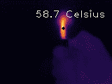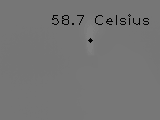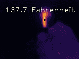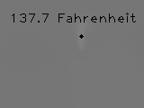

**Figure 5:** Gray8 thermal image with the measured temperature value of a flame pixel in °C (*top-left*) and in °F (*bottom-left*). Gray16 thermal image with the measured temperature value of a flame pixel in °C (*top-right*) and in °F (*bottom-right*).

我们不显示度数符号“”，因为默认的 OpenCV 字体遵循有限的 ASCII，不提供这种符号。如果你对它感兴趣，请使用 [PIL](https://pypi.org/project/Pillow/) (Python 图像库)。

如果我们想验证这个值是否有意义，我们可以获得一个不同的温度点，在这种情况下，一个更冷的温度点:点燃打火机的手。

```py
# get the second gray16 value

# pixel coordinates
x = 90
y = 100
```

我们简单地改变坐标，得到如图 6 所示的结果。

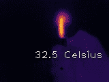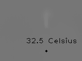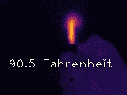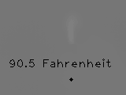

**Figure 6:** Gray8 thermal image with the measured temperature value of a hand pixel in °C (*top-left*) and in °F (*bottom-left*). Gray16 thermal image with the measured temperature value of a hand pixel in °C (*top-right*) and in °F (*bottom-right*).

* * *

### [](#TOC)**用热感摄像机/照相机测量你的第一次体温**

 **在这最后一节，我们将再次应用我们在本教程中学到的东西，但来自一个热视频源:一个热摄像机或热视频文件。

* * *

#### [**测量来自热视频的温度**](#TOC)

如果你手头没有这些令人难以置信的相机，不要担心，我们将使用一个样本视频序列，`gray16_sequence`文件夹，提取自 **RGMVision ThermalCAM 1** 。

在下面这段代码中，您将学会如何轻松地做到这一点。

打开`measure_video_temperature.py`并导入 NumPy、OpenCV、OS 和 argparse 库:

```py
# import the necessary packages
import cv2
import numpy as np
import os
import argparse
```

如果您熟悉 PyImageSearch 教程，那么您已经知道 argparse Python 库。我们用它在运行时给程序提供额外的信息(例如，命令行参数)。在这种情况下，我们将使用它来指定我们的热视频路径:

```py
# construct the argument parse and parse the arguments
ap = argparse.ArgumentParser()
ap.add_argument("-v", "--video", required=True, help="path of the video sequence")
args = vars(ap.parse_args())
```

下面的代码向您展示了如何实现一个鼠标指针来轻松显示所选像素的温度，而不是选择一个固定点:

```py
# create mouse global coordinates
x_mouse = 0
y_mouse = 0                 

# create thermal video fps variable (8 fps in this case)
fps = 8

# mouse events function
def mouse_events(event, x, y, flags, param):
    # mouse movement event
    if event == cv2.EVENT_MOUSEMOVE:

    # update global mouse coordinates
    global x_mouse
    global y_mouse

    x_mouse = x
    y_mouse = y

# set up mouse events and prepare the thermal frame display
gray16_frame = cv2.imread("lighter_gray16_image.tiff", cv2.IMREAD_ANYDEPTH)
cv2.imshow('gray8', gray16_frame)
cv2.setMouseCallback('gray8', mouse_events)
```

从**第 20-29 行**，我们定义了鼠标事件函数。首先，当我们检测到鼠标移动(`cv2.EVENT_MOUSEMOVE`)时，我们更新先前的`x`和`y`像素坐标。

我们建议您查看使用 Python 和 OpenCV 捕获鼠标点击事件的[教程，以更深入地了解鼠标捕获事件。](https://www.pyimagesearch.com/2015/03/09/capturing-mouse-click-events-with-python-and-opencv/)

```py
# loop over the thermal video frames
for image in sorted(os.listdir(args["video"])):

    # filter .tiff files (gray16 images)
    if image.endswith(".tiff"):

        # define the gray16 frame path
        file_path = os.path.join(args["video"], image)

        # open the gray16 frame
        gray16_frame = cv2.imread(file_path, cv2.IMREAD_ANYDEPTH)

        # calculate temperature
        temperature_pointer = gray16_frame[y_mouse, x_mouse]
        temperature_pointer = (temperature_pointer / 100) - 273.15
        temperature_pointer = (temperature_pointer / 100) * 9 / 5 - 459.67

        # convert the gray16 frame into a gray8
        gray8_frame = np.zeros((120, 160), dtype=np.uint8)
        gray8_frame = cv2.normalize(gray16_frame, gray8_frame, 0, 255, cv2.NORM_MINMAX)
        gray8_frame = np.uint8(gray8_frame)

        # colorized the gray8 frame using OpenCV colormaps
        gray8_frame = cv2.applyColorMap(gray8_frame, cv2.COLORMAP_INFERNO)

        # write pointer
        cv2.circle(gray8_frame, (x_mouse, y_mouse), 2, (255, 255, 255), -1)

        # write temperature
        cv2.putText(gray8_frame, "{0:.1f} Fahrenheit".format(temperature_pointer), (x_mouse - 40, y_mouse - 15), cv2.FONT_HERSHEY_PLAIN, 1, (255, 255, 255), 1)

        # show the thermal frame
        cv2.imshow("gray8", gray8_frame)

        # wait 125 ms: RGMVision ThermalCAM1 frames per second = 8
        cv2.waitKey(int((1 / fps) * 1000))
```

循环热视频序列，`gray16_sequence`文件夹，并获得 gray16 温度值(**第 37-46 行**)。为了简化过程，我们使用 gray16 帧序列 TIFF 图像，而不是 gray16 视频文件(常见的压缩视频文件往往会丢失信息)。

在**的第 49-51 行**上，我们应用等式(1)并以 C(或 F)为单位计算我们的热感鼠标指针的温度:`x_mouse`和`y_mouse`。

然后，我们获得 gray8 图像来显示每帧的结果。

在第 71 行的**上，我们等待了 125 毫秒，因为我们的 **RGMVision ThermalCAM 1** 提供了一个 8 fps 的流。**

* * *

#### [**用热感相机测量温度**](#TOC)

作为本教程的最后一点，我们将学习如何在 UVC (USB 视频类)热感摄像机的每一帧中循环，在我们的例子中，是 **RGMVision ThermalCAM 1** ，同时测量和显示鼠标像素的温度。

打开`measure_camera_video_temperature.py`并导入 NumPy 和 OpenCV 库:

```py
# import the necessary packages
import cv2
import numpy as np
```

按照上面的**“从热视频测量温度”**部分定义鼠标事件功能:

```py
# create mouse global coordinates
x_mouse = 0
y_mouse = 0                 

# mouse events function
def mouse_events(event, x, y, flags, param):
    # mouse movement event
    if event == cv2.EVENT_MOUSEMOVE:

    # update global mouse coordinates
    global x_mouse
    global y_mouse

    x_mouse = x
    y_mouse = y
```

设置热感摄像机指数和分辨率，在我们的例子中，`160x120`:

```py
# set up the thermal camera index (thermal_camera = cv2.VideoCapture(0, cv2.CAP_DSHOW) on Windows OS)
thermal_camera = cv2.VideoCapture(0)

# set up the thermal camera resolution
thermal_camera.set(cv2.CAP_PROP_FRAME_WIDTH, 160)
thermal_camera.set(cv2.CAP_PROP_FRAME_HEIGHT, 120)
```

在**第 22 行**，你应该选择你的相机 ID。如果您使用的是 Windows 操作系统，请确保指定您的后端视频库，例如，Direct Show (DSHOW): `thermal_camera = cv2.VideoCapture(0, cv2.CAP_DSHOW)`。

欲了解更多信息，请访问[带 OpenCV 概述的视频 I/O](https://docs.opencv.org/4.5.4/d0/da7/videoio_overview.html)。

将热感摄像机设置为 gray16 源，并接收 raw 格式的数据。

```py
# set up the thermal camera to get the gray16 stream and raw data
thermal_camera.set(cv2.CAP_PROP_FOURCC, cv2.VideoWriter.fourcc('Y','1','6',' '))
thermal_camera.set(cv2.CAP_PROP_CONVERT_RGB, 0)
```

**第 30 行**阻止 RGB 转换。

设置鼠标事件并准备热帧显示(**行 33-35** ):

```py
# set up mouse events and prepare the thermal frame display
grabbed, frame_thermal = thermal_camera.read()
cv2.imshow('gray8', frame_thermal)
cv2.setMouseCallback('gray8', mouse_events)
```

循环热摄像机帧，计算灰度 16 温度值(**第 38-63 行**)。

```py
# loop over the thermal camera frames
while True:

    # grab the frame from the thermal camera stream
    (grabbed, thermal_frame) = thermal_camera.read()

    # calculate temperature
    temperature_pointer = thermal_frame[y_mouse, x_mouse]
    # temperature_pointer = (temperature_pointer / 100) - 273.15
    temperature_pointer = (temperature_pointer / 100) * 9 / 5 - 459.67

    # convert the gray16 image into a gray8
    cv2.normalize(thermal_frame, thermal_frame, 0, 255, cv2.NORM_MINMAX)
    thermal_frame = np.uint8(thermal_frame)

    # colorized the gray8 image using OpenCV colormaps
    thermal_frame = cv2.applyColorMap(thermal_frame, cv2.COLORMAP_INFERNO)

    # write pointer
    cv2.circle(thermal_frame, (x_mouse, y_mouse), 2, (255, 255, 255), -1)

    # write temperature
    cv2.putText(thermal_frame, "{0:.1f} Fahrenheit".format(temperature_pointer), (x_mouse - 40, y_mouse - 15), cv2.FONT_HERSHEY_PLAIN, 1, (255, 255, 255), 1)

    # show the thermal frame
    cv2.imshow('gray8', thermal_frame)
    cv2.waitKey(1)

# do a bit of cleanup
thermal_camera.release()
cv2.destroyAllWindows()
```

我们在第 49 行和第 50 行将灰色 16 图像转换为灰色 8，以显示结果。

然后我们应用我们最喜欢的热调色板，就像我们已经学过的，写下温度值和指针位置。

在这里！

一个使用热感相机和 OpenCV 的实时鼠标温度测量仪！

这最后一部分代码和 RGMVision ThermalCAM 1 可在 [RGM 视觉](https://www.rgmvision.com/)上获得。

* * *

* * *

## [**汇总**](#TOC)

在本教程中，我们已经了解了灰度 8 和灰度 16 图像(即最常见的热成像格式)之间的差异。我们学会了从图像中测量我们的第一个温度，只使用 Python 和 OpenCV 在不同的调色板中显示结果。更进一步，我们还发现了如何实时计算视频流和 UVC 热感相机的每个像素温度。

在下一个教程中，我们将实现一个简化的面部温度测量解决方案，这是 COVID 疫情中一个有价值的方法。您将能够将这些知识应用到您自己的实际项目中，例如，以简单明了的方式使用您的 Raspberry Pi。

* * *

### [**引用信息**](#TOC)

**Garcia-Martin，R.** “热视觉:使用 Python 和 OpenCV 从图像中测量第一个温度”， *PyImageSearch* ，P. Chugh，A. R. Gosthipaty，S. Huot，K. Kidriavsteva 和 R. Raha 编辑。，2022 年，【https://pyimg.co/mns3e 

```py
@incollection{Garcia-Martin_2022_Measuring,
  author = {Raul Garcia-Martin},
  title = {Thermal Vision: Measuring Your First Temperature from an Image with {P}ython and {OpenCV}},
  booktitle = {PyImageSearch},
  editor = {Puneet Chugh and Aritra Roy Gosthipaty and Susan Huot and Kseniia Kidriavsteva and Ritwik Raha},
  year = {2022},
  note = {https://pyimg.co/mns3e},
}
```

* * *

**要下载这篇文章的源代码(并在未来教程在 PyImageSearch 上发布时得到通知)，*只需在下面的表格中输入您的电子邮件地址！******