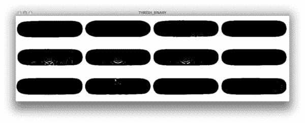
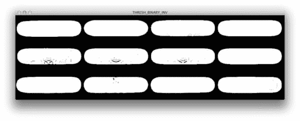

# 阈值处理:使用 OpenCV 的简单图像分割

> 原文：<https://pyimagesearch.com/2014/09/08/thresholding-simple-image-segmentation-using-opencv/>

[](https://pyimagesearch.com/wp-content/uploads/2014/09/thresholding_example.jpg)

悲剧。令人心碎。无法忍受。

这是我用来形容过去一周的三个词。

大约一周前，我的一个儿时密友在一场悲惨的车祸中去世了。

我和他一起上小学和中学。我们夏天在我的车道上玩滑板，冬天在我的后院玩滑雪板和雪橇。

从上周开始，我一直在旅行，参加他的葬礼。每一刻都极度痛苦。我发现很难集中注意力，我的思绪总是回到十多年前的记忆中。

老实说，我写这篇博客是一个奇迹。

但是如果有什么是我相信的，那就是生活应该被庆祝。没有比对爱人的怀旧回忆更好的庆祝方式了。

早在中学时代，我和他曾经浏览过 [CCS 目录](http://shop.ccs.com/)(是的，实际目录；他们没有在网上列出他们所有的产品，即使他们列出了，我们的互联网是拨号上网的，使用是由父母控制的。

我们会幻想下一步要买哪种滑板，或者更确切地说，我们会要求父母给我们买哪种滑板作为生日礼物。

像在上学前、上学中和放学后翻阅 CCS 目录这样的小回忆让我喜笑颜开。它们让日子过得更轻松。

所以在这篇文章中，我将展示如何使用 Python 和 OpenCV 执行基本的图像分割。

我们还会给它一个小小的滑板主题，只是为了向一位朋友致敬，他的记忆在我脑海中占据了很重的位置。

**OpenCV 和 Python 版本:**
这个例子将运行在 **Python 2.7/Python 3.4+** 和 **OpenCV 2.4.X/OpenCV 3.0+** 上。

# `cv2.threshold`功能

让我们先来看看 cv2.threshold 函数的签名:

`(T, threshImage) = cv2.threshold(src, thresh, maxval, type)`

第一个参数是我们的源图像，或者我们想要对其执行阈值处理的图像。这个图像应该是灰度的。

第二个参数`thresh`是用于对灰度图像中的像素强度进行分类的阈值。

第三个参数`maxval`，是图像中任何给定像素通过`thresh`测试时使用的像素值。

最后，第四个参数是要使用的阈值方法。`type`值可以是以下任一值:

*   `cv2.THRESH_BINARY`
*   `cv2.THRESH_BINARY_INV`
*   `cv2.THRESH_TRUNC`
*   `cv2.THRESH_TOZERO`
*   `cv2.THRESH_TOZERO_INV`

听起来很复杂？事实并非如此——我将为您展示每种阈值类型的示例。

然后，`cv2.threshold`返回一个由两个值组成的元组。第一个值`T`是用于阈值处理的值。在我们的例子中，这个值与我们传递给`cv2.threshold`函数的`thresh`值相同。

第二个值是我们实际的阈值图像。

无论如何，让我们继续探索一些代码。

# 阈值处理:使用 OpenCV 的简单图像分割

图像分割有多种形式。

聚类。压缩。边缘检测。区域增长。图形划分。分水岭。这样的例子不胜枚举。

但是在一开始，只有最基本的图像分割类型:阈值分割。

让我们看看如何使用 OpenCV 执行简单的图像分割。打开您最喜欢的编辑器，创建一个名为`threshold.py`的文件，让我们开始吧:

```py
# import the necessary packages
import argparse
import cv2

# construct the argument parser and parse the arguments
ap = argparse.ArgumentParser()
ap.add_argument("-i", "--image", required = True,
	help = "Path to the image to be thresholded")
ap.add_argument("-t", "--threshold", type = int, default = 128,
	help = "Threshold value")
args = vars(ap.parse_args())

# load the image and convert it to grayscale
image = cv2.imread(args["image"])
gray = cv2.cvtColor(image, cv2.COLOR_BGR2GRAY)

# initialize the list of threshold methods
methods = [
	("THRESH_BINARY", cv2.THRESH_BINARY),
	("THRESH_BINARY_INV", cv2.THRESH_BINARY_INV),
	("THRESH_TRUNC", cv2.THRESH_TRUNC),
	("THRESH_TOZERO", cv2.THRESH_TOZERO),
	("THRESH_TOZERO_INV", cv2.THRESH_TOZERO_INV)]

# loop over the threshold methods
for (threshName, threshMethod) in methods:
	# threshold the image and show it
	(T, thresh) = cv2.threshold(gray, args["threshold"], 255, threshMethod)
	cv2.imshow(threshName, thresh)
	cv2.waitKey(0)

```

我们将从导入我们需要的两个包开始，**线 2 和 3** 上的`argparse`和`cv2`。

从那里，我们将在第 6-11 行解析我们的命令行参数。这里我们需要两个参数。第一个，`--image`，是我们想要阈值化的图像的路径。第二个，`--threshold`，是将传递给`cv2.threshold`函数的阈值。

从那里，我们将从磁盘加载图像，并在**第 14 行和第 15 行**将其转换为灰度。我们转换为灰度，因为`cv2.threshold`期望一个单通道图像。

**第 18-23 行**定义了我们的阈值方法列表。

我们从第 26 行的**开始循环我们的阈值方法。**

从那里，我们在第 28 行的**上应用实际阈值方法。我们将灰度图像作为第一个参数传递，将命令行提供的阈值作为第二个参数传递，将 255(白色)作为阈值测试通过时的值作为第三个参数传递，最后将阈值方法本身作为最后一个参数传递。**

最后，阈值图像显示在**行 29 和 30** 上。

我们来看一些结果。打开您的终端，导航到我们的代码目录，并执行以下命令:

```py
$ python threshold.py --image images/skateboard_decks.png --threshold 245

```

在本例中，我们使用值 245 进行阈值测试。如果输入图像中的像素通过了阈值测试，它的值将被设置为 255。

现在，让我们来看看结果:

[](https://pyimagesearch.com/wp-content/uploads/2014/09/thresholding_thresh_binary.jpg)

**Figure 1:** Applying cv2.threshold with cv2.THRESH_BINARY.

使用`cv2.THRESH_BINARY`将滑板分割成白色背景的黑色。

要反转颜色，只需使用`cv2.THRESH_BINARY_INV`，如下所示:

[](https://pyimagesearch.com/wp-content/uploads/2014/09/thresholding_thresh_binary_inv.jpg)

**Figure 2:** Applying cv2.threshold with cv2.THRESH_BINARY_INV.

还不错。我们还能做什么？

[](https://pyimagesearch.com/wp-content/uploads/2014/09/thresholding_thresh_trunc.jpg)

**Figure 3:** Applying cv2.threshold with cv2.THRESH_TRUNC.

如果源像素不大于提供的阈值，使用`cv2.THRESH_TRUNC`保持像素强度不变。

然后我们有`cv2.THRESH_TOZERO`，如果源像素不大于提供的阈值，它将源像素设置为零:

[](https://pyimagesearch.com/wp-content/uploads/2014/09/thresholding_thresh_binary1.jpg)

**Figure 4:** Applying cv2.threshold with cv2.THRESH_TOZERO.

最后，我们也可以使用`cv2.THRESH_TOZERO_INV`来反转这个行为:

[](https://pyimagesearch.com/wp-content/uploads/2014/09/thresholding_thresh_binary_inv1.jpg)

**Figure 5:** Applying cv2.threshold with cv2.THRESH_TOZERO_INV.

没什么！

# 摘要

在这篇博文中，我向你展示了如何执行最基本的图像分割形式:阈值分割。

为了执行阈值处理，我们使用了`cv2.threshold`函数。

OpenCV 为我们提供了五种基本的阈值分割方法，包括:`cv2.THRESH_BINARY`、`cv2.THRESH_BINARY_INV`、`cv2.THRESH_TRUNC`、`cv2.THRESH_TOZERO`、`cv2.THRESH_TOZERO_INV`。

最重要的是，确保使用`thresh`值，因为它会根据您提供的值给出不同的结果。

在以后的文章中，我将向你展示如何用**自动确定阈值，不需要调整参数！**