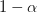
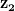
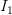
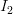
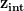

# 火炬中心系列# 4:PGAN——GAN 上的模型

> 原文：<https://pyimagesearch.com/2022/01/10/torch-hub-series-4-pgan-model-on-gan/>

在本教程中，您将了解渐进式 GAN 的架构细节，这使其能够生成高分辨率图像。此外，我们将了解如何使用 Torch Hub 导入预训练的 PGAN 模型，并在我们的项目中使用它来生成高质量的图像。

本课是关于火炬中心的 6 部分系列的第 4 部分:

1.  [*火炬中心系列# 1:*](https://pyimagesearch.com/2021/12/20/torch-hub-series-1-introduction-to-torch-hub/)火炬中心介绍
2.  [*火炬枢纽系列#2: VGG 和雷斯内特*](https://pyimagesearch.com/2021/12/27/torch-hub-series-2-vgg-and-resnet/)
3.  [*火炬轮毂系列#3: YOLO v5 和 SSD——物体检测模型*](https://pyimagesearch.com/2022/01/03/torch-hub-series-3-yolov5-and-ssd-models-on-object-detection/)
4.  *火炬轮毂系列# 4:——甘模型*(本教程)
5.  *火炬轮毂系列# 5:MiDaS——深度估计模型*
6.  *火炬中枢系列#6:图像分割*

**要了解渐进式 GAN 如何工作并可用于生成高分辨率图像，** ***继续阅读。***

## **火炬轮毂系列# 4:PGAN——甘模型**

### **话题描述**

2014 年，生成对抗网络的出现及其有效地对任意数据分布进行建模的能力，在计算机视觉界掀起了风暴。双人游戏范式的简单性和推理时惊人的快速样本生成是 GANs 成为现实世界中实际应用的理想选择的两个主要因素。

然而，在它们出现后的很长一段时间内，GAN 的生成能力局限于为相对低分辨率的数据集(例如，MNIST ( `28×28`图像)、CIFAR10 ( `32×32`图像)等生成样本。).这可以归因于这样一个事实，即生成性对抗网络难以捕捉高分辨率图像中潜在数据分布的几种模式和复杂的低级细节。这在实践中受到限制，因为现实世界中的应用通常要求以高分辨率生成样本。

正因为如此，计算机视觉社区共同努力改进底层网络架构，并引入新的训练技术来稳定训练过程和提高生成样本的质量。

在本教程中，我们将研究一种这样的技术，即渐进式生长，它在弥补这一差距和使 GANs 能够以更高分辨率生成高质量样品方面发挥了关键作用，这对于各种实际应用来说是必不可少的。具体来说，我们将详细讨论以下内容:

*   前卫的甘()建筑细部
*   渐进生长技术和显著特征使 PGAN 能够通过稳定高效的训练生成高分辨率样品
*   从 Torch Hub 导入预先训练的生成模型，如 PGAN，以便快速无缝地集成到我们的深度学习项目中
*   利用预训练的 PGAN 模型生成高分辨率人脸图像
*   走过训练有素的 PGAN 的潜在空间

### **渐进式氮化镓架构**

长期以来，生成式对抗网络一直难以生成高分辨率的图像。这主要是因为高分辨率图像包含大量高层结构形式的信息和错综复杂的低层细节，很难一下子学会。

这可以从多玩家训练范例的角度来理解，该范例形成了训练 GAN 的整体部分。正如在[之前的教程](https://pyimagesearch.com/2021/10/25/training-a-dcgan-in-pytorch/)中所讨论的，GAN 的主要组件是更新生成器，以在每一步欺骗鉴别器。然而，当采用 GAN 来生成高分辨率图像时，生成器很难同时对图像的高级和复杂的低级细节进行整体建模。这是真的，尤其是在训练的初始阶段，此时它的权重或多或少是随机的。

这使得鉴别器更强，因为它可以很容易地将发生器样本与干扰发生器和鉴别器平衡的真实样本区分开，这对于 GAN 的最佳收敛是至关重要的。

此外，在另一个教程的[中，我们讨论了 gan 容易发生模式崩溃。上述问题也可以从模拟分布的角度来看，这是 GAN 的目标。具体来说，生成器很难一次有效地捕获数据分布的所有模式。当数据是高分辨率的并且包括与高级结构和更精细的语义细节相关的多种模式时，这个问题变得更加严重。](https://pyimagesearch.com/2021/12/13/gan-training-challenges-dcgan-for-color-images/)

渐进式 GAN 旨在通过将生成高分辨率图像的复杂任务划分为更简单的子任务来缓解上述问题。这主要是通过要求生成器在每一步解决更简单的生成任务来实现的。

具体地，在训练过程中，最初要求生成器学习图像的低分辨率版本。随着它在以较低分辨率生成图像方面慢慢变得更好，要求生成器生成的图像的分辨率会增加。这使生成高分辨率图像的最终目标保持不变，但不会立即使生成器负担过重，并允许它逐渐捕捉图像中的高层次和低层次细节。这项技术背后的动机在**图 1** 中被有效地捕捉到。

**图 2** 展示了构成 PGAN 基础的渐进增长模式。具体来说，我们从一个生成低分辨率图像(比如说，`8×8`)的生成器和一个相应的鉴别器开始，该鉴别器将生成的`8×8`图像与调整到`8×8`维度的真实图像(最初是`1024×1024`)一起作为输入。

此时，生成器学习对图像分布的高层结构进行建模。渐渐地，新层被同步添加到发生器和鉴别器，使它们能够以更高的分辨率处理图像。这使得发生器能够遵循平滑和渐进的学习曲线，并慢慢学习更高分辨率图像中的精细细节。

渐进增长的范式也可以从假设估计的角度来看。我们不是要求生成器一次学习一个复杂的函数，而是要求它在每一步学习更简单的子函数。由于这个原因，要求发生器在特定的时间步长捕获更少的模式。因此，随着训练的进行，它可以逐渐捕获不同的数据分布模式。

此外，由于发生器具有生成低分辨率图像的更简单的任务，特别是在训练的初始阶段，所以发生器可以在这些任务上做得相当好，保持鉴别器和发生器的强度之间的平衡。

### **渐进生长技术**

在上一节中，我们讨论了 PGAN 网络如何通过将高分辨率图像分成更简单的任务来处理生成高分辨率图像的复杂问题。此外，我们观察到，这需要发生器和鉴别器架构同步渐进增长，以从低分辨率图像开始逐渐处理更高分辨率的图像。

在教程的这一部分，我们将讨论 PGAN 建筑如何实现渐进增长技术。具体来说，总体目标是在每个阶段缓慢地向生成器和鉴别器添加层。

**图 3** 显示了渐进增长模式的要点。在形式上，我们希望在生成器和鉴别器中逐步添加层，并确保它们平滑地、逐步地与网络集成，而不对训练过程进行任何突然的改变。

在发生器的情况下(即**图 3** 、*上*)，我们假设在给定的阶段，我们得到如图所示的输入，我们希望发生器的输出分辨率加倍。为了实现这一点，我们首先使用`Upsample()`操作，它将图像的空间维度增加了一个因子`×2`。此外，我们添加一个新的卷积层，输出一个`2N×2N`维度图像(显示在右边的分支)。请注意，最终输出是左右分支输出与的加权和

and weighting coefficients, respectively.

现在让我们来了解一下的作用

in the architecture shown above. As we can see from the plot on the right side, increases linearly as training progresses, and thus, decays linearly.

最初，卷积层是随机初始化的，它不会计算任何有意义的函数或输出。因此，卷积层的输出被赋予一个低的非零加权系数(例如，

), and the entire output is nearly from the Upsampling layer. Note that the upsampling layer is not learnable or parameterized and uses a technique such as nearest-neighbor interpolation to increase the spatial dimensions.

即使系数

is initially low, the gradients flow through the convolution layer. As the training progresses, the weights of the newly added layer gradually start to learn and output meaningful images. Thus, slowly, the weight of the convolution layer (i.e., ) is increased as shown, and the contribution from the non-learnable Upsample layer (i.e., ) is reduced. This allows the newly added convolution layer to smoothly integrate with the network and learn more complex functions than a simple nearest interpolation-based upsampling.

鉴别器也遵循类似的方法，如图**图 3** ( *底部*)所示，逐渐增加层数。这里唯一的区别是鉴别器从发生器获取输出图像，并对空间维度进行下采样，如图所示。注意，在给定阶段，层被同时添加到鉴别器和发生器，因为鉴别器必须在任何给定的时间步长处理来自发生器的输出图像。

既然我们已经讨论了 PGAN 体系结构，那就让我们来看看网络的运行情况吧！！

### **CelebA 数据集**

在本教程中，我们将使用 [CelebA 数据集](https://mmlab.ie.cuhk.edu.hk/projects/CelebA.html)，它由各种名人的高分辨率面部图像组成，是我们教程的合适选择。具体来说，CelebA 数据集是由香港中文大学 MMLAB 的研究人员收集的，由 202，599 张人脸图像组成，属于 10，177 位独特的名人。此外，数据集还为图像提供面部标志和二元属性注释，这有助于定位面部特征和表示语义特征。

### **配置您的开发环境**

要遵循本指南，您需要在系统上安装 PyTorch 库、`torchvision`模块和`matplotlib`库。

幸运的是，使用 pip 很容易安装这些包:

```py
$ pip install torch torchvision
$ pip install matplotlib
```

**如果您需要帮助配置 OpenCV 的开发环境，我们*强烈推荐*阅读我们的** [***pip 安装 OpenCV* 指南**](https://pyimagesearch.com/2018/09/19/pip-install-opencv/)——它将在几分钟内让您启动并运行。

### **在配置开发环境时遇到了问题？**

说了这么多，你是:

*   时间紧迫？
*   了解你雇主的行政锁定系统？
*   想要跳过与命令行、包管理器和虚拟环境斗争的麻烦吗？
*   **准备好在您的 Windows、macOS 或 Linux 系统上运行代码*****？***

 *那今天就加入 [PyImageSearch 大学](https://pyimagesearch.com/pyimagesearch-university/)吧！

**获得本教程的 Jupyter 笔记本和其他 PyImageSearch 指南，这些指南是** ***预先配置的*** **，可以在您的网络浏览器中运行在 Google Colab 的生态系统上！**无需安装。

最棒的是，这些 Jupyter 笔记本可以在 Windows、macOS 和 Linux 上运行！

### **项目结构**

既然我们已经讨论了 PGAN 和渐进式增长技术背后的直觉，我们就准备深入代码，看看我们的 PGAN 模型在起作用。我们从描述目录的项目结构开始。

```py
├── output
├── pyimagesearch
│   ├── config.py
├── predict.py
└── analyze.py
```

首先访问本教程的 ***“下载”*** 部分，检索源代码和示例图像。

我们从理解项目目录的结构开始。具体来说，输出文件夹将存储从我们预先训练的 PGAN 模型和我们的潜在空间分析生成的图像的绘图。

`pyimagesearch`文件夹中的`config.py`文件存储了我们代码的参数、初始设置和配置。

最后，`predict.py`文件使我们能够从我们的火炬中心预训练的 PGAN 模型生成高分辨率图像，`analyze.py`文件存储用于分析和遍历 PGAN 模型的潜在空间的代码。

### **创建配置文件**

我们从讨论`config.py`文件开始，它包含我们将在教程中使用的参数配置。

```py
# import the necessary packages
import torch
import os

# define gpu or cpu usage
DEVICE = "cuda" if torch.cuda.is_available() else "cpu"
USE_GPU = True if DEVICE == "cuda" else False

# define the number of images to generate and interpolate
NUM_IMAGES = 8
NUM_INTERPOLATION = 8

# define the path to the base output directory
BASE_OUTPUT = "output"

# define the path to the output model output and latent
# space interpolation
SAVE_IMG_PATH = os.path.join(BASE_OUTPUT, "image_samples.png")
INTERPOLATE_PLOT_PATH = os.path.sep.join([BASE_OUTPUT,
	"interpolate.png"])
```

我们从进口**2 号线和 3 号线**的必要包装开始。然后，在**的第 6 行和第 7 行**，我们定义了`DEVICE`和`USE_GPU`参数，它们决定了我们是使用 GPU 还是 CPU 来根据可用性生成图像。

在**的第 10 行**，我们定义了`NUM_IMAGES`参数，它定义了我们将为 PGAN 模型可视化的输出图像的数量。此外，`NUM_INTERPOLATION`参数定义了我们将用于线性插值和遍历潜在空间的点数(**第 11 行**)。

最后，我们在**行 14** 上定义了到输出文件夹(即`BASE_OUTPUT`)的路径，并在**行 18 和 19** 上定义了存储生成图像(即`SAVE_IMG_PATH`)和潜在空间插值图(即`INTERPOLATE_PLOT_PATH`)的相应路径。

### **使用 PGAN 模型生成图像**

现在我们已经定义了我们的配置参数，我们可以使用预训练的 PGAN 模型生成人脸图像。

在本系列之前的教程中，我们观察了 Torch Hub 如何用于将预先训练的 PyTorch 模型导入并无缝集成到我们的深度学习管道和项目中。这里，我们将使用 Torch Hub API 的功能来导入在 CelebAHQ 数据集上预先训练的 PGAN 模型。

让我们从项目目录中打开`predict.py`文件并开始吧。

```py
# USAGE
# python predict.py

# import the necessary packages
from pyimagesearch import config
import matplotlib.pyplot as plt
import torchvision
import torch

# load the pre-trained PGAN model
model = torch.hub.load("facebookresearch/pytorch_GAN_zoo:hub",
	"PGAN", model_name="celebAHQ-512", pretrained=True,
	useGPU=config.USE_GPU)

# sample random noise vectors
(noise, _) = model.buildNoiseData(config.NUM_IMAGES)

# pass the sampled noise vectors through the pre-trained generator
with torch.no_grad():
	generatedImages = model.test(noise)

# visualize the generated images
grid = torchvision.utils.make_grid(
	generatedImages.clamp(min=-1, max=1), nrow=config.NUM_IMAGES,
	scale_each=True, normalize=True)
plt.figure(figsize = (20,20))
plt.imshow(grid.permute(1, 2, 0).cpu().numpy())

# save generated image visualizations
torchvision.utils.save_image(generatedImages.clamp(min=-1, max=1),
	config.SAVE_IMG_PATH, nrow=config.NUM_IMAGES, scale_each=True,
	normalize=True)
```

在**的第 5-8 行**，我们导入必要的包和模块，包括来自`pyimagesearch`文件夹(**第 5 行**)和`matplotlib`库(**第 6 行**)的配置文件，以可视化我们生成的图像。此外，我们导入了`torchvision`模块(**行 7** )和`torch`库(**行 8** )来访问 PyTorch 的各种功能。

在**的第 11-13 行**，我们使用`torch.hub.load`函数加载我们预先训练好的 PGAN 模型。请注意，该函数采用以下参数:

*   存储模型的位置。这对应于 PyTorch GAN zoo(即`facebookresearch/pytorch_GAN_zoo:hub`)，它提供了在不同数据集上训练的各种 GAN 模型的模型和训练权重。
*   我们打算加载的模型的名称(即`PGAN`)
*   数据集名称(即`celebAHQ-512`)允许我们为给定模型加载特定于数据集的预训练权重。
*   `pretrained`参数，当设置为 True 时，指示 Torch Hub API 下载所选模型的预训练权重并加载它们。
*   `useGPU`布尔参数表示模型是否必须加载到 GPU 或 CPU 上进行推理(由`config.USE_GPU`定义)。

由于我们已经选择了`celebAHQ-512`数据集，该模型将生成维度为`512×512`的图像。

接下来，在**第 16 行**上，我们使用我们的 PGAN 模型的内置`buildNoiseData()`函数，它将我们打算生成的图像数量(即`config.NUM_IMAGES`)作为参数，并对这些 512 维随机噪声向量进行采样。

由于我们仅使用预训练的模型进行推断，我们指导 PyTorch 在`torch.no_grad()`的帮助下关闭梯度计算，如**第 19 行**所示。然后，我们将随机噪声向量作为输入提供给火炬中心 PGAN 模型的内置`test()`函数，该函数通过预训练的 PGAN 处理输入，并将输出图像存储在变量`generatedImages` ( **第 20 行**)中。

在**第 23-25 行**，我们使用 torchvision.utils 包的`make_grid()`函数以网格的形式绘制我们的图像。该函数将待绘制图像的张量(即`generatedImages`)、单行中显示的图像数量(即`config.NUM_IMAGES`)和另外两个布尔参数(即`scale_each`和`normalize`)作为参数，它们对张量中的图像值进行缩放和归一化。

注意，在将张量传递给`make_grid`函数之前，我们将张量`generatedImages`限制在范围`[-1, 1]`内。此外，设置`normalize=True`参数会将图像移动到`(0, 1)`范围。`scale_each=True`参数确保在实例级别缩放图像，而不是基于所有图像进行缩放。设置这些参数可确保图像在`make_grid`功能要求的特定范围内标准化，以获得最佳的可视化结果。

最后，在**的第 26 行和第 27 行**，我们使用 matplotlib 的`imshow()`函数设置图形的大小并显示我们生成的图像。我们使用如图所示的`torchvision.utils`模块的`save_image()`功能，将我们的输出保存在`config.SAVE_IMG_PATH`定义的位置，在**的第 30-32 行**上。

**图 5** 显示了从 PGAN 模型生成的图像。请注意，即使在`512×512`的高分辨率下，模型也可以捕捉到高层次的结构和细节(如肤色、性别、发型、表情等)。)来确定特定人脸的语义。

### **行走潜在空间**

我们已经讨论了渐进生长技术如何帮助 PGAN 捕捉图像中的高级结构和精细细节，并生成高分辨率的人脸。进一步分析 GAN 如何很好地捕获数据分布的语义的潜在方法是遍历网络的潜在空间并分析生成的图像中的转变。对于已经成功捕获底层数据分布的网络来说，图像之间的过渡应该是平滑的。具体地，在这种情况下，估计的概率分布函数将是平滑的，适当的概率质量均匀地分布在分布的图像上。

预训练的 PGAN 网络是从噪声空间中的点到图像空间的确定性映射。这仅仅意味着如果一个特定的噪声矢量(比如，

) is input multiple times to the pre-trained PGAN, it will always output the same image corresponding to that particular noise vector.

上述事实意味着，给定两个不同的噪声向量，

and , we get two separate outputs (i.e., images and ) corresponding to the input vectors. In addition, if we take any point on the line joining the vectors and in the noise space, it will have a corresponding mapping in the image space.

因此，为了分析 PGAN 的输出图像空间中的图像之间的过渡，我们在噪声潜在空间中行走。我们可以取 2 个随机噪声向量，

and , and get points on the line joining and via a simple linear interpolation operation:

 * \mathbf{z_1} + (1-\lambda) * \mathbf{z_2}")

其中

is a number in the range `(0, 1)`.

最后，我们可以通过插值向量

through the PGAN to get the corresponding image on the line joining and . To walk and analyze the latent space, we will do this for multiple points on the line joining the noise vectors by varying the value in the interval `(0, 1)`.

接下来，让我们打开`analyze.py`文件并在代码中实现它，以分析我们的 PGAN 学习到的结构。

```py
# USAGE
# python analyze.py

# import the necessary packages
from pyimagesearch import config
import matplotlib.pyplot as plt
import torchvision
import numpy as np
import torch

def interpolate(n):
	# sample the two noise vectors z1 and z2
	(noise, _) = model.buildNoiseData(2)

	# define the step size and sample numbers in the range (0, 1) at
	# step intervals
	step = 1 / n
	lam = list(np.arange(0, 1, step))

	# initialize a tensor for storing interpolated images
	interpolatedImages = torch.zeros([n, 3, 512, 512])

	# iterate over each value of lam
	for i in range(n):
		# compute interpolated z
		zInt = (1 - lam[i]) * noise[0] + lam[i] * noise[1]

		# generate the corresponding in the images space
		with torch.no_grad():
			outputImage = model.test(zInt.reshape(-1, 512))
			interpolatedImages[i] = outputImage

	# return the interpolated images
	return interpolatedImages

# load the pre-trained PGAN model
model = torch.hub.load("facebookresearch/pytorch_GAN_zoo:hub",
	"PGAN", model_name="celebAHQ-512", pretrained=True, useGPU=True)

# call the interpolate function
interpolatedImages = interpolate(config.NUM_INTERPOLATION)

# visualize output images
grid = torchvision.utils.make_grid(
	interpolatedImages.clamp(min=-1, max=1), scale_each=True,
	normalize=True)
plt.figure(figsize = (20, 20))
plt.imshow(grid.permute(1, 2, 0).cpu().numpy())

# save visualizations
torchvision.utils.save_image(interpolatedImages.clamp(min=-1, max=1),
	config.INTERPOLATE_PLOT_PATH, nrow=config.NUM_IMAGES, 
	scale_each=True, normalize=True)
```

正如我们之前看到的，我们在第 5-9 行导入必要的包。

在**的第 11-34 行**，我们定义了我们的插值函数，该函数将参数`n`作为输入，该参数是我们想要在连接两个噪声向量的线上采样的点数；并返回从我们的 GAN 模型输出的插值图像(即`interpolatedImages`)。

在**第 13 行**，我们对两个噪声向量进行采样，我们将使用内置的`buildNoiseData()`函数进行插值。然后，在**行 17** 上，我们将定义步长(即`1/n`，因为我们希望在大小为 1 的区间内均匀采样点)，在**行 18** 上，我们使用`np.arange()`函数采样点(即我们的

values) in the interval `(0, 1)` at intervals defined by `step`. Notice that the `np.arange()` function takes as input the starting and ending points of the interval we want to sample in (i.e., 0 and 1) and the step size (i.e., step).

在**第 21 行**上，我们初始化了一个张量(即`interpolatedImages`)，这有助于我们将来自 GAN 的输出插值存储在图像空间中。

从**第 24 行**开始，我们迭代由`lam`定义的 lambdas 列表中的每个值，以获得相应的插值。在第 26 行的**上，我们使用列表`lam`中的第`i`个值，并用它来得到连接的线上相应的插值点**

and (i.e., `noise[0]` and `noise[1]` vector). Then, on **Lines 29-31**, we invoke the `torch.no_grad()` mode as discussed earlier and pass the interpolated `zInt` through the PGAN model to get the corresponding output image and store it in the `outputImage` variable. Finally, we store the `outputImage` at the `i`th index of our `interpolateImages` tensor, which collects all interpolations in the image space in sequence. Finally, on **Line 34**, we return the `interpolatedImages` tensor.

现在我们已经定义了我们的`interpolation()`函数，我们准备在我们的潜在空间中行走，并在图像空间中分析相应输出中的转换。

在**第 37 和 38** 行，我们从火炬中心导入我们预先训练的 PGAN 模型，如前所述。

在**第 41 行**上，我们将`config.NUM_INTERPOLATION`参数(它定义了我们想要在连接两个噪声向量的线上采样的点数)传递给我们的 interpolate()函数，并将相应的输出存储在`interpolatedImages`变量中。

最后，在**的第 44-48 行**，我们使用`make_grid()`函数和`matplotlib`库来显示我们的插值输出，就像我们之前在文章中看到的那样。我们使用前面详细讨论过的`torchvision.utils`模块的`save_image()`函数将可视化保存在`config.INTERPOLATE_PLOT_PATH`定义的位置(**第 51-53 行**)。

**图 6** 显示了当直线上的插值点连接时，PGAN 图像空间中的相应输出

and are passed through the generator. Notice the transition of images happens smoothly, without any abrupt changes, as we move from left to right in the figure. This clearly shows that the PGAN has done a good job at learning the semantic structure of the underlying data distribution.

## **总结**

在本教程中，我们讨论了渐进式 GAN 网络的架构细节，使其能够产生高分辨率图像。具体来说，我们讨论了渐进增长范式，它允许 PGAN 生成器逐渐学习生成高分辨率图像的精细细节积分。此外，我们了解了如何使用 Torch Hub 导入预训练的 GAN 模型，并在没有深度学习项目的情况下无缝集成它们。此外，我们通过可视化生成的图像和穿越其潜在空间，看到了 PGAN 网络的运行。

### **引用信息**

**Chandhok，S.** “火炬中心系列#4: PGAN”， *PyImageSearch* ，2022 年，[https://PyImageSearch . com/2022/01/10/Torch-Hub-Series-4-pgan-model-on-gan/](https://pyimagesearch.com/2022/01/10/torch-hub-series-4-pgan-model-on-gan/)

```py
@article{shivam_2022_THS4,
  author = {Shivam Chandhok},
  title = {Torch Hub Series \#4: {PGAN}},
  journal = {PyImageSearch},
  year = {2022},
  note = {https://pyimagesearch.com/2022/01/10/torch-hub-series-4-pgan-model-on-gan/},
}
```

**要下载这篇文章的源代码(并在未来教程在 PyImageSearch 上发布时得到通知)，*只需在下面的表格中输入您的电子邮件地址！****