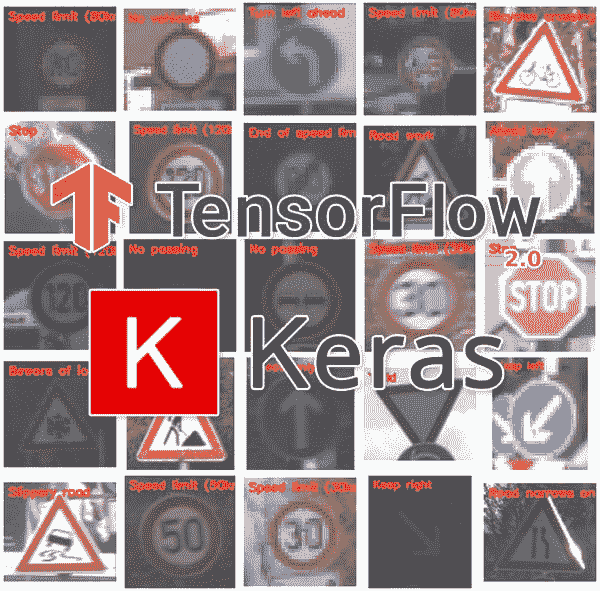
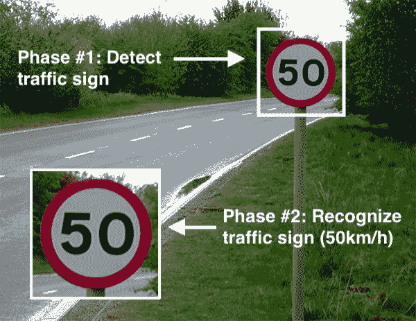
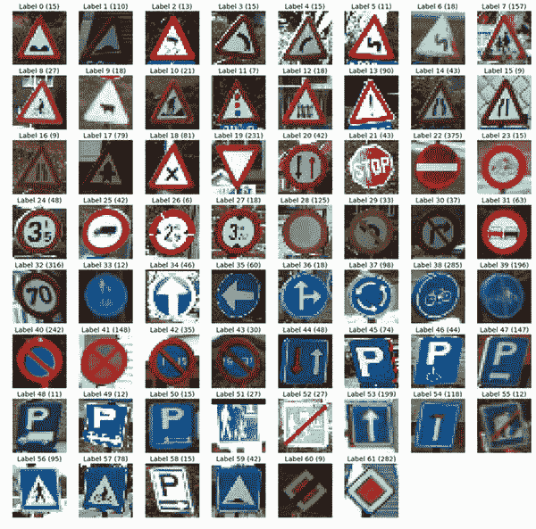
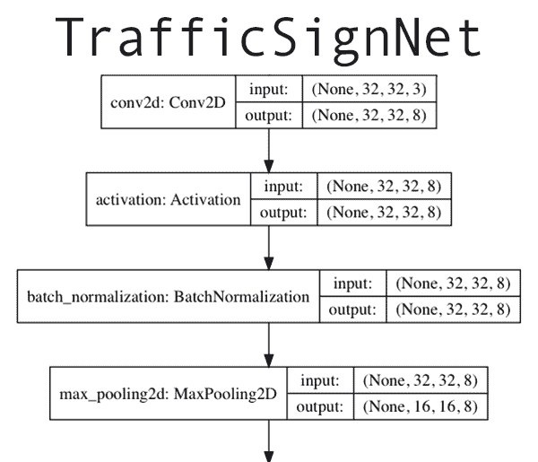
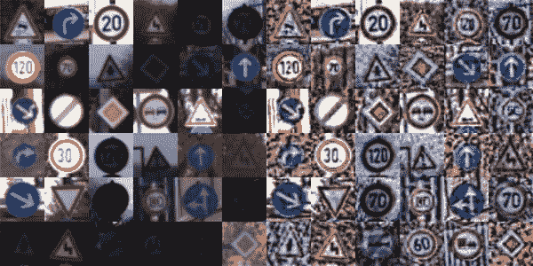
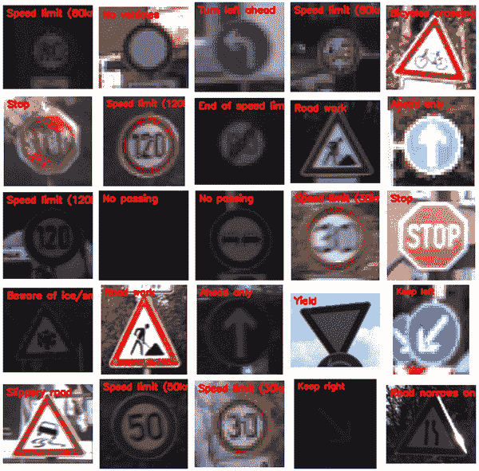

# 基于 Keras 和深度学习的交通标志分类

> 原文：<https://pyimagesearch.com/2019/11/04/traffic-sign-classification-with-keras-and-deep-learning/>

在本教程中，您将学习如何使用 Keras 和深度学习训练自己的交通标志分类器/识别器，能够获得 95%以上的准确率。

[](https://pyimagesearch.com/wp-content/uploads/2019/11/traffic_sign_recognition_header.jpg)

上周末，我开车去马里兰看望我的父母。当我把车开进他们家的车道时，我注意到一件奇怪的事情——有一辆我不认识的车停在我爸爸的停车位上。

我停好车，从后备箱里拿出包，甚至还没来得及进前门，我爸就出来了，兴奋又活泼，大声说他刚从车行回来，把他的旧车折价换了一辆全新的 2020 款本田雅阁。

大多数人都喜欢拥有一辆新车，但对我爸爸来说，他每年为了工作都要开很多英里的车，拥有一辆新车对 T2 来说是一件大事，尤其是对 T3 来说。

我爸爸想让我们一家人去开车兜风，检查一下汽车，所以我爸爸、我妈妈和我爬进车里，“新车味”像难闻的古龙水一样扑面而来，你羞于承认自己喜欢这种味道。

当我们在路上行驶时，我妈妈注意到汽车的仪表盘上自动显示出了限速— *这是怎么回事？*

答案？

**交通标志识别。**

在 2020 款本田雅阁车型中，前摄像头传感器安装在后视镜后面的挡风玻璃内部。

那个摄像头轮询帧，沿路寻找标志，然后对它们进行分类。

识别出的交通标志会显示在 LCD 仪表盘上，提醒驾驶员。

无可否认，这是一个非常漂亮的功能，其余的驾驶很快就从车辆试驾变成了一场关于如何使用计算机视觉和深度学习算法来识别交通标志的讲座(我不确定我的父母是否想要这场讲座，但他们还是得到了它)。

当我拜访我的父母回来时，我决定写一个关于交通标志识别的教程会很有趣(并且有教育意义)——你可以使用这个代码作为你自己的交通标志识别项目的起点。

**要了解更多关于 Keras 和深度学习的交通标志分类，*继续阅读！***

## 基于 Keras 和深度学习的交通标志分类

在本教程的第一部分，我们将讨论交通标志分类和识别的概念，包括我们将用来训练我们自己的自定义交通标志分类器的数据集。

从那里，我们将审查我们的项目目录结构。

然后我们将实现`TrafficSignNet`，这是一个卷积神经网络，我们将在我们的数据集上训练它。

给定我们训练好的模型，我们将评估它在测试数据上的准确性，甚至学习如何对新的输入数据进行预测。

### 什么是交通标志分类？

[](https://pyimagesearch.com/wp-content/uploads/2019/11/traffic_sign_classification_phases.jpg)

**Figure 1:** Traffic sign recognition consists of object detection: (1) detection/localization and (2) classification. In this blog post we will only focus on classification of traffic signs with Keras and deep learning.

交通标志分类是自动识别道路沿线交通标志的过程，包括限速标志、让行标志、并线标志等。能够自动识别交通标志使我们能够制造“更智能的汽车”。

自动驾驶汽车需要交通标志识别，以便正确解析和理解道路。同样，汽车内部的“驾驶员警报”系统需要了解周围的道路，以帮助和保护驾驶员。

交通标志识别只是计算机视觉和深度学习可以解决的问题之一。

### 我们的交通标志数据集

[](https://pyimagesearch.com/wp-content/uploads/2019/11/traffic_sign_classification_dataset.jpg)

**Figure 2:** The German Traffic Sign Recognition Benchmark (GTSRB) dataset will be used for traffic sign classification with Keras and deep learning. ([image source](https://steemit.com/programming/@kasperfred/looking-at-german-traffic-signs))

我们将用来训练我们自己的自定义交通标志分类器的数据集是[德国交通标志识别基准(GTSRB)](https://www.kaggle.com/meowmeowmeowmeowmeow/gtsrb-german-traffic-sign) 。

GTSRB 数据集由 **43 个交通标志类别**和**近 50，000 张图像组成。**

数据集的样本可以在上面的 ****图 2**** 中看到——注意交通标志是如何被*预先裁剪*给我们的，这意味着数据集注释者/创建者已经手动标记了图像中的标志*并且*为我们提取了交通标志感兴趣区域(ROI ),从而简化了项目。

在现实世界中，交通标志识别是一个两阶段的过程:

1.  **定位:**检测并定位交通标志在输入图像/帧中的位置。
2.  **识别:**取定位的 ROI，实际上*识别*，*分类*交通标志。

深度学习对象检测器可以在网络的单次前向传递中执行定位和识别——如果你有兴趣了解更多关于使用更快的 R-CNN、单次检测器(SSD)和 RetinaNet 的对象检测和交通标志定位的信息，请务必参考我的书， *[使用 Python](https://pyimagesearch.com/deep-learning-computer-vision-python-book/)* 进行计算机视觉的深度学习，我在其中详细讨论了该主题。

### GTSRB 数据集面临的挑战

在 GTSRB 数据集中有许多挑战，**首先是图像分辨率低**，更糟糕的是，**对比度差**(如上面的 ****图 2**** 所示)。这些图像是像素化的，在某些情况下，人类的眼睛和大脑要识别这个标志即使不是不可能，也是非常具有挑战性的。

数据集的第二个挑战是**处理类偏斜:**

[](https://pyimagesearch.com/wp-content/uploads/2019/11/traffic_sign_classification_distribution.png)

**Figure 3:** The German Traffic Sign Recognition Benchmark (GTSRB) dataset is an example of an unbalanced dataset. We will account for this when training our traffic sign classifier with Keras and deep learning. ([image source](https://medium.com/@thomastracey/recognizing-traffic-signs-with-cnns-23a4ac66f7a7))

最高级别*(限速 50 公里/小时)*有超过 2000 个例子，而最少代表级别*(限速 20 公里/小时)*只有不到 200 个例子——这是一个数量级的差异！

**为了成功训练一个准确的交通标志分类器，我们需要设计一个实验来:**

*   预处理我们的输入图像，以提高对比度。
*   说明类别标签倾斜。

### 项目结构

继续使用本文的 ***【下载】*** 部分下载源代码。下载完成后，在你的机器上解压文件。

从这里我们将 **[从 Kaggle](https://www.kaggle.com/meowmeowmeowmeowmeow/gtsrb-german-traffic-sign/) 下载 GTSRB 数据集。**只需点击 Kaggle 菜单栏中的*“下载(300 MB)”*按钮，按照提示使用第三方认证合作伙伴或您的电子邮件地址登录 Kaggle。然后，您可以再次单击*“下载(300 MB)”*按钮，您的下载将开始，如下所示:


**Figure 4:** How to download the GTSRB dataset from Kaggle for traffic sign recognition with Keras and deep learning.

我将数据集提取到我的项目目录中，您可以在这里看到:

```py
$ tree --dirsfirst --filelimit 10
.
├── examples [25 entries]
├── gtsrb-german-traffic-sign
│   ├── Meta [43 entries]
│   ├── Test [12631 entries]
│   ├── Train [43 entries]
│   ├── meta-1 [43 entries]
│   ├── test-1 [12631 entries]
│   ├── train-1 [43 entries]
│   ├── Meta.csv
│   ├── Test.csv
│   └── Train.csv
├── output
│   ├── trafficsignnet.model
│   │   ├── assets
│   │   ├── variables
│   │   │   ├── variables.data-00000-of-00002
│   │   │   ├── variables.data-00001-of-00002
│   │   │   └── variables.index
│   │   └── saved_model.pb
│   └── plot.png
├── pyimagesearch
│   ├── __init__.py
│   └── trafficsignnet.py
├── train.py
├── signnames.csv
└── predict.py

13 directories, 13 files

```

我们的项目包含三个主要目录和一个 Python 模块:

*   `gtsrb-german-traffic-sign/`:我们的 GTSRB 数据集。
*   `output/`:包含我们的输出模型和`train.py`生成的训练历史图。
*   `examples/`:包含由`predict.py`生成的 25 个带注释图像的随机样本。
*   `pyimagesearch`:组成我们 TrafficSignNet CNN 的一个模块。

我们还将演练`train.py`和`predict.py`。我们的训练脚本加载数据，编译模型，训练，并将序列化的模型和绘图图像输出到磁盘。从那里，我们的预测脚本生成带注释的图像用于视觉验证目的。

### 配置您的开发环境

对于本文，您需要安装以下软件包:

*   **OpenCV**
*   **NumPy**
*   **scikit-learn**
*   **scikit-image**
*   **imutils**
*   **matplotlib**
*   **TensorFlow 2.0** (CPU 或 GPU)

幸运的是，每一个都很容易用 pip 安装，pip 是一个 Python 包管理器。

现在让我们安装软件包，理想情况下安装到如图所示的虚拟环境中(您需要创建环境):

```py
$ workon traffic_signs
$ pip install opencv-contrib-python
$ pip install numpy
$ pip install scikit-learn
$ pip install scikit-image
$ pip install imutils
$ pip install matplotlib
$ pip install tensorflow==2.0.0 # or tensorflow-gpu

```

使用 [pip 安装 OpenCV](https://pyimagesearch.com/2018/09/19/pip-install-opencv/) 无疑是开始使用 OpenCV 的最快和最简单的方法。关于**如何创建你的虚拟环境**的说明包含在[这个链接](https://pyimagesearch.com/2018/09/19/pip-install-opencv/)的教程中。这种方法(与从源代码编译相反)只是检查先决条件，并将在大多数系统上都能工作的预编译二进制文件放入虚拟环境站点包中。优化可能处于活动状态，也可能不处于活动状态。请记住，维护者已经选择不包括专利算法，因为害怕诉讼。有时在 PyImageSearch 上，我们出于教育和研究目的使用专利算法(有一些免费的替代品，你可以在商业上使用)。然而，pip 方法对于初学者来说是一个很好的选择——只是要记住你没有完整的安装。如果您需要完整安装，请参考我的[安装教程](https://pyimagesearch.com/opencv-tutorials-resources-guides/)页面。

如果你对(1)我们为什么使用 TensorFlow 2.0 感到好奇，以及(2)想知道为什么我没有指导你安装 Keras，你可能会惊讶地知道，Keras 现在实际上是作为 TensorFlow 的一部分包含在内的。诚然，TensorFlow 和 Keras 的婚姻是建立在一个有趣的过去。一定要看**[*Keras vs . TF . Keras:tensor flow 2.0 有什么不同？*](https://pyimagesearch.com/2019/10/21/keras-vs-tf-keras-whats-the-difference-in-tensorflow-2-0/)** 如果你很好奇 TensorFlow 为什么现在包含 Keras。

一旦您的环境准备就绪，是时候使用 Keras 识别交通标志了！

### 实施交通标志网，我们的 CNN 交通标志分类器

[](https://pyimagesearch.com/wp-content/uploads/2019/11/traffic_sign_recognition_architecture.png)

**Figure 5:** The Keras deep learning framework is used to build a Convolutional Neural Network (CNN) for traffic sign classification.

让我们来实现一个卷积神经网络来分类和识别交通标志。

***注:**如果这是你第一次用 Keras 建 CNN，一定要复习我的 [Keras 教程](https://pyimagesearch.com/2018/09/10/keras-tutorial-how-to-get-started-with-keras-deep-learning-and-python/)。*

我已经决定将这个分类器命名为`TrafficSignNet` —打开项目目录中的`trafficsignnet.py`文件，然后插入以下代码:

```py
# import the necessary packages
from tensorflow.keras.models import Sequential
from tensorflow.keras.layers import BatchNormalization
from tensorflow.keras.layers import Conv2D
from tensorflow.keras.layers import MaxPooling2D
from tensorflow.keras.layers import Activation
from tensorflow.keras.layers import Flatten
from tensorflow.keras.layers import Dropout
from tensorflow.keras.layers import Dense

class TrafficSignNet:
	@staticmethod
	def build(width, height, depth, classes):
		# initialize the model along with the input shape to be
		# "channels last" and the channels dimension itself
		model = Sequential()
		inputShape = (height, width, depth)
		chanDim = -1

```

我们的`tf.keras`进口列在**2-9 线**。我们将利用 Keras 的[顺序 API](https://pyimagesearch.com/2019/10/28/3-ways-to-create-a-keras-model-with-tensorflow-2-0-sequential-functional-and-model-subclassing/) 来构建我们的`TrafficSignNet` CNN ( **Line 2** )。

**第 11 行**定义了我们的`TrafficSignNet`类，接着是**第 13 行**定义了我们的`build`方法。`build`方法接受四个参数:图像尺寸、`depth`和数据集中`classes`的数量。

**第 16-19 行**初始化我们的`Sequential`模型并指定 CNN 的`inputShape`。

让我们定义我们的`CONV => RELU => BN => POOL`层集:

```py
		# CONV => RELU => BN => POOL
		model.add(Conv2D(8, (5, 5), padding="same",
			input_shape=inputShape))
		model.add(Activation("relu"))
		model.add(BatchNormalization(axis=chanDim))
		model.add(MaxPooling2D(pool_size=(2, 2)))

```

这组图层使用一个 *5×5* 内核来学习更大的特征——这将有助于区分不同的交通标志形状和交通标志本身上的颜色斑点。

在这里，我们定义了两组`(CONV => RELU => CONV => RELU) * 2 => POOL`层:

```py
		# first set of (CONV => RELU => CONV => RELU) * 2 => POOL
		model.add(Conv2D(16, (3, 3), padding="same"))
		model.add(Activation("relu"))
		model.add(BatchNormalization(axis=chanDim))
		model.add(Conv2D(16, (3, 3), padding="same"))
		model.add(Activation("relu"))
		model.add(BatchNormalization(axis=chanDim))
		model.add(MaxPooling2D(pool_size=(2, 2)))

		# second set of (CONV => RELU => CONV => RELU) * 2 => POOL
		model.add(Conv2D(32, (3, 3), padding="same"))
		model.add(Activation("relu"))
		model.add(BatchNormalization(axis=chanDim))
		model.add(Conv2D(32, (3, 3), padding="same"))
		model.add(Activation("relu"))
		model.add(BatchNormalization(axis=chanDim))
		model.add(MaxPooling2D(pool_size=(2, 2)))

```

这些层集合通过在应用 max-pooling 以减少体积维度之前堆叠两组`CONV => RELU => BN`层来加深网络。

我们网络的头部由两组完全连接的层和一个 softmax 分类器组成:

```py
		# first set of FC => RELU layers
		model.add(Flatten())
		model.add(Dense(128))
		model.add(Activation("relu"))
		model.add(BatchNormalization())
		model.add(Dropout(0.5))

		# second set of FC => RELU layers
		model.add(Flatten())
		model.add(Dense(128))
		model.add(Activation("relu"))
		model.add(BatchNormalization())
		model.add(Dropout(0.5))

		# softmax classifier
		model.add(Dense(classes))
		model.add(Activation("softmax"))

		# return the constructed network architecture
		return model

```

辍学是一种正规化的形式，旨在防止过度拟合。结果往往是一个更一般化的模型。

**第 54 行**返回我方`model`；接下来，我们将在我们的`train.py`脚本中编译和训练模型。

如果你很难理解本课程中的术语，请务必参考 [*使用 Python 进行计算机视觉的深度学习*](https://pyimagesearch.com/deep-learning-computer-vision-python-book/) 了解图层类型的概念性知识。我的 [Keras 教程](https://pyimagesearch.com/2018/09/10/keras-tutorial-how-to-get-started-with-keras-deep-learning-and-python/)也提供了一个简要的概述。

### 实施我们的培训脚本

现在我们的`TrafficSignNet`架构已经实现，让我们创建我们的 Python 训练脚本，它将负责:

*   从 GTSRB 数据集加载我们的训练和测试分割
*   图像预处理
*   训练我们的模型
*   评估我们模型的准确性
*   将模型序列化到磁盘，以便我们稍后可以使用它来预测新的交通标志数据

让我们开始吧——打开项目目录中的`train.py`文件，添加以下代码:

```py
# set the matplotlib backend so figures can be saved in the background
import matplotlib
matplotlib.use("Agg")

# import the necessary packages
from pyimagesearch.trafficsignnet import TrafficSignNet
from tensorflow.keras.preprocessing.image import ImageDataGenerator
from tensorflow.keras.optimizers import Adam
from tensorflow.keras.utils import to_categorical
from sklearn.metrics import classification_report
from skimage import transform
from skimage import exposure
from skimage import io
import matplotlib.pyplot as plt
import numpy as np
import argparse
import random
import os

```

**第 2-18 行**导入我们必需的包:

*   `matplotlib`:Python 事实上的绘图包。我们使用`"Agg"`后端，确保我们能够将我们的绘图作为图像文件导出到磁盘(**第 2 行和第 3 行**)。
*   `TrafficSignNet`:我们前面用 Keras 编码的交通标志卷积神经网络(**第 6 行**)。
*   `tensorflow.keras`:确保我们可以处理数据扩充、`Adam`优化和一键编码(**第 7-9 行**)。
*   `classification_report`:sci kit-learn 方法，用于打印方便的培训评估(**第 10 行**)。
*   `skimage`:我们将使用 scikit-image 代替 OpenCV 预处理我们的数据集，因为 scikit-image 提供了 OpenCV 没有的一些额外的预处理算法(**第 11-13 行**)。
*   `numpy`:用于数组和数值运算(**第 15 行**)。
*   `argparse`:处理[解析命令行参数](https://pyimagesearch.com/2018/03/12/python-argparse-command-line-arguments/) ( **第 16 行**)。
*   `random`:随机打乱我们的数据集(**第 17 行**)。
*   `os`:我们将使用这个模块来获取我们操作系统的路径分隔符(**第 18 行**)。

让我们继续定义一个从磁盘加载数据的函数:

```py
def load_split(basePath, csvPath):
	# initialize the list of data and labels
	data = []
	labels = []

	# load the contents of the CSV file, remove the first line (since
	# it contains the CSV header), and shuffle the rows (otherwise
	# all examples of a particular class will be in sequential order)
	rows = open(csvPath).read().strip().split("\n")[1:]
	random.shuffle(rows)

```

我们将 GTSRB 数据集预先分为训练/测试部分。**第 20 行**定义`load_split`分别加载每个训练片段。它接受一个到数据集基础的路径以及一个包含每个图像的类标签的`.csv`文件路径。

**第 22 行和第 23 行**初始化我们的`data`和`labels`列表，该函数将很快填充并返回这些列表。

**第 28 行**加载我们的`.csv`文件，去掉空白，通过换行符抓取每一行，跳过第一个标题行。结果是一个`rows`列表，然后**行 29** 随机洗牌。

这里可以看到第 28 行和第 29 行的结果(即，如果你通过`print(rows[:3])`打印列表中的前三行):

```py
['33,35,5,5,28,29,13,Train/13/00013_00001_00009.png',
 '36,36,5,5,31,31,38,Train/38/00038_00049_00021.png',
 '75,77,6,7,69,71,35,Train/35/00035_00039_00024.png']

```

数据的格式为:`Width, Height, X1, Y1, X2, Y2, ClassID, Image Path`。

现在让我们继续遍历`rows`,提取并预处理我们需要的数据:

```py
	# loop over the rows of the CSV file
	for (i, row) in enumerate(rows):
		# check to see if we should show a status update
		if i > 0 and i % 1000 == 0:
			print("[INFO] processed {} total images".format(i))

		# split the row into components and then grab the class ID
		# and image path
		(label, imagePath) = row.strip().split(",")[-2:]

		# derive the full path to the image file and load it
		imagePath = os.path.sep.join([basePath, imagePath])
		image = io.imread(imagePath)

```

**32 号线**绕过`rows`。在循环中，我们继续:

*   每处理 1000 幅图像，向终端显示一次状态更新(**第 34 行和第 35 行**)。
*   从`row` ( **第 39 行**)中提取 ClassID ( `label`)和`imagePath`)。
*   导出图像文件的完整路径+用 scikit-image 加载图像(**第 42 行和第 43 行**)。

正如上面的*“gt SRB 数据集的挑战”*一节中提到的那样，**数据集的一个最大问题是，许多图像具有*低对比度*，**使得人眼识别给定的标志具有挑战性(更不用说计算机视觉/深度学习模型了)。

我们可以通过应用一种叫做[对比度受限自适应直方图均衡化](https://en.wikipedia.org/wiki/Adaptive_histogram_equalization#CLAHE) (CLAHE)的算法来自动提高图像对比度，其实现可以在 scikit-image 库中找到[。](https://scikit-image.org/docs/dev/api/skimage.exposure.html#skimage.exposure.equalize_adapthist)

使用 CLAHE，我们可以提高交通标志图像的对比度:

[](https://pyimagesearch.com/wp-content/uploads/2019/11/traffic_sign_recognition_clahe.jpg)

**Figure 6:** As part of preprocessing for our GTSRB dataset for deep learning classification of traffic signs, we apply a method known as [Contrast Limited Adaptive Histogram Equalization](https://en.wikipedia.org/wiki/Adaptive_histogram_equalization#CLAHE) (CLAHE) to improve image contrast. Original images input images can be seen on the *left* — notice how contrast is very low and some signs cannot be recognize. By applying CLAHE *(right)* we can improve image contrast.

虽然我们的图像对人眼来说可能有点“不自然”，但对比度的提高将更好地帮助我们的计算机视觉算法自动识别我们的交通标志。

***注:**非常感谢 [Thomas Tracey](https://github.com/tommytracey) 在他 2017 年的文章中提出使用 CLAHE 来改善交通标志识别[。](https://medium.com/@thomastracey/recognizing-traffic-signs-with-cnns-23a4ac66f7a7)*

现在让我们通过应用 CLAHE 来预处理我们的图像:

```py
		# resize the image to be 32x32 pixels, ignoring aspect ratio,
		# and then perform Contrast Limited Adaptive Histogram
		# Equalization (CLAHE)
		image = transform.resize(image, (32, 32))
		image = exposure.equalize_adapthist(image, clip_limit=0.1)

		# update the list of data and labels, respectively
		data.append(image)
		labels.append(int(label))

	# convert the data and labels to NumPy arrays
	data = np.array(data)
	labels = np.array(labels)

	# return a tuple of the data and labels
	return (data, labels)

```

为了完成对`rows`的循环，我们:

*   将图像尺寸调整为 *32×32* 像素(**第 48 行**)。
*   应用 CLAHE 图像对比度校正(**第 49 行**)。
*   用`image`本身和等级`label` ( **行 52 和 53** )更新`data`和`labels`列表。

然后，**行 56-60** 将`data`和`labels`转换成 NumPy 数组，`return`将它们转换成调用函数。

定义了我们的`load_split`函数后，现在我们可以继续用[解析命令行参数](https://pyimagesearch.com/2018/03/12/python-argparse-command-line-arguments/):

```py
# construct the argument parser and parse the arguments
ap = argparse.ArgumentParser()
ap.add_argument("-d", "--dataset", required=True,
	help="path to input GTSRB")
ap.add_argument("-m", "--model", required=True,
	help="path to output model")
ap.add_argument("-p", "--plot", type=str, default="plot.png",
	help="path to training history plot")
args = vars(ap.parse_args())

```

我们的三个命令行参数包括:

*   `--dataset`:gt SRB 数据集的路径。
*   `--model`:输出模型的路径/文件名。
*   通往我们训练历史的路径。

让我们初始化一些超参数并加载我们的类标签名:

```py
# initialize the number of epochs to train for, base learning rate,
# and batch size
NUM_EPOCHS = 30
INIT_LR = 1e-3
BS = 64

# load the label names
labelNames = open("signnames.csv").read().strip().split("\n")[1:]
labelNames = [l.split(",")[1] for l in labelNames]

```

**第 74-76 行**初始化要训练的时期数、我们的初始学习率和批量大小。

**第 79 行和第 80 行**从一个`.csv`文件中加载类`labelNames`。文件中不必要的标记会被自动丢弃。

现在让我们继续加载并预处理我们的数据:

```py
# derive the path to the training and testing CSV files
trainPath = os.path.sep.join([args["dataset"], "Train.csv"])
testPath = os.path.sep.join([args["dataset"], "Test.csv"])

# load the training and testing data
print("[INFO] loading training and testing data...")
(trainX, trainY) = load_split(args["dataset"], trainPath)
(testX, testY) = load_split(args["dataset"], testPath)

# scale data to the range of [0, 1]
trainX = trainX.astype("float32") / 255.0
testX = testX.astype("float32") / 255.0

# one-hot encode the training and testing labels
numLabels = len(np.unique(trainY))
trainY = to_categorical(trainY, numLabels)
testY = to_categorical(testY, numLabels)

# calculate the total number of images in each class and
# initialize a dictionary to store the class weights
classTotals = trainY.sum(axis=0)
classWeight = dict()

# loop over all classes and calculate the class weight
for i in range(0, len(classTotals)):
	classWeight[i] = classTotals.max() / classTotals[i]

```

在这一部分中，我们:

*   导出到训练和测试分割的路径(**行 83 和 84** )。
*   使用我们的`load_split`函数来分别加载每个训练/测试分割(**行 88 和 89** )。
*   通过将图像缩放到范围*【0，1】*(**第 92 行和第 93 行**)来预处理图像。
*   对培训/测试类别标签进行一次性编码(**第 96-98 行**)。
*   考虑我们的数据集中的倾斜(即，事实上我们有*比其他类别多*多得多的图像)。**第 102-107 行**为每个类分配一个权重，供训练时使用。

从这里，我们将准备+训练我们的`model`:

```py
# construct the image generator for data augmentation
aug = ImageDataGenerator(
	rotation_range=10,
	zoom_range=0.15,
	width_shift_range=0.1,
	height_shift_range=0.1,
	shear_range=0.15,
	horizontal_flip=False,
	vertical_flip=False,
	fill_mode="nearest")

# initialize the optimizer and compile the model
print("[INFO] compiling model...")
opt = Adam(lr=INIT_LR, decay=INIT_LR / (NUM_EPOCHS * 0.5))
model = TrafficSignNet.build(width=32, height=32, depth=3,
	classes=numLabels)
model.compile(loss="categorical_crossentropy", optimizer=opt,
	metrics=["accuracy"])

# train the network
print("[INFO] training network...")
H = model.fit(
	aug.flow(trainX, trainY, batch_size=BS),
	validation_data=(testX, testY),
	steps_per_epoch=trainX.shape[0] // BS,
	epochs=NUM_EPOCHS,
	class_weight=classWeight,
	verbose=1)

```

**第 110-118 行**用随机旋转、缩放、移动、剪切和翻转设置初始化我们的[数据扩充](https://pyimagesearch.com/2019/07/08/keras-imagedatagenerator-and-data-augmentation/)对象。请注意，我们在这里*没有*应用水平或垂直翻转，因为野外的交通标志*不会*翻转。

**第 121-126 行**用`Adam`优化器和学习率衰减编译我们的`TraffigSignNet`模型。

**130-136 线**使用[Keras’`fit`方法](https://pyimagesearch.com/2018/12/24/how-to-use-keras-fit-and-fit_generator-a-hands-on-tutorial/)训练`model`。注意，`class_weight`参数被传递以适应我们数据集中的倾斜。

接下来，我们将评估`model`并将其序列化到磁盘:

```py
# evaluate the network
print("[INFO] evaluating network...")
predictions = model.predict(testX, batch_size=BS)
print(classification_report(testY.argmax(axis=1),
	predictions.argmax(axis=1), target_names=labelNames))

# save the network to disk
print("[INFO] serializing network to '{}'...".format(args["model"]))
model.save(args["model"])

```

**行 140** 对测试集上的`model`进行评估。从那里，**行 141 和 142** 在终端打印分类报告。

**第 146 行**将 Keras `model`序列化到磁盘，以便我们稍后可以在预测脚本中使用它进行推断。

最后，下面的代码块绘制了训练精度/损失曲线，并将该图导出到磁盘上的图像文件中:

```py
# plot the training loss and accuracy
N = np.arange(0, NUM_EPOCHS)
plt.style.use("ggplot")
plt.figure()
plt.plot(N, H.history["loss"], label="train_loss")
plt.plot(N, H.history["val_loss"], label="val_loss")
plt.plot(N, H.history["accuracy"], label="train_acc")
plt.plot(N, H.history["val_accuracy"], label="val_acc")
plt.title("Training Loss and Accuracy on Dataset")
plt.xlabel("Epoch #")
plt.ylabel("Loss/Accuracy")
plt.legend(loc="lower left")
plt.savefig(args["plot"])

```

请特别注意，TensorFlow 2.0 已将训练历史键重命名为:

*   `H.history["acc"]`现在是`H.history["accuracy"]`。
*   `H.history["val_acc"]`现在是`H.history["val_accuracy"]`。

此时，您应该正在使用 TensorFlow 2.0(内置了 Keras)，但如果不是，您可以调整键名(**第 154 行和第 155 行**)。

就我个人而言，我仍然没有弄明白为什么 TensorFlow 的开发人员做出了更改，以拼出“准确性”，但没有拼出“验证”。对我来说，这似乎违反直觉。也就是说，所有的框架和代码库都有我们需要学会处理的细微差别。

### 在交通标志数据集上训练 TrafficSignNet

要训练我们的交通标志分类模型，请确保您具有:

1.  使用本教程的 ***【下载】*** 部分下载源代码。
2.  按照上面的*“项目结构”*部分下载我们的交通标志数据集。

从那里，打开一个终端并执行以下命令:

```py
$ python train.py --dataset gtsrb-german-traffic-sign \
	--model output/trafficsignnet.model --plot output/plot.png
[INFO] loading training and testing data...
[INFO] compiling model...
[INFO] training network...
Epoch 1/30
612/612 [==============================] - 49s 81ms/step - loss: 2.6584 - accuracy: 0.2951 - val_loss: 2.1152 - val_accuracy: 0.3513
Epoch 2/30
612/612 [==============================] - 47s 77ms/step - loss: 1.3989 - accuracy: 0.5558 - val_loss: 0.7909 - val_accuracy: 0.7417
Epoch 3/30
612/612 [==============================] - 48s 78ms/step - loss: 0.9402 - accuracy: 0.6989 - val_loss: 0.5147 - val_accuracy: 0.8302
Epoch 4/30
612/612 [==============================] - 47s 76ms/step - loss: 0.6940 - accuracy: 0.7759 - val_loss: 0.4559 - val_accuracy: 0.8515
Epoch 5/30
612/612 [==============================] - 47s 76ms/step - loss: 0.5521 - accuracy: 0.8219 - val_loss: 0.3004 - val_accuracy: 0.9055
...
Epoch 26/30
612/612 [==============================] - 46s 75ms/step - loss: 0.1213 - accuracy: 0.9627 - val_loss: 0.7386 - val_accuracy: 0.8274
Epoch 27/30
612/612 [==============================] - 46s 75ms/step - loss: 0.1175 - accuracy: 0.9633 - val_loss: 0.1931 - val_accuracy: 0.9505
Epoch 28/30
612/612 [==============================] - 46s 75ms/step - loss: 0.1101 - accuracy: 0.9664 - val_loss: 0.1553 - val_accuracy: 0.9575
Epoch 29/30
612/612 [==============================] - 46s 76ms/step - loss: 0.1098 - accuracy: 0.9662 - val_loss: 0.1642 - val_accuracy: 0.9581
Epoch 30/30
612/612 [==============================] - 47s 76ms/step - loss: 0.1063 - accuracy: 0.9684 - val_loss: 0.1778 - val_accuracy: 0.9495
[INFO] evaluating network...
                               precision    recall  f1-score   support
         Speed limit (20km/h)       0.94      0.98      0.96        60
         Speed limit (30km/h)       0.96      0.97      0.97       720
         Speed limit (50km/h)       0.95      0.98      0.96       750
         Speed limit (60km/h)       0.98      0.92      0.95       450
         Speed limit (70km/h)       0.98      0.96      0.97       660
         Speed limit (80km/h)       0.92      0.93      0.93       630
  End of speed limit (80km/h)       0.96      0.87      0.91       150
        Speed limit (100km/h)       0.93      0.94      0.93       450
        Speed limit (120km/h)       0.90      0.99      0.94       450
                   No passing       1.00      0.97      0.98       480
 No passing veh over 3.5 tons       1.00      0.96      0.98       660
 Right-of-way at intersection       0.95      0.93      0.94       420
                Priority road       0.99      0.99      0.99       690
                        Yield       0.98      0.99      0.99       720
                         Stop       1.00      1.00      1.00       270
                  No vehicles       0.99      0.90      0.95       210
    Veh > 3.5 tons prohibited       0.97      0.99      0.98       150
                     No entry       1.00      0.94      0.97       360
              General caution       0.98      0.77      0.86       390
         Dangerous curve left       0.75      0.60      0.67        60
        Dangerous curve right       0.69      1.00      0.81        90
                 Double curve       0.76      0.80      0.78        90
                   Bumpy road       0.99      0.78      0.87       120
                Slippery road       0.66      0.99      0.79       150
    Road narrows on the right       0.80      0.97      0.87        90
                    Road work       0.94      0.98      0.96       480
              Traffic signals       0.87      0.95      0.91       180
                  Pedestrians       0.46      0.55      0.50        60
            Children crossing       0.93      0.94      0.94       150
            Bicycles crossing       0.92      0.86      0.89        90
           Beware of ice/snow       0.88      0.75      0.81       150
        Wild animals crossing       0.98      0.95      0.96       270
   End speed + passing limits       0.98      0.98      0.98        60
             Turn right ahead       0.97      1.00      0.98       210
              Turn left ahead       0.98      1.00      0.99       120
                   Ahead only       0.99      0.97      0.98       390
         Go straight or right       1.00      1.00      1.00       120
          Go straight or left       0.92      1.00      0.96        60
                   Keep right       0.99      1.00      0.99       690
                    Keep left       0.97      0.96      0.96        90
         Roundabout mandatory       0.90      0.99      0.94        90
            End of no passing       0.90      1.00      0.94        60
End no passing veh > 3.5 tons       0.91      0.89      0.90        90

                     accuracy                           0.95     12630
                    macro avg       0.92      0.93      0.92     12630
                 weighted avg       0.95      0.95      0.95     12630

[INFO] serializing network to 'output/trafficsignnet.model'...

```

***注意:**在终端输出块中，为了可读性，一些类名被缩短了。*

[](https://pyimagesearch.com/wp-content/uploads/2019/11/plot.png)

**Figure 7:** Keras and deep learning is used to train a traffic sign classifier.

在这里你可以看到我们在测试集上获得了 95%的准确率*！*

 *### 实现我们的预测脚本

现在，我们的交通标志识别模型已经训练完毕，让我们学习如何:

1.  从磁盘加载模型
2.  从磁盘加载样本图像
3.  以与训练相同的方式预处理样本图像
4.  将我们的图像通过我们的交通标志分类器
5.  获得我们的最终产量预测

为了实现这些目标，我们需要检查`predict.py`的内容:

```py
# import the necessary packages
from tensorflow.keras.models import load_model
from skimage import transform
from skimage import exposure
from skimage import io
from imutils import paths
import numpy as np
import argparse
import imutils
import random
import cv2
import os

```

**第 2-12 行**导入我们必需的包、模块和函数。最值得注意的是，我们从`tensorflow.keras.models`导入`load_model`，确保我们可以从磁盘加载我们的序列化模型。你可以在这里了解更多关于[保存和加载 Keras 模型的信息。](https://pyimagesearch.com/2018/12/10/keras-save-and-load-your-deep-learning-models/)

我们将使用 scikit-image 来预处理我们的图像，就像我们在训练脚本中所做的那样。

但是与我们的训练脚本不同，我们将利用 OpenCV 来注释并将输出图像写入磁盘。

让我们解析我们的命令行参数:

```py
# construct the argument parse and parse the arguments
ap = argparse.ArgumentParser()
ap.add_argument("-m", "--model", required=True,
	help="path to pre-trained traffic sign recognizer")
ap.add_argument("-i", "--images", required=True,
	help="path to testing directory containing images")
ap.add_argument("-e", "--examples", required=True,
	help="path to output examples directory")
args = vars(ap.parse_args())

```

**第 15-22 行**解析三个命令行参数:

*   `--model`:磁盘上序列化交通标志识别器 Keras 模型的路径(我们在上一节对模型进行了训练)。
*   `--images`:测试图像目录的路径。
*   `--examples`:我们的路径到我们的注释输出图像将被存储的目录。

有了`args`字典中的每一条路径，我们就可以继续了:

```py
# load the traffic sign recognizer model
print("[INFO] loading model...")
model = load_model(args["model"])

# load the label names
labelNames = open("signnames.csv").read().strip().split("\n")[1:]
labelNames = [l.split(",")[1] for l in labelNames]

# grab the paths to the input images, shuffle them, and grab a sample
print("[INFO] predicting...")
imagePaths = list(paths.list_images(args["images"]))
random.shuffle(imagePaths)
imagePaths = imagePaths[:25]

```

**第 26 行**将我们训练过的交通标志`model`从磁盘载入内存。

**第 29 行和第 30 行**加载并解析类`labelNames`。

**第 34-36 行**抓取输入图像的路径，`shuffle`它们，并抓取`25`样本图像。

我们现在将对样本进行循环:

```py
# loop over the image paths
for (i, imagePath) in enumerate(imagePaths):
	# load the image, resize it to 32x32 pixels, and then apply
	# Contrast Limited Adaptive Histogram Equalization (CLAHE),
	# just like we did during training
	image = io.imread(imagePath)
	image = transform.resize(image, (32, 32))
	image = exposure.equalize_adapthist(image, clip_limit=0.1)

	# preprocess the image by scaling it to the range [0, 1]
	image = image.astype("float32") / 255.0
	image = np.expand_dims(image, axis=0)

	# make predictions using the traffic sign recognizer CNN
	preds = model.predict(image)
	j = preds.argmax(axis=1)[0]
	label = labelNames[j]

	# load the image using OpenCV, resize it, and draw the label
	# on it
	image = cv2.imread(imagePath)
	image = imutils.resize(image, width=128)
	cv2.putText(image, label, (5, 15), cv2.FONT_HERSHEY_SIMPLEX,
		0.45, (0, 0, 255), 2)

	# save the image to disk
	p = os.path.sep.join([args["examples"], "{}.png".format(i)])
	cv2.imwrite(p, image)

```

在我们的`imagePaths`循环中(从**第 39 行**开始)，我们:

*   用 scikit-image 加载输入图像(**第 43 行**)。
*   **预处理**图像*的方式与我们处理训练数据* ( **第 44-48 行**)的方式相同。用和训练一样的方式预处理我们的图像是绝对重要的，包括(1)调整大小，(2)调整对比度，(3)缩放到范围 *[0，1]* 。*如果我们不像对待训练数据一样对测试数据进行预处理**，那么我们的模型预测就没有意义。***
*   向图像添加一个维度——我们将对批量大小 1 进行推断( **Line 49** )。
*   **做一个预测**，抓取概率最高的类标签(**第 52-54 行**)。
*   使用 OpenCV，我们加载图像，调整图像大小，用标签对图像进行注释，并将输出图像写入磁盘(**第 58-65 行**)。

对所有 25 个图像样本重复该过程。

### 对交通标志数据进行预测

要使用我们训练的`TrafficSignNet`模型对交通标志数据进行预测，请确保您已经使用本教程的 ***“下载”*** 部分下载源代码和预训练模型。

从那里，打开一个终端并执行以下命令:

```py
$ python predict.py --model output/trafficsignnet.model \
	--images gtsrb-german-traffic-sign/Test \
	--examples examples
[INFO] loading model...
[INFO] predicting...

```

[](https://pyimagesearch.com/wp-content/uploads/2019/11/traffic_sign_recognition_results.png)

**Figure 8:** Keras deep learning traffic sign classification results.

**如您所见，我们的交通标志分类器正在正确识别我们输入的交通标志！**

### **接下来是什么？我推荐 [PyImageSearch 大学](https://pyimagesearch.com/pyimagesearch-university/?utm_source=blogPost&utm_medium=bottomBanner&utm_campaign=What%27s%20next%3F%20I%20recommend)。**

********课程信息:**
60+总课时 64+学时点播代码演练视频最后更新:2022 年 12 月
★★★4.84(128 评分)15800+学员报名人数**

****我强烈****

**你是否认为学习计算机视觉和深度学习必须是耗时的、势不可挡的、复杂的？还是必须涉及复杂的数学和方程？还是需要计算机科学的学位？**

**那是*而不是*的情况。**

**要掌握计算机视觉和深度学习，你需要的只是有人用*简单、直观的*术语向你解释事情。*而这正是我做的*。我的使命是改变教育和复杂的人工智能主题的教学方式。**

**如果你是认真学习计算机视觉的，你的下一站应该是 PyImageSearch 大学，最全面的计算机视觉，深度学习，以及今天在线的 OpenCV 课程。在这里，你将学习如何成功地将计算机视觉应用到你的工作、研究和项目中。和我一起掌握计算机视觉。**

****PyImageSearch 大学里面你会发现:****

*   **& check; **60+Course** About basic computer vision, deep learning, and OpenCV topics**
*   **& check; **60+completion certificate****
*   **& check; **64+hours** of video on demand**
*   **& check; **The new course *will be published regularly*** to ensure that you can keep up with the latest technology.**
*   **Check of&; **The pre-configured Jupyter notebook is in Google Colab 【T1]****
*   **& check; Run all code examples in your web browser—for Windows, macOS and Linux (no development environment configuration required! )**
*   **&检查；访问 PyImageSearch**
*   **& check in the **centralized code warehouse of all 500+tutorials on *; **Easily click to download** code, data set, pre-training model, etc.*****
*   **& check; **Access** on mobile phones, notebooks, desktops and other devices.**

**[点击这里加入 PyImageSearch 大学](https://pyimagesearch.com/pyimagesearch-university/?utm_source=blogPost&utm_medium=bottomBanner&utm_campaign=What%27s%20next%3F%20I%20recommend)**

## 摘要

在本教程中，您学习了如何使用 Keras 和深度学习来执行交通标志分类和识别。

为了创建我们的交通标志分类器，我们:

*   利用流行的德国交通标志识别基准 [(GTSRB)](https://www.kaggle.com/meowmeowmeowmeowmeow/gtsrb-german-traffic-sign) 作为我们的数据集。
*   使用 Keras 深度学习库实现了一个名为`TrafficSignNet`的卷积神经网络。
*   在 GTSRB 数据集上训练`TrafficSignNet`，获得 **95%的准确率**。
*   创建了一个 Python 脚本来加载我们训练过的`TrafficSignNet`模型，然后对新的输入图像进行分类。

我希望你喜欢今天关于 Keras 交通标志分类的帖子！

如果你有兴趣了解更多关于为交通标志识别和检测训练你自己的定制深度学习模型的信息，请务必参考 *[使用 Python 进行计算机视觉的深度学习](https://pyimagesearch.com/deep-learning-computer-vision-python-book/)* ，在那里我会更详细地介绍这个主题。

**要下载这篇文章的源代码(并在未来教程在 PyImageSearch 上发布时得到通知)，*只需在下面的表格中输入您的电子邮件地址！****