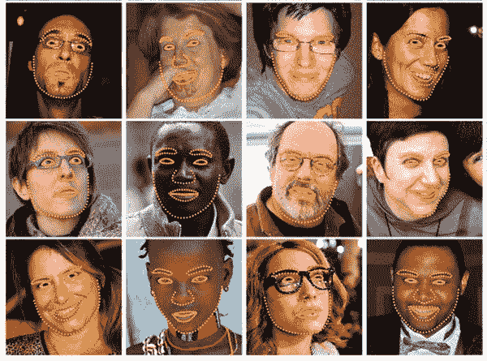
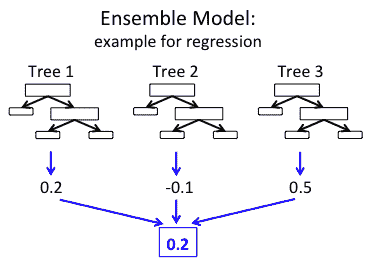
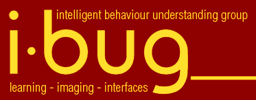
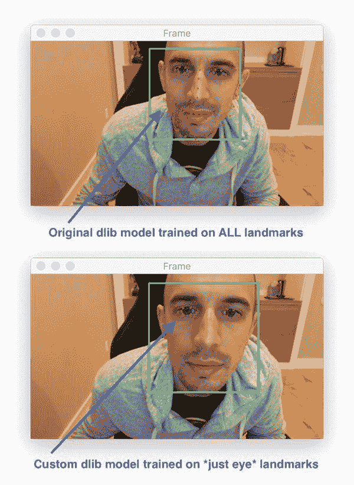
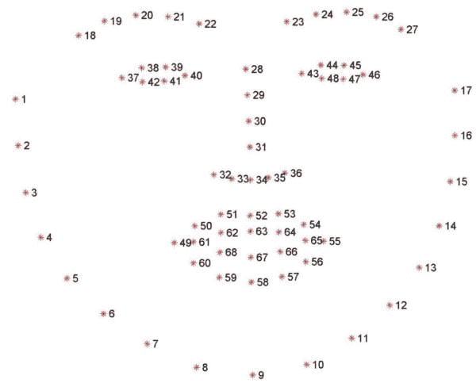
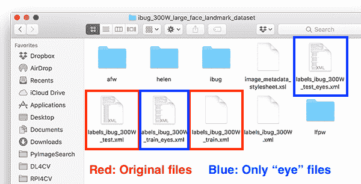
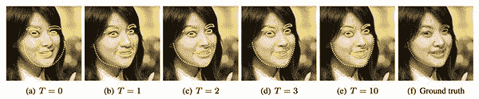

# 训练自定义 dlib 形状预测器

> 原文：<https://pyimagesearch.com/2019/12/16/training-a-custom-dlib-shape-predictor/>

在本教程中，您将学习如何训练您自己的自定义 dlib 形状预测器。然后，您将学习如何使用经过培训的 dlib 形状预测器，并使用它来预测输入图像和实时视频流上的地标。

今天开始一个全新的两部分系列**用 dlib:** 训练自定义形状预测器

1.  **第 1 部分:**训练自定义 dlib 形状预测器(今天的教程)
2.  **第 2 部分:**调整 dlib 形状预测超参数以平衡速度、精度和模型大小(下周的教程)

**形状预测器**，也称为**标志预测器**，用于预测给定“形状”的关键 *(x，y)*-坐标。

最常见、最著名的形状预测器是 dlib 的面部标志预测器[](https://pyimagesearch.com/2017/04/03/facial-landmarks-dlib-opencv-python/)**，用于定位个人面部结构，包括:**

 ***   眼睛
*   眉毛
*   鼻子
*   嘴唇/嘴
*   下颌的轮廓

面部标志用于[面部对齐](https://pyimagesearch.com/2017/05/22/face-alignment-with-opencv-and-python/)(一种提高面部识别准确性的方法)，建立一个[“睡意检测器”来检测疲劳、困倦的驾驶员](https://pyimagesearch.com/2017/05/08/drowsiness-detection-opencv/)，面部交换，虚拟改造应用，*等等。*

然而，仅仅因为面部标志是最流行的形状预测器，并不意味着我们不能训练一个形状预测器来定位图像中的其他形状！

例如，您可以使用形状预测器来:

*   在构建基于[计算机视觉的文档扫描仪](https://pyimagesearch.com/2014/09/01/build-kick-ass-mobile-document-scanner-just-5-minutes/)时自动定位一张纸的四个角。
*   检测人体的关键、结构关节(脚、膝、肘等。).
*   构建 AR/VR 应用时，将指尖本地化。

今天，我们将更详细地探讨形状预测器，包括如何使用 dlib 库训练您自己的自定义形状预测器。

**要学习如何训练自己的 dlib 形状预测器，*继续阅读！***

## 调整自定义 dlib 形状预测器

在本教程的第一部分，我们将简要讨论什么是形状/标志预测器，以及如何使用它们来预测结构对象上的特定位置。

从那里，我们将回顾 iBUG 300-W 数据集，这是一个用于训练形状预测器的常见数据集，形状预测器用于定位人脸上的特定位置(即，**面部标志**)。

然后，我将向您展示如何训练您自己的自定义 dlib 形状预测器，从而得到一个可以平衡速度、准确性和模型大小的模型。

最后，我们将测试我们的形状预测器，并将其应用于一组输入图像/视频流，证明我们的形状预测器能够实时运行。

我们将讨论后续步骤来结束本教程。

### 什么是形状/地标预测？

[](https://pyimagesearch.com/wp-content/uploads/2019/12/dlib_shape_pred_example_pred.jpg)

**Figure 1:** Training a custom dlib shape predictor on facial landmarks ([image source](http://www.csc.kth.se/~vahidk/face_ert.html)).

形状/标志预测器用于在输入“形状”上定位特定的 *(x，y)*-坐标。术语“形状”是任意的，**但是它被认为是*结构性的。***

结构形状的例子包括:

*   表面
*   手
*   手指
*   脚趾
*   等等。

例如，脸有各种不同的形状和大小，它们都有共同的结构特征——眼睛在鼻子上面，鼻子在嘴巴上面，等等。

**形状/标志预测器的目标是利用这种结构知识，并给出足够的训练数据，*学习如何自动预测这些结构的位置。***

### 形状/地标预测器如何工作？

[](https://pyimagesearch.com/wp-content/uploads/2019/12/dlib_shape_pred_ert.png)

**Figure 2:** How do shape/landmark predictors work? The dlib library implements a shape predictor algorithm with an ensemble of regression trees approach using the method described by [Kazemi and Sullivan in their 2014 CVPR paper](http://www.csc.kth.se/~vahidk/face_ert.html) ([image source](https://databricks.com/blog/2015/01/21/random-forests-and-boosting-in-mllib.html)).

有多种形状预测算法。具体使用哪一种取决于:

*   您正在处理 2D 或 3D 数据
*   你需要利用深度学习
*   或者，如果传统的计算机视觉和机器学习算法就足够了

dlib 库中实现的形状预测器算法来自卡泽米和沙利文 2014 年的 CVPR 论文， *[用回归树集合进行 1 毫秒人脸对齐。](http://www.csc.kth.se/~vahidk/face_ert.html)*

为了估计界标位置，算法:

*   检查一组稀疏的输入像素强度(即输入模型的“特征”)
*   将特征传递到回归树集合(ERT)中
*   细化预测位置，通过一系列回归变量提高准确性

最终的结果是一个可以超实时运行的形状预测器！

关于里程碑式预测内部运作的更多细节，请务必参考卡泽米和沙利文 2014 年的出版物。

### iBUG 300-W 数据集

[](https://pyimagesearch.com/wp-content/uploads/2019/12/dlib_shape_pred_ibug_group.png)

**Figure 3:** In this tutorial we will use the iBUG 300-W face landmark dataset to learn how to train a custom dlib shape predictor.

为了训练我们的自定义 dlib 形状预测器，我们将利用 [iBUG 300-W 数据集](https://ibug.doc.ic.ac.uk/resources/300-W/)(但是有一点变化)。

iBUG-300W 的目标是训练一个形状预测器，能够定位每个单独的面部结构，包括眼睛、眉毛、鼻子、嘴和下颌线。

数据集本身由 68 对整数值组成— **这些值是上面图 2 中描绘的面部结构的 *(x，y)*—坐标。**

为了创建 iBUG-300W 数据集，研究人员手工并费力地在总共 7764 张图像上标注了 68 个坐标中的每个。

在 iBUG-300W 上训练的模型可以预测这 68 个 *(x，y)*-坐标对中的每一个的位置，并且因此可以定位面部上的每一个位置。

这一切都很好……

但是如果我们想训练一个形状预测器来定位眼睛呢？

我们如何着手做那件事？

### 平衡形状预测模型的速度和精度

[](https://pyimagesearch.com/wp-content/uploads/2019/12/dlib_shape_pred_landmark_comparison.jpg)

**Figure 4:** We will train a custom dlib shape/landmark predictor to recognize just eyes in this tutorial.

**让我们假设一下，你想训练一个定制的形状预测器来定位*仅仅是*眼睛的位置。**

我们有两种选择来完成这项任务:

1.  利用 dlib 的*预先训练好的*面部标志检测器来定位*所有*面部结构，然后丢弃除眼睛以外的所有定位*。*
2.  训练我们自己的*自定义* dlib 路标预测器，它返回*仅仅是*眼睛的位置。

在某些情况下，你也许能够摆脱第一种选择；然而，这里有两个问题，即关于你的**模型速度**和你的**模型尺寸。**

**模型速度:**即使你只对地标预测的*子集*感兴趣，你的模型*仍然负责*预测整个*地标集*。你不能只告诉你的模型*“哦，嘿，只要给我那些位置，不要计算其余的。”事情并不是这样的——这是一种“全有或全无”的计算。*

**模型大小:**由于你的模型需要知道如何预测*所有被训练的*地标位置，因此它需要存储关于如何预测这些位置的量化信息。它需要存储的信息越多，你的模型就越大。

**把你的 shape predictor 模型尺寸想象成一张购物清单**——在 20 件商品的清单中，你可能只需要*鸡蛋和一加仑牛奶*，但是如果你去商店，你将会购买*清单上的所有*商品，因为这是你的家人希望你做的！

模型大小也是这样。

您的模型并不“关心”您只真正“需要”地标预测的子集；它被训练来预测所有这些，所以你会得到所有的回报！

**如果你只需要特定地标的*子集*，你应该考虑训练你自己的定制形状预测器**——你最终会得到一个既*更小*又*更快的模型。*

**在今天的教程中，我们将训练一个定制的 dlib 形状预测器来定位来自 iBUG 300-W 数据集中的*眼睛位置*。**

这种模型可以用在虚拟改造应用程序中，用于只涂眼线笔/睫毛膏或 T2 或 T3。它可以用在 T4 睡意检测器中，用于检测汽车方向盘后疲劳的司机。

### 配置您的 dlib 开发环境

为了完成今天的教程，您需要一个安装了以下软件包的虚拟环境:

*   dlib
*   OpenCV
*   imutils

幸运的是，这些包都是 pip 可安装的，但是有一些先决条件，包括虚拟环境。有关其他信息，请务必遵循以下两个指南:

*   **[*【安装 dlib(简易、完整指南)*](https://pyimagesearch.com/2018/01/22/install-dlib-easy-complete-guide/)**
*   **[*pip 安装 opencv*](https://pyimagesearch.com/2018/09/19/pip-install-opencv/)**

pip 安装命令包括:

```py
$ workon <env-name>
$ pip install dlib
$ pip install opencv-contrib-python
$ pip install imutils

```

一旦你按照我的 [dlib](https://pyimagesearch.com/2018/01/22/install-dlib-easy-complete-guide/) 或 [OpenCV](https://pyimagesearch.com/2018/09/19/pip-install-opencv/) 安装指南安装了`virtualenv`和`virtualenvwrapper`，那么`workon`命令就变得可用。

### 下载 iBUG 300-W 数据集

在我们深入本教程之前，**现在花点时间下载 iBUG 300-W 数据集(~1.7GB):**

[http://dlib . net/files/data/ibug _ 300 w _ large _ face _ landmark _ dataset . tar . gz](http://dlib.net/files/data/ibug_300W_large_face_landmark_dataset.tar.gz)

你可能还想使用这篇博文的 ***【下载】*** 部分来下载源代码。

我建议将 iBug 300W 数据集放入与本教程下载相关的 zip 文件中，如下所示:

```py
$ unzip custom-dlib-shape-predictor.zip
...
$ cd custom-dlib-shape-predictor
$ mv ~/Downloads/ibug_300W_large_face_landmark_dataset.tar.gz .
$ tar -xvf ibug_300W_large_face_landmark_dataset.tar.gz
...

```

或者(即，不点击上面的超链接)，在您的终端中使用`wget`直接下载数据集:

```py
$ unzip custom-dlib-shape-predictor.zip
...
$ cd custom-dlib-shape-predictor
$ wget http://dlib.net/files/data/ibug_300W_large_face_landmark_dataset.tar.gz
$ tar -xvf ibug_300W_large_face_landmark_dataset.tar.gz
...

```

从这里开始，您可以跟随教程的其余部分。

### 项目结构

假设您已经遵循了上一节中的说明，您的项目目录现在组织如下:

```py
$ tree --dirsfirst --filelimit 10
.
├── ibug_300W_large_face_landmark_dataset
│   ├── afw [1011 entries]
│   ├── helen
│   │   ├── testset [990 entries]
│   │   └── trainset [6000 entries]
│   ├── ibug [405 entries]
│   ├── image_metadata_stylesheet.xsl
│   ├── labels_ibug_300W.xml
│   ├── labels_ibug_300W_test.xml
│   ├── labels_ibug_300W_train.xml
│   └── lfpw
│       ├── testset [672 entries]
│       └── trainset [2433 entries]
├── ibug_300W_large_face_landmark_dataset.tar.gz
├── eye_predictor.dat
├── parse_xml.py
├── train_shape_predictor.py
├── evaluate_shape_predictor.py
└── predict_eyes.py

9 directories, 10 files

```

iBug 300-W 数据集在`ibug_300W_large_face_landmark_dataset/`目录中提取。我们将按此顺序回顾以下 Python 脚本:

1.  `parse_xml.py`:解析训练/测试 XML 数据集文件以获得**只看得见的**地标坐标。
2.  `train_shape_predictor.py`:接受解析后的 XML 文件，用 dlib 训练我们的形状预测器。
3.  `evaluate_shape_predictor.py`:计算我们定制的形状预测器的平均误差(MAE)。
4.  `predict_eyes.py`:使用我们定制的 dlib 形状预测器进行形状预测，该预测器经过训练，仅识别眼睛标志。

在下一节中，我们将从检查输入 XML 文件开始。

### 了解 iBUG-300W XML 文件结构

我们将使用 iBUG-300W 来训练我们的形状预测器；然而，我们有一个小问题:

iBUG-300W 为数据集中的所有 面部结构(即眉毛、眼睛、鼻子、嘴和下颌线) *(x，y)*-坐标对***…***

**…然而，我们想在*只训练眼睛的形状预测器！***

那我们怎么做？

我们会找到另一个不包含我们不关心的面部结构的数据集吗？

手动打开训练文件并删除我们不需要的面部结构的坐标对？

干脆放弃，拿着我们的球，回家？

**当然不是！**

我们是程序员和工程师——我们所需要的只是一些基本的文件解析，以创建一个新的训练文件，该文件只包括眼睛坐标。

为了理解我们如何做到这一点，让我们首先通过检查`labels_ibug_300W_train.xml`训练文件来考虑如何在 iBUG-300W 数据集中注释面部标志:

```py
...
<images>
  <image file='lfpw/trainset/image_0457.png'>
    <box top='78' left='74' width='138' height='140'>
      <part name='00' x='55' y='141'/>
      <part name='01' x='59' y='161'/>
      <part name='02' x='66' y='182'/>
      <part name='03' x='75' y='197'/>
      <part name='04' x='90' y='209'/>
      <part name='05' x='108' y='220'/>
      <part name='06' x='131' y='226'/>
      <part name='07' x='149' y='232'/>
      <part name='08' x='167' y='230'/>
      <part name='09' x='181' y='225'/>
      <part name='10' x='184' y='208'/>
      <part name='11' x='186' y='193'/>
      <part name='12' x='185' y='179'/>
      <part name='13' x='184' y='167'/>
      <part name='14' x='186' y='152'/>
      <part name='15' x='185' y='142'/>
      <part name='16' x='181' y='133'/>
      <part name='17' x='95' y='128'/>
      <part name='18' x='105' y='121'/>
      <part name='19' x='117' y='117'/>
      <part name='20' x='128' y='115'/>
      <part name='21' x='141' y='116'/>
      <part name='22' x='156' y='115'/>
      <part name='23' x='162' y='110'/>
      <part name='24' x='169' y='108'/>
      <part name='25' x='175' y='108'/>
      <part name='26' x='180' y='109'/>
      <part name='27' x='152' y='127'/>
      <part name='28' x='157' y='136'/>
      <part name='29' x='162' y='145'/>
      <part name='30' x='168' y='154'/>
      <part name='31' x='152' y='166'/>
      <part name='32' x='158' y='166'/>
      <part name='33' x='163' y='168'/>
      <part name='34' x='167' y='166'/>
      <part name='35' x='171' y='164'/>
      <part name='36' x='111' y='134'/>
      <part name='37' x='116' y='130'/>
      <part name='38' x='124' y='128'/>
      <part name='39' x='129' y='130'/>
      <part name='40' x='125' y='134'/>
      <part name='41' x='118' y='136'/>
      <part name='42' x='161' y='127'/>
      <part name='43' x='166' y='123'/>
      <part name='44' x='173' y='122'/>
      <part name='45' x='176' y='125'/>
      <part name='46' x='173' y='129'/>
      <part name='47' x='167' y='129'/>
      <part name='48' x='139' y='194'/>
      <part name='49' x='151' y='186'/>
      <part name='50' x='159' y='180'/>
      <part name='51' x='163' y='182'/>
      <part name='52' x='168' y='180'/>
      <part name='53' x='173' y='183'/>
      <part name='54' x='176' y='189'/>
      <part name='55' x='174' y='193'/>
      <part name='56' x='170' y='197'/>
      <part name='57' x='165' y='199'/>
      <part name='58' x='160' y='199'/>
      <part name='59' x='152' y='198'/>
      <part name='60' x='143' y='194'/>
      <part name='61' x='159' y='186'/>
      <part name='62' x='163' y='187'/>
      <part name='63' x='168' y='186'/>
      <part name='64' x='174' y='189'/>
      <part name='65' x='168' y='191'/>
      <part name='66' x='164' y='192'/>
      <part name='67' x='160' y='192'/>
    </box>
  </image>
...

```

iBUG-300W 数据集中的所有训练数据都由结构化的 XML 文件表示。

每个图像都有一个`image`标签。

在`image`标签中有一个`file`属性，它指向示例图像文件在磁盘上的位置。

此外，每个`image`都有一个与之相关联的`box`元素。

`box`元素表示图像中面部的**边界框坐标。为了理解`box`元素如何表示面部的边界框，考虑它的四个属性:**

1.  `top`:包围盒的起始 *y* 坐标。
2.  `left`:包围盒的起始 *x* 坐标。
3.  `width`:边框的宽度。
4.  `height`:边框的高度。

在`box`元素中，我们总共有 68 个`part`元素— **这些`part`元素表示 iBUG-300W 数据集中的各个 *(x，y)*—面部标志的坐标。**

注意，每个`part`元素都有三个属性:

1.  `name`:特定面部标志的索引/名称。
2.  `x`:地标的 *x* 坐标。
3.  `y`:地标的 *y* 坐标。

那么，这些地标是如何映射到特定的面部结构的呢？

答案就在下图中:

[](https://pyimagesearch.com/wp-content/uploads/2017/04/facial_landmarks_68markup.jpg)

**Figure 5:** Visualizing the 68 facial landmark coordinates from the iBUG 300-W dataset.

****图 5**** 中的坐标是 1 索引的，因此要将坐标`name`映射到我们的 XML 文件，只需从值中减去 1(因为我们的 XML 文件是 0 索引的)。

基于可视化，我们可以得出哪个`name`坐标映射到哪个面部结构:

*   通过*【48，68】*可以进入**口**。
*   **右眉**通穴*【17、22】。*
*   左眉**经**穴*【22、27】*。
*   **右眼**使用*【36，42】。*
*   **左眼**与*【42，48】。*
*   **鼻**使用*【27，35】。*
*   通过*【0，17】控制**钳口**。*

由于我们*只对眼睛*感兴趣，因此我们需要解析出点*【36，48】*，再次记住:

*   我们的坐标在 XML 文件中是零索引的
*   而*【36，48】*中的右括号*)*是暗示“非包含”的数学符号。

既然我们理解了 iBUG-300W 训练文件的结构，我们可以继续解析出*只*眼睛坐标。

### 构建“仅眼睛”形状预测数据集

让我们创建一个 Python 脚本来解析 iBUG-300W XML 文件，并仅提取*眼睛坐标(我们将在下一节中训练一个自定义 dlib 形状预测器)。*

打开`parse_xml.py`文件，我们开始吧:

```py
# import the necessary packages
import argparse
import re

# construct the argument parser and parse the arguments
ap = argparse.ArgumentParser()
ap.add_argument("-i", "--input", required=True,
	help="path to iBug 300-W data split XML file")
ap.add_argument("-t", "--output", required=True,
	help="path output data split XML file")
args = vars(ap.parse_args())

```

**2 号线和 3 号线**导入必要的包。

我们将使用 Python 的两个内置模块:(1) `argparse`用于[解析命令行参数](https://pyimagesearch.com/2018/03/12/python-argparse-command-line-arguments/)，以及(2) `re`用于正则表达式匹配。如果你在开发正则表达式时需要帮助，regex101.com[是一个很好的工具，它也支持除 Python 之外的其他语言。](https://regex101.com/)

我们的脚本需要两个命令行参数:

*   `--input`:输入数据分割 XML 文件的路径(即来自 iBug 300-W 数据集)。
*   `--output`:我们输出的**只看** XML 文件的路径。

让我们继续定义我们的眼睛坐标的索引:

```py
# in the iBUG 300-W dataset, each (x, y)-coordinate maps to a specific
# facial feature (i.e., eye, mouth, nose, etc.) -- in order to train a
# dlib shape predictor on *just* the eyes, we must first define the
# integer indexes that belong to the eyes
LANDMARKS = set(list(range(36, 48)))

```

我们的**眼标**指定在**17 线**上。参考**图 5** ，记住该图是 1 索引的，而 Python 是 0 索引的。

我们将在眼睛位置上训练我们的自定义形状预测器；然而，**通过修改`LANDMARKS`列表并包括您想要检测的地标的 0 索引名称，您可以轻松地训练眉毛、鼻子、嘴或下颌线预测器，包括这些结构的任何组合或子集，**。

现在让我们定义正则表达式并加载原始的输入 XML 文件:

```py
# to easily parse out the eye locations from the XML file we can
# utilize regular expressions to determine if there is a 'part'
# element on any given line
PART = re.compile("part name='[0-9]+'")

# load the contents of the original XML file and open the output file
# for writing
print("[INFO] parsing data split XML file...")
rows = open(args["input"]).read().strip().split("\n")
output = open(args["output"], "w")

```

我们在第 22 行**上的正则表达式将很快支持提取`part`元素及其名称/索引。**

**第 27 行**加载*输入* XML 文件的内容。

**第 28 行**打开我们的*输出* XML 文件进行写入。

现在我们准备好循环遍历*输入的* XML 文件，让**找到并提取眼睛标志:**

```py
# loop over the rows of the data split file
for row in rows:
	# check to see if the current line has the (x, y)-coordinates for
	# the facial landmarks we are interested in
	parts = re.findall(PART, row)

	# if there is no information related to the (x, y)-coordinates of
	# the facial landmarks, we can write the current line out to disk
	# with no further modifications
	if len(parts) == 0:
		output.write("{}\n".format(row))

	# otherwise, there is annotation information that we must process
	else:
		# parse out the name of the attribute from the row
		attr = "name='"
		i = row.find(attr)
		j = row.find("'", i + len(attr) + 1)
		name = int(row[i + len(attr):j])

		# if the facial landmark name exists within the range of our
		# indexes, write it to our output file
		if name in LANDMARKS:
			output.write("{}\n".format(row))

# close the output file
output.close()

```

**第 31 行**开始对输入 XML 文件的`rows`进行循环。在循环内部，我们执行以下任务:

*   通过正则表达式匹配(**第 34 行**)确定当前`row`是否包含`part`元素。
    *   如果 ***不包含`part`元素，***将该行写回文件(**第 39 行和第 40 行**)。
    *   如果它 ***确实包含了一个`part`元素*** ，我们需要进一步解析它(**第 43-53 行**)。
        *   这里我们从`part`中提取`name`属性。
        *   然后检查`name`是否存在于我们想要训练形状预测器来定位的`LANDMARKS`中。如果是，我们将`row`写回磁盘(否则我们*忽略*特定的`name`，因为它不是我们想要定位的地标)。
*   通过关闭我们的`output` XML 文件(**第 56 行**)来结束这个脚本。

***注:**我们大部分`parse_xml.py`脚本的灵感来自于 [Luca Anzalone 的`slice_xml`函数，来自于他们的 GitHub repo](https://github.com/Luca96/dlib-minified-models/blob/master/face_landmarks/training_script.py#L32) 。非常感谢 Luca 编写了这样一个简单、简洁、高效的脚本！*

### 创建我们的培训和测试拆分

[](https://pyimagesearch.com/wp-content/uploads/2019/12/dlib_shape_pred_finder.png)

**Figure 6:** Creating our “eye only” face landmark training/testing XML files for training a dlib custom shape predictor with Python.

在本教程的这一点上，我假设您两者都具备:

1.  从上面的*“下载 iBUG 300-W 数据集”*部分下载了 iBUG-300W 数据集
2.  使用本教程的 ***【下载】*** 部分下载源代码。

您可以使用以下命令，通过仅解析原始训练文件中的眼睛标志坐标来生成新的**训练文件**:

```py
$ python parse_xml.py \
	--input ibug_300W_large_face_landmark_dataset/labels_ibug_300W_train.xml \
	--output ibug_300W_large_face_landmark_dataset/labels_ibug_300W_train_eyes.xml
[INFO] parsing data split XML file...

```

类似地，您可以做同样的事情来创建我们新的**测试文件:**

```py
$ python parse_xml.py \
	--input ibug_300W_large_face_landmark_dataset/labels_ibug_300W_test.xml \
	--output ibug_300W_large_face_landmark_dataset/labels_ibug_300W_test_eyes.xml
[INFO] parsing data split XML file...

```

要验证我们的新培训/测试文件是否已创建，请检查 iBUG-300W 根数据集目录中的`labels_ibug_300W_train_eyes.xml`和`labels_ibug_300W_test_eyes.xml`文件:

```py
$ cd ibug_300W_large_face_landmark_dataset
$ ls -lh *.xml    
-rw-r--r--@ 1 adrian  staff    21M Aug 16  2014 labels_ibug_300W.xml
-rw-r--r--@ 1 adrian  staff   2.8M Aug 16  2014 labels_ibug_300W_test.xml
-rw-r--r--  1 adrian  staff   602K Dec 12 12:54 labels_ibug_300W_test_eyes.xml
-rw-r--r--@ 1 adrian  staff    18M Aug 16  2014 labels_ibug_300W_train.xml
-rw-r--r--  1 adrian  staff   3.9M Dec 12 12:54 labels_ibug_300W_train_eyes.xml
$ cd ..

```

请注意，我们的`*_eyes.xml`文件被高亮显示。这两个文件的文件大小*都比它们原始的、未解析的副本*小得多。

### 实现我们定制的 dlib 形状预测器训练脚本

我们的 dlib 形状预测器训练脚本大致基于(1) [dlib 的官方示例](http://dlib.net/train_shape_predictor.py.html)和(2) [Luca Anzalone 的 2018 年优秀文章](https://medium.com/datadriveninvestor/training-alternative-dlib-shape-predictor-models-using-python-d1d8f8bd9f5c)。

我在这里的主要贡献是:

*   提供一个创建自定义 dlib 形状预测器的**完整端到端示例**，包括:
    *   在训练集上训练形状预测器
    *   在测试集上评估形状预测器
*   使用形状预测器对自定义图像/视频流进行预测。
*   **对您应该调整的超参数**提供更多注释。
*   演示如何**系统地调整你的形状预测器超参数**来平衡速度、模型大小和精确度 ***(下周的教程)。***

要了解如何训练自己的 dlib 形状预测器，请打开项目结构中的`train_shape_predictor.py`文件并插入以下代码:

```py
# import the necessary packages
import multiprocessing
import argparse
import dlib

# construct the argument parser and parse the arguments
ap = argparse.ArgumentParser()
ap.add_argument("-t", "--training", required=True,
	help="path to input training XML file")
ap.add_argument("-m", "--model", required=True,
	help="path serialized dlib shape predictor model")
args = vars(ap.parse_args())

```

**2-4 行**导入我们的包，即 dlib。dlib 工具包是由 [PyImageConf 2018](https://pyimagesearch.com/2018/10/01/pyimageconf-2018-recap/) 演讲人、 [Davis King](https://pyimagesearch.com/2017/03/13/an-interview-with-davis-king-creator-of-the-dlib-toolkit/) 开发的一个包。我们将使用 dlib 来训练形状预测器。

多重处理库将用于获取和设置我们将用于训练我们的形状预测器的线程/进程的数量。

我们的脚本需要两个命令行参数(**第 7-12 行**):

*   `--training`:我们输入的训练 XML 文件的路径。我们将使用前面两个部分生成的**仅供参考的** XML 文件。
*   `--model`:序列化 dlib 形状预测器输出文件的路径。

从这里开始，我们需要在训练形状预测器之前设置选项(即超参数)。

虽然下面的代码块可以压缩成只有 11 行代码，但是代码和本教程中的注释提供了额外的信息来帮助您(1)理解关键选项，以及(2)配置和调整选项/超参数以获得最佳性能。

在本节的剩余代码块中，我将讨论在训练您自己的自定义 dlib 形状预测器时，您可以调整/设置的 7 个最重要的超参数。这些值是:

1.  `tree_depth`
2.  `nu`
3.  `cascade_depth`
4.  `feature_pool_size`
5.  `num_test_splits`
6.  `oversampling_amount`
7.  `oversampling_translation_jitter`

我们将从默认的 dlib 形状预测器选项开始:

```py
# grab the default options for dlib's shape predictor
print("[INFO] setting shape predictor options...")
options = dlib.shape_predictor_training_options()

```

在那里，我们将配置`tree_depth`选项:

```py
# define the depth of each regression tree -- there will be a total
# of 2^tree_depth leaves in each tree; small values of tree_depth
# will be *faster* but *less accurate* while larger values will
# generate trees that are *deeper*, *more accurate*, but will run
# *far slower* when making predictions
options.tree_depth = 4

```

这里我们定义了`tree_depth`，顾名思义，它控制回归树集合(ERTs)中每个回归树的深度。每棵树上都有`2^tree_depth`片叶子——**你必须小心平衡*深度*和*速度。***

更小的值`tree_depth`将导致*更浅的树*，其*更快*，但是潜在地*更不准确。*更大的值`tree_depth`将创建*更深的树*，这些树*更慢*，但潜在地*更准确。*

`tree_depth`的典型值在范围 *[2，8]内。*

我们要探索的下一个参数是`nu`，一个正则化参数:

```py
# regularization parameter in the range [0, 1] that is used to help
# our model generalize -- values closer to 1 will make our model fit
# the training data better, but could cause overfitting; values closer
# to 0 will help our model generalize but will require us to have
# training data in the order of 1000s of data points
options.nu = 0.1

```

`nu`选项是一个浮点值(在范围 *[0，1]* 内)，用作正则化参数来帮助我们的模型泛化。

更接近于`1`的值将使我们的模型更接近于训练数据，但是可能会导致过度拟合。更接近于 `0`的值将帮助我们的模型一般化；然而，泛化能力有一个警告—**`nu`越接近 `0`，你就需要越多的*训练数据。***

通常，对于小的`nu`值，你需要 1000 个训练样本。

我们的下一个参数是`cascade_depth`:

```py
# the number of cascades used to train the shape predictor -- this
# parameter has a *dramtic* impact on both the *accuracy* and *output
# size* of your model; the more cascades you have, the more accurate
# your model can potentially be, but also the *larger* the output size
options.cascade_depth = 15

```

一系列级联用于细化和调整来自专家审评组的初始预测—**`cascade_depth`将对你的模型的*准确性*和*输出文件大小*产生巨大影响。**

您允许的级联越多，您的模型将变得越大(但可能更准确)。你允许的层叠越少，你的模型就越小(但可能不太精确)。

卡泽米和沙利文论文中的下图展示了`cascade_depth`对面部标志对齐的影响:

[](https://pyimagesearch.com/wp-content/uploads/2019/12/dlib_shape_pred_cascade_depth.jpg)

**Figure 7:** The `cascade_depth` parameter has a significant impact on the accuracy of your custom dlib shape/landmark predictor model.

可以清楚地看到，层叠越深，面部标志对齐得越好。

通常情况下，您会希望根据所需的目标模型大小和精度，在*【6，18】*范围内探索`cascade_depth`值。

现在让我们继续讨论`feature_pool_size`:

```py
# number of pixels used to generate features for the random trees at
# each cascade -- larger pixel values will make your shape predictor
# more accurate, but slower; use large values if speed is not a
# problem, otherwise smaller values for resource constrained/embedded
# devices
options.feature_pool_size = 400

```

`feature_pool_size`控制用于为每个级联中的随机树生成特征的像素数。

你包含的像素越多，你的模型运行的越慢(但是可能会更精确)。你考虑的*像素*越少，你的模型运行越快(但也可能不太准确)。

**我在这里的建议是，如果推理速度是*而不是*所关心的，你应该为`feature_pools_size`使用较大的值。否则，您应该使用较小的值来加快预测速度(通常用于嵌入式/资源受限的设备)。**

我们要设置的下一个参数是`num_test_splits`:

```py
# selects best features at each cascade when training -- the larger
# this value is, the *longer* it will take to train but (potentially)
# the more *accurate* your model will be
options.num_test_splits = 50

```

`num_test_splits`参数对**你的模型需要多长时间训练** *(* 即训练/挂钟时间，*不是*推断速度)有着巨大的影响。

你考虑的越多，你就越有可能有一个准确的形状预测器——但是，再次重申，要小心这个参数，因为它可能会导致训练时间激增。

接下来让我们来看看`oversampling_amount`:

```py
# controls amount of "jitter" (i.e., data augmentation) when training
# the shape predictor -- applies the supplied number of random
# deformations, thereby performing regularization and increasing the
# ability of our model to generalize
options.oversampling_amount = 5

```

`oversampling_amount`控制应用于我们训练数据的[数据增加](https://pyimagesearch.com/2019/07/08/keras-imagedatagenerator-and-data-augmentation/)的数量。dlib 库导致数据扩充**抖动**，但它本质上和数据扩充的想法是一样的。

这里我们告诉 dlib 对每个输入图像应用总共`5`个随机变形。

您可以将`oversampling_amount`视为一个正则化参数，因为它可能*降低*训练精度，但*增加*测试精度，从而允许我们的模型更好地泛化。

典型的`oversampling_amount`值位于*【0，50】*范围内，其中 `0`表示没有增加，`50`表示训练数据集中增加了 50 倍。

**小心这个参数！**更大的`oversampling_amount`值*可能看起来是个好主意*，但是它们会*显著*增加你的训练时间。

接下来是`oversampling_translation_jitter`选项:

```py
# amount of translation jitter to apply -- the dlib docs recommend
# values in the range [0, 0.5]
options.oversampling_translation_jitter = 0.1

```

`oversampling_translation_jitter`控制应用于我们的训练数据集的翻译增强量。

平移抖动的典型值在范围 *[0，0.5]内。*

`be_verbose`选项简单地指示 dlib 在我们的形状预测器训练时打印出状态信息:

```py
# tell the dlib shape predictor to be verbose and print out status
# messages our model trains
options.be_verbose = True

```

最后，我们有了`num_threads`参数:

```py
# number of threads/CPU cores to be used when training -- we default
# this value to the number of available cores on the system, but you
# can supply an integer value here if you would like
options.num_threads = multiprocessing.cpu_count()

```

这个参数 ***极其重要*** 因为它可以 ***显著地*** 加快训练你的模型所需要的时间！

向 dlib 提供的 CPU 线程/内核越多，模型的训练速度就越快。我们将把这个值默认为系统中 CPU 的总数；但是，您可以将该值设置为任意整数(前提是它小于或等于系统中 CPU 的数量)。

既然我们的`options`已经设置好了，最后一步就是简单地调用`train_shape_predictor`:

```py
# log our training options to the terminal
print("[INFO] shape predictor options:")
print(options)

# train the shape predictor
print("[INFO] training shape predictor...")
dlib.train_shape_predictor(args["training"], args["model"], options)

```

dlib 库接受(1)我们的训练 XML 文件的路径，(2)我们的输出形状预测器模型的路径，以及(3)我们的选项集。

一旦定型，形状预测器将被序列化到磁盘上，这样我们以后就可以使用它了。

虽然这个脚本看起来特别简单，但是一定要花时间配置您的选项/超参数以获得最佳性能。

### 定型自定义 dlib 形状预测器

我们现在准备训练我们的自定义 dlib 形状预测器！

确保您已经(1)下载了 iBUG-300W 数据集，并且(2)使用了本教程的 ***“下载”*** 部分来下载这篇文章的源代码。

完成后，您就可以训练形状预测器了:

```py
$ python train_shape_predictor.py \
	--training ibug_300W_large_face_landmark_dataset/labels_ibug_300W_train_eyes.xml \
	--model eye_predictor.dat
[INFO] setting shape predictor options...
[INFO] shape predictor options:
shape_predictor_training_options(be_verbose=1, cascade_depth=15, tree_depth=4, num_trees_per_cascade_level=500, nu=0.1, oversampling_amount=5, oversampling_translation_jitter=0.1, feature_pool_size=400, lambda_param=0.1, num_test_splits=50, feature_pool_region_padding=0, random_seed=, num_threads=20, landmark_relative_padding_mode=1)
[INFO] training shape predictor...
Training with cascade depth: 15
Training with tree depth: 4
Training with 500 trees per cascade level.
Training with nu: 0.1
Training with random seed:
Training with oversampling amount: 5
Training with oversampling translation jitter: 0.1
Training with landmark_relative_padding_mode: 1
Training with feature pool size: 400
Training with feature pool region padding: 0
Training with 20 threads.
Training with lambda_param: 0.1
Training with 50 split tests.
Fitting trees...
Training complete
Training complete, saved predictor to file eye_predictor.dat

```

整个训练过程在我的 3 GHz 英特尔至强 W 处理器上花费了 **9m11s** 。

要验证您的形状预测器是否已序列化到磁盘，请确保已在您的目录结构中创建了`eye_predictor.dat`:

```py
$ ls -lh *.dat
-rw-r--r--@ 1 adrian  staff    18M Dec  4 17:15 eye_predictor.dat

```

正如你所看到的，输出模型只有**18MB**——与 dlib 的标准/默认面部标志预测器 **99.7MB 相比，文件大小减少了很多！**

### 实现我们的形状预测评估脚本

现在我们已经训练了 dlib 形状预测器，我们需要评估它在训练集和测试集上的性能，以验证它没有过度拟合，并且我们的结果将(理想地)推广到训练集之外的我们自己的图像。

打开`evaluate_shape_predictor.py`文件并插入以下代码:

```py
# import the necessary packages
import argparse
import dlib

# construct the argument parser and parse the arguments
ap = argparse.ArgumentParser()
ap.add_argument("-p", "--predictor", required=True,
	help="path to trained dlib shape predictor model")
ap.add_argument("-x", "--xml", required=True,
	help="path to input training/testing XML file")
args = vars(ap.parse_args())

# compute the error over the supplied data split and display it to
# our screen
print("[INFO] evaluating shape predictor...")
error = dlib.test_shape_predictor(args["xml"], args["predictor"])
print("[INFO] error: {}".format(error))

```

**第 2 行和第 3 行**表示我们需要`argparse`和`dlib`来评估我们的形状预测器。

我们的命令行参数包括:

*   `--predictor`:我们通过前面两个*“训练”*部分生成的序列化形状预测器模型的路径。
*   `--xml`:输入训练/测试 XML 文件的路径(即我们的**只看**解析的 XML 文件)。

当这两个参数都通过命令行提供时，dlib 将处理求值(**行 16** )。Dlib 处理在 ***预测的*** 标志坐标和 ***地面实况*** 标志坐标之间的平均误差(MAE)的计算。

***越小*越美，*越好*越预言。**

### 形状预测精度结果

如果你还没有，使用本教程的 ***“下载”*** 部分下载源代码和预训练的形状预测器。

从那里，执行下面的命令来评估我们在**训练集上的眼睛界标预测器:**

```py
$ python evaluate_shape_predictor.py --predictor eye_predictor.dat \
	--xml ibug_300W_large_face_landmark_dataset/labels_ibug_300W_train_eyes.xml
[INFO] evaluating shape predictor...
[INFO] error: 3.631152776257545

```

这里我们得到了大约 3.63 的 **MAE。**

现在让我们在我们的**测试集上运行相同的命令:**

```py
$ python evaluate_shape_predictor.py --predictor eye_predictor.dat \
	--xml ibug_300W_large_face_landmark_dataset/labels_ibug_300W_test_eyes.xml
[INFO] evaluating shape predictor...
[INFO] error: 7.568211111799696

```

正如你所看到的, **MAE 在我们的测试集上比在我们的训练集上大两倍。**

如果你以前有过使用机器学习或深度学习算法的经验，你会知道在大多数情况下，你的训练损失会低于测试损失。这并不意味着您的模型表现很差，相反，这只是意味着您的模型在模拟训练数据和测试数据方面做得更好。

形状预测器的评估特别有趣，因为需要检查的不仅仅是 MAE！

你还需要**视觉验证**结果和**验证形状预测器是否按预期工作**——我们将在下一节讨论这个主题。

### 实现形状预测器推理脚本

现在我们已经训练好了形状预测器，我们需要通过将它应用到我们自己的示例图像/视频中来直观地验证结果看起来不错。

在本节中，我们将:

1.  从磁盘加载我们训练过的 dlib 形状预测器。
2.  访问我们的视频流。
3.  将形状预测应用于每个单独的帧。
4.  验证结果看起来不错。

让我们开始吧。

打开`predict_eyes.py`并插入以下代码:

```py
# import the necessary packages
from imutils.video import VideoStream
from imutils import face_utils
import argparse
import imutils
import time
import dlib
import cv2

# construct the argument parser and parse the arguments
ap = argparse.ArgumentParser()
ap.add_argument("-p", "--shape-predictor", required=True,
	help="path to facial landmark predictor")
args = vars(ap.parse_args())

```

**2-8 线**导入必要的包。特别是，我们将在这个脚本中使用`imutils`和 OpenCV ( `cv2`)。我们的`VideoStream`类将允许我们访问我们的网络摄像头。`face_utils`模块包含一个助手函数，用于将 dlib 的地标预测转换为 NumPy 数组。

这个脚本唯一需要的命令行参数是我们训练过的面部标志预测器的路径，`--shape-predictor`。

让我们执行三个初始化:

```py
# initialize dlib's face detector (HOG-based) and then load our
# trained shape predictor
print("[INFO] loading facial landmark predictor...")
detector = dlib.get_frontal_face_detector()
predictor = dlib.shape_predictor(args["shape_predictor"])

# initialize the video stream and allow the cammera sensor to warmup
print("[INFO] camera sensor warming up...")
vs = VideoStream(src=0).start()
time.sleep(2.0)

```

我们的初始化包括:

*   加载人脸`detector` ( **第 19 行**)。检测器允许我们在定位面部标志之前在图像/视频中找到面部。我们将使用 dlib 的 HOG +线性 SVM 人脸检测器。或者，你可以使用 Haar cascades(非常适合资源受限的嵌入式设备)或更准确的[深度学习人脸检测器](https://pyimagesearch.com/2018/02/26/face-detection-with-opencv-and-deep-learning/)。
*   加载面部标志`predictor` ( **第 20 行**)。
*   初始化我们的网络视频流(**第 24 行**)。

现在我们准备好循环我们相机中的帧:

```py
# loop over the frames from the video stream
while True:
	# grab the frame from the video stream, resize it to have a
	# maximum width of 400 pixels, and convert it to grayscale
	frame = vs.read()
	frame = imutils.resize(frame, width=400)
	gray = cv2.cvtColor(frame, cv2.COLOR_BGR2GRAY)

	# detect faces in the grayscale frame
	rects = detector(gray, 0)

```

**第 31-33 行**抓取一帧，调整大小，转换成灰度。

**第 36 行**使用 dlib 的 HOG +线性 SVM 算法进行人脸检测。

让我们通过**预测和绘制面部标志:**来处理帧中检测到的面部

```py
	# loop over the face detections
	for rect in rects:
		# convert the dlib rectangle into an OpenCV bounding box and
		# draw a bounding box surrounding the face
		(x, y, w, h) = face_utils.rect_to_bb(rect)
		cv2.rectangle(frame, (x, y), (x + w, y + h), (0, 255, 0), 2)

		# use our custom dlib shape predictor to predict the location
		# of our landmark coordinates, then convert the prediction to
		# an easily parsable NumPy array
		shape = predictor(gray, rect)
		shape = face_utils.shape_to_np(shape)

		# loop over the (x, y)-coordinates from our dlib shape
		# predictor model draw them on the image
		for (sX, sY) in shape:
			cv2.circle(frame, (sX, sY), 1, (0, 0, 255), -1)

```

**第 39 行**开始在检测到的人脸上循环。在循环内部，我们:

*   取 dlib 的`rectangle`对象，转换成 OpenCV 的标准`(x, y, w, h)`包围盒排序(**第 42 行**)。
*   画出包围面部的边界框(**线 43** )。
*   使用我们定制的 dlib 形状`predictor`通过**线 48** 预测我们的地标(即眼睛)的位置。
*   将返回的坐标转换成一个 NumPy 数组(**第 49 行**)。
*   循环预测的地标坐标，并在输出帧上将它们分别绘制为小点(**行 53 和 54** )。

如果你需要复习画矩形和实心圆，请参考我的 OpenCV 教程。

最后，我们将显示结果！

```py
	# show the frame
	cv2.imshow("Frame", frame)
	key = cv2.waitKey(1) & 0xFF

	# if the `q` key was pressed, break from the loop
	if key == ord("q"):
		break

# do a bit of cleanup
cv2.destroyAllWindows()
vs.stop()

```

**第 57 行**向屏幕显示画面。

如果在我们处理视频流中的帧时按下了`q`键，我们将暂停并执行清理。

### 用我们的 dlib 形状预测器进行预测

您准备好观看我们的定制形状预测器了吗？

如果是这样，请确保使用本教程的 ***“下载”*** 部分下载源代码和预训练的 dlib shape predictor。

从那里，您可以执行以下命令:

```py
$ python predict_eyes.py --shape-predictor eye_predictor.dat
[INFO] loading facial landmark predictor...
[INFO] camera sensor warming up...

```

如你所见，我们的形状预测器是:

*   **在输入视频流中正确定位**我的眼睛
*   **实时运行**

再一次，我想把你的注意力引回到本教程的*“平衡形状预测器模型速度和准确性”*部分— **我们的模型并没有预测面部可能的 68 个地标位置的全部*！***

相反，我们训练了一个**定制的 dlib 形状预测器，*只对*的眼睛区域进行定位。**(即，我们的模型没有在 iBUG-300W 数据集中的其他面部结构上进行训练，包括眉毛、鼻子、嘴和下颌线)。

我们定制的眼睛预测器可以用于我们*不需要*额外的面部结构，而*只需要*眼睛的情况，例如[建立一个睡意检测器](https://pyimagesearch.com/2017/10/23/raspberry-pi-facial-landmarks-drowsiness-detection-with-opencv-and-dlib/)，为眼线/睫毛膏建立一个虚拟改造应用程序，或者创建计算机辅助软件来帮助残疾用户使用他们的计算机。

在下周的教程中，我将向你展示如何调整 dlib 的形状预测器的超参数，以获得最佳的 **性能。**

### 如何为形状预测器训练创建自己的数据集？

要创建自己的形状预测数据集，您需要使用 dlib 的 [imglab](https://github.com/davisking/dlib/tree/master/tools/imglab) 工具。关于如何为形状预测器训练创建和注释你自己的数据集超出了这篇博文的范围。我将在 PyImageSearch 的未来教程中介绍它。

## 摘要

在本教程中，您学习了如何训练您自己的自定义 dlib 形状/地标预测器。

为了训练我们的形状预测器，我们利用了 [iBUG-300W 数据集](https://ibug.doc.ic.ac.uk/resources/300-W/)，只是不是训练我们的模型来识别*所有面部结构*(即，眼睛、眉毛、鼻子、嘴和下颌线)**，而是训练模型来定位*仅仅是眼睛。***

最终结果是一个模型:

*   **准确:**我们的形状预测器可以准确预测/定位人脸上眼睛的位置。
*   **小:**我们的眼睛标志预测器比预训练的 dlib 面部标志预测器小(分别为 18MB 和 99.7MB)。
*   **快速:**我们的模型比 dlib 的预训练面部标志预测器更快，因为它预测的位置更少(模型的超参数也被选择来提高速度)。

在下周的教程中，我将教你如何系统地调整 dlib 的形状预测器训练程序的超参数，以平衡预测速度，模型大小和定位精度。

**要下载这篇文章的源代码(并在未来教程在 PyImageSearch 上发布时得到通知)，*只需在下面的表格中输入您的电子邮件地址！*****