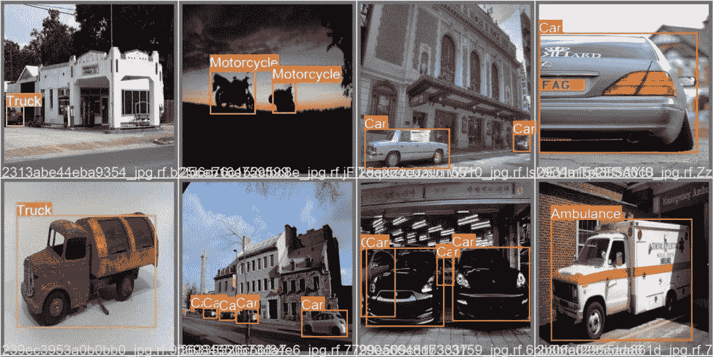

# 在自定义数据集上训练 YOLOv5 对象检测器

> 原文：<https://pyimagesearch.com/2022/06/20/training-the-yolov5-object-detector-on-a-custom-dataset/>

* * *

## **目录**

* * *

## [**在自定义数据集上训练 YOLOv5 物体检测器**](#TOC)

在深度学习的帮助下，我们都知道计算机视觉领域在最近十年里激增。因此，许多流行的计算机视觉问题，如图像分类、对象检测和具有真实工业用例的分割，开始实现前所未有的准确性。从 2012 年开始，每年都会设定一个新的基准。今天，我们将从实用的角度来看物体检测。

对象检测具有各种最先进的架构，可以在现实世界的数据集上使用现成的架构，以合理的准确度检测对象。唯一的条件是测试数据集与预训练的检测器具有相同的类。

但是，您经常构建的应用程序可能有不同于预训练对象检测器类的对象。例如，数据集分布与训练数据集检测器的地方非常不同。在这种情况下，我们经常使用迁移学习的概念，其中我们使用预先训练的检测器，并在较新的数据集上对其进行微调。在今天的教程中，您将学习在自定义数据集上训练预训练的 YOLOv5 对象检测器，而无需编写太多代码。

我们将不深入 YOLOv5 物体探测器的理论细节；然而，你可以查看我们的[介绍 YOLO 家族](https://pyimg.co/dgbvi)的博客帖子，在那里我们涵盖了一些相关的内容。

这是我们关于 YOLO 的 7 集系列的最后一课:

1.  [*YOLO 家族简介*](https://pyimg.co/dgbvi)
2.  [*了解一个实时物体检测网络:你只看一次(YOLOv1)*](https://pyimg.co/3cpmz)
3.  [*更好、更快、更强的物体探测器(YOLOv2)*](https://pyimg.co/ehaox)
4.  [*使用 COCO 评估器*](https://pyimg.co/nwoka) 平均精度(mAP)
5.  [*用 Darknet-53 和多尺度预测的增量改进(YOLOv3)*](https://pyimg.co/8xfpg)
6.  [*【yolov 4】*](https://pyimg.co/c6kiu)
7.  ***[在自定义数据集上训练 YOLOv5 物体检测器](https://pyimg.co/fq0a3)* (今日教程)**

**要了解如何在自定义数据集** ***上训练 YOLOv5 物体检测器，只需继续阅读。***

* * *

## [**在自定义数据集上训练 YOLOv5 物体检测器**](#TOC)

2020 年， [**Ultralytics**](https://ultralytics.com/) 的创始人兼 CEO 格伦·约彻(Glenn Jocher)在 [**GitHub**](https://github.com/ultralytics/yolov5) 上发布了其 YOLOv5 的开源实现。YOLOv5 提供了一系列在 MS COCO 数据集上预先训练的对象检测架构。

今天，YOLOv5 是官方最先进的模型之一，拥有巨大的支持，并且在生产中更容易使用。最好的部分是 YOLOv5 是在 PyTorch 中原生实现的，消除了 Darknet 框架的限制(基于 C 编程语言)。

从 YOLO 到 PyTorch 框架的巨大变化使得开发人员更容易修改架构并直接导出到许多部署环境中。别忘了，YOLOv5 是火炬中心展示区的官方最先进车型之一。

**表 1** 显示了 Volta 100 GPU 上 640×640 图像分辨率下 MS COCO 验证数据集上五个 YOLOv5 变体的性能(mAP)和速度(FPS)基准。所有五个模型都是在 MS COCO 训练数据集上训练的。型号性能指标评测从 YOLOv5n 开始按升序显示(即，具有最小型号尺寸的 nano 变体到最大型号 YOLOv5x)。

 

|   |   |   |   | **速度**  | **速度**  | **速度**  |   |   |
|   | **大小**  |  |  | **CPU b1**  | **V100 b1**  | **V100 b32**  | **参数**  | **一偏**  |
| **型号**  | **【像素】**  | **0.5:0.95**  | **0.5**  | **(ms)**  | **(ms)**  | **(ms)**  | **【米】**  | **@ 640(B)** |
| 约洛夫 5n  | 640
 | 28.4  | 46.0  | 45
 | 6.3  | 0.6  | 1.9  | 4.5  |
| 约洛夫 5s  | 640
 | 37.2  | 56.0  | 98
 | 6.4  | 0.9
 | 7.2  | 16.5  |
| yolov 5m
 | 640
 | 45.2  | 63.9  | 224
 | 8.2  | 1.7  | 21.2  | 49
 |
| 约洛夫 5l  | 640
 | 48.8  | 67.2  | 430
 | 10.1  | 2.7  | 46.5  | 109.1  |
| YOLOv5x  | 640
 | 50.7  | 68.9  | 766  | 12.1  | 4.8  | 86.7  | 205.7  |
| **表 1:**MS COCO 数据集上五个 YOLOv5 变种的性能和速度基准。
 |

今天，我们将通过在自定义数据集上迁移学习来学习如何在 PyTorch 框架中利用 YOLOv5 的强大功能！

* * *

### [**配置您的开发环境**](#TOC)

为了遵循这个指南，您需要克隆 [Ultralytics YOLOv5 存储库](https://github.com/ultralytics/yolov5)并从`requirements.txt`安装所有必需的包`pip`。

幸运的是，要运行 YOLOv5 培训，您只需在`requirements.txt`文件上进行 pip 安装，这意味着所有的库都可以通过 pip 安装！

```py
$ git clone https://github.com/ultralytics/yolov5.git #clone repo
$ cd yolov5/
$ pip install -r requirements.txt #install dependencies
```

* * *

### [**在配置开发环境时遇到了问题？**](#TOC)

说了这么多，你是:

*   时间紧迫？
*   了解你雇主的行政锁定系统？
*   想要跳过与命令行、包管理器和虚拟环境斗争的麻烦吗？
*   **准备好在您的 Windows、macOS 或 Linux 系统上运行代码*****？***

 *那今天就加入 [PyImageSearch 大学](https://www.pyimagesearch.com/pyimagesearch-university/)吧！

**获得本教程的 Jupyter 笔记本和其他 PyImageSearch 指南，这些指南是** ***预先配置的*** **，可以在您的网络浏览器中运行在 Google Colab 的生态系统上！**无需安装。

最棒的是，这些 Jupyter 笔记本可以在 Windows、macOS 和 Linux 上运行！

* * *

## [**关于数据集**](#TOC)

对于今天的实验，我们将在两个不同的数据集上训练 YOLOv5 模型，即 [Udacity 自动驾驶汽车数据集](https://public.roboflow.com/object-detection/self-driving-car)和 [Vehicles-OpenImages 数据集](https://public.roboflow.com/object-detection/vehicles-openimages)。

这些数据集是公开的，但我们从 [Roboflow](https://roboflow.com/) 下载它们，它提供了一个很好的平台，可以用计算机视觉领域的各种数据集来训练你的模型。更有趣的是，你可以下载多种格式的数据集，如 COCO JSON、YOLO Darknet TXT 和 YOLOv5 PyTorch。这节省了编写助手函数的时间，以便将基本事实注释转换成模型所需的格式。

* * *

### [**YOLOv5 标签格式**](#TOC)

因为我们将训练 YOLOv5 PyTorch 模型，所以我们将以 YOLOv5 格式下载数据集。YOLOv5 的基本事实注释格式非常简单(图 2**中显示了一个例子)，因此您可以自己编写一个脚本来完成这项工作。每个图像的每个边界框都有一个单行的`text`文件。例如，如果一个图像中有四个对象，`text`文件将有四行包含类标签和边界框坐标。每行的格式是**

`class_id center_x center_y width height`

其中字段以空格分隔，坐标从`0`到`1`标准化。要从像素值转换为标准化的`xywh`，将 x &框的宽度除以图像的宽度，将 y &框的高度除以图像的高度。

* * *

### [**车辆-OpenImages 数据集**](#TOC)

该数据集仅包含用于对象检测的各种车辆类别的 627 幅图像，如*汽车*、*公共汽车*、*救护车*、*摩托车*和*卡车*。这些图像来源于[开放图像](https://arxiv.org/pdf/1811.00982.pdf)开源计算机视觉数据集。该数据集受[知识共享许可](https://creativecommons.org/licenses/by/4.0/)的保护，它允许你共享和改编数据集，甚至将其用于商业用途。

**图 3** 显示了来自数据集的一些样本图像，带有用绿色标注的地面实况边界框。

在 627 幅图像中有 1194 个感兴趣区域(对象)，这意味着每幅图像至少有 1.9 个对象。基于**图 4** 中所示的启发，汽车类贡献了超过 50%的对象。相比之下，其余的类别:公共汽车、卡车、摩托车和救护车，相对于小汽车类别来说代表性不足。

* * *

### [**Udacity 自动驾驶汽车数据集**](#TOC)

请注意，我们不会在此数据集上训练 YOLOv5 模型。相反，我们为你们所有人确定了这个伟大的数据集作为练习，以便一旦你们从本教程中学习完，你们可以使用这个数据集来训练对象检测器。

这个数据集来源于[原始的 Udacity 自动驾驶汽车数据集](https://github.com/udacity/self-driving-car/tree/master/annotations)。不幸的是，原始数据集缺少数以千计的行人、骑车人、汽车和交通灯的标注。因此，Roboflow 设法重新标记了数据集，以纠正错误和遗漏。

**图 5** 显示了 Roboflow 标注的数据集和原始数据集中缺失的标签的一些例子。如果你使用过自动驾驶城市场景数据集，如 [Cityscapes](https://www.cityscapes-dataset.com/) 、 [ApolloScape](http://apolloscape.auto/) 和 [Berkeley DeepDrive](https://bdd-data.berkeley.edu/) ，你会发现这个数据集与那些数据集非常相似。

该数据集包含 11 个类别的 97，942 个标签和 15，000 幅图像。该数据集在 Roboflow 上以两种不同的方式提供:具有`1920x1200`(下载大小`~3.1` GB)的图像和适合大多数人的具有`512x512`(下载大小`~580` MB)的降采样版本。我们将使用下采样版本，因为它的尺寸更小，符合我们对网络的要求。

像前面的 Vehicles-OpenImages 数据集一样，这个数据集拥有最多属于`car`类的对象(超过总对象的 60%)。**图 6** 显示了 Udacity 自动驾驶汽车数据集中的类别分布:

* * *

### [**选择型号**](#TOC)

**图 7** 显示了五种 YOLOv5 变体，从为在移动和嵌入式设备上运行而构建的最小 YOLOv5 nano 模型开始，到另一端的 YOLOv5 XLarge。对于今天的实验，我们将利用基本模型 YOLOv5s，它提供了准确性和速度之间的良好平衡。

* * *

## [**约洛夫 5 训练**](#TOC)

 **这一部分是今天教程的核心，我们将涵盖大部分内容，从

*   下载数据集
*   创建数据配置
*   培训 YOLOv5 模型
*   可视化 YOLOv5 模型工件
*   定量结果
*   冻结初始图层并微调剩余图层
*   结果

* * *

### [**下载车辆-打开图像数据集**](#TOC)

```py
# Download the vehicles-open image dataset
!mkdir vehicles_open_image
%cd vehicles_open_image
!curl -L "https://public.roboflow.com/ds/2Tb6yXY8l8?key=Eg82WpxUEr" > vehicles.zip 
!unzip vehicles.zip
!rm vehicles.zip
```

在**的第 2 行和第 3 行**，我们创建了`vehicles_open_image`目录，并将`cd`放入我们下载数据集的目录中。然后，在**的第 4 行**，我们使用`curl`命令，并将从[获得的数据集 URL 传递到这里](https://public.roboflow.com/object-detection/vehicles-openimages/1)。最后，我们解压缩数据集并删除第 5 行和第 6 行上的 zip 文件。

让我们看看`vehicles_open_image`文件夹的内容:

```py
$tree /content/vehicles_open_image -L 2
/content/vehicles_open_image
├── data.yaml
├── README.dataset.txt
├── README.roboflow.txt
├── test
│   ├── images
│   └── labels
├── train
│   ├── images
│   └── labels
└── valid
    ├── images
    └── labels

9 directories, 3 files
```

父目录有三个文件，其中只有`data.yaml`是必需的，还有三个子目录:

*   `data.yaml`:有数据相关的配置，如列车和有效数据目录路径，数据集中的类总数，每个类的名称
*   `train`:带有训练标签的训练图像
*   `valid`:带注释的验证图像
*   `test`:测试图像和标签。如果带有标签的测试数据可用，评估模型的性能就变得容易了。

* * *

### [**配置设置**](#TOC)

接下来，我们将编辑`data.yaml`文件，为`train`和`valid`图像设置`path`和绝对路径。

```py
# Create configuration
import yaml
config = {'path': '/content/vehicles_open_image',
         'train': '/content/vehicles_open_image/train',
         'val': '/content/vehicles_open_image/valid',
         'nc': 5,
         'names': ['Ambulance', 'Bus', 'Car', 'Motorcycle', 'Truck']}

with open("data.yaml", "w") as file:
   yaml.dump(config, file, default_flow_style=False)
```

在**行 2** 上，我们导入`yaml`模块，这将允许我们以`.yaml`格式保存`data.yaml`配置文件。然后从**第 3-7 行**开始，我们在一个`config`变量中定义数据路径、训练、验证、类的数量和类名。所以`config`是一本字典。

最后，在**的第 9 行和第 10 行**，我们打开与数据集一起下载的现有`data.yaml`文件，用`config`中的内容覆盖它，并将其存储在磁盘上。

* * *

### [**【yolo V5】训练超参数和模型配置**](#TOC)

YOLOv5 有大约 30 个用于各种训练设置的超参数。这些在`hyp.scratch-low.yaml`中定义，用于从零开始的低增强 COCO 训练，放置在`/data`目录中。训练数据超参数如下所示，它们对于产生良好的结果非常重要，因此在开始训练之前，请确保正确初始化这些值。对于本教程，我们将简单地使用默认值，这些值是为 YOLOv5 COCO 培训从头开始优化的。

如您所见，它有`learning rate`、`weight_decay`和`iou_t` (IoU 训练阈值)，以及一些数据增强超参数，如`translate`、`scale`、`mosaic`、`mixup`和`copy_paste`。`mixup:0.0`表示不应应用混合数据增强。

```py
lr0: 0.01  # initial learning rate (SGD=1E-2, Adam=1E-3)
lrf: 0.01  # final OneCycleLR learning rate (lr0 * lrf)
momentum: 0.937  # SGD momentum/Adam beta1
weight_decay: 0.0005  # optimizer weight decay 5e-4
warmup_epochs: 3.0  # warmup epochs (fractions ok)
warmup_momentum: 0.8  # warmup initial momentum
warmup_bias_lr: 0.1  # warmup initial bias lr
box: 0.05  # box loss gain
cls: 0.5  # cls loss gain
cls_pw: 1.0  # cls BCELoss positive_weight
obj: 1.0  # obj loss gain (scale with pixels)
obj_pw: 1.0  # obj BCELoss positive_weight
iou_t: 0.20  # IoU training threshold
anchor_t: 4.0  # anchor-multiple threshold
# anchors: 3  # anchors per output layer (0 to ignore)
fl_gamma: 0.0  # focal loss gamma (efficientDet default gamma=1.5)
hsv_h: 0.015  # image HSV-Hue augmentation (fraction)
hsv_s: 0.7  # image HSV-Saturation augmentation (fraction)
hsv_v: 0.4  # image HSV-Value augmentation (fraction)
degrees: 0.0  # image rotation (+/- deg)
translate: 0.1  # image translation (+/- fraction)
scale: 0.5  # image scale (+/- gain)
shear: 0.0  # image shear (+/- deg)
perspective: 0.0  # image perspective (+/- fraction), range 0-0.001
flipud: 0.0  # image flip up-down (probability)
fliplr: 0.5  # image flip left-right (probability)
mosaic: 1.0  # image mosaic (probability)
mixup: 0.0  # image mixup (probability)
copy_paste: 0.0  # segment copy-paste (probability)
```

接下来，您可以简单地查看一下`YOLOv5s`网络架构的结构，尽管您几乎不会修改模型配置文件，这与训练数据超参数不同。对于 COCO 女士数据集，它将`nc`设置为`80`，将`backbone`设置为特征提取，然后将`head`设置为检测。

```py
# Parameters
nc: 80  # number of classes
depth_multiple: 0.33  # model depth multiple
width_multiple: 0.50  # layer channel multiple
anchors:
  - [10,13, 16,30, 33,23]  # P3/8
  - [30,61, 62,45, 59,119]  # P4/16
  - [116,90, 156,198, 373,326]  # P5/32

# YOLOv5 v6.0 backbone
backbone:
  # [from, number, module, args]
  [[-1, 1, Conv, [64, 6, 2, 2]],  # 0-P1/2
   [-1, 1, Conv, [128, 3, 2]],  # 1-P2/4
   [-1, 3, C3, [128]],
   [-1, 1, Conv, [256, 3, 2]],  # 3-P3/8
   [-1, 6, C3, [256]],
   [-1, 1, Conv, [512, 3, 2]],  # 5-P4/16
   [-1, 9, C3, [512]],
   [-1, 1, Conv, [1024, 3, 2]],  # 7-P5/32
   [-1, 3, C3, [1024]],
   [-1, 1, SPPF, [1024, 5]],  # 9
  ]

# YOLOv5 v6.0 head
head:
  [[-1, 1, Conv, [512, 1, 1]],
   [-1, 1, nn.Upsample, [None, 2, 'nearest']],
   [[-1, 6], 1, Concat, [1]],  # cat backbone P4
   [-1, 3, C3, [512, False]],  # 13

   [-1, 1, Conv, [256, 1, 1]],
   [-1, 1, nn.Upsample, [None, 2, 'nearest']],
   [[-1, 4], 1, Concat, [1]],  # cat backbone P3
   [-1, 3, C3, [256, False]],  # 17 (P3/8-small)

   [-1, 1, Conv, [256, 3, 2]],
   [[-1, 14], 1, Concat, [1]],  # cat head P4
   [-1, 3, C3, [512, False]],  # 20 (P4/16-medium)

   [-1, 1, Conv, [512, 3, 2]],
   [[-1, 10], 1, Concat, [1]],  # cat head P5
   [-1, 3, C3, [1024, False]],  # 23 (P5/32-large)

   [[17, 20, 23], 1, Detect, [nc, anchors]],  # Detect(P3, P4, P5)
  ]
```

* * *

### [**训练约洛夫 5s 模型**](#TOC)

我们几乎已经准备好训练 YOLOv5 模型了，正如上面讨论的，我们将训练 YOLOv5s 模型。但是，在我们运行培训之前，让我们定义几个参数:

```py
SIZE = 640
BATCH_SIZE = 32
EPOCHS = 20
MODEL = "yolov5s"
WORKERS = 1
PROJECT = "vehicles_open_image_pyimagesearch"
RUN_NAME = f"{MODEL}_size{SIZE}_epochs{EPOCHS}_batch{BATCH_SIZE}_small"
```

我们定义了几个标准模型参数:

*   `SIZE`:训练时的图像尺寸或网络输入。图像在被传送到网络之前将被调整到这个值。预处理管道会将它们的大小调整为`640`像素。
*   `BATCH_SIZE`:作为单个批次送入网络进行正向传送的图像数量。可以根据可用的 GPU 内存进行修改。我们已经将其设置为`32`。
*   `EPOCHS`:我们想要在完整数据集上训练模型的次数。
*   `MODEL`:我们希望用于训练的基础模型。我们使用 YOLOv5 系列的小型型号`yolov5s`。
*   `WORKERS`:要使用的最大数据加载器工作进程。
*   `PROJECT`:这将在当前目录下创建一个项目目录(`yolov5`)。
*   `RUN_NAME`:每次运行这个模型时，它都会在项目目录下创建一个子目录，其中会有很多关于模型的信息，比如权重、样本输入图像、一些验证预测输出、度量图等。

```py
!python train.py --img {SIZE}\
               --batch {BATCH_SIZE}\
               --epochs {EPOCHS}\
               --data ../vehicles_open_image/data.yaml\
               --weights {MODEL}.pt\
               --workers {WORKERS}\
               --project {PROJECT}\
               --name {RUN_NAME}\
               --exist-ok
```

如果没有错误，培训将如下所示开始。日志表明 YOLOv5 模型将在特斯拉 T4 GPU 上使用 Torch 版进行训练；除此之外，它还显示了初始化的`hyperparameters`。

下载了`yolov5s.pt`权重，这意味着用 MS COCO 数据集训练的参数来初始化 YOLOv5s 模型。最后，我们可以看到两个纪元已经用一个`mAP@0.5=0.237`完成了。

```py
github: up to date with https://github.com/ultralytics/yolov5 ✅
YOLOv5 ? v6.1-236-gdcf8073 Python-3.7.13 torch-1.11.0+cu113 CUDA:0 (Tesla T4, 15110MiB)
hyperparameters: lr0=0.01, lrf=0.01, momentum=0.937, weight_decay=0.0005, warmup_epochs=3.0, warmup_momentum=0.8, warmup_bias_lr=0.1, box=0.05, cls=0.5, cls_pw=1.0, obj=1.0, obj_pw=1.0, iou_t=0.2, anchor_t=4.0, fl_gamma=0.0, hsv_h=0.015, hsv_s=0.7, hsv_v=0.4, degrees=0.0, translate=0.1, scale=0.5, shear=0.0, perspective=0.0, flipud=0.0, fliplr=0.5, mosaic=1.0, mixup=0.0, copy_paste=0.0
Weights & Biases: run 'pip install wandb' to automatically track and visualize YOLOv5 ? runs (RECOMMENDED)
TensorBoard: Start with 'tensorboard --logdir parking_lot_pyimagesearch', view at http://localhost:6006/
Downloading https://ultralytics.com/assets/Arial.ttf to /root/.config/Ultralytics/Arial.ttf...
100% 755k/755k [00:00<00:00, 18.0MB/s]
YOLOv5 temporarily requires wandb version 0.12.10 or below. Some features may not work as expected.
Downloading https://github.com/ultralytics/yolov5/releases/download/v6.1/yolov5s.pt to yolov5s.pt...
100% 14.1M/14.1M [00:00<00:00, 125MB/s]

Overriding model.yaml nc=80 with nc=5
Logging results to parking_lot_pyimagesearch/yolov5s_size640_epochs20_batch32_simple
Starting training for 20 epochs...

     Epoch   gpu_mem       box       obj       cls    labels  img_size
      0/19     7.36G   0.09176   0.03736   0.04355        31       640: 100% 28/28 [00:28<00:00,  1.03s/it]
               Class     Images     Labels          P          R     mAP@.5 mAP@.5:.95: 100% 4/4 [00:03<00:00,  1.04it/s]
                 all        250        454      0.352      0.293      0.185      0.089

     Epoch   gpu_mem       box       obj       cls    labels  img_size
      1/19     8.98G   0.06672   0.02769   0.03154        45       640: 100% 28/28 [00:25<00:00,  1.09it/s]
               Class     Images     Labels          P          R     mAP@.5 mAP@.5:.95: 100% 4/4 [00:05<00:00,  1.45s/it]
                 all        250        454      0.271      0.347      0.237     0.0735
```

瞧啊。这样，您已经学会了在从 Roboflow 下载的自定义数据集上训练对象检测器。是不是很神奇？

更令人兴奋的是，YOLOv5 将模型工件记录在`runs`目录中，我们将在下一节中看到这一点。

培训完成后，您将看到类似于下图的输出:

```py
​​    Epoch   gpu_mem       box       obj       cls    labels  img_size
     19/19     7.16G   0.02747   0.01736  0.004772        46       640: 100% 28/28 [01:03<00:00,  2.27s/it]
               Class     Images     Labels          P          R     mAP@.5 mAP@.5:.95: 100% 4/4 [00:05<00:00,  1.42s/it]
                 all        250        454      0.713      0.574      0.606      0.416

20 epochs completed in 0.386 hours.
Optimizer stripped from runs/train/exp/weights/last.pt, 14.5MB
Optimizer stripped from runs/train/exp/weights/best.pt, 14.5MB

Validating runs/train/exp/weights/best.pt...
Fusing layers... 
Model summary: 213 layers, 7023610 parameters, 0 gradients, 15.8 GFLOPs
               Class     Images     Labels          P          R     mAP@.5 mAP@.5:.95: 100% 4/4 [00:08<00:00,  2.23s/it]
                 all        250        454      0.715      0.575      0.606      0.416
           Ambulance        250         64      0.813      0.814      0.853      0.679
                 Bus        250         46      0.771      0.652      0.664       0.44
                 Car        250        238      0.653      0.496      0.518      0.354
          Motorcycle        250         46      0.731      0.478      0.573      0.352
               Truck        250         60      0.608      0.433      0.425      0.256
```

以上结果表明，YOLOv5s 模型在所有类中都实现了`0.606@0.5` IoU 和`0.416@0.5:0.95` IoU 的映射。它还指示类-明智的地图，并且该模型获得了救护车类的最佳分数(即`0.853 mAP@0.5` IoU)。该模型花了`23.16`分钟在特斯拉 T4 或特斯拉 K80 上完成了`20`时代的培训。

* * *

### [**可视化模型构件**](#TOC)

现在我们已经完成了模型的训练，让我们看看在`yolov5/vehicles_open_pyimagesearch_model`目录中生成的结果。

默认情况下，所有训练结果都记录到`yolov5/runs/train`中，并为每次运行创建一个新的递增目录，如`runs/train/exp`、`runs/train/exp1`等。然而，在训练模型时，我们通过了`PROJECT`和`RUN_NAME`，所以在这种情况下，它不会创建默认目录来记录训练结果。因此，在这个实验中`runs`是`parking_lot_pyimagesearch`。

接下来，让我们看看实验中创建的文件。

```py
$tree parking_lot_pyimagesearch/yolov5s_size640_epochs20_batch32_small/
parking_lot_pyimagesearch/yolov5s_size640_epochs20_batch32_small/
├── confusion_matrix.png
├── events.out.tfevents.1652810418.f70b01be1223.864.0
├── F1_curve.png
├── hyp.yaml
├── labels_correlogram.jpg
├── labels.jpg
├── opt.yaml
├── P_curve.png
├── PR_curve.png
├── R_curve.png
├── results.csv
├── results.png
├── train_batch0.jpg
├── train_batch1.jpg
├── train_batch2.jpg
├── val_batch0_labels.jpg
├── val_batch0_pred.jpg
├── val_batch1_labels.jpg
├── val_batch1_pred.jpg
├── val_batch2_labels.jpg
├── val_batch2_pred.jpg
└── weights
    ├── best.pt
    └── last.pt

1 directory, 23 files
```

在**线 1** 上，我们使用`tree`命令，后跟`PROJECT`和`RUN_NAME`，显示训练对象检测器的各种评估指标和权重文件。正如我们所看到的，它有一个精度曲线、召回曲线、精度-召回曲线、混淆矩阵、验证图像预测，以及 PyTorch 格式的权重文件。

现在让我们看一些来自`runs`目录的图片。

**图 8** 显示了具有镶嵌数据增强的训练图像批次。有 16 个图像聚集在一起；如果我们从第 3 行第 1 列中选择一个图像，那么我们可以看到该图像是四个不同图像的组合。我们在 YOLOv4 的文章中解释了镶嵌数据增强的概念，所以如果你还没有的话，一定要去看看。

接下来，我们看一下`results.png`，它包括边界框、对象和分类的训练和验证损失。它还具有用于训练的度量:精确度、召回率、`mAP@0.5`和`mAP@0.5:0.95`(**图 9** )。

**图 10** 显示了 Vehicles-OpenImages 数据集上的地面实况图像和 YOLOv5s 模型预测。从下面的两张图片来看，很明显这个模型在检测物体方面做得很好。不幸的是，该模型在第二幅图像中没有检测到自行车，在第六幅图像中没有检测到汽车。在第一张图片中，把一辆卡车误归类为一辆汽车，但这是一个很难破解的问题，因为人类甚至很难正确预测它。但总的来说，它在这些图像上做得很好。

*   
*   

**Figure 10:** Ground-truth images (*top*) and YOLOv5s model prediction (*bottom*) fine-tuned with all layers.

* * *

### [**冻结初始图层，微调剩余图层**](#TOC)

我们学习了如何训练在 MS COCO 数据集上预先训练的对象检测器，这意味着我们微调了 Vehicles-OpenImages 数据集上的模型参数(所有层)。但问题是，我们需要在新的数据集上训练所有的模型层吗？也许不会，因为预训练模型已经在一个大型的、精确的 MS COCO 数据集上进行了训练。

在自定义数据集上经常微调模型时，冻结图层的好处是可以减少训练时间。如果自定义数据集不太复杂，那么即使不相同，也可以达到相当的精度。当我们比较这两个模型的训练时间时，你会自己看到。

在本节中，我们将再次在 Vehicles-OpenImages 数据集上训练或微调 YOLOv5s 模型，但冻结网络的初始`11`层，这与之前我们微调所有检测器层不同。感谢 YOLOv5 的创造者，冻结模型层非常容易。但是，首先，我们必须通过`--freeze`参数传递我们想要在模型中冻结的层数。

现在让我们通过执行`train.py`脚本来训练模型。首先我们把`--name`，也就是运行名改成`freeze_layers`，传递`--freeze`参数，其他参数都一样。

```py
!python train.py --img {SIZE}\
               --batch {BATCH_SIZE}\
               --epochs {EPOCHS}\
               --data ../vehicles_open_image/data.yaml\
               --weights {MODEL}.pt\
               --workers {WORKERS}\
               --project {PROJECT}\
               --name freeze_layers\
               --exist-ok\
               --freeze 0 1 2 3 4 5 6 7 8 9 10
```

运行培训脚本时会产生以下输出；如您所见，网络的前 11 层显示有一个`freezing`前缀，这意味着这些层的参数(权重和偏差)将保持不变。同时，剩余的 15 个图层将在自定义数据集上进行微调。

话虽如此，现在还是让我们来看看结果吧！

```py
freezing model.0.conv.weight
freezing model.0.bn.weight
freezing model.0.bn.bias
freezing model.1.conv.weight
freezing model.1.bn.weight
freezing model.1.bn.bias
.
.
.
.
freezing model.10.conv.weight
freezing model.10.bn.weight
freezing model.10.bn.bias
```

我们可以从下面的输出中观察到，`20`个时期仅用了`0.158`个小时(即`9.48`分钟)就完成了，而我们在没有层冻结的情况下进行微调的模型用了`23.16`分钟。哇！这将时间缩短了近 2.5 倍。

但是等等，让我们来看看这个模型的映射，它是为所有类和类级显示的。

在冻结 11 层的情况下，模型实现了`0.551 mAP@0.5` IoU 和`0.336 mAP@0.5:0.95` IoU。这两个模型的精确度之间肯定有差异，但不太显著。

```py
20 epochs completed in 0.158 hours.
Optimizer stripped from parking_lot_pyimagesearch/freeze_layers/weights/last.pt, 14.5MB
Optimizer stripped from parking_lot_pyimagesearch/freeze_layers/weights/best.pt, 14.5MB

Validating parking_lot_pyimagesearch/freeze_layers/weights/best.pt...
Fusing layers... 
Model summary: 213 layers, 7023610 parameters, 0 gradients, 15.8 GFLOPs
               Class     Images     Labels          P          R     mAP@.5 mAP@.5:.95: 100% 4/4 [00:04<00:00,  1.25s/it]
                 all        250        454      0.579      0.585      0.551      0.336
           Ambulance        250         64      0.587      0.688      0.629      0.476
                 Bus        250         46      0.527      0.696      0.553      0.304
                 Car        250        238      0.522      0.462      0.452      0.275
          Motorcycle        250         46      0.733      0.478      0.587      0.311
               Truck        250         60      0.527        0.6      0.533      0.313
```

最后，在**图 11** 中，我们可以在验证图像上看到探测器预测。结果清楚地表明，它们不如用所有层训练的检测器好。例如，它错过了第一幅图像中的对象，在第二幅图像中，它将一个`motorcycle`误归类为一个`car`，在第四幅图像中未能检测到`car`，甚至在第六幅图像中，它只看到了三个`cars`。也许多训练一点时间或者少冻结几层可以提高探测器的性能。

* * *

* * *

## [**汇总**](#TOC)

恭喜你走到这一步！让我们快速总结一下我们在本教程中学到的内容。

1.  我们首先简要介绍了 YOLOv5，并讨论了 YOLOv5 变体的性能和速度基准。
2.  然后我们讨论了两个数据集:Vehicles-OpenImages 数据集和 Udacity 自动驾驶汽车数据集。除此之外，我们还介绍了 YOLOv5 基本事实注释格式。
3.  在最终确定 YOLOv5 模型变体用于训练之后，我们进入了本教程的实践部分，在这里我们讨论了一些方面，比如下载数据集、为给定数据创建`configuration.yaml`，以及训练和可视化 YOLOv5 模型工件。
4.  最后，我们第二次训练 YOLOv5 模型，但是模型的最初 11 层被冻结，并且将结果与完全训练的 YOLOv5 模型进行比较。

* * *

### [**引用信息**](#TOC)

**Sharma，A.** “在自定义数据集上训练 YOLOv5 对象检测器”， *PyImageSearch* ，D. Chakraborty，P. Chugh，A. R. Gosthipaty，S. Huot，K. Kidriavsteva，R. Raha 和 A. Thanki 编辑。，2022 年，【https://pyimg.co/fq0a3 

```py
@incollection{Sharma_2022_Custom_Dataset,
  author = {Aditya Sharma},
  title = {Training the {YOLOv5} Object Detector on a Custom Dataset},
  booktitle = {PyImageSearch},
  editor = {Devjyoti Chakraborty and Puneet Chugh and Aritra Roy Gosthipaty and Susan Huot and Kseniia Kidriavsteva and Ritwik Raha and Abhishek Thanki},
  year = {2022},
  note = {https://pyimg.co/fq0a3},
}
```

* * *

**要下载这篇文章的源代码(并在未来教程在 PyImageSearch 上发布时得到通知)，*只需在下面的表格中输入您的电子邮件地址！******