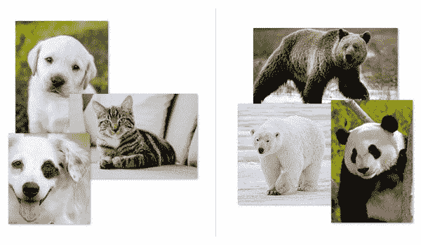
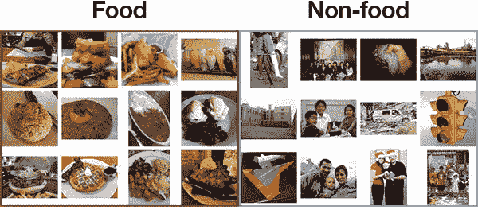

# 利用 Keras 和深度学习进行迁移学习

> 原文：<https://pyimagesearch.com/2019/05/20/transfer-learning-with-keras-and-deep-learning/>


在本教程中，您将学习如何使用 Keras、深度学习和 Python 在您自己的自定义数据集上执行迁移学习。

想象一下:

你刚刚被 Yelp 雇佣到他们的计算机视觉部门工作。

Yelp 刚刚在其网站上推出了一项新功能，允许评论者为他们的食物/菜肴拍照，然后将它们与餐厅菜单上的特定项目相关联。

这是一个很好的功能…

***…但是他们收到了很多垃圾图片。***

某些邪恶的用户没有给他们的菜肴拍照…相反，他们在给…(嗯，你大概可以猜到)拍照。

你的任务？

弄清楚如何创建一个自动化的计算机视觉应用程序，可以区分“食物”和“非食物”，从而允许 Yelp 继续推出他们的新功能，并为他们的用户提供价值。

那么，您将如何构建这样一个应用程序呢？

答案在于通过深度学习进行迁移学习。

今天标志着使用 Keras 进行 ***迁移学习*的一套全新教程的开始。迁移学习是这样的过程:**

1.  在数据集上对网络*进行预训练*
2.  并且利用它来识别它没有被训练过的图像/对象类别

从本质上讲，我们可以利用最先进的网络在具有挑战性的数据集(如 ImageNet 或 COCO)上学习到的强大、有鉴别能力的过滤器，然后应用这些网络来识别模型*从未训练过*的对象。

一般来说，在深度学习的背景下，有两种类型的迁移学习:

1.  通过**特征提取**转移学习
2.  通过**微调**转移学习

在执行*特征提取*时，我们将预训练的网络视为一个任意的特征提取器，允许输入图像向前传播，在预先指定的层停止，并将该层的*输出*作为我们的特征。

*另一方面，*微调要求我们通过移除之前的全连接层头，提供新的、刚初始化的层头，然后训练新的 FC 层来预测我们的输入类，从而更新模型架构本身。

我们将在 PyImageSearch 博客**上讨论本系列的*两种*技术，但今天我们将重点讨论*特征提取*。**

**要了解如何使用 Keras 通过特征提取进行迁移学习，*继续阅读！***

## 利用 Keras 和深度学习进行迁移学习

***2020-05-13 更新:**此博文现已兼容 TensorFlow 2+!*

***注意:**我将在本系列教程中介绍的许多迁移学习概念也出现在我的书《用 Python 进行计算机视觉的深度学习》中。**在这本书里，我进行了更详细的讨论(包括更多我的技巧、建议和最佳实践)。**如果你想在阅读完本指南后了解更多关于迁移学习的细节，请务必[看看我的书](https://pyimagesearch.com/deep-learning-computer-vision-python-book/)。*

在本教程的第一部分，我们将回顾迁移学习的两种方法:特征提取和微调。

然后，我将详细讨论如何通过*特征提取*进行迁移学习(本教程的主要焦点)。

从那里，我们将回顾 Food-5k 数据集，该数据集包含分为两类的 5000 张图像:“食物”和“非食物”。

在本教程中，我们将通过特征提取利用迁移学习来识别这两个类。

一旦我们很好地处理了数据集，我们将开始编码。

我们将回顾许多 Python 文件，每个文件完成一个特定的步骤，包括:

1.  创建配置文件。
2.  构建我们的数据集(即，将图像放入正确的目录结构中)。
3.  使用 Keras 和预训练的 CNN 从我们的输入图像中提取特征。
4.  在提取的特征之上训练逻辑回归模型。

**我们今天将在这里复习的部分代码也将在迁移学习系列**的剩余部分中使用——如果你打算跟随教程，*现在花点时间来确保你理解代码*。

### 两种迁移学习:*特征提取*和*微调*

[](https://pyimagesearch.com/wp-content/uploads/2019/05/transfer_learning_keras_animals.jpg)

**Figure 1:** Via “transfer learning”, we can utilize a pre-existing model such as one trained to classify dogs vs. cats. Using that pre-trained model we can break open the CNN and then apply “transfer learning” to another, completely different dataset (such as bears). We’ll learn how to apply transfer learning with Keras and deep learning in the rest of this blog post.

***注:**以下章节改编自我的书，[用 Python 进行计算机视觉的深度学习](https://pyimagesearch.com/deep-learning-computer-vision-python-book/)。关于迁移学习的全套章节，请参考课文。*

考虑一个传统的机器学习场景，其中我们面临两个分类挑战。

在第一个挑战中，我们的目标是训练一个[卷积神经网络](https://pyimagesearch.com/2018/04/16/keras-and-convolutional-neural-networks-cnns/)来识别图像中的狗和猫。

然后，在第二个项目中，我们的任务是识别三种不同的熊:*灰熊*、*北极熊*和*大熊猫*。

使用机器学习/深度学习中的标准实践，我们可以将这些挑战视为*两个独立的问题:*

*   首先，我们将收集足够的狗和猫的标记数据集，然后在数据集上训练模型
*   然后，我们将重复这个过程第二次，只是这一次，收集我们的熊品种的图像，然后在标记的数据集上训练一个模型。

**迁移学习提出了一种不同的范式** — *如果我们可以利用**现有的**预训练分类器作为新分类、对象检测或实例分割任务的起点，会怎么样？*

在上述挑战的背景下使用迁移学习，我们将:

*   首先训练一个卷积神经网络来识别狗和猫
*   然后，使用对狗和猫数据训练的*相同的 CNN，并使用它来区分熊类，即使在初始训练期间没有熊数据与狗和猫数据混合*

这听起来好得令人难以置信吗？

其实不是。

在 ImageNet 和 COCO 等大规模数据集上训练的深度神经网络已经被证明在迁移学习的任务上*优秀*。

这些网络学习一组丰富的、有辨别能力的特征，能够识别 100 到 1000 个对象类别——只有这些过滤器可以重复用于 CNN 最初训练以外的任务才有意义。

一般来说，当应用于计算机视觉的深度学习时，有两种类型的迁移学习:

1.  将网络视为任意特征提取器。
2.  移除现有网络的全连接层，在 CNN 上放置一组新的 FC 层，然后*微调*这些权重(以及可选的先前层)以识别新的对象类。

在这篇博文中，我们将主要关注迁移学习的第一种方法，将网络视为特征提取器。

我们将在本系列关于深度学习的迁移学习的后面讨论微调网络。

### 通过特征提取进行迁移学习

[](https://pyimagesearch.com/wp-content/uploads/2019/05/transfer_learning_keras_feature_extract.png)

**Figure 2:** *Left*: The original VGG16 network architecture that outputs probabilities for each of the 1,000 ImageNet class labels. *Right*: Removing the FC layers from VGG16 and instead of returning the final POOL layer. This output will serve as our extracted features.

***注:**以下章节改编自我的书，[用 Python 进行计算机视觉的深度学习](https://pyimagesearch.com/deep-learning-computer-vision-python-book/)。有关特征提取的完整章节，请参考正文。*

通常，您会将卷积神经网络视为端到端图像分类器:

1.  我们将图像输入网络。
2.  图像通过网络向前传播。
3.  我们在网络的末端获得最终的分类概率。

然而，没有“规则”说我们必须允许图像通过整个 T2 网络向前传播。

相反，我们可以:

1.  在任意但预先指定的层(如激活层或池层)停止传播。
2.  从指定图层中提取值。
3.  将这些值视为特征向量。

例如，让我们考虑本节顶部的**图 2** ( *左*)中 Simonyan 和 Zisserman 的 VGG16 网络。

除了网络中的层，我还包括了每个层的输入和输出体积形状。

**当将网络视为特征提取器时，我们本质上是在预先指定的层**处“切断”网络(通常在完全连接的层之前，但这实际上取决于您的特定数据集)。

如果我们在 VGG16 的全连接层之前停止传播，网络中的最后一层将成为最大池层(**图 2** ，*右*)，其输出形状将为 *7 x 7 x 512* 。将该体积展平成特征向量，我们将获得一列 *7 x 7 x 512 = 25，088* 值— **该数字列表用作我们的特征向量，用于量化输入图像。**

然后，我们可以对整个图像数据集重复这个过程。

给定我们网络中总共的 *N* 幅图像，我们的数据集现在将被表示为一列 *N* 个向量，每个向量有 25，088 维。

一旦我们有了我们的特征向量，我们就可以在这些特征的基础上训练现成的机器学习模型，如线性 SVM、逻辑回归、决策树或随机森林，以获得可以识别新类别图像的分类器。

**也就是说，通过特征提取进行迁移学习的两种最常见的机器学习模型是:**

1.  逻辑回归
2.  线性 SVM

为什么是那两种型号？

首先，记住我们的特征提取器是 CNN。

CNN 是能够学习非线性特征的非线性模型——我们假设 CNN 所学习的特征已经*健壮且有辨别能力。*

第二个原因，也可能是更重要的原因，是我们的特征向量往往非常大，而且维数很高。

因此，我们需要一个可以在特征之上训练的快速模型— ***线性模型往往训练起来非常快。***

例如，我们的 5000 幅图像的数据集，每幅图像由 25088 维的特征向量表示，可以在几秒钟内使用逻辑回归模型进行训练。

作为这一部分的总结，**我希望你记住，CNN *本身*是*而不是*能够识别这些新的阶级。**

相反，我们使用 CNN 作为中间特征提取器。

下游机器学习分类器将负责学习从 CNN 提取的特征的潜在模式。

### Foods-5K 数据集

[](https://pyimagesearch.com/wp-content/uploads/2019/05/transfer_learning_keras_food5k_dataset.jpg)

**Figure 3:** We will apply transfer learning to the [Foods-5K dataset](https://mmspg.epfl.ch/downloads/food-image-datasets/) using Python, Keras, and Deep Learning.

我们今天将在这里使用的数据集是由瑞士联邦理工学院的[多媒体信号处理小组(MSPG)](https://mmspg.epfl.ch/) 策划的 [**Food-5K 数据集**](https://mmspg.epfl.ch/downloads/food-image-datasets/) 。

顾名思义，该数据集由 5000 幅图像组成，分为两类:

1.  食物
2.  非食品

我们的目标是训练一个分类器，这样我们就可以区分这两个类。

MSPG 为我们提供了拆分前培训、验证和测试拆分。我们将在本指南中通过抽取进行迁移学习，并在其余的特征抽取教程中使用这些拆分。

#### 下载 Food-5K 数据集

由于 ***不可靠*** Food-5K 数据集下载方法最初发布在以下带密码的 FTP 站点:

*   **主持人:**treplin . epfl . ch
*   **用户名:** FoodImage@grebvm2.epfl.ch
*   **密码:** Cahc1moo

…我现在已经**将数据集直接包含在这里:**

[下载 Food-5K 数据集](https://s3-us-west-2.amazonaws.com/static.pyimagesearch.com/food-datasets/Food-5K.zip)

### 项目结构

在继续之前，请继续:

1.  找到这篇博文的 ***【下载】*** 部分，抓取代码。
2.  使用上面的链接下载 **Food-5K 数据集**。

然后你会有*两个*。压缩文件。首先，提取`transfer-learning-keras.zip`。在里面，您会发现一个名为`Food-5K/`的空文件夹。第二，把`Food-5K.zip`文件放在那个文件夹里，然后解压。

完成这些步骤后，您将看到以下目录结构:

```py
$ tree --dirsfirst --filelimit 10
.
├── Food-5K
│   ├── evaluation [1000 entries]
│   ├── training [3000 entries]
│   ├── validation [1000 entries]
│   └── Food-5K.zip
├── dataset
├── output
├── pyimagesearch
│   ├── __init__.py
│   └── config.py
├── build_dataset.py
├── extract_features.py
└── train.py

7 directories, 6 files

```

如你所见，`Food-5K/`包含了`evaluation/`、`training/`和`validation/`子目录(这些将出现在你提取`Food-5K.zip`的 之后的*)。每个子目录包含 1000 个`.jpg`图像文件。*

我们的`dataset/`目录虽然现在是空的，但很快就会以更有组织的形式包含 Food-5K 图像(将在章节*“为特征提取构建数据集”*中讨论)。

成功执行今天的 Python 脚本后，`output/`目录将存放我们提取的特征(存储在三个独立的`.csv`文件中)以及我们的标签编码器和模型(两者都是`.cpickle`格式)。**这些文件有意不包含在中。zip 您必须按照本教程来创建它们。**

我们的 Python 脚本包括:

*   我们的定制配置文件将帮助我们管理数据集、类名和路径。它是直接用 Python 编写的，所以我们可以使用`os.path`直接在脚本中构建特定于操作系统的格式化文件路径。
*   使用这个配置，这个脚本将在磁盘上创建一个有组织的数据集，使得从其中提取特征变得容易。
*   `extract_features.py`:迁移学习魔法从这里开始。这个 Python 脚本将使用预先训练的 CNN 来提取原始特征，并将结果存储在一个`.csv`文件中。标签编码器`.cpickle`文件也将通过该脚本输出。
*   我们的训练脚本将在先前计算的特征之上训练一个逻辑回归模型。我们将评估生成的模型并将其保存为`.cpickle`。

`config.py`和`build_dataset.py`脚本将在迁移学习系列的剩余部分重复使用，所以请务必密切关注它们！

### 我们的配置文件

让我们从查看配置文件开始。

打开`pyimagesearch`子模块中的`config.py`,插入以下代码:

```py
# import the necessary packages
import os

# initialize the path to the *original* input directory of images
ORIG_INPUT_DATASET = "Food-5K"

# initialize the base path to the *new* directory that will contain
# our images after computing the training and testing split
BASE_PATH = "dataset"

```

我们从单个导入开始。我们将在这个配置中使用`os`模块( **Line 2** )来正确地连接路径。

`ORIG_INPUT_DATASET`是到*原始*输入数据集的路径(即，您下载和解压缩 Food-5K 数据集的位置)。

下一个路径`BASE_PATH`，将是我们的数据集被组织的地方(执行`build_dataset.py`的结果)。

***注意:**目录结构对于这篇文章来说不是特别有用，但是一旦我们开始微调，它**将**放在系列文章的后面。同样，我认为以这种方式组织数据集是“最佳实践”,原因您将在本系列文章中看到。*

让我们指定更多数据集配置以及我们的类标签和批量大小:

```py
# define the names of the training, testing, and validation
# directories
TRAIN = "training"
TEST = "evaluation"
VAL = "validation"

# initialize the list of class label names
CLASSES = ["non_food", "food"]

# set the batch size
BATCH_SIZE = 32

```

输出训练、评估和验证目录的路径在第 13-15 行**中指定。**

在第 18 行的**上以列表形式指定了`CLASSES`。如前所述，我们将使用`"food"`和`"non_food"`图像。**

在提取特征时，我们将把数据分成称为批次的小块。`BATCH_SIZE`指定在**线 21** 上。

最后，我们可以建立其余的路径:

```py
# initialize the label encoder file path and the output directory to
# where the extracted features (in CSV file format) will be stored
LE_PATH = os.path.sep.join(["output", "le.cpickle"])
BASE_CSV_PATH = "output"

# set the path to the serialized model after training
MODEL_PATH = os.path.sep.join(["output", "model.cpickle"])

```

我们的标签编码器路径连接在第 25 行的**上，其中连接路径的结果是 Linux/Mac 上的`output/le.cpickle`或 Windows 上的`output\le.cpickle`。**

提取的特征将存在于`BASE_CSV_PATH`中指定路径的 CSV 文件中。

最后，我们在`MODEL_PATH`中组装导出模型文件的路径。

### 构建用于特征提取的数据集

在我们从输入图像集中提取特征之前，让我们花点时间在磁盘上组织我们的图像。

我更喜欢将磁盘上的数据集组织成以下格式:

`dataset_name/class_label/example_of_class_label.jpg`

维护此目录结构:

*   不仅在磁盘上组织我们的数据集…
*   **…但是*也*使我们能够利用 Keras 的`flow_from_directory`函数，当我们在本系列教程的后面进行微调时。**

由于 Food-5K 数据集还提供了*预先提供的数据分割，*我们最终的目录结构将具有以下形式:

`dataset_name/split_name/class_label/example_of_class_label.jpg`

现在让我们继续构建我们的数据集+目录结构。

打开`build_dataset.py`文件并插入以下代码:

```py
# import the necessary packages
from pyimagesearch import config
from imutils import paths
import shutil
import os

# loop over the data splits
for split in (config.TRAIN, config.TEST, config.VAL):
	# grab all image paths in the current split
	print("[INFO] processing '{} split'...".format(split))
	p = os.path.sep.join([config.ORIG_INPUT_DATASET, split])
	imagePaths = list(paths.list_images(p))

```

我们的包装是在**2-5 线**进口的。我们将在整个脚本中使用我们的`config` ( **Line 2** )来调用我们的设置。其他三个导入——`paths`、`shutil`和`os`——将允许我们遍历目录、创建文件夹和复制文件。

在第 8 行,我们开始循环我们的培训、测试和验证部分。

**第 11 行和第 12 行**创建了一个所有`imagePaths`在 split 中的列表。

从这里开始，我们将继续遍历`imagePaths`:

```py
	# loop over the image paths
	for imagePath in imagePaths:
		# extract class label from the filename
		filename = imagePath.split(os.path.sep)[-1]
		label = config.CLASSES[int(filename.split("_")[0])]

		# construct the path to the output directory
		dirPath = os.path.sep.join([config.BASE_PATH, split, label])

		# if the output directory does not exist, create it
		if not os.path.exists(dirPath):
			os.makedirs(dirPath)

		# construct the path to the output image file and copy it
		p = os.path.sep.join([dirPath, filename])
		shutil.copy2(imagePath, p)

```

对于分割中的每个`imagePath`,我们继续:

*   从文件名中提取类`label`(**第 17 行和第 18 行**)。
*   根据`BASE_PATH`、`split`和`label` ( **第 21 行**)构建输出目录的路径。
*   通过**线 24 和 25** 创建`dirPath`(如有必要)。
*   将图像复制到目标路径(**第 28 行和第 29 行**)。

* * *

既然`build_dataset.py`已经被编码，使用教程的 ***“下载”*** 部分下载源代码的档案。

然后，您可以使用以下命令执行`build_dataset.py`:

```py
$ python build_dataset.py
[INFO] processing 'training split'...
[INFO] processing 'evaluation split'...
[INFO] processing 'validation split'...

```

在这里，您可以看到我们的脚本成功执行。

要验证磁盘上的目录结构，请使用`ls`命令:

```py
$ ls dataset/
evaluation  training  validation

```

在数据集目录中，我们有培训、评估和验证部分。

在每个目录中，我们都有类别标签目录:

```py
$ ls dataset/training/
food  non_food

```

### 使用 Keras 和预训练的 CNN 从我们的数据集中提取特征

让我们转到迁移学习的实际特征提取部分。

使用预先训练的 CNN 进行特征提取的所有代码将存在于`extract_features.py`中—打开该文件并插入以下代码:

```py
# import the necessary packages
from sklearn.preprocessing import LabelEncoder
from tensorflow.keras.applications import VGG16
from tensorflow.keras.applications.vgg16 import preprocess_input
from tensorflow.keras.preprocessing.image import img_to_array
from tensorflow.keras.preprocessing.image import load_img
from pyimagesearch import config
from imutils import paths
import numpy as np
import pickle
import random
import os

# load the VGG16 network and initialize the label encoder
print("[INFO] loading network...")
model = VGG16(weights="imagenet", include_top=False)
le = None

```

在**第 2-12 行**，提取特征所需的所有包都被导入。最值得注意的是这包括`VGG16`。

**VGG16** 是我们用来进行迁移学习的卷积神经网络(CNN)(**第 3 行**)。

在第 16 行的**上，我们加载`model`，同时指定两个参数:**

*   `weights="imagenet"`:加载预训练的 ImageNet 权重用于迁移学习。
*   `include_top=False`:我们不包括 softmax 分类器的全连接头部。换句话说，我们砍掉了网络的头。

随着重量的拨入和无头部模型的加载，我们现在准备好进行迁移学习了。我们将直接使用网络*的输出值，*将结果存储为特征向量。

最后，我们的标签编码器在**行 17** 被初始化。

让我们循环一下我们的数据分割:

```py
# loop over the data splits
for split in (config.TRAIN, config.TEST, config.VAL):
	# grab all image paths in the current split
	print("[INFO] processing '{} split'...".format(split))
	p = os.path.sep.join([config.BASE_PATH, split])
	imagePaths = list(paths.list_images(p))

	# randomly shuffle the image paths and then extract the class
	# labels from the file paths
	random.shuffle(imagePaths)
	labels = [p.split(os.path.sep)[-2] for p in imagePaths]

	# if the label encoder is None, create it
	if le is None:
		le = LabelEncoder()
		le.fit(labels)

	# open the output CSV file for writing
	csvPath = os.path.sep.join([config.BASE_CSV_PATH,
		"{}.csv".format(split)])
	csv = open(csvPath, "w")

```

每个`split`(训练、测试和验证)的循环从**第 20 行**开始。

首先，我们为`split` ( **第 23 行和第 24 行**)抓取所有的`imagePaths`。

路径通过**行 28** 被随机打乱，从那里，我们的类`labels`被从路径本身中提取出来(**行 29** )。

如果有必要，我们的标签编码器被实例化和安装(**第 32-34 行**)，确保我们可以将字符串类标签转换为整数。

接下来，我们构建输出 CSV 文件的路径(**第 37-39 行**)。我们将有三个 CSV 文件—每个数据分割一个。每个 CSV 将有 *N* 个行数——数据分割中的每个图像一行。

下一步是循环遍历`BATCH_SIZE`块中的`imagePaths`:

```py
	# loop over the images in batches
	for (b, i) in enumerate(range(0, len(imagePaths), config.BATCH_SIZE)):
		# extract the batch of images and labels, then initialize the
		# list of actual images that will be passed through the network
		# for feature extraction
		print("[INFO] processing batch {}/{}".format(b + 1,
			int(np.ceil(len(imagePaths) / float(config.BATCH_SIZE)))))
		batchPaths = imagePaths[i:i + config.BATCH_SIZE]
		batchLabels = le.transform(labels[i:i + config.BATCH_SIZE])
		batchImages = []

```

为了创建我们的批处理`imagePaths`，我们使用 Python 的`range`函数。该函数接受三个参数:`start`、`stop`和`step`。你可以在[这篇详解](https://realpython.com/python-range/)中读到更多关于`range`的内容。

我们的批处理将遍历整个列表`imagePaths`。`step`是我们的批量大小(`32`，除非您在配置设置中调整它)。

在**行 48 和 49** 上，使用数组切片提取当前一批图像路径和标签。然后我们的`batchImages`列表在**第 50 行**被初始化。

现在让我们继续填充我们的`batchImages`:

```py
		# loop over the images and labels in the current batch
		for imagePath in batchPaths:
			# load the input image using the Keras helper utility
			# while ensuring the image is resized to 224x224 pixels
			image = load_img(imagePath, target_size=(224, 224))
			image = img_to_array(image)

			# preprocess the image by (1) expanding the dimensions and
			# (2) subtracting the mean RGB pixel intensity from the
			# ImageNet dataset
			image = np.expand_dims(image, axis=0)
			image = preprocess_input(image)

			# add the image to the batch
			batchImages.append(image)

```

循环遍历`batchPaths` ( **第 53 行**，我们将加载每个`image`，对其进行预处理，并将其聚集到`batchImages`。

`image`本身装载在**线 56** 上。

预处理包括:

*   通过**行 56** 上的`target_size`参数调整到 *224×224* 像素。
*   转换成数组格式(**第 57 行**)。
*   添加批次尺寸(**行 62** )。
*   均值减法(**第 63 行**)。

*如果这些预处理步骤出现外来，请参考[用 Python 进行计算机视觉的深度学习](https://pyimagesearch.com/deep-learning-computer-vision-python-book/)。*

最后，通过**线 66** 将`image`添加到批次中。

现在，我们将通过我们的网络将该批图像传递给**以提取特征:**

```py
		# pass the images through the network and use the outputs as
		# our actual features, then reshape the features into a
		# flattened volume
		batchImages = np.vstack(batchImages)
		features = model.predict(batchImages, batch_size=config.BATCH_SIZE)
		features = features.reshape((features.shape[0], 7 * 7 * 512))

```

我们的一批图像经由**线 71 和 72 通过网络发送。**

请记住，我们已经删除了网络的全连接层头。相反，正向传播*在最大池层停止*。我们将把 max-pooling 层的输出视为一个列表`features`，也称为“特征向量”。

最大池层的输出尺寸为 *(batch_size，7 x 7 x 512)* 。因此，我们可以将`features`转换成一个形状为`(batch_size, 7 * 7 * 512)`、*、**的 NumPy 数组，将 CNN 的输出视为一个特征向量。***

让我们总结一下这个脚本:

```py
		# loop over the class labels and extracted features
		for (label, vec) in zip(batchLabels, features):
			# construct a row that exists of the class label and
			# extracted features
			vec = ",".join([str(v) for v in vec])
			csv.write("{},{}\n".format(label, vec))

	# close the CSV file
	csv.close()

# serialize the label encoder to disk
f = open(config.LE_PATH, "wb")
f.write(pickle.dumps(le))
f.close()

```

为了保持我们的批处理效率，`features`和相关的类标签被写入我们的 CSV 文件(**第 76-80 行**)。

在 CSV 文件中，类`label`是每一行中的第一个字段(使我们能够在训练期间轻松地从该行中提取它)。特征`vec`如下。

每个 CSV 文件将通过**行 83** 关闭。回想一下，在完成*后，我们将为每个数据分割创建一个 CSV 文件。*

最后，我们可以将标签编码器转储到磁盘中(**第 86-88 行**)。

* * *

让我们使用在 ImageNet 上预先训练的 VGG16 网络从数据集中提取特征。

使用本教程的 ***“下载”*** 部分下载源代码，并从那里执行以下命令:

```py
$ python extract_features.py
[INFO] loading network...
[INFO] processing 'training split'...
...
[INFO] processing batch 92/94
[INFO] processing batch 93/94
[INFO] processing batch 94/94
[INFO] processing 'evaluation split'...
...
[INFO] processing batch 30/32
[INFO] processing batch 31/32
[INFO] processing batch 32/32
[INFO] processing 'validation split'...
...
[INFO] processing batch 30/32
[INFO] processing batch 31/32
[INFO] processing batch 32/32

```

在 NVIDIA K80 GPU 上，从 Food-5K 数据集中的 5000 张图像中提取特征需要 2m55s。

你可以用 CPU 来代替，但是它会花费更多的时间。

### 实施我们的培训脚本

通过特征提取进行迁移学习的最后一步是实现一个 Python 脚本，该脚本将从 CNN 中提取特征，然后在这些特征的基础上训练一个逻辑回归模型。

**再次提醒，请记住我们的 CNN *没有预测任何事情！*相反，CNN 被视为一个任意的特征提取器。**

我们向网络输入一幅图像，它被正向传播，然后我们从最大池层提取层输出——这些输出作为我们的特征向量。

要了解我们如何在这些特征向量上训练一个模型，打开`train.py`文件，让我们开始工作:

```py
# import the necessary packages
from sklearn.linear_model import LogisticRegression
from sklearn.metrics import classification_report
from pyimagesearch import config
import numpy as np
import pickle
import os

def load_data_split(splitPath):
	# initialize the data and labels
	data = []
	labels = []

	# loop over the rows in the data split file
	for row in open(splitPath):
		# extract the class label and features from the row
		row = row.strip().split(",")
		label = row[0]
		features = np.array(row[1:], dtype="float")

		# update the data and label lists
		data.append(features)
		labels.append(label)

	# convert the data and labels to NumPy arrays
	data = np.array(data)
	labels = np.array(labels)

	# return a tuple of the data and labels
	return (data, labels)

```

在**2-7 行**，我们导入我们需要的包。值得注意的是，我们将使用`LogisticRegression`作为我们的**机器学习分类器**。与提取特征相比，我们的训练脚本需要更少的导入。这部分是因为训练脚本本身实际上更简单。

让我们在**第 9 行**上定义一个名为`load_data_split`的函数。该函数负责加载给定数据分割 CSV 文件路径的所有数据和标签(参数`splitPath`)。

在函数内部，我们首先初始化我们的`data`和`labels`列表(**第 11 行和第 12 行**)。

从那里，我们打开 CSV，并从第 15 行的**开始循环所有行。在循环中，我们:**

*   将`row`中所有逗号分隔的值加载到一个列表中(**第 17 行**)。
*   通过**行 18** 抓取类`label`(列表中的第一个值)。
*   提取该行中的所有`features`(**行 19** )。这些都是列表*中的值，除了*类标签。结果就是我们的**特征向量**。
*   从那里，我们将特征向量和`label`分别添加到`data`和`labels`列表中(**第 22 和 23 行**)。

最后，`data`和`labels`返回到调用函数(**第 30 行**)。

随着`load_data_spit`函数准备就绪，让我们通过加载我们的数据来让它工作:

```py
# derive the paths to the training and testing CSV files
trainingPath = os.path.sep.join([config.BASE_CSV_PATH,
	"{}.csv".format(config.TRAIN)])
testingPath = os.path.sep.join([config.BASE_CSV_PATH,
	"{}.csv".format(config.TEST)])

# load the data from disk
print("[INFO] loading data...")
(trainX, trainY) = load_data_split(trainingPath)
(testX, testY) = load_data_split(testingPath)

# load the label encoder from disk
le = pickle.loads(open(config.LE_PATH, "rb").read())

```

**第 33-41 行**从磁盘加载我们的训练和测试特征数据。我们使用前面代码块中的函数来处理加载过程。

**第 44 行**加载我们的标签编码器。

有了内存中的数据，我们现在准备好**训练我们的机器学习分类器:**

```py
# train the model
print("[INFO] training model...")
model = LogisticRegression(solver="lbfgs", multi_class="auto",
	max_iter=150)
model.fit(trainX, trainY)

# evaluate the model
print("[INFO] evaluating...")
preds = model.predict(testX)
print(classification_report(testY, preds, target_names=le.classes_))

# serialize the model to disk
print("[INFO] saving model...")
f = open(config.MODEL_PATH, "wb")
f.write(pickle.dumps(model))
f.close()

```

**48-50 线**负责初始化和训练我们的**逻辑回归** `model`。

***注:**要详细了解逻辑回归和其他机器学习算法，一定要参考 [PyImageSearch 大师](https://pyimagesearch.com/pyimagesearch-gurus/)，我的旗舰计算机视觉课程和社区。*

**线 54 和 55** 便于在测试机上评估`model`并在终端打印分类统计。

最后，`model`以 Python 的 pickle 格式输出(**第 59-61 行**)。

我们的培训脚本到此结束！如您所知，在要素数据的基础上编写用于训练逻辑回归模型的代码非常简单。在下一部分中，我们将运行培训脚本。

如果你想知道我们如何处理如此多的特征数据，以至于它不能一次全部放入内存，请继续关注下周的教程。

***注意:**本教程已经够长了，所以我还没有介绍如何调整逻辑回归模型的超参数，这是我*肯定*推荐的，以确保获得尽可能高的精度。如果您有兴趣了解更多关于迁移学习的知识，以及如何在特征提取过程中调整超参数，请务必参考[使用 Python 进行计算机视觉的深度学习](https://pyimagesearch.com/deep-learning-computer-vision-python-book/)，其中我将更详细地介绍这些技术。*

### 在提取的特征上训练模型

此时，我们已经准备好通过 Keras 的特征提取来执行迁移学习的最后一步。

让我们简要回顾一下到目前为止我们所做的工作:

1.  下载了 Food-5K 数据集(分别属于“食物”和“非食物”两类的 5000 张图片)。
2.  以一种更适合迁移学习的格式重构了数据集的原始目录结构(特别是微调，我们将在本系列的后面讨论)。
3.  使用在 ImageNet 上预先训练的 VGG16 从图像中提取特征。

现在，我们将在这些提取特征的基础上训练一个逻辑回归模型。

请再次记住，VGG16 没有经过训练，无法识别“食物”和“非食物”类别。相反，它被训练识别 1000 个 ImageNet 类。

但是，通过利用:

1.  用 VGG16 进行特征提取
2.  并且在那些提取的特征之上应用逻辑回归分类器

我们将能够识别新的职业，尽管 VGG16 从未被训练来识别它们！

继续使用本教程的 ***【下载】*** 部分下载本指南的源代码。

从那里，打开一个终端并执行以下命令:

```py
$ python train.py
[INFO] loading data...
[INFO] training model...
[INFO] evaluating...
              precision    recall  f1-score   support

        food       0.99      0.98      0.98       500
    non_food       0.98      0.99      0.99       500

    accuracy                           0.98      1000
   macro avg       0.99      0.98      0.98      1000
weighted avg       0.99      0.98      0.98      1000

[INFO] saving model...
```

在我的机器上的训练只花了 **27 秒**，正如你可以从我们的输出中看到的，**我们在测试集上获得了 98-99%的准确率！**

## 什么时候应该使用迁移学习和特征提取？

通过特征提取进行迁移学习通常是在你自己的项目中获得基线准确度的最简单的方法之一。

每当我面对一个新的深度学习项目时，我经常用 Keras 进行特征提取，只是为了看看会发生什么:

*   在某些情况下，精确度是足够的。
*   在其他情况下，它需要我根据我的逻辑回归模型调整超参数，或者尝试另一个预先训练好的 CNN。
*   在其他情况下，我需要探索微调，甚至用定制的 CNN 架构从头开始训练。

无论如何，在*最好的情况下*通过特征提取的迁移学习给了我很好的准确性，项目可以完成。

在最糟糕的情况下，我将获得一个基线，在未来的实验中超越它。

## 摘要

今天标志着我们关于 Keras 和深度学习的*迁移学习*系列的开始。

通过深度学习进行特征提取的两种主要形式是:

1.  特征抽出
2.  微调

今天教程的重点是*特征提取*，将预先训练好的网络视为任意特征提取器的过程。

通过特征提取执行迁移学习的步骤包括:

1.  从预先训练的网络开始(通常在诸如 ImageNet 或 COCO 的数据集上；大到足以让模型学习区分滤波器)。
2.  允许输入图像向前传播到任意(预先指定的)层。
3.  获取该层的输出，并将其作为 f *特征向量。*
4.  在提取特征的数据集上训练“标准”机器学习模型。

通过特征提取执行迁移学习的好处是，我们不需要训练(或重新训练)我们的神经网络。

相反，网络充当黑盒特征提取器。

那些被提取的特征被假设为本质上是非线性的(因为它们是从 CNN 中提取的)，然后被传递到线性模型中用于分类。

如果你有兴趣学习更多关于迁移学习、特征提取和微调的知识，一定要参考我的书， [*用 Python 进行计算机视觉的深度学习*](https://pyimagesearch.com/deep-learning-computer-vision-python-book/) ，我在那里更详细地讨论了这个主题。

我希望你喜欢今天的帖子！下周我们将讨论当我们的数据集太大而无法放入内存时如何进行特征提取，敬请关注。

**要下载这篇文章的源代码(并在未来教程在 PyImageSearch 上发布时得到通知)，*只需在下面的表格中输入您的电子邮件地址！***