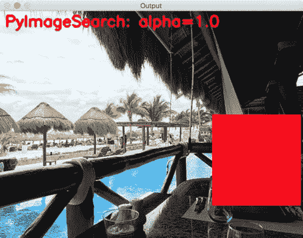
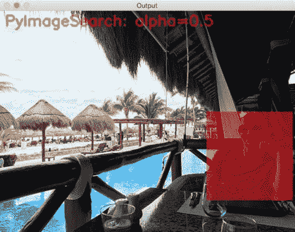
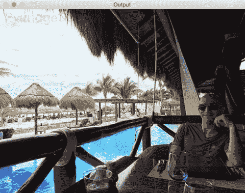
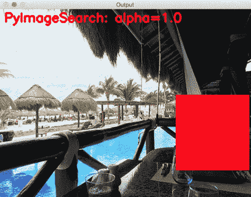

# OpenCV 透明覆盖

> 原文：<https://pyimagesearch.com/2016/03/07/transparent-overlays-with-opencv/>

```py
# import the necessary packages
from __future__ import print_function
import numpy as np
import cv2

# load the image
image = cv2.imread("mexico.jpg")

```

**第 2-4 行**处理导入我们需要的 Python 包。

**第 7 行**使用`cv2.imread`函数从磁盘加载我们的图像。

下一步是在范围*【0，1.0】*之间循环不同的 alpha 透明度值，让我们可以直观地理解`alpha`值如何影响我们的输出图像:

```py
# loop over the alpha transparency values
for alpha in np.arange(0, 1.1, 0.1)[::-1]:
	# create two copies of the original image -- one for
	# the overlay and one for the final output image
	overlay = image.copy()
	output = image.copy()

	# draw a red rectangle surrounding Adrian in the image
	# along with the text "PyImageSearch" at the top-left
	# corner
	cv2.rectangle(overlay, (420, 205), (595, 385),
		(0, 0, 255), -1)
	cv2.putText(overlay, "PyImageSearch: alpha={}".format(alpha),
		(10, 30), cv2.FONT_HERSHEY_SIMPLEX, 1.0, (0, 0, 255), 3)

```

为了应用透明覆盖，我们需要制作输入图像的两个副本:

1.  一个用于最终的`output`图像。
2.  另一个是我们将要建造的`overlay`。

使用`cv2.rectangle`功能，我们在图像的右下角画一个围绕我的矩形。然后我们应用`cv2.putText`在左上角绘制文本`PyImageSearch`。

我们现在准备使用`cv2.addWeighted`函数应用透明叠加:

```py
	# apply the overlay
	cv2.addWeighted(overlay, alpha, output, 1 - alpha,
		0, output)

```

`cv2.addWeighted`方法需要六个参数。

第一个是我们的`overlay`，我们想要使用提供的 alpha 透明度“覆盖”在原始图像上的图像。

第二个参数是叠加层的实际 *alpha 透明度*。`alpha`越接近 *1.0* ，叠加的**越不透明**。同样的，`alpha`越接近 *0.0* ，叠加的**越透明**就会出现。

`cv2.addWeighted`的第三个参数是源映像——在本例中，是从磁盘加载的原始映像。

我们提供 *beta* 值作为第四个参数。β定义为`1 - alpha`。我们需要定义α和β，这样`alpha + beta = 1.0`。

第五个参数是 *gamma* 值——一个加到加权和上的标量。您可以将 gamma 视为应用加权加法后添加到输出图像的常数。在这种情况下，我们将其设置为零，因为我们不需要应用常数值的加法。

最后，我们有最后一个参数，`output`，它是应用加权求和运算后的输出目的地——***这个值是我们最终的输出图像**。*

我们的最后一个代码块处理向屏幕显示最终输出图像，以及显示相关的 *alpha* 和 *beta* 值:

```py
	# show the output image
	print("alpha={}, beta={}".format(alpha, 1 - alpha))
	cv2.imshow("Output", output)
	cv2.waitKey(0)

```

要执行我们的 Python 脚本，将源代码+示例图像下载到本文(使用本课底部的 ***“下载”*** 表单)并执行以下命令:

```py
$ python overlay.py

```

您应该会在屏幕上看到以下图像:

[](https://pyimagesearch.com/wp-content/uploads/2016/02/transparent_overlay_10.jpg)

**Figure 3:** Notice how for *alpha=1.0*, the text and rectangle are entirely opaque (i.e., not transparent).

然而，一旦我们到达`alpha=0.5`,“PyImageSearch”文本和矩形都变得更加透明:

[](https://pyimagesearch.com/wp-content/uploads/2016/02/transparent_overlay_05.jpg)

**Figure 4:** Constructing transparent overlays with Python and OpenCV.

在`alpha=0.1`处，文本和矩形几乎不可见:

[](https://pyimagesearch.com/wp-content/uploads/2016/02/transparent_overlay_01.jpg)

**Figure 5:** The smaller *alpha* gets, the more transparent the overlay will be.

下面您可以看到一个 GIF 动画，它将每个透明度级别可视化:

[](https://pyimagesearch.com/wp-content/uploads/2016/02/transparent_overlay_animation.gif)

## 摘要

在这篇博文中，我们学习了如何使用 Python、OpenCV 和`cv2.addWeighted`函数构建透明的覆盖图。

未来的博客文章将使用这种透明叠加功能在输出图像上绘制平视显示器(hud ),并使输出更加美观。