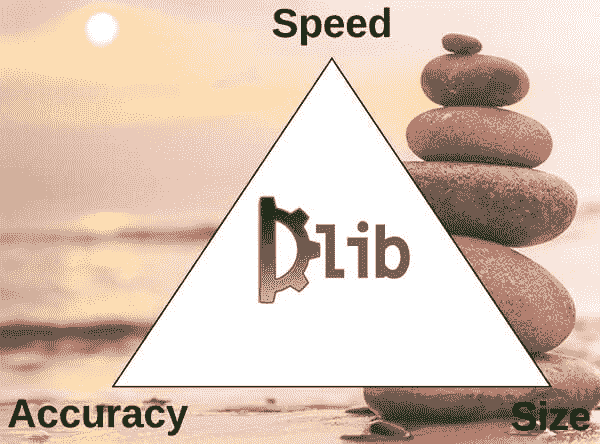
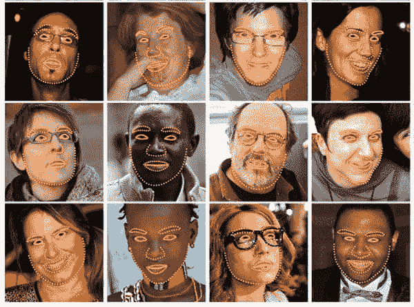
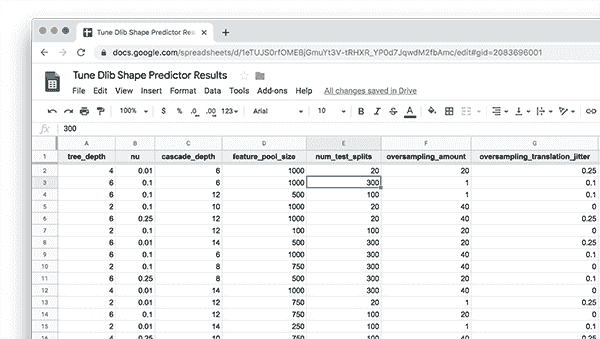
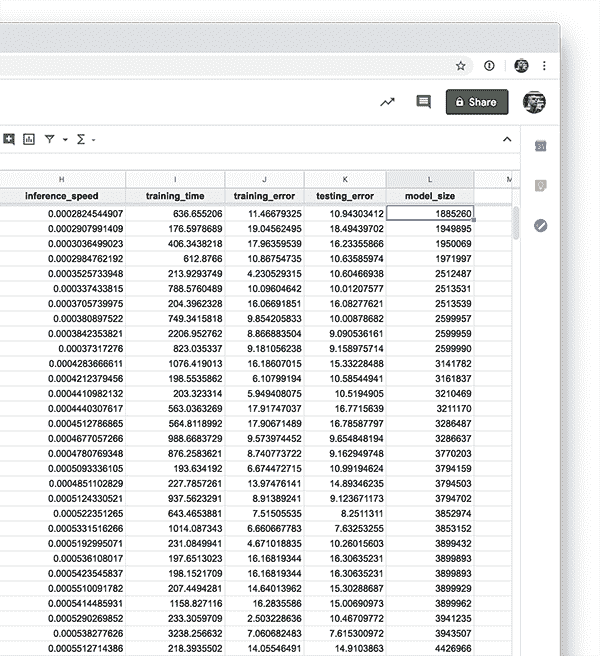
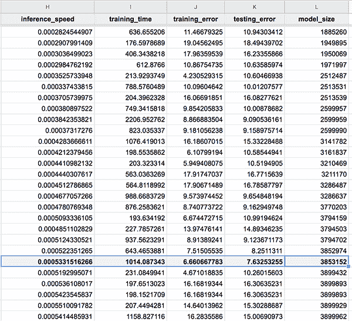

# 调整 dlib 形状预测超参数以平衡速度、精度和模型尺寸

> 原文：<https://pyimagesearch.com/2019/12/23/tuning-dlib-shape-predictor-hyperparameters-to-balance-speed-accuracy-and-model-size/>

[](https://pyimagesearch.com/wp-content/uploads/2019/12/tune_dlib_shape_pred_header.jpg)

在本教程中，您将学习如何优化 dlib 的形状预测器超参数和选项，以获得平衡速度、精度和模型大小的形状预测器。

今天是我们关于用 dlib 训练自定义形状预测器的两部分系列的第二部分:

1.  **Part #1:** *[训练自定义 dlib 形状预测器](https://pyimagesearch.com/2019/12/16/training-a-custom-dlib-shape-predictor/)* (上周教程)
2.  **第 2 部分:** *调整 dlib 形状预测超参数以平衡速度、精度和模型大小*(今天的教程)

许多软件开发人员和项目经理都熟悉“铁三角”的概念。构建软件时，我们需要平衡:

1.  **好，**优质软件
2.  可以快速交付给客户的软件
***   软件有多贵(即，它是否**便宜****

 **需要注意的是，我们只能从上面选择两个。

快速交付给客户的好的、高质量的软件肯定不便宜。类似地，开发成本低、交付速度快的软件也不一定好。

当训练我们自己的定制 dlib 形状预测器时，我们有一个类似的问题——我们需要平衡:

*   **速度:**模型能做出预测的速度(即推理速度)。
*   **准确性:**我们的模型在预测中的精确程度。
*   **模型大小:**模型越大，占用的空间越多，需要的计算资源也越多。因此，更小的型号是首选。

但是不像软件开发的铁三角只有*三个顶点，* dlib 的形状预测器包括 **7-10 个选项**，你通常会想要调整。

那么，我们如何去调整这些形状预测选项和超参数呢？

我将在这篇文章的剩余部分讨论这个话题。

***注意:**如果你还没有读过 [**上周关于训练 dlib 形状预测器**](https://pyimagesearch.com/2019/12/16/training-a-custom-dlib-shape-predictor/) 的帖子，确保你现在就去读，因为本教程的其余部分都是以它为基础的。*

**要了解如何调整 dlib 的形状预测器选项，以最佳地平衡速度、精度和模型大小，*请继续阅读！***

## 调整 dlib 形状预测超参数以平衡速度、精度和模型尺寸

在本教程的第一部分，我们将讨论为什么我们需要调整 dlib 的形状预测选项，以获得一个适合我们特定项目要求和应用的最佳模型。

接下来，我们将回顾和讨论今天用来训练 dlib 形状预测器的数据集。

**然后我将向你展示如何实现一个 Python 脚本来自动*探索 dlib 的形状预测器选项。***

 *我们将讨论如何使用这个脚本的结果来设置 dlib 的形状预测器的选项，训练它，并获得一个最佳模型，从而结束本教程。

我们开始吧！

### 为什么我们需要调整我们的形状预测超参数？

[](https://pyimagesearch.com/wp-content/uploads/2019/12/tune_dlib_shape_pred_tuning.jpg)

**Figure 1:** In this tutorial, we will learn how to tune custom dlib shape predictor hyperparameters to balance speed, accuracy, and model size.

当训练我们自己的自定义 dlib 形状预测器时，我们需要平衡:

*   模型速率
*   模型精度
*   模型尺寸

通常我们只能有 1-2 个选择。

在你打开你的代码编辑器或命令行之前，**首先考虑项目的目标和你的 shape predictor 将被部署在哪里:**

*   形状预测器会在嵌入式设备上使用吗？如果是，就在精度上稍微妥协一下，寻求一个又快又小的模型。
*   **您是否将该模型部署到现代笔记本电脑/台式机上？**您可能能够获得计算成本更高的大型模型，因此不要太担心模型的大小，而是专注于最大限度地提高准确性。
*   **模型的输出大小是一个问题吗？**如果您的模型需要通过网络连接进行部署/更新，那么您应该寻求尽可能小但仍能达到合理精度的模型。
*   训练模型所需的时间是一个问题吗？如果是，请注意在训练过程中应用的任何抖动/数据增强。

提前考虑这些选项*将使*更容易*为 dlib 的形状预测器调整选项——我还将向您展示我自己的调整脚本，我用它来帮助缩小形状预测器选项的范围，这些选项将很好地适用于我各自的用例。*

 *### iBUG-300W 数据集

[](https://pyimagesearch.com/wp-content/uploads/2019/12/dlib_shape_pred_example_pred.jpg)

**Figure 2:** The [iBug 300-W face landmark dataset](https://ibug.doc.ic.ac.uk/resources/300-W/) is used to train a custom dlib shape predictor. We will tune custom dlib shape predictor hyperparameters in an effort to balance speed, accuracy, and model size.

为了训练和调整我们自己的自定义 dlib 形状预测器，我们将使用 [iBUG 300-W 数据集](https://ibug.doc.ic.ac.uk/resources/300-W/)，与我们在上周的教程中使用的数据集相同。

iBUG 300-W 数据集用于[训练面部标志预测器](https://pyimagesearch.com/2019/12/16/training-a-custom-dlib-shape-predictor/)并定位面部的各个结构，包括:

*   眉毛
*   眼睛
*   鼻子
*   口
*   下颌的轮廓

**然而，我们将训练我们的形状预测器来定位*只有眼睛*——**我们的模型将*而不是*在其他面部结构上进行训练。

有关 iBUG 300-W 数据集的更多细节，请参考上周的博文。

### 配置您的 dlib 开发环境

为了完成今天的教程，您需要一个安装了以下软件包的虚拟环境:

*   dlib
*   OpenCV
*   imutils
*   scikit-learn

幸运的是，这些包都是 pip 可安装的，但是有一些先决条件(包括 Python 虚拟环境)。有关配置开发环境的更多信息，请务必遵循以下两个指南:

*   **[*【安装 dlib(简易、完整指南)*](https://pyimagesearch.com/2018/01/22/install-dlib-easy-complete-guide/)**
*   **[*pip 安装 opencv*](https://pyimagesearch.com/2018/09/19/pip-install-opencv/)**

pip 安装命令包括:

```py
$ workon <env-name>
$ pip install dlib
$ pip install opencv-contrib-python
$ pip install imutils
$ pip install scikit-learn

```

一旦你按照我的 [dlib](https://pyimagesearch.com/2018/01/22/install-dlib-easy-complete-guide/) 或 [OpenCV](https://pyimagesearch.com/2018/09/19/pip-install-opencv/) 安装指南安装了`virtualenv`和`virtualenvwrapper`，那么`workon`命令就变得可用。

### 下载 iBUG 300-W 数据集

在我们深入本教程之前，**现在花点时间下载 iBUG 300-W 数据集(~1.7GB):**

[http://dlib . net/files/data/ibug _ 300 w _ large _ face _ landmark _ dataset . tar . gz](http://dlib.net/files/data/ibug_300W_large_face_landmark_dataset.tar.gz)

你可能还想使用这篇博文的 ***【下载】*** 部分下载源代码。

我建议将 iBug 300-W 数据集放入与本教程下载相关的 zip 文件中，如下所示:

```py
$ unzip tune-dlib-shape-predictor.zip
...
$ cd tune-dlib-shape-predictor
$ mv ~/Downloads/ibug_300W_large_face_landmark_dataset.tar.gz .
$ tar -xvf ibug_300W_large_face_landmark_dataset.tar.gz
...

```

或者(即，不点击上面的超链接)，在您的终端中使用`wget`直接下载数据集:

```py
$ unzip tune-dlib-shape-predictor.zip
...
$ cd tune-dlib-shape-predictor
$ wget http://dlib.net/files/data/ibug_300W_large_face_landmark_dataset.tar.gz
$ tar -xvf ibug_300W_large_face_landmark_dataset.tar.gz
...

```

从这里开始，您可以跟随教程的其余部分。

### 项目结构

假设您已经遵循了上一节中的说明，您的项目目录现在组织如下:

```py
$ tree --dirsfirst --filelimit 15
.
├── ibug_300W_large_face_landmark_dataset
│   ├── afw [1011 entries]
│   ├── helen
│   │   ├── testset [990 entries]
│   │   └── trainset [6000 entries]
│   ├── ibug [405 entries]
│   ├── image_metadata_stylesheet.xsl
│   ├── labels_ibug_300W.xml
│   ├── labels_ibug_300W_test.xml
│   ├── labels_ibug_300W_train.xml
│   └── lfpw
│       ├── testset [672 entries]
│       └── trainset [2433 entries]
├── ibug_300W_large_face_landmark_dataset.tar.gz
├── pyimagesearch
│   ├── __init__.py
│   └── config.py
├── example.jpg
├── ibug_300W_large_face_landmark_dataset.tar.gz
├── optimal_eye_predictor.dat
├── parse_xml.py
├── predict_eyes.py
├── train_shape_predictor.py
├── trials.csv
└── tune_predictor_hyperparams.py

2 directories, 15 files

```

[上周](https://pyimagesearch.com/2019/12/16/training-a-custom-dlib-shape-predictor/)，我们回顾了以下 Python 脚本:

*   `parse_xml.py`:解析训练/测试 XML 数据集文件以获得**只看得见的**地标坐标。
*   `train_shape_predictor.py`:接受解析后的 XML 文件，用 dlib 训练我们的形状预测器。
*   `evaluate_shape_predictor.py`:计算我们定制的形状预测器的平均误差(MAE)。**不包括在今天的下载中** —类似/附加功能在今天的调整脚本中提供。
*   `predict_eyes.py`:使用我们定制的 dlib 形状预测器进行形状预测，该预测器经过训练，仅识别眼睛标志。

今天，我们将回顾以下 Python 文件:

*   我们的配置路径、常量和变量都在一个方便的位置。
*   今天教程的核心就在这里。该脚本确定 dlib 形状预测超参数的所有**6075 个**组合。从那里，我们将随机抽样 100 个组合，并继续训练和评估这 100 个模型。超参数和评估标准输出到 CSV 文件，以便在您选择的电子表格应用程序中进行检查。

### 为培训准备 iBUG-300W 数据集

[](https://pyimagesearch.com/wp-content/uploads/2019/12/dlib_shape_pred_landmark_comparison.jpg)

**Figure 3:** Our custom dlib shape/landmark predictor recognizes just eyes.

正如上面的*“iBUG-300 w 数据集”*部分提到的，**我们将在*只在*眼睛**上训练我们的 dlib 形状预测器(即*而不是*眉毛、鼻子、嘴或下颌)。

为了完成这项任务，我们首先需要从 iBUG 300-W 训练/测试 XML 文件中解析出我们不感兴趣的任何面部结构。

要开始，请确保您已经:

1.  使用本教程的 ***【下载】*** 部分下载源代码。
2.  已使用上面的*“下载 iBUG-300W 数据集”*部分下载 iBUG-300W 数据集。
3.  查看了*“项目结构”*部分。

您会注意到在项目的目录结构中有一个名为`parse_xml.py`的脚本——这个脚本用于从 XML 文件中解析出*也就是*眼睛的位置。

我们在上周的教程中详细回顾了这个文件，所以我们今天不打算在这里再次回顾(参考上周的帖子以了解它是如何工作的)。

在继续本教程的其余部分之前，您需要执行以下命令来准备我们的“仅供参考”的培训和测试 XML 文件:

```py
$ python parse_xml.py \
	--input ibug_300W_large_face_landmark_dataset/labels_ibug_300W_train.xml \
	--output ibug_300W_large_face_landmark_dataset/labels_ibug_300W_train_eyes.xml
[INFO] parsing data split XML file...
$ python parse_xml.py \
	--input ibug_300W_large_face_landmark_dataset/labels_ibug_300W_test.xml \
	--output ibug_300W_large_face_landmark_dataset/labels_ibug_300W_test_eyes.xml
[INFO] parsing data split XML file...

```

要验证我们的新培训/测试文件是否已创建，请检查 iBUG-300W 根数据集目录中的`labels_ibug_300W_train_eyes.xml`和`labels_ibug_300W_test_eyes.xml`文件:

```py
$ cd ibug_300W_large_face_landmark_dataset
$ ls -lh *.xml    
-rw-r--r--@ 1 adrian  staff    21M Aug 16  2014 labels_ibug_300W.xml
-rw-r--r--@ 1 adrian  staff   2.8M Aug 16  2014 labels_ibug_300W_test.xml
-rw-r--r--  1 adrian  staff   602K Dec 12 12:54 labels_ibug_300W_test_eyes.xml
-rw-r--r--@ 1 adrian  staff    18M Aug 16  2014 labels_ibug_300W_train.xml
-rw-r--r--  1 adrian  staff   3.9M Dec 12 12:54 labels_ibug_300W_train_eyes.xml
$ cd ..

```

请注意，我们的`*_eyes.xml`文件被高亮显示。这两个文件的文件大小*都比它们原始的、未解析的副本*小得多。

一旦完成了这些步骤，您就可以继续本教程的其余部分。

### 查看我们的配置文件

在我们深入了解这个项目之前，让我们先回顾一下我们的配置文件。

打开`config.py`文件并插入以下代码:

```py
# import the necessary packages
import os

# define the path to the training and testing XML files
TRAIN_PATH = os.path.join("ibug_300W_large_face_landmark_dataset",
	"labels_ibug_300W_train_eyes.xml")
TEST_PATH = os.path.join("ibug_300W_large_face_landmark_dataset",
	"labels_ibug_300W_test_eyes.xml")

```

这里我们有训练和测试 XML 文件的路径(即在我们已经解析出眼睛区域的之后生成的*)。*

接下来，我们将定义一些用于调整 dlib 形状预测超参数的常数:

```py
# define the path to the temporary model file
TEMP_MODEL_PATH = "temp.dat"

# define the path to the output CSV file containing the results of
# our experiments
CSV_PATH = "trials.csv"

# define the path to the example image we'll be using to evaluate
# inference speed using the shape predictor
IMAGE_PATH = "example.jpg"

# define the number of threads/cores we'll be using when trianing our
# shape predictor models
PROCS = -1

# define the maximum number of trials we'll be performing when tuning
# our shape predictor hyperparameters
MAX_TRIALS = 100

```

我们的 dlib 调谐**路径**包括:

*   选项/超参数调整期间使用的临时形状预测文件(**第 11 行**)。
*   用于存储我们个人试验结果的 CSV 文件(**第 15 行**)。
*   我们将使用一个示例图像来评估给定模型的推理速度(**第 19 行**)。

接下来，我们将定义一个**多处理**变量——训练我们的形状预测器时将使用的并行线程/内核的数量(**第 23 行**)。值`-1`表示*所有的*处理器内核都将用于训练。

我们将通过超参数的**组合来寻找性能最佳的模型。**第 27 行**定义了在探索形状预测器超参数空间时我们将执行的**最大试验次数**:**

*   较小的值会导致`tune_predictor_hyperparams.py`脚本完成得更快，但也会探索*更少的选项。*
*   更大的值将*需要更多的时间*来完成`tune_predictor_hyperparams.py`脚本，并将探索*更多的选项*，为您提供更多的结果，然后您可以使用这些结果来做出更好、更明智的决定，以选择您的最终形状预测器超参数。

如果我们要从**6000+**中找出最好的模型，即使在强大的计算机上，也需要**多周/数月的时间**来训练和评估形状预测模型；所以你要用`MAX_TRIALS`参数寻求平衡。

### 实现我们的 dlib 形状预测器调整脚本

如果你关注了[上周关于训练自定义 dlib 形状预测器](https://pyimagesearch.com/2019/12/16/training-a-custom-dlib-shape-predictor/)的帖子，你会注意到我们*将所有选项硬编码到了我们的形状预测器*中。

硬编码我们的超参数值有点问题，因为它要求我们手动:

1.  **步骤#1:** 更新任何培训选项。
2.  **步骤#2:** 执行用于训练形状预测器的脚本。
3.  **步骤#3:** 在我们的形状模型上评估新训练的形状预测器。
4.  **步骤#4:** 返回步骤#1，必要时重复。

**这里的问题是这些步骤是一个*手动过程*，要求我们在每一步都进行干预。**

相反，如果我们可以创建一个 Python 脚本，让 ***自动*** 为我们处理调优过程，那就更好了。

我们可以定义我们想要探索的选项和相应的值。我们的脚本将确定这些参数的所有可能组合。然后，它会在这些选项上训练一个形状预测器，对其进行评估，然后继续下一组选项。一旦脚本完成运行，我们就可以检查结果，选择最佳参数来实现模型速度、大小和准确性的平衡，然后训练最终的模型。

要了解如何创建这样的脚本，打开`tune_predictor_hyperparams.py`文件并插入以下代码:

```py
# import the necessary packages
from pyimagesearch import config
from sklearn.model_selection import ParameterGrid
import multiprocessing
import numpy as np
import random
import time
import dlib
import cv2
import os

```

**第 2-10 行**导入我们的包装，包括:

*   `config`:我们的配置。
*   `ParameterGrid`:生成一个可迭代的参数组合列表。参考 scikit-learn 的[参数表格文件](https://scikit-learn.org/stable/modules/generated/sklearn.model_selection.ParameterGrid.html)。
*   `multiprocessing` : Python 内置的多处理模块。
*   `dlib` : [戴维斯·金的图像处理工具包](https://pyimagesearch.com/2017/03/13/an-interview-with-davis-king-creator-of-the-dlib-toolkit/)，其中包括一个形状预测器的实现。
*   OpenCV 现在被用于图像输入输出和预处理。

现在让我们定义我们的函数来评估我们的**模型精度:**

```py
def evaluate_model_acc(xmlPath, predPath):
	# compute and return the error (lower is better) of the shape
	# predictor over our testing path
	return dlib.test_shape_predictor(xmlPath, predPath)

```

**第 12-15 行**定义了一个辅助工具来评估我们的平均误差(MAE)，或者更简单地说，模型的准确性。

就像我们有一个评估模型精度的函数，我们也需要一个评估**模型推理速度的方法:**

```py
def evaluate_model_speed(predictor, imagePath, tests=10):
	# initialize the list of timings
	timings = []

	# loop over the number of speed tests to perform
	for i in range(0, tests):
		# load the input image and convert it to grayscale
		image = cv2.imread(config.IMAGE_PATH)
		gray = cv2.cvtColor(image, cv2.COLOR_BGR2GRAY)

		# detect faces in the grayscale frame
		detector = dlib.get_frontal_face_detector()
		rects = detector(gray, 1)

		# ensure at least one face was detected
		if len(rects) > 0:
			# time how long it takes to perform shape prediction
			# using the current shape prediction model
			start = time.time()
			shape = predictor(gray, rects[0])
			end = time.time()

		# update our timings list
		timings.append(end - start)

	# compute and return the average over the timings
	return np.average(timings)

```

我们从第 17 行**开始的`evaluate_model_speed`函数接受以下参数:**

*   `predictor`:dlib 形状/标志检测器的路径。
*   `imagePath`:输入图像的路径。
*   `tests`:要执行的测试数量和平均值。

**第 19 行**初始化一个`timings`列表。我们将在从第 22 行**开始的循环中填充`timings`。在循环中，我们继续:**

*   加载一个`image`并将其转换为灰度(**第 24 行和第 25 行**)。
*   使用 dlib 的 HOG +线性 SVM 人脸`detector` ( **第 28 行和第 29 行**)进行人脸检测。
*   确保至少检测到一张脸(**第 32 行**)。
*   计算形状/地标预测的推断时间，并将结果添加到`timings` ( **第 35-40 行**)。

最后，我们将我们的`timings`平均值返回给调用者(**行 43)** 。

让我们为超参数 CSV 文件定义一个列列表:

```py
# define the columns of our output CSV file
cols = [
	"tree_depth",
	"nu",
	"cascade_depth",
	"feature_pool_size",
	"num_test_splits",
	"oversampling_amount",
	"oversampling_translation_jitter",
	"inference_speed",
	"training_time",
	"training_error",
	"testing_error",
	"model_size"
]

```

记住，这个 CSV 将保存我们的脚本调整的所有超参数的值。**第 46-59 行**定义了 CSV 文件的列，包括:

*   ******给定试验的超参数值:******
    *   `tree_depth`:控制树的深度。
    *   `nu`:帮助我们模型一般化的正则化参数。
    *   `cascade_depth`:细化和调整初始预测的级联数量。
    *   `feature_pool_size`:控制用于为级联中的随机树生成特征的像素数。
    *   `num_test_splits`:测试分割的数量影响训练时间和模型精度。
    *   `oversampling_amount`:控制训练形状预测器时应用的“抖动”量。
    *   `oversampling_translation_jitter`:控制应用于数据集的平移“抖动”/增强量。
*   **评估标准:**
    *   `inference_speed`:经过训练的形状预测器的推理速度。
    *   `training_time`:训练形状预测器所花费的时间。
    *   `training_error`:训练集错误。
    *   `testing_error`:测试集错误。
    *   `model_size`:模型文件大小。

***注:**请继续阅读，了解超参数值的简要回顾，包括如何初始化它们的指南。*

然后，我们打开输出 CSV 文件并将`cols`写入磁盘:

```py
# open the CSV file for writing and then write the columns as the
# header of the CSV file
csv = open(config.CSV_PATH, "w")
csv.write("{}\n".format(",".join(cols)))

# determine the number of processes/threads to use
procs = multiprocessing.cpu_count()
procs = config.PROCS if config.PROCS > 0 else procs

```

**第 63 行和第 64 行**将`cols`写入 CSV 文件。

**第 67 行和第 68 行**确定训练时使用的进程/线程的数量。这个数字是基于您的计算机拥有的 CPUs 内核的数量。我的 3GHz 英特尔至强 W 有 20 个内核，但大多数笔记本电脑 CPU 将有 2-8 个内核。

下一个代码块初始化集合**超参数/选项**以及我们将探索的**对应值**:

```py
# initialize the list of dlib shape predictor hyperparameters that
# we'll be tuning over
hyperparams = {
	"tree_depth": list(range(2, 8, 2)),
	"nu": [0.01, 0.1, 0.25],
	"cascade_depth": list(range(6, 16, 2)),
	"feature_pool_size": [100, 250, 500, 750, 1000],
	"num_test_splits": [20, 100, 300],
	"oversampling_amount": [1, 20, 40],
	"oversampling_translation_jitter": [0.0, 0.1, 0.25]
}

```

正如在上周的帖子中[所讨论的，有 7 个形状预测器选项可供你探索。](https://pyimagesearch.com/2019/12/16/training-a-custom-dlib-shape-predictor/)

我们上周详细回顾了它们，但您可以在下面找到每一个的简短摘要:

*   `tree_depth`:每棵树都会有`2^tree_depth`片叶子。更小的`tree_depth`值将导致*更浅的树*，更快*，但是潜在地*更不准确。*更大的`tree_depth`值将创建*更深的树*，这些树*更慢*，但潜在地*更准确。**
**   `nu`:用于帮助我们模型一般化的正则化参数。更接近于`1`的值将使我们的模型更接近于训练数据，但是可能会导致过度拟合。更接近 `0`的值将帮助我们的模型一般化；然而，这里有一个警告——**`nu`越接近 `0`*你将需要更多的训练数据*。***   `cascade_depth`:用于改进和调整初始预测的级联数量。该参数将对模型的*精度*和*输出文件大小*产生 ***的显著影响*。**你允许的*级联越多，你的模型就会变得越大(也可能更精确)。您允许的*级联越少，您的模型就越小(但也可能导致精度降低)。***   `feature_pool_size`:控制用于为级联中的每个随机树生成特征的像素数。你包含的*像素*越多，你的模型运行的就越慢(但也能产生更精确的形状预测器)。你考虑的像素越少，你的模型运行越快(但也可能不太准确)。*   `num_test_splits`:影响训练时间和模型精度。你考虑的越多，你就越有可能有一个准确的形状预测器，但是要小心！较大的值将导致训练时间激增，并且需要更长的时间来完成形状预测器训练。*   `oversampling_amount`:控制在训练形状预测器时应用的“抖动”量(即[数据增加](https://pyimagesearch.com/2019/07/08/keras-imagedatagenerator-and-data-augmentation/))。典型值在*【0，50】*范围内。例如，`5`的值会导致您的训练数据增加*5 倍*。这里要小心，因为`oversampling_amount`越大，你的模型训练的时间就越长。*   `oversampling_translation_jitter`:控制应用于数据集的平移抖动/增强量。*

 *现在我们有了将要探索的`hyperparams`集合，我们需要构造这些选项的所有可能组合**——为此，我们将使用 scikit-learn 的`ParameterGrid`类:**

```py
# construct the set of hyperparameter combinations and randomly
# sample them as trying to test *all* of them would be
# computationally prohibitive
combos = list(ParameterGrid(hyperparams))
random.shuffle(combos)
sampledCombos = combos[:config.MAX_TRIALS]
print("[INFO] sampling {} of {} possible combinations".format(
	len(sampledCombos), len(combos)))

```

给定上面第 72-80 行**上的`hyperparams`集合，总共有**6075 种可能的组合**可供我们探索。**

在单台机器上，这将需要花费*周*的时间来探索，因此我们将随机对参数进行采样，以获得可能值的合理范围。

**第 85 行和第 86 行**构建了所有可能的选项/值组合的集合，并对它们进行随机洗牌。然后我们对`MAX_TRIALS`组合进行采样(**第 87 行**)。

现在让我们继续循环我们的`sampledCombos`:

```py
# loop over our hyperparameter combinations
for (i, p) in enumerate(sampledCombos):
	# log experiment number
	print("[INFO] starting trial {}/{}...".format(i + 1,
		len(sampledCombos)))

	# grab the default options for dlib's shape predictor and then
	# set the values based on our current hyperparameter values
	options = dlib.shape_predictor_training_options()
	options.tree_depth = p["tree_depth"]
	options.nu = p["nu"]
	options.cascade_depth = p["cascade_depth"]
	options.feature_pool_size = p["feature_pool_size"]
	options.num_test_splits = p["num_test_splits"]
	options.oversampling_amount = p["oversampling_amount"]
	otj = p["oversampling_translation_jitter"]
	options.oversampling_translation_jitter = otj

	# tell dlib to be verbose when training and utilize our supplied
	# number of threads when training
	options.be_verbose = True
	options.num_threads = procs

```

**第 99 行**抓取 dlib 的形状预测器的默认`options`。我们需要将默认选项属性加载到内存中，然后才能单独更改它们。

**第 100-107 行**根据这组特定的超参数设置每个 dlib 形状预测超参数`options`。

**第 111 行和第 112 行**告诉 dlib 在训练时要详细，并使用配置的线程数(关于线程/进程数请参考**第 67 行和第 68 行**)。

从这里开始，我们将**用 dlib:** 训练和评估我们的形状预测器

```py
	# train the model using the current set of hyperparameters
	start = time.time()
	dlib.train_shape_predictor(config.TRAIN_PATH,
		config.TEMP_MODEL_PATH, options)
	trainingTime = time.time() - start

	# evaluate the model on both the training and testing split
	trainingError = evaluate_model_acc(config.TRAIN_PATH,
		config.TEMP_MODEL_PATH)
	testingError = evaluate_model_acc(config.TEST_PATH,
		config.TEMP_MODEL_PATH)

	# compute an approximate inference speed using the trained shape
	# predictor
	predictor = dlib.shape_predictor(config.TEMP_MODEL_PATH)
	inferenceSpeed = evaluate_model_speed(predictor,
		config.IMAGE_PATH)

	# determine the model size
	modelSize = os.path.getsize(config.TEMP_MODEL_PATH)

```

**第 115-118 行**训练我们定制的 dlib 形状预测器，包括计算经过的训练时间。

然后，我们使用新训练的形状预测器来分别计算我们的训练和测试分割的误差(**行 121-124** )。

为了估计`inferenceSpeed`，我们确定形状预测器执行推断需要多长时间(即，给定检测到的面部示例图像，模型需要多长时间来定位眼睛？)经由**线路 128-130** 。

**第 133 行**获取模型的文件大小。

接下来，我们将**将超参数选项和评估指标输出到 CSV 文件:**

```py
	# build the row of data that will be written to our CSV file
	row = [
		p["tree_depth"],
		p["nu"],
		p["cascade_depth"],
		p["feature_pool_size"],
		p["num_test_splits"],
		p["oversampling_amount"],
		p["oversampling_translation_jitter"],
		inferenceSpeed,
		trainingTime,
		trainingError,
		testingError,
		modelSize,
	]
	row = [str(x) for x in row]

	# write the output row to our CSV file
	csv.write("{}\n".format(",".join(row)))
	csv.flush()

	# delete the temporary shape predictor model
	if os.path.exists(config.TEMP_MODEL_PATH):
		os.remove(config.TEMP_MODEL_PATH)

# close the output CSV file
print("[INFO] cleaning up...")
csv.close()

```

**第 136-150 行**生成训练超参数和评估结果的基于字符串的列表。

然后，我们将该行写入磁盘，删除临时模型文件，并进行清理(**第 153-162 行**)。

同样，这个循环将最多运行`100`次迭代，以构建我们的超参数和评估数据的 CSV 行。如果我们评估了所有的**6075 个**组合，我们的计算机将会在*周*内产生大量数据。

### 探索形状预测超参数空间

现在，我们已经实现了 Python 脚本来探索 dlib 的形状预测器超参数空间，让我们将它投入使用。

确保你有:

1.  使用本教程的 ***【下载】*** 部分下载源代码。
2.  使用上面的*“下载 iBUG-300W 数据集”*部分下载 iBUG-300W 数据集。
3.  在*“为培训准备 iBUG-300W 数据集”*一节中，为培训和测试 XML 文件执行了`parse_xml.py`。

假设您已经完成了这些步骤中的每一步，现在您可以执行`tune_predictor_hyperparams.py`脚本:

```py
$ python tune_predictor_hyperparams.py
[INFO] sampling 100 of 6075 possible combinations
[INFO] starting trial 1/100...
...
[INFO] starting trial 100/100...
Training with cascade depth: 12
Training with tree depth: 4
Training with 500 trees per cascade level.
Training with nu: 0.25
Training with random seed:
Training with oversampling amount: 20
Training with oversampling translation jitter: 0.1
Training with landmark_relative_padding_mode: 1
Training with feature pool size: 1000
Training with feature pool region padding: 0
Training with 20 threads.
Training with lambda_param: 0.1
Training with 100 split tests.
Fitting trees...
Training complete
Training complete, saved predictor to file temp.dat
[INFO] cleaning up...

real    3052m50.195s
user    30926m32.819s
sys     338m44.848s

```

在我配有 3GHz 英特尔至强 W 处理器的 iMac Pro 上，整个训练时间花费了 **~3，052 分钟**，相当于 **~2.11 天。**确保运行脚本一整夜，并根据您的计算能力，计划在 2-5 天内检查状态。

脚本完成后，您的工作目录中应该有一个名为`trials.csv`的文件:

```py
$ ls *.csv
trials.csv

```

我们的`trials.csv`文件包含了我们的实验结果。

在下一节中，我们将检查该文件，并使用它来选择最佳形状预测器选项，以平衡速度、准确性和模型大小。

### 确定最佳形状预测参数以平衡速度、精度和模型大小

此时，我们有了输出`trials.csv`文件，它包含(1)输入形状预测器选项/超参数值和(2)相应的输出精度、推理时间、模型大小等的组合。

我们的目标是分析这个 CSV 文件，并为我们的特定任务确定最合适的值。

首先，在您最喜欢的电子表格应用程序(例如、微软 Excel、macOS Numbers、Google Sheets 等。):

[](https://pyimagesearch.com/wp-content/uploads/2019/12/tune_dlib_shape_pred_spreadsheet.png)

**Figure 4:** Hyperparameter tuning a dlib shape predictor produced the following data to analyze in a spreadsheet. We will analyze hyperparameters and evaluation criteria to balance speed, accuracy, and shape predictor model size.

现在假设**我的目标是训练和部署一个形状预测器到*嵌入式设备。***

对于嵌入式设备，我们的模型应该:

*   ***尽可能小***
*   在进行预测时，小模型也将是 ***快速的*，在使用资源受限的设备时，**是必需的
*   有合理的精确度，但是我们需要牺牲一点精确度来得到一个小而快的模型。

为了确定 dlib 的形状预测器的最佳超参数，**我将首先按照*模型大小:*** 对我的电子表格进行排序

[](https://pyimagesearch.com/wp-content/uploads/2019/12/tune_dlib_shape_pred_model_size_sorted.png)

**Figure 5:** Sort your dlib shape predictors by model size when you are analyzing the results of tuning your model to balance speed, accuracy, and model size.

然后我会检查`inference_speed`、`training_error`和`testing_error`列，寻找一个既快速又具有合理准确性的模型。

这样，我找到了下面的模型，**粗体，并在电子表格中选择了**:

[](https://pyimagesearch.com/wp-content/uploads/2019/12/tune_dlib_shape_pred_best_model.png)

**Figure 6:** After sorting your dlib shape predictor turning by `model_size`, examine the `inference_speed`, `training_error`, and `testing_error` columns, looking for a model that is fast but also has reasonable accuracy.

这种模式是:

*   大小只有 **3.85MB**
*   在**测试误差方面前 25 名**
*   **极速**，能够在*单秒*内进行**1875 次预测**

下面我包括了这个模型的形状预测超参数:

*   `tree_depth` : 2
*   `nu` : 0.25
*   `cascade_depth` : 12
*   `feature_pool_size` : 500
*   `num_test_splits` : 100
*   `oversampling_amount` : 20
*   `oversampling_translation_jitter` : 0

### 更新我们的形状预测器训练脚本

我们快完成了！

我们需要做的最后一个更新是对我们的`train_shape_predictor.py`文件的更新。

打开该文件并插入以下代码:

```py
# import the necessary packages
import multiprocessing
import argparse
import dlib

# construct the argument parser and parse the arguments
ap = argparse.ArgumentParser()
ap.add_argument("-t", "--training", required=True,
	help="path to input training XML file")
ap.add_argument("-m", "--model", required=True,
	help="path serialized dlib shape predictor model")
args = vars(ap.parse_args())

# grab the default options for dlib's shape predictor
print("[INFO] setting shape predictor options...")
options = dlib.shape_predictor_training_options()

# update our hyperparameters
options.tree_depth = 2
options.nu = 0.25
options.cascade_depth = 12
options.feature_pool_size = 500
options.num_test_splits = 20
options.oversampling_amount = 20
options.oversampling_translation_jitter = 0

# tell the dlib shape predictor to be verbose and print out status
# messages our model trains
options.be_verbose = True

# number of threads/CPU cores to be used when training -- we default
# this value to the number of available cores on the system, but you
# can supply an integer value here if you would like
options.num_threads = multiprocessing.cpu_count()

# log our training options to the terminal
print("[INFO] shape predictor options:")
print(options)

# train the shape predictor
print("[INFO] training shape predictor...")
dlib.train_shape_predictor(args["training"], args["model"], options)

```

注意在**第 19-25 行**中，我们如何使用在上一节中找到的最佳值来更新我们的形状预测器选项。

我们脚本的其余部分负责使用这些值训练形状预测器。

关于`train_shape_predictor.py`脚本的详细回顾，请务必参考[上周的博客文章](https://pyimagesearch.com/2019/12/16/training-a-custom-dlib-shape-predictor/)。

### 根据我们的最优选项值训练 dlib 形状预测器

既然我们已经确定了最佳形状预测器选项，并且用这些值更新了我们的`train_shape_predictor.py`文件，我们可以继续训练我们的模型。

打开终端并执行以下命令:

```py
$ time python train_shape_predictor.py \
	--training ibug_300W_large_face_landmark_dataset/labels_ibug_300W_train_eyes.xml \
	--model optimal_eye_predictor.dat
[INFO] setting shape predictor options...
[INFO] shape predictor options:
shape_predictor_training_options(be_verbose=1, cascade_depth=12, tree_depth=2, num_trees_per_cascade_level=500, nu=0.25, oversampling_amount=20, oversampling_translation_jitter=0, feature_pool_size=500, lambda_param=0.1, num_test_splits=20, feature_pool_region_padding=0, random_seed=, num_threads=20, landmark_relative_padding_mode=1)
[INFO] training shape predictor...
Training with cascade depth: 12
Training with tree depth: 2
Training with 500 trees per cascade level.
Training with nu: 0.25
Training with random seed: 
Training with oversampling amount: 20
Training with oversampling translation jitter: 0
Training with landmark_relative_padding_mode: 1
Training with feature pool size: 500
Training with feature pool region padding: 0
Training with 20 threads.
Training with lambda_param: 0.1
Training with 20 split tests.
Fitting trees...
Training complete                             
Training complete, saved predictor to file optimal_eye_predictor.dat

real	10m49.273s
user	83m6.673s
sys		0m47.224s

```

一旦经过训练，我们可以使用`predict_eyes.py`文件(在上周的[博客文章](https://pyimagesearch.com/2019/12/16/training-a-custom-dlib-shape-predictor/)中回顾过)来直观地验证我们的模型是否工作正常:

如你所见，我们训练了一个 dlib 形状预测器:

*   **精确地**定位眼睛
*   就推断/预测速度而言,**快吗**
*   就模型尺寸而言,**小吗**

在训练您自己的自定义 dlib 形状预测器时，您也可以执行相同的分析。

### 我们如何加快我们的形状预测器调整脚本？

[](https://pyimagesearch.com/wp-content/uploads/2019/12/tune_dlib_shape_pred_speed.jpg)

**Figure 7:** Tuning dlib shape predictor hyperparameters allows us to balance speed, accuracy, and model size.

这里明显的瓶颈是`tune_predictor_hyperparams.py`脚本— **只探索了 1.65%的可能选项，花了 2 天多才完成。**

因此，探索*所有*可能的超参数将花费 ***个月的时间！***

**记住，我们正在训练一个*只用眼睛的*地标预测器。**如果我们为所有 68 个典型的地标训练模型，训练将花费**更长的时间。**

在大多数情况下，我们根本没有那么多时间(或耐心)。

那么，我们能做些什么呢？

首先，我建议减少你的超参数空间。

例如，让我们假设您正在训练一个 dlib shape predictor 模型，该模型将被*部署*到嵌入式设备，如 Raspberry Pi、Google Coral 或 NVIDIA Jetson Nano。在这种情况下，你会想要一个**快**和**小**的模型——因此*知道*你需要包含一点准确性，以获得一个又快又小的模型。

在这种情况下，您将希望避免探索超参数空间的区域，这将导致模型更大且进行预测更慢。考虑限制你的`tree_depth`、`cascade_depth`和`feature_pool_size`探索，并专注于将导致更小、更快模型的值。

不要混淆部署和培训。你应该*在一台功能强大的全尺寸机器上(即不是嵌入式设备)调整/训练*你的形状预测器。从那里开始，假设你的模型对于一个嵌入式设备来说相当小，那么你应该*部署*这个模型到目标设备。

其次，我建议利用分布式计算。

为模型调整超参数是线性扩展问题的一个很好的例子，可以通过增加硬件来解决。

例如，你可以使用亚马逊、微软、谷歌等。云加速旋转**多台机器**。然后，每台机器可以负责**探索超参数的非重叠子集**。给定 *N* 台机器总数，你可以通过因子 *N* 减少调整你的形状预测器选项所花费的时间。

当然，我们可能没有预算来利用云，在这种情况下，你应该看到我上面的第一个建议。

## 摘要

在本教程中，您学习了如何自动调整 dlib 的形状预测器的选项和超参数，使您能够正确地平衡:

1.  模型推断/预测速度
2.  模型精度
3.  模型尺寸

**调整超参数*在计算上非常*，**因此建议您:

*   **在您的个人笔记本电脑或台式机上安排足够的时间(2-4 天)**来运行 hyperparameter 调整脚本。
*   **利用分布式系统和潜在的云**来加速多个系统，每个系统处理超参数的*非重叠子集*。

运行优化脚本后，您可以打开生成的 CSV/Excel 文件，按照您最感兴趣的列(即速度、准确性、大小)对其进行排序，并确定您的最佳超参数。

给定参数，您从排序中发现您可以更新形状预测器训练脚本，然后训练您的模型。

我希望你喜欢今天的教程！

**要下载这篇文章的源代码(并在未来教程在 PyImageSearch 上发布时得到通知)，*只需在下面的表格中输入您的电子邮件地址！********