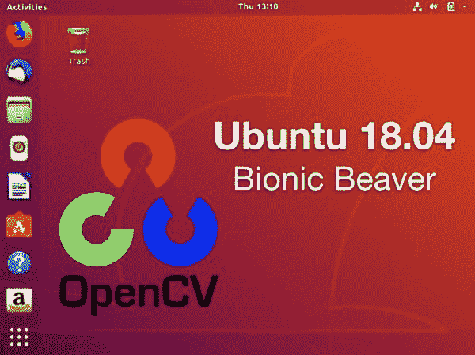
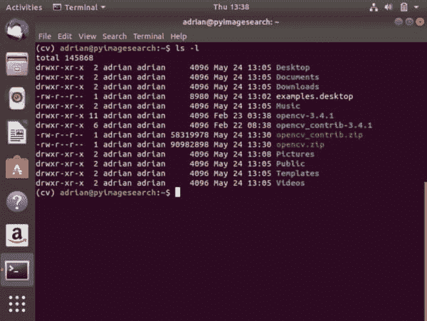
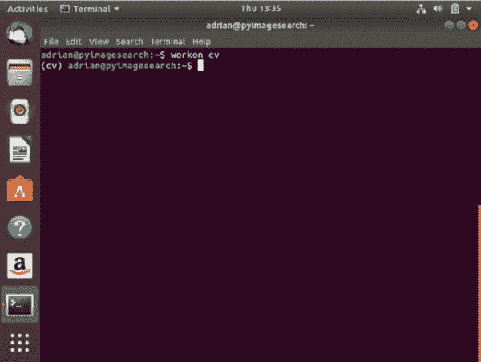
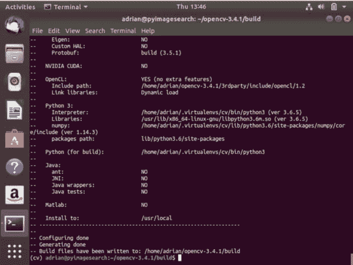
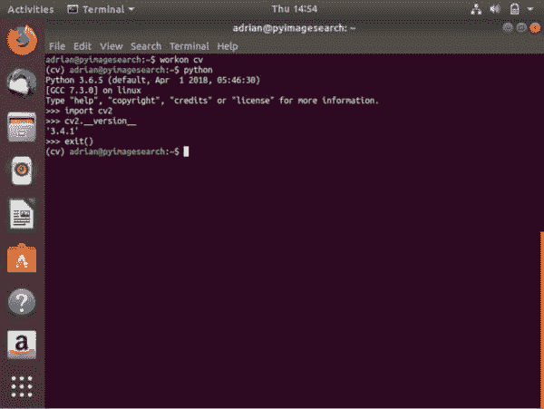

# Ubuntu 18.04:如何安装 OpenCV

> 原文：<https://pyimagesearch.com/2018/05/28/ubuntu-18-04-how-to-install-opencv/>

[](https://pyimagesearch.com/wp-content/uploads/2018/05/install_opencv-1804-header.jpg)

在这篇博文中，你将学习如何在 Ubuntu 18.04 上安装 OpenCV。

过去，我已经为 Ubuntu 编写了一些安装指南:

*   [Ubuntu 16.04:如何用 Python 2.7 和 Python 3.5+安装 OpenCV](https://pyimagesearch.com/2016/10/24/ubuntu-16-04-how-to-install-opencv/)
*   [在 Ubuntu 上安装 OpenCV 3.0 和 Python 2.7+](https://pyimagesearch.com/2015/06/22/install-opencv-3-0-and-python-2-7-on-ubuntu/)
*   [在 Ubuntu 上安装 OpenCV 3.0 和 Python 3.4+](https://pyimagesearch.com/2015/07/20/install-opencv-3-0-and-python-3-4-on-ubuntu/)
*   (…如果你正在寻找 macOS 和 Raspberry Pi 安装指南，请务必查看本页

Canonical 的员工一直在努力工作。

2018 年 4 月 26 日，他们为社区发布了新的长期支持(LTS)版本的 Ubuntu:**Ubuntu 18.04 LTS(仿生海狸)**。

对 Ubuntu 16.04 LTS 的支持将持续到 2021 年 4 月，所以请放心— *您不必升级 16.04 操作系统就可以继续进行您的图像处理项目。*

也就是说，如果你想升级到 Ubuntu 18.04 并使用最新最好的，我想你会对 Ubuntu 18.04 的新变化感到非常满意。

让我们言归正传，用 Python 3 绑定安装 OpenCV。

**要学习如何用 OpenCV 来支撑你的 Ubuntu 18.04 系统，*继续阅读。***

***注意:**虽然你不会在我的博客上看到 Ubuntu 17.10 的具体指南(*非 *-LTS)，但这些说明可能适用于 17.10(你只需自担风险)。*

## Ubuntu 18.04:如何安装 OpenCV

**Ubuntu 18.04 的一个主要变化是他们完全放弃了 Python 2.7。**

如果需要的话，你仍然可以安装 Python 2.7***，但是现在 Python 3 是操作系统的默认版本。***

 *鉴于此，本指南支持 Python 3。如果你需要 Python 2.7 支持，请先阅读整个指南*，然后查看这篇博文底部附近的**安装故障排除(FAQ)** 部分的第一个问题，寻找一些 Python 2.7 的指导。*

 *### 第 0 步:放松——您将使用 Python 3.6

让我们在 Ubuntu 18.04 上熟悉一下 Python 3。

要在 Ubuntu 18.04 上运行 Python 3，必须显式调用`python3`。

让我们看看我们的系统上安装了哪个版本:

```py
$ python3 --version
Python 3.6.5

```

现在，让我们启动一个 Python 3 shell 来测试一下:

```py
$ python3
>> print("OpenCV + Ubuntu 18.04!")
OpenCV + Ubuntu 18.04!
>> quit()

```

这很简单，所以让我们继续在 Ubuntu 18.04 上安装 OpenCV。

### 步骤 1:在 Ubuntu 18.04 上安装 OpenCV 依赖项

今天的所有步骤都将在终端/命令行中完成。在我们开始之前，打开一个终端或通过 SSH 连接。

从那里，我们需要用 [apt-get](https://help.ubuntu.com/community/AptGet/Howto) 包管理器刷新/升级预安装的包/库:

```py
$ sudo apt-get update
$ sudo apt-get upgrade

```

然后安装开发人员工具:

```py
$ sudo apt-get install build-essential cmake unzip pkg-config

```

你很可能已经在 Ubuntu 18.04 上安装了`pkg-config`，但是为了安全起见，一定要把它包含在 install 命令中。

接下来，我们需要安装一些特定于 OpenCV 的先决条件。OpenCV 是一个图像处理/计算机视觉库，因此它需要能够加载 JPEG、PNG、TIFF 等标准图像文件格式。以下图像 I/O 包将允许 OpenCV 处理图像文件:

```py
$ sudo apt-get install libjpeg-dev libpng-dev libtiff-dev

```

现在让我们试着安装`libjasper-dev`:

```py
$ sudo apt-get install libjasper-dev

```

**如果您收到关于`libjasper-dev`丢失的错误，请遵循以下说明:**

```py
sudo add-apt-repository "deb http://security.ubuntu.com/ubuntu xenial-security main"
sudo apt update
sudo apt install libjasper1 libjasper-dev

```

**否则(或者一旦`libjasper-dev`安装完毕)，继续进行。**

接下来，让我们包括视频 I/O 包，因为我们经常在 PyImageSearch 博客上处理视频。您将需要以下软件包，以便使用您的相机流和处理视频文件:

```py
$ sudo apt-get install libavcodec-dev libavformat-dev libswscale-dev libv4l-dev
$ sudo apt-get install libxvidcore-dev libx264-dev

```

OpenCV 的 highgui 模块依赖 GTK 库进行 gui 操作。highgui 模块将允许你创建基本的 gui 来显示图像，处理鼠标点击，创建滑块和跟踪条。高级 GUI 应该用 TK、Wx 或 QT 来构建。参见[这篇博文](https://pyimagesearch.com/2016/05/30/displaying-a-video-feed-with-opencv-and-tkinter/)来学习如何用 TK 制作 OpenCV GUI。

让我们安装 GTK:

```py
$ sudo apt-get install libgtk-3-dev

```

我总是推荐以下两个库，它们将优化各种 OpenCV 函数:

```py
$ sudo apt-get install libatlas-base-dev gfortran

```

最后，我们的最后一个要求是安装 Python 3 头文件和库:

```py
$ sudo apt-get install python3.6-dev

```

### 步骤 2:下载官方 OpenCV 源代码

***更新 2018-12-20:这些指令已经更新，可以与 OpenCV 3.4.4 一起使用。**这些指令应该继续适用于未来的 OpenCV 3.x 版本。*

既然我们继续在终端中工作，让我们使用`wget`下载官方 OpenCV 版本:

```py
$ cd ~
$ wget -O opencv.zip https://github.com/opencv/opencv/archive/3.4.4.zip

```

接着是`opencv_contrib`模块:

```py
$ wget -O opencv_contrib.zip https://github.com/opencv/opencv_contrib/archive/3.4.4.zip

```

***注意:**如果你的浏览器切断了完整的命令，要么使用上面工具栏中的*<>*按钮展开代码块，要么复制并粘贴以下 URL:https://github.com/opencv/opencv_contrib/archive/3.4.4.zip*

那么，什么是贡献回购呢？

contrib 存储库包含 SIFT、SURF 等算法。在过去，这些实现包含在 OpenCV 2.4 的默认安装中；然而，从 OpenCV 3+开始，它们被转移了。

contrib 模块中包括正在积极开发的模块和/或已申请专利的模块(不能免费用于商业/工业用途)。筛选和冲浪属于这一类。你可以在下面的博文中进一步了解这一举动背后的思维过程:*[OpenCV 3 中 SIFT 和 SURF 去哪儿了？](https://pyimagesearch.com/2015/07/16/where-did-sift-and-surf-go-in-opencv-3/)*

***重要:**`opencv`和`opencv_contrib`版本必须相同。请注意，两个 URL 都指向 3.4.4。在使用本指南的同时，您可以随意安装不同的版本——只要确保更新两个网址即可。*

现在，让我们解压缩归档文件:

```py
$ unzip opencv.zip
$ unzip opencv_contrib.zip

```

[](https://pyimagesearch.com/wp-content/uploads/2018/05/install_opencv-1804-ls.jpg)

**Figure 1:** After downloading and unzipping `opencv` and `opencv_contrib`, our home directory listing should look similar to what is displayed in the terminal.

现在，让我们继续重命名目录:

```py
$ mv opencv-3.4.4 opencv
$ mv opencv_contrib-3.4.4 opencv_contrib

```

### 步骤 3:配置您的 Python 3 环境

我们配置 Python 3 开发环境的第一步是安装 pip，这是一个 Python 包管理器。

要安装 pip，只需在终端中输入以下内容:

```py
$ wget https://bootstrap.pypa.io/get-pip.py
$ sudo python3 get-pip.py

```

#### 利用虚拟环境进行 Python 开发

如果你熟悉我的博客并在其中安装了指南，下面的陈述可能会让我听起来像一张破唱片，但我还是会重复一遍:

我每天都使用 [virtualenv](https://virtualenv.pypa.io/en/latest/) 和 [virtualenvwrapper](https://virtualenvwrapper.readthedocs.org/en/latest/) ，你也应该这样做，除非你有非常具体的理由不这样做。这两个 Python 包便于为您的项目创建独立的 Python 环境。

使用虚拟环境是最佳实践。

为什么？

虚拟环境允许您在隔离的情况下处理项目，而不会占用大量资源，如虚拟机和 Docker 映像(我肯定会使用 VirtualBox 和 Docker，它们各有各的用处)。

例如，您可能有一个 Python + OpenCV 项目，它需要一个旧版本的 scikit-learn (v0.14)，但是您希望在所有新项目中继续使用最新版本的 scikit-learn (0.19)。

使用虚拟环境，您可以分别处理这两个软件版本的依赖关系，这是使用 Python 的系统安装*不可能做到的。*

如果你想了解更多关于 Python 虚拟环境的信息，看看这篇关于 RealPython 的[文章，或者阅读这篇关于 PyImageSearch](https://realpython.com/blog/python/python-virtual-environments-a-primer/) 的[博客的前半部分。](https://pyimagesearch.com/2016/05/02/accessing-rpi-gpio-and-gpio-zero-with-opencv-python/)

现在让我们继续安装`virtualenv`和`virtualenvwrapper`:

```py
$ sudo pip install virtualenv virtualenvwrapper
$ sudo rm -rf ~/get-pip.py ~/.cache/pip

```

为了完成安装，我们需要更新我们的`~/.bashrc`文件。

使用终端文本编辑器，如`vi` / `vim`或`nano`，将下列行添加到您的`~/.bashrc`中:

```py
# virtualenv and virtualenvwrapper
export WORKON_HOME=$HOME/.virtualenvs
export VIRTUALENVWRAPPER_PYTHON=/usr/bin/python3
source /usr/local/bin/virtualenvwrapper.sh

```

或者，您可以通过 bash 命令直接附加这些行:

```py
$ echo -e "\n# virtualenv and virtualenvwrapper" >> ~/.bashrc
$ echo "export WORKON_HOME=$HOME/.virtualenvs" >> ~/.bashrc
$ echo "export VIRTUALENVWRAPPER_PYTHON=/usr/bin/python3" >> ~/.bashrc
$ echo "source /usr/local/bin/virtualenvwrapper.sh" >> ~/.bashrc

```

接下来，获取`~/.bashrc`文件:

```py
$ source ~/.bashrc

```

#### 创建一个虚拟环境来存放 OpenCV 和其他包

好了，虽然这看起来似乎需要做很多工作，但我们现在可以为 OpenCV 创建 Python 3 虚拟环境了:

```py
$ mkvirtualenv cv -p python3

```

这一行简单地创建了一个名为`cv`的 Python 3 虚拟环境。你可以给你的环境起任何你喜欢的名字——我喜欢让它们简洁明了，同时提供足够的信息，这样我就能记住它们的用途。您可以在您的系统上拥有任意多的虚拟环境！

让我们使用 workon 命令来验证我们是否在 cv 环境中:

```py
$ workon cv

```

**图 2** 显示了您的终端将会是什么样子(假设您没有更改任何 bash 提示符设置):

[](https://pyimagesearch.com/wp-content/uploads/2018/05/install_opencv-1804-workon.jpg)

**Figure 2:** If you see the `(cv)` at the beginning of the bash prompt, then your virtual environment is active and you’re working “inside” the environment. You can now safely install OpenCV with correct Python bindings.

#### 在您的环境中安装 NumPy

让我们将第一个包安装到环境中:NumPy。NumPy 是使用 Python 和 OpenCV 的必要条件。我们简单地使用 pip(当`cv` Python 虚拟环境处于活动状态时):

```py
$ pip install numpy

```

### 步骤 4:为 Ubuntu 18.04 配置和编译 OpenCV

现在我们要搬家了。我们已经准备好编译和安装 OpenCV。

在我们开始之前，让我们确保我们在 cv 虚拟环境中:

```py
$ workon cv

```

虚拟环境是活跃的(你在虚拟环境中)这是非常重要的，这也是我不断重申它的原因。如果在进入下一步之前，您在`cv` Python 虚拟环境中*不是*，那么您的构建文件将无法正确生成。

#### 用 CMake 配置 OpenCV

让我们使用`cmake`来建立我们的 OpenCV 构建:

```py
$ cd ~/opencv
$ mkdir build
$ cd build
$ cmake -D CMAKE_BUILD_TYPE=RELEASE \
    -D CMAKE_INSTALL_PREFIX=/usr/local \
    -D WITH_CUDA=OFF \
    -D INSTALL_PYTHON_EXAMPLES=ON \
    -D OPENCV_EXTRA_MODULES_PATH=~/opencv_contrib/modules \
    -D OPENCV_ENABLE_NONFREE=ON \
    -D BUILD_EXAMPLES=ON ..

```

***更新 2018-12-20:*** *一定要设置`OPENCV_ENABLE_NONFREE=ON`标志，这样你就可以访问我们有时在这个博客上回顾的专利算法(并在 [PyImageSearch Gurus](https://pyimagesearch.com/pyimagesearch-gurus/) 中深入讨论)。同样，一定要更新虚拟环境的路径，以便使用正确的`PYTHON_EXECUTABLE`(注意路径中的`cv`，因为我们的虚拟环境名称是`cv`)。*

我总是建议您滚动 CMake 输出，查看是否有任何异常。你不会看到每个设置旁边都标有“是”，这是正常的。确保您没有看到任何错误，否则您的编译可能会失败(警告是可以的)。

[](https://pyimagesearch.com/wp-content/uploads/2018/05/install_opencv-1804-cmake-output-zoomout.jpg)

**Figure 3:** To compile OpenCV for Ubuntu 18.04, we make use of CMake. The CMake tool will configure settings prior to compilation.

花点时间注意一下**图 3** 中 Ubuntu 18.04 上的 CMake 输出中只显示了*“Python 3”*部分。这是故意的，因为我们只编译支持 Python 3 的 OpenCV。

***更新 2018-12-20:** 另外，向上滚动大约 20 行，确保**“非自由算法”**设置为**“是”**。*

***注意:**如果您在本教程的`cmake`或`make`阶段遇到与`stdlib.h: No such file or directory`相关的问题，您还需要在 CMake 中包含以下选项:`-D ENABLE_PRECOMPILED_HEADERS=OFF`。在这种情况下，我建议删除您的构建目录，重新创建它，然后重新运行包含上述选项的`cmake`。这将解决`stdlib.h`错误。*

#### 在 Ubuntu 18.04 上编译 OpenCV

让我们用`make`来编译 OpenCV。

根据处理器/内核的数量，您可以通过改变命令中的标志来减少编译时间。我的计算机有 4 个内核，所以我使用的是`-j4`标志。您可以更新数字或完全关闭标志:

```py
$ make -j4

```

[](https://pyimagesearch.com/wp-content/uploads/2018/05/install_opencv-1804-compile-finished.jpg)

**Figure 4:** To compile OpenCV with Python 3 on Ubuntu 18.04, we use `make`. Using make compiles OpenCV from source and is preferred over using package managers for installing OpenCV.

这个过程可能需要 30 分钟或更长时间，所以如果可以的话，去散散步吧。

如果您的编译受阻并挂起，这可能是由于线程竞争情况。如果您遇到这个问题，只需删除您的`build`目录，重新创建它，并重新运行`cmake`和`make`。这次不包括`make`旁边的旗帜。

#### 安装和验证 OpenCV

成功完成 100%的编译后，您现在可以安装 OpenCV:

```py
$ sudo make install
$ sudo ldconfig

```

为了验证安装，有时我喜欢在终端中输入以下命令:

```py
$ pkg-config --modversion opencv
3.4.4

```

### 步骤 5:完成 Python+ OpenCV + Ubuntu 18.04 的安装

我们已经到达比赛的最后一圈，所以坚持下去。

***更新 2018-12-20:** 以下路径已更新。以前版本的 OpenCV 在不同的位置(`/usr/local/lib/python3.6/site-packages`)安装了绑定，所以一定要仔细看看下面的路径。*

此时，OpenCV 的 Python 3 绑定应该位于以下文件夹中:

```py
$ ls /usr/local/python/cv2/python-3.6
cv2.cpython-36m-x86_64-linux-gnu.so

```

让我们简单地将它们重命名为`cv2.so`:

```py
$ cd /usr/local/python/cv2/python-3.6
$ sudo mv cv2.cpython-36m-x86_64-linux-gnu.so cv2.so

```

***专业提示:*** *如果您同时安装 OpenCV 3 和 [OpenCV 4](https://pyimagesearch.com/2018/08/15/how-to-install-opencv-4-on-ubuntu/) ，而不是将文件重命名为 cv2，那么您可以考虑将其命名为`cv2.opencv3.4.4.so`，然后在下一个子步骤中适当地将该文件 sym-link 到`cv2.so`。*

我们的最后一个子步骤是将 OpenCV `cv2.so`绑定符号链接到我们的`cv`虚拟环境中:

```py
$ cd ~/.virtualenvs/cv/lib/python3.6/site-packages/
$ ln -s /usr/local/python/cv2/python-3.6/cv2.so cv2.so

```

### 步骤 6:在 Ubuntu 18.04 上测试 OpenCV 3 的安装

比赛结束了，但是让我们来验证一下我们是否已经开足马力了。

为了验证我们的 OpenCV + Ubuntu 安装是否完成，我喜欢启动 Python，导入 OpenCV，并查询版本(如果您也安装了多个版本的 OpenCV，这对于保持理智很有用):

```py
$ cd ~
$ workon cv
$ python
Python 3.6.5 (default, Apr 1 2018, 05:46:30)
[GCC 7.3.0] on linux
Type "help", "copyright", "credits" or "license" for more information.
>>> import cv2
>>> cv2.__version__
'3.4.4'
>>> quit()

```

下面是它在我的系统上的样子:

[](https://pyimagesearch.com/wp-content/uploads/2018/05/install_opencv-1804-verify.jpg)

**Figure 5:** To verify that OpenCV is correctly installed and configured in our Python 3 virtual environment, I like to run the Python interpreter in the terminal. From there you can import OpenCV (`cv2`) and verify the version number matches what you intended to install.

***更新 2018-12-20:*** *我今天更新期间没有更新截图。版本应该反映您安装的 OpenCV 版本。*

或者，此时，您可以安全地删除您的个人文件夹中的 zip 和目录:

```py
$ cd ~
$ rm opencv.zip opencv_contrib.zip
$ rm -rf opencv opencv_contrib

```

## 安装疑难解答(常见问题)

在这一节中，我将解决在 Ubuntu 18.04 LTS 上安装 OpenCV 3 和 Python 3 时出现的一些常见问题。

***q .***Ubuntu 18.04 上 Python 2.7 在哪？

***A.*** Python 3 是默认，Ubuntu 18.04 自带。Python 2.7 用户可以在**步骤#1:** 结束时手动安装 Python 2.7

```py
$ sudo apt-get install python2.7 python2.7-dev

```

从那里，当您在**步骤#3** 中创建您的虚拟环境时，首先安装 Python 2.7 的 pip:

```py
$ sudo python2.7 get-pip.py

```

然后(也是在**步骤#3** 中)当您创建虚拟环境时，只需使用相关的 Python 版本标志:

```py
$ mkvirtualenv cv -p python2.7

```

从那以后，一切都应该是一样的。

***Q.*** 为什么我不能直接 pip 安装 OpenCV？

***A.*** 根据您的操作系统和架构，OpenCV 有许多可安装 pip 的版本。您可能遇到的问题是，它们可能在没有各种优化、图像 I/O 支持、视频 I/O 支持和`opencv_contrib`支持的情况下编译。使用它们——但是使用它们要自担风险。本教程旨在让你在 Ubuntu 18.04 上完全安装 OpenCV，同时让你完全控制编译。

***Q.*** 执行`mkvirtualenv`或`workon`时，遇到“命令未找到错误”。

***A.*** 你会看到这个错误消息的原因有很多，都来自于**步骤#3:**

1.  首先，确保你已经使用`pip`软件包管理器正确安装了`virtualenv`和`virtualenvwrapper`。通过运行`pip freeze`进行验证，确保在已安装包列表中看到`virtualenv`和`virtualenvwrapper`。
2.  您的`~/.bashrc`文件可能有错误。查看您的`~/.bashrc`文件的内容，查看正确的`export`和`source`命令是否存在(检查**步骤#3** 中应该附加到`~/.bashrc`的命令)。
3.  你可能忘记了你的`~/.bashrc`。确保编辑完`source ~/.bashrc`后运行它，以确保你可以访问`mkvirtualenv`和`workon`命令。

***问*** 当我打开一个新的终端，注销或者重启我的 Ubuntu 系统时，我无法执行`mkvirtualenv`或者`workon`命令。

***A.*** 见上一题的 **#2** 。

***Q.*** 当我尝试导入 OpenCV 时，遇到了这个消息:`Import Error: No module named cv2`。

**发生这种情况有多种*原因，不幸的是，很难诊断。我推荐以下建议来帮助诊断和解决错误:***

 ***1.  使用`workon cv`命令确保您的`cv`虚拟环境处于活动状态。如果这个命令给你一个错误，那么请看这个 FAQ 中的第一个问题。
2.  尝试在您的`cv`虚拟环境中研究`site-packages`目录的内容。根据您的 Python 版本，您可以在`~/.virtualenvs/cv/lib/python3.6/site-packages/`中找到`site-packages`目录。确保(1)在`site-packages`目录中有一个`cv2.so`文件，并且(2)它被正确地符号链接到一个有效的文件。
3.  一定要检查位于`/usr/local/lib/python3.6/site-packages/`的 Python 的系统安装的`site-packages`(甚至`dist-packages`)目录。此外，请检查`/usr/local/python/cv2`。理想情况下，您应该在其中一个位置有一个`cv2.so`文件。
4.  作为最后一招，检查 OpenCV 构建的`build/lib`目录。那里的*应该是*那里的`cv2.so`文件(如果`cmake`和`make`都执行无误)。如果`cv2.so`文件存在，*手动将其*复制到系统`site-packages`目录以及`cv`虚拟环境的`site-packages`目录中。

## 摘要

今天我们在 Ubuntu 18.04 LTS 上安装了 OpenCV 3 和 Python 3 绑定。

我希望这些说明对你用 OpenCV 3 配置你自己的 Ubuntu 18.04 机器有帮助。

如果您有兴趣了解关于 OpenCV、计算机视觉和图像处理的更多信息，请务必在下面的表格中输入您的电子邮件地址，以便在新的博客帖子和教程发布时收到通知！*****