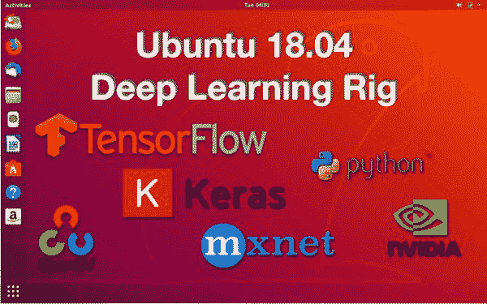
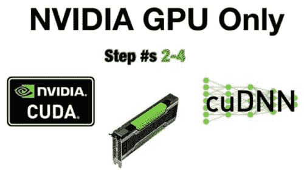
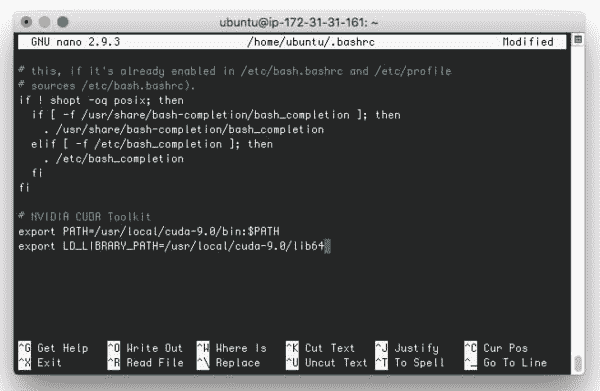
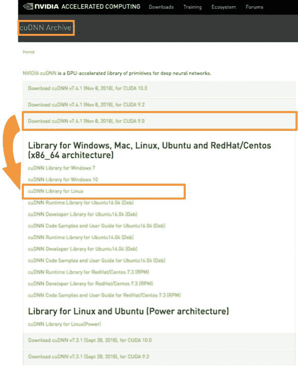
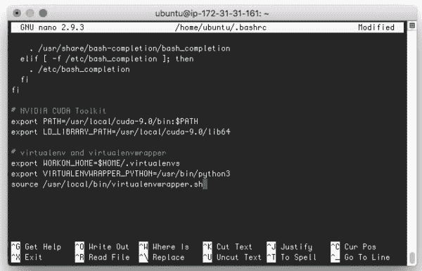
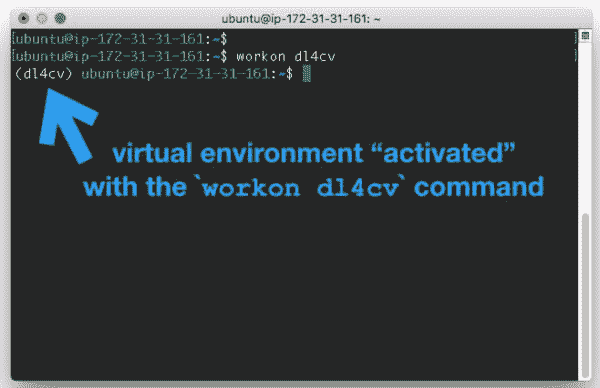
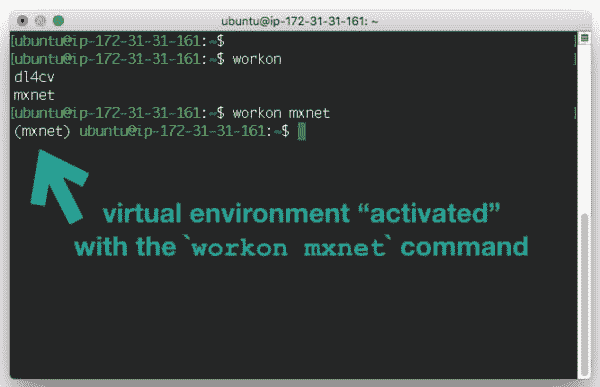
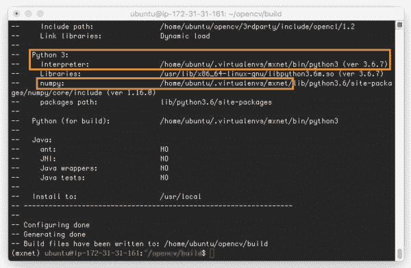

# Ubuntu 18.04:安装深度学习的 TensorFlow 和 Keras

> 原文：<https://pyimagesearch.com/2019/01/30/ubuntu-18-04-install-tensorflow-and-keras-for-deep-learning/>



在本教程中，您将学习如何使用 TensorFlow 和 Keras 配置您的 Ubuntu 18.04 机器进行深度学习。

在开始使用计算机视觉和深度学习时，配置深度学习装备是成功的一半。我以提供高质量的教程为荣，这些教程可以帮助您让您的环境为有趣的东西做好准备。

本指南将帮助你用必要的深度学习工具设置你的 Ubuntu 系统，用于(1)你自己的项目和(2)我的书， [*用 Python 进行计算机视觉的深度学习*](https://pyimagesearch.com/deep-learning-computer-vision-python-book/) 。

所需要的只是 Ubuntu 18.04，一些时间/耐心，以及*可选的*一个 NVIDIA GPU。

如果你是**苹果用户，**你可以按照我的 **[macOS Mojave 深度学习安装说明](https://pyimagesearch.com/2019/01/30/macos-mojave-install-tensorflow-and-keras-for-deep-learning/)！**

**要了解如何用 TensorFlow、Keras、mxnet 配置 Ubuntu 进行深度学习，*继续阅读*。**

## Ubuntu 18.04:安装深度学习的 TensorFlow 和 Keras

2019 年 1 月 7 日，我向现有客户(一如既往免费升级)和新客户发布了我的[深度学习书籍](https://pyimagesearch.com/deep-learning-computer-vision-python-book/)的 2.1 版本。

伴随兼容性代码更新的是全新的预配置环境，消除了配置您自己的系统的麻烦。换句话说，我将汗水和时间投入到创建近乎完美的可用环境中，您可以在不到 5 分钟的时间内启动这些环境。

这包括更新的(1) VirtualBox 虚拟机和(2) Amazon machine instance (AMI):

*   [深度学习虚拟机](https://pyimagesearch.com/2017/09/22/deep-learning-python-ubuntu-virtual-machine/)是独立的，可以在任何运行 VirtualBox 的操作系统中独立运行。
*   我的[深度学习 AMI](https://pyimagesearch.com/2017/09/20/pre-configured-amazon-aws-deep-learning-ami-with-python/) 其实是互联网上所有人都可以免费使用的(收费当然适用于 AWS 收费)。如果你在家里/工作场所/学校没有 GPU，而你需要使用一个或多个 GPU 来训练深度学习模型，这是一个很好的选择。这是我用 GPU 在云端深度学习时用的 ***一模一样的系统*** 。

虽然有些人可以使用 VM 或 AMI，但你已经到达这里，因为你需要在你的 Ubuntu 机器上配置你自己的深度学习环境。

配置你自己系统的过程不适合胆小的人，尤其是第一次。如果你仔细按照步骤操作，并额外注意*可选的* GPU 设置，我相信你会成功的。

如果你遇到困难，只需[给我发信息](https://pyimagesearch.com/contact)，我很乐意帮忙。DL4CV 客户可以使用配套的网站门户获得更快的响应。

我们开始吧！

### 步骤 1:安装 Ubuntu 依赖项

在我们开始之前，启动一个终端或 SSH 会话。SSH 用户可能会选择使用一个名为`screen`的程序(如果你熟悉它的话)来确保你的会话在你的互联网连接中断时不会丢失。

准备好之后，继续更新您的系统:

```py
$ sudo apt-get update
$ sudo apt-get upgrade

```

让我们安装开发工具、图像和视频 I/O 库、GUI 包、优化库和其他包:

```py
$ sudo apt-get install build-essential cmake unzip pkg-config
$ sudo apt-get install libxmu-dev libxi-dev libglu1-mesa libglu1-mesa-dev
$ sudo apt-get install libjpeg-dev libpng-dev libtiff-dev
$ sudo apt-get install libavcodec-dev libavformat-dev libswscale-dev libv4l-dev
$ sudo apt-get install libxvidcore-dev libx264-dev
$ sudo apt-get install libgtk-3-dev
$ sudo apt-get install libopenblas-dev libatlas-base-dev liblapack-dev gfortran
$ sudo apt-get install libhdf5-serial-dev
$ sudo apt-get install python3-dev python3-tk python-imaging-tk

```

**CPU 用户:**跳到 ***【第五步】*** 。

**GPU 用户:** CUDA 9 需要 gcc v6，但 Ubuntu 18.04 附带 gcc v7，因此我们需要安装 gcc 和 g++ v6:

```py
$ sudo apt-get install gcc-6 g++-6

```

### 步骤 2:安装最新的 NVIDIA 驱动程序(仅限 GPU)

[](https://pyimagesearch.com/wp-content/uploads/2019/01/ubuntu1804_dl_install_gpu_only.jpg)

**Figure 1:** Steps 2-4 require that you have an NVIDIA CUDA-capable GPU. A GPU with 8GB memory is recommended. *If you do not have a GPU, just skip to **Step #5.***

此步骤仅针对 **GPU 用户**。

***注意:*** *这一节与我的 [Ubuntu 16.04 深度学习安装指南](https://pyimagesearch.com/2017/09/27/setting-up-ubuntu-16-04-cuda-gpu-for-deep-learning-with-python/)有相当大的不同，所以确保你仔细地遵循它**。***

让我们继续将 NVIDIA PPA 库添加到 Ubuntu 的 Aptitude 包管理器中:

```py
$ sudo add-apt-repository ppa:graphics-drivers/ppa
$ sudo apt-get update

```

现在，我们可以非常方便地安装我们的 NVIDIA 驱动程序:

```py
$ sudo apt install nvidia-driver-396

```

继续并重新启动，以便在机器启动时激活驱动程序:

```py
$ sudo reboot now

```

一旦您的计算机启动，您回到终端或重新建立了 SSH 会话，您将需要验证 NVIDIA 驱动程序是否已成功安装:

```py
$ nvidia-smi
+-----------------------------------------------------------------------------+
| NVIDIA-SMI 396.54                 Driver Version: 396.54                    |
|-------------------------------+----------------------+----------------------+
| GPU  Name        Persistence-M| Bus-Id        Disp.A | Volatile Uncorr. ECC |
| Fan  Temp  Perf  Pwr:Usage/Cap|         Memory-Usage | GPU-Util  Compute M. |
|===============================+======================+======================|
|   0  Tesla K80           Off  | 00000000:00:1E.0 Off |                    0 |
| N/A   58C    P0    61W / 149W |      0MiB / 11441MiB |     99%      Default |
+-------------------------------+----------------------+----------------------+

+-----------------------------------------------------------------------------+
| Processes:                                                       GPU Memory |
|  GPU       PID   Type   Process name                             Usage      |
|=============================================================================|
|  No running processes found                                                 |
+-----------------------------------------------------------------------------+

```

在第一个表格的顶行，我们有 NVIDIA GPU 驱动程序版本。

接下来的两行显示了您的 GPU 类型(在我的例子中是 Tesla K80)以及使用了多少 GPU 内存——这个空闲的 K80 使用了大约 12GB 的 0Mb。

`nvidi-smi`命令还将向您展示使用下表中的 GPU 运行的进程。如果您在 Keras 或 mxnet 正在训练时发出这个命令，您会看到 Python 正在使用 GPU。

这里一切看起来都很好，所以我们可以前进到 ***【步骤 3】***。

### 步骤 3:安装 CUDA 工具包和 cuDNN(仅限 GPU)

这一步是针对 **GPU 用户**的。

前往 NVIDIA 开发者网站下载 CUDA 9.0。您可以通过此直接链接访问下载内容:

[https://developer.nvidia.com/cuda-90-download-archive](https://developer.nvidia.com/cuda-90-download-archive)

***注意:**TensorFlowv 1.12 需要 CUDA v9.0(除非你想从我不推荐的源码构建 tensor flow)。*

NVIDIA 尚未正式支持 Ubuntu 18.04，但 Ubuntu 17.04 驱动程序仍将工作。

从 CUDA Toolkit 下载页面进行以下选择:

1.  *“Linux”*
2.  *"x86_64"*
3.  *“Ubuntu”*
4.  *【17.04】*(也适用于 18.04)
5.  *run file*(本地)**

 *…就像这样:


**Figure 2:** Downloading the NVIDIA CUDA Toolkit 9.0 for Ubuntu 18.04.

您可能只想将链接复制到剪贴板，并使用 wget 命令下载运行文件:

```py
$ wget https://developer.nvidia.com/compute/cuda/9.0/Prod/local_installers/cuda_9.0.176_384.81_linux-run

```

请务必复制完整的 URL:

`https://developer.nvidia.com/compute/cuda/9.0/Prod/local_installers/cuda_9.0.176_384.81_linux-run`

从那里开始安装，让我们继续安装 CUDA 工具包。这要求我们首先通过`chmod`命令给脚本*可执行文件*权限，然后我们使用超级用户的凭证(可能会提示您输入 root 密码):

```py
$ chmod +x cuda_9.0.176_384.81_linux-run
$ sudo ./cuda_9.0.176_384.81_linux-run --override

```

***注意:**需要–override开关，否则 CUDA 安装人员会抱怨 gcc-7 还在安装。*

在安装过程中，您必须:

*   使用*“空格”*向下滚动并接受条款和条件
*   选择 y 为*T3【在不支持的配置上安装】*
*   选择 n 为*T3“为 Linux-x86_64 384.81 安装 NVIDIA 加速图形驱动？”*
*   保留所有其他默认值(有些是`y`，有些是`n`)。对于路径，只需按下*“回车”*。

现在我们需要更新我们的 ~/。包含 CUDA 工具包的 bashrc 文件:

```py
$ nano ~/.bashrc

```

nano 文本编辑器非常简单，但是您可以随意使用您喜欢的编辑器，如 vim 或 emacs。滚动到底部并添加以下行:

```py
# NVIDIA CUDA Toolkit
export PATH=/usr/local/cuda-9.0/bin:$PATH
export LD_LIBRARY_PATH=/usr/local/cuda-9.0/lib64

```

[](https://pyimagesearch.com/wp-content/uploads/2019/01/ubuntu1804_dl_install_bashrc_cuda.jpg)

**Figure 3:** Editing the `~/.bashrc` profile for the CUDA Toolkit. CUDA allows you to use your GPU for deep learning and other computation.

用 nano 保存和退出，只需按*“ctrl+o”*，然后按*“回车”*，最后按*“ctrl+x”*。

保存并关闭 bash 概要文件后，继续重新加载文件:

```py
$ source ~/.bashrc

```

从这里您可以确认 CUDA 工具包已经成功安装:

```py
$ nvcc -V
nvcc: NVIDIA (R) Cuda compiler driver
Copyright (c) 2005-2017 NVIDIA Corporation
Built on Fri_Sep__1_21:08:03_CDT_2017
Cuda compilation tools, release 9.0, V9.0.176

```

### 第四步:安装 cuDNN (CUDA 深度学习神经网络库)(仅限 GPU)

对于这一步，您需要在 NVIDIA 网站上创建一个帐户+下载 cuDNN。

以下是链接:

[https://developer.nvidia.com/cudnn](https://developer.nvidia.com/cudnn)

当您登录到该页面后，继续进行以下选择:

1.  *“下载 cud nn”*
2.  登录并检查*“我同意 cuDNN 软件许可协议的服务条款”*
3.  *“存档的 cuDNN 版本”*
4.  ***“cud nn v 7 . 4 . 1(2018 . 11 . 8)for CUDA 9.0”***
5.  ***【cud nn Linux 库】***

您的选择应该使您的浏览器页面看起来像这样:

[](https://pyimagesearch.com/wp-content/uploads/2019/01/ubuntu1804_dl_install_cudnn.jpg)

**Figure 4:** Downloading cuDNN from the NVIDIA developer website in order to set up our Ubuntu system for deep learning.

一旦文件驻留在您的个人计算机上，您可能需要将它们放置到您的 GPU 系统中。您可以使用以下命令将文件 SCP 到您的 GPU 机器上(如果您使用 EC2 密钥对):

```py
$ scp -i EC2KeyPair.pem ~/Downloads/cudnn-9.0-linux-x64-v7.4.1.5.tgz \
	username@your_ip_address:~

```

在 GPU 系统上(通过 SSH 或在桌面上)，以下命令会将 cuDNN 安装到 Ubuntu 18.04 系统的正确位置:

```py
$ cd ~
$ tar -zxf cudnn-9.0-linux-x64-v7.4.1.5.tgz
$ cd cuda
$ sudo cp -P lib64/* /usr/local/cuda/lib64/
$ sudo cp -P include/* /usr/local/cuda/include/
$ cd ~

```

上面，我们有:

1.  提取了我们主目录中的 cuDNN 9.0 v7.4.1.5 文件。
2.  导航到`cuda/`目录。
3.  将`lib64/`目录及其所有内容复制到所示路径。
4.  将`include/`文件夹也复制到所示的路径。

小心使用这些命令，因为如果 cuDNN 不在需要的地方，它们可能会成为一个棘手的问题。

### 步骤 5:创建您的 Python 虚拟环境

本节面向 ***两个*** **CPU 和 GPU** 用户。

我是 Python 虚拟环境的倡导者，因为它们是 Python 开发世界中的最佳实践。

虚拟环境允许在您的系统上开发不同的项目，同时管理 Python 包的依赖性。

例如，我可能在我的 GPU DevBox 系统上有一个名为`dl4cv_21`的环境，对应于我的[深度学习书籍](https://pyimagesearch.com/deep-learning-computer-vision-python-book/)的 2.1 版本。

但是当我以后发布 3.0 版本时，我会用不同版本的 TensorFlow、Keras、scikit-learn 等测试我的代码。因此，我只是将更新后的依赖项放在它们自己的环境中，名为`dl4cv_30`。我想你已经明白这使得开发变得容易多了。

另一个例子是两个独立的努力，例如(1)一个博客系列文章——我们现在正致力于[预测房价](https://pyimagesearch.com/2019/01/21/regression-with-keras/)；以及(2)一些其他项目，如 [PyImageSearch Gurus](https://pyimagesearch.com/pyimagesearch-gurus/) 。

我有一个`house_prices`虚拟环境用于 3 部分房价系列，还有一个`gurus_cv4`虚拟环境用于我最近对整个大师课程的 OpenCV 4 更新。

换句话说，您可以根据需要构建尽可能多的虚拟环境，而无需让资源饥渴的虚拟机来测试代码。

对于 Python 开发来说，这是显而易见的。

我使用并推广以下工具来完成工作:

*   **虚拟人**
*   虚拟包装

***注:**我并不反对替代品(蟒蛇，venv 等。)，但是您将独自解决这些替代方案的任何问题。此外，如果您混合使用不同的环境系统，这可能会引起一些麻烦，所以当您遵循网上找到的教程时，请注意您在做什么。*

事不宜迟，让我们在您的系统上设置虚拟环境——如果您以前已经做过，只需选择我们实际创建新环境的位置。

首先，让我们安装 pip，一个 Python 包管理工具:

```py
$ wget https://bootstrap.pypa.io/get-pip.py
$ sudo python3 get-pip.py

```

现在已经安装了 pip，让我们继续安装我推荐的两个虚拟环境工具— virtualenv 和 virtualenvwrapper :

```py
$ sudo pip install virtualenv virtualenvwrapper
$ sudo rm -rf ~/get-pip.py ~/.cache/pip

```

我们需要用一些 virtualenvwrapper 设置来更新 bash 概要文件，以使这些工具能够协同工作。

请打开您的 ~/。bashrc 文件，并在最底部添加以下几行:

```py
# virtualenv and virtualenvwrapper
export WORKON_HOME=$HOME/.virtualenvs
export VIRTUALENVWRAPPER_PYTHON=/usr/bin/python3
source /usr/local/bin/virtualenvwrapper.sh

```

[](https://pyimagesearch.com/wp-content/uploads/2019/01/ubuntu1804_dl_install_bashrc_virtualenvwrapper.jpg)

**Figure 5:** Using Python virtual environments is a necessity for deep learning development with Python on Ubuntu. In this screenshot, we have edited our `~/.bashrc` to use virtualenv and virtualenvwrapper (two of my preferred tools).

让我们继续加载我们的 ~/。bashrc 文件:

```py
$ source ~/.bashrc

```

**virtualenvwrapper** 工具现在支持以下终端**命令:**

*   `mkvirtualenv`:创建一个虚拟环境。
*   `rmvirtualenv`:删除虚拟环境。
*   `workon`:激活指定的虚拟环境。如果未指定环境，将列出所有环境。
*   `deactivate`:带你到你的系统环境。您可以随时再次激活任何虚拟环境。

#### 创建`dl4cv`环境

使用上面列表中的第一个命令，让我们继续用 Python 3:

```py
$ mkvirtualenv dl4cv -p python3

```

当您的虚拟环境处于活动状态时，您的终端 bash 提示符将如下所示:

[](https://pyimagesearch.com/wp-content/uploads/2019/01/ubuntu1804_dl_install_workon_dl4cv.jpg)

**Figure 6:** My `dl4cv` environment is activated. The beginning of the bash prompt serves as my validation that I’m ready to install software for deep learning with Python.

如果您的环境不是活动的，只需使用`workon`命令:

```py
$ workon dl4cv

```

从这里开始，您的 bash 提示符将相应地改变。

### 步骤 6:安装 Python 库

既然我们的 Python 虚拟环境已经创建并处于活动状态，让我们使用 pip 安装 NumPy 和 OpenCV:

```py
$ pip install numpy
$ pip install opencv-contrib-python

```

或者，您可以[从源代码](https://pyimagesearch.com/2018/08/15/how-to-install-opencv-4-on-ubuntu/)安装 OpenCV，以获得带有专利算法的完整安装。但是对于我的深度学习书籍来说，那些额外的算法与深度学习无关。

让我们安装额外的计算机视觉、图像处理和机器学习所需的库:

```py
$ pip install scipy matplotlib pillow
$ pip install imutils h5py requests progressbar2
$ pip install scikit-learn scikit-image

```

#### 用 Python 安装 TensorFlow 进行*计算机视觉深度学习*

安装 [TensorFlow](https://www.tensorflow.org/) 有两种选择:

**选项#1:** 安装 tensor flow*T3*GPU 支持:

```py
$ pip install tensorflow-gpu==1.12.0

```

***注意:**来自读者的反馈让我们意识到 CUDA 的新版本不支持最新的 TensorFlow。我们建议安装 1.12.0 版，如图所示。*

**选项#2:** 安装 tensor flow*T3【无 GPU 支持:*

```py
$ pip install tensorflow

```

可以说，第三种选择是从源代码编译 TensorFlow，但对于 DL4CV 来说这是不必要的。

继续验证 TensorFlow 是否安装在您的`dl4cv`虚拟环境中:

```py
$ python
>>> import tensorflow
>>>

```

#### 为 *DL4CV* 安装 Keras

我们将再次使用 pip 将 [Keras](https://keras.io/) 安装到`dl4cv`环境中:

```py
$ pip install keras

```

您可以通过启动 Python shell 来验证 Keras 是否已安装:

```py
$ python
>>> import keras
Using TensorFlow backend.
>>>

```

现在，让我们退出 Python shell，然后在进入*“第 7 步”*之前停用环境:

```py
>>> exit()
$ deactivate

```

***注:**针对 DL4CV ImageNet 捆绑包第 10 章“案例研究:情感识别”提出了一个问题。[解决方案](https://github.com/keras-team/keras/issues/10648)是为了兼容性需要安装来自 Keras 主分支的以下 commit-ID:`9d33a024e3893ec2a4a15601261f44725c6715d1`。要实现修复，您可以(1)使用 commit-ID 克隆 Keras repo，以及(2)使用`setup.py`安装 Keras。最终，PyPi 将被更新，上面描述的 pip 安装方法将起作用。错误/修复并不影响所有章节。**参考:**DL4CV 问题跟踪器中的 798 号票证。*

### 第 7 步:安装 mxnet(仅限于 *DL4CV* *ImageNet 包*)

[](https://pyimagesearch.com/wp-content/uploads/2017/11/mxnet_install_header.jpg)

**Figure 7:** mxnet is a great deep learning framework and is highly efficient for multi-GPU and distributed network training.

我们在使用 Python 的*计算机视觉深度学习的 *ImageNet 捆绑包*中使用 [mxnet](https://mxnet.apache.org/) ，这是因为(1)它的速度/效率以及(2)它处理多个 GPU 的强大能力。*

当处理 ImageNet 数据集以及其他大型数据集时，使用多个 GPU 进行训练至关重要。

并不是说用 TensorFlow GPU 后端就不能用 Keras 完成同样的事情，而是 mxnet 做的更有效率。语法是相似的，但是 mxnet 的某些方面不如 Keras 用户友好。在我看来，权衡是值得的，精通一个以上的深度学习框架总是好的。

让我们开始行动，安装 mxnet。

#### 安装 mxnet 需要 OpenCV + mxnet 编译

为了有效地使用 mxnet 的数据扩充功能和 im2rec 实用程序，我们需要从源代码编译 mxnet *，而不是简单的 mxnet 的 pip 安装。*

**由于 mxnet 是一个编译过的 C++库(带有 Python 绑定)，这就意味着我们必须像*井*一样从源代码编译 OpenCV。**

让我们继续下载 OpenCV(我们将使用版本 3.4.4):

```py
$ cd ~
$ wget -O opencv.zip https://github.com/opencv/opencv/archive/3.4.4.zip
$ wget -O opencv_contrib.zip https://github.com/opencv/opencv_contrib/archive/3.4.4.zip

```

然后解压缩归档文件:

```py
$ unzip opencv.zip
$ unzip opencv_contrib.zip

```

我喜欢重命名目录，这样我们的路径将是相同的，即使您使用的是 OpenCV 3 . 4 . 4 以外的版本:

```py
$ mv opencv-3.4.4 opencv
$ mv opencv_contrib-3.4.4 opencv_contrib

```

然后，让我们创建一个新的虚拟环境(假设您遵循了 ***步骤#2** 中的 virtualenv 和 virtualenvwrapper 指令)。*

`mxnet`虚拟环境将包含完全独立于我们的`dl4cv`环境的包:

```py
$ mkvirtualenv mxnet -p python3

```

现在已经创建了 mxnet 环境，请注意 bash 提示符:

[](https://pyimagesearch.com/wp-content/uploads/2019/01/ubuntu1804_dl_install_workon_mxnet.jpg)

**Figure 8:** The virtualenvwrapper tool coupled with the `workon mxnet` command activates our `mxnet` virtual environment for deep learning.

我们可以继续将 DL4CV 所需的软件包安装到环境中:

```py
$ pip install numpy scipy matplotlib pillow
$ pip install imutils h5py requests progressbar2
$ pip install scikit-learn scikit-image

```

让我们用 cmake 配置 OpenCV:

```py
$ cd ~/opencv
$ mkdir build
$ cd build
$ cmake -D CMAKE_BUILD_TYPE=RELEASE \
	-D CMAKE_INSTALL_PREFIX=/usr/local \
	-D INSTALL_PYTHON_EXAMPLES=ON \
	-D INSTALL_C_EXAMPLES=OFF \
	-D OPENCV_EXTRA_MODULES_PATH=~/opencv_contrib/modules \
	-D PYTHON_EXECUTABLE=~/.virtualenvs/mxnet/bin/python \
	-D OPENCV_ENABLE_NONFREE=ON \
	-D BUILD_EXAMPLES=ON ..

```

[](https://pyimagesearch.com/wp-content/uploads/2019/01/ubuntu1804_dl_install_cmake.jpg)

**Figure 9:** OpenCV’s CMake output shows us that we’re using a Python 3.6 interpreter inside the mxnet environment. NumPy in the mxnet environment is also being utilized.

假设您的输出与我的匹配，让我们开始编译过程:

```py
$ make -j4

```

编译 OpenCV 可能需要相当长的时间，但是由于您可能有 GPU，您的系统规格可能已经能够在不到 30 分钟的时间内编译 OpenCV。然而，这是你想去散步或喝杯咖啡的时候。

当 OpenCV 被 100%编译后，还有一些子步骤要执行，从我们实际的安装命令开始:

```py
$ sudo make install
$ sudo ldconfig

```

您可以通过以下方式确认 OpenCV 已成功安装:

```py
$ pkg-config --modversion opencv
3.4.4

```

现在是关键的子步骤。

我们需要做的是创建一个从 OpenCV 安装位置到虚拟环境本身的链接。这就是所谓的符号链接。

让我们现在就着手解决这个问题:

```py
$ cd /usr/local/python/cv2/python-3.6
$ ls
cv2.cpython-36m-x86_64-linux-gnu.so

```

现在让我们把。因此，文件到一些更有意义的东西+创建一个符号链接到我们的 mxnet 站点包:

```py
$ sudo mv cv2.cpython-36m-x86_64-linux-gnu.so cv2.opencv3.4.4.so
$ cd ~/.virtualenvs/mxnet/lib/python3.6/site-packages
$ ln -s /usr/local/python/cv2/python-3.6/cv2.opencv3.4.4.so cv2.so

```

***注意:**如果您的系统中安装了多个 OpenCV 版本，您可以使用相同的命名约定和符号链接方法。*

为了测试 OpenCV 是否正确安装和链接，在 mxnet 环境中启动一个 Python shell:

```py
$ cd ~
$ workon mxnet
$ python
>>> import cv2
>>> cv2.__version__
'3.4.4'

```

我们现在准备将 mxnet 安装到环境中。

#### 克隆和安装`mxnet`

我们为 CUDA 安装了 gcc 和 g++ V7；*不过有个问题* — mxnet *需要* **gcc v6** 和 **g++ v6** 从源码编译。

解决方案是移除 gcc 和 g++ 符号链接:

```py
$ cd /usr/bin
$ sudo rm gcc g++

```

然后创建新的，这次指向 gcc-6 和`g++-6`:

```py
$ sudo ln -s gcc-6 gcc
$ sudo ln -s g++-6 g++

```

现在我们已经链接了正确的编译器工具，让我们下载并安装 mxnet。

继续克隆 mxnet 存储库，并检查版本 1.3:

```py
$ cd ~
$ git clone --recursive --no-checkout https://github.com/apache/incubator-mxnet.git mxnet
$ cd mxnet
$ git checkout v1.3.x
$ git submodule update --init

```

随着 mxnet 1.3 版本的发布，我们将编译支持 BLAS、OpenCV、CUDA 和 cuDNN 的 mxnet:

```py
$ workon mxnet
$ make -j4 USE_OPENCV=1 USE_BLAS=openblas USE_CUDA=1 USE_CUDA_PATH=/usr/local/cuda USE_CUDNN=1

```

编译过程可能会在不到 40 分钟内完成。

然后，我们将为 mxnet 创建一个到虚拟环境站点包的符号链接:

```py
$ cd ~/.virtualenvs/mxnet/lib/python3.6/site-packages/
$ ln -s ~/mxnet/python/mxnet mxnet

```

***更新 2019-06-04:**sym-link 更新支持 mxnet 的`io`模块。*

让我们继续测试我们的 mxnet 安装:

```py
$ workon mxnet
$ cd ~
$ python
>>> import mxnet
>>>

```

***注意:**不要删除你 home 文件夹中的 ~/mxnet 目录。不仅我们的 Python 绑定在那里，而且在创建序列化图像数据集时，我们还需要 ~/mxnet/bin 中的文件(即`im2rec`命令)。*

现在 mxnet 已经完成了编译，我们可以重置我们的 gcc 和 g++ 符号链接来使用 v7:

```py
$ cd /usr/bin
$ sudo rm gcc g++
$ sudo ln -s gcc-7 gcc
$ sudo ln -s g++-7 g++

```

我们也可以从我们的主文件夹中删除 OpenCV 源代码:

```py
$ cd ~
$ rm -rf opencv/
$ rm -rf opencv_contrib/

```

在这里，您可以停用此环境，选择不同的环境，或者创建另一个环境。在 DL4CV companion 网站的补充材料页面中，我有关于如何为 TensorFlow 对象检测 API、Mask R-CNN 和 RetinaNet 代码设置环境的说明。

### mxnet + OpenCV 4.1 解决方法

***更新 2019-08-08:*** OpenCV 4.1 已经引起了 mxnet 的大量读者问题。在本节中，我将介绍 PyImageSearch 阅读器 Gianluca 的一个解决方法。*谢谢你，吉安卢卡！*

问题是最新的 OpenCV (4.1.0)没有创建 pkg-config 命令(在 mxnet 构建中使用)需要的`opencv4.pc`文件来识别安装的库和文件夹。

修复的方法是**除了稍后添加一个符号链接**之外，再添加一个 CMake 标志**。**

让我们回顾一下 CMake 标志:

```py
$ cmake -D CMAKE_BUILD_TYPE=RELEASE \
	-D CMAKE_INSTALL_PREFIX=/usr/local \
	-D INSTALL_PYTHON_EXAMPLES=ON \
	-D INSTALL_C_EXAMPLES=OFF \
	-D OPENCV_GENERATE_PKGCONFIG=YES \
	-D OPENCV_EXTRA_MODULES_PATH=~/opencv_contrib/modules \
	-D PYTHON_EXECUTABLE=~/.virtualenvs/mxnet/bin/python \
	-D OPENCV_ENABLE_NONFREE=ON \
	-D BUILD_EXAMPLES=ON ..

```

注意**行 5** 被高亮显示。

然而，从这一点开始遵循上述说明，还有一个额外的步骤。

一旦安装完毕(通过`make`命令)，我们需要将文件`opencv4.pc`从`/usr/local/lib`符号链接到默认的`/usr/share/pkgconfig`文件夹:

```py
$ cd /usr/share/pkgconfig
$ ln -s /usr/local/lib/opencv4.pc opencv4.pc

```

如果您对 OpenCV 4.1 和 mxnet 有任何问题，请务必在下面的表格中提供您的意见。

### 干得好的工作

在这一点上，依次“祝贺”——你已经成功地为深度学习配置了你的 Ubuntu 18.04 盒子！

干得好！

**您在配置深度学习系统时遇到过困难吗？**

如果您在这个过程中遇到了困难，我鼓励您重新阅读一遍说明，并尝试调试。如果你真的陷入困境，你可以在 DL4CV 伴侣网站问题跟踪者(在你的书的前面有一个注册链接)或者通过[联系我](https://pyimagesearch.com/contact/)来寻求帮助。

我还想借此机会提醒您一下本书附带的预配置实例:

*   [DL4CV VirtualBox 虚拟机](https://pyimagesearch.com/2017/09/22/deep-learning-python-ubuntu-virtual-machine/)已经过预先配置，可以使用了。它将帮助你通过*初学者*和*实践者*包中几乎所有的实验。对于 *ImageNet* 捆绑包，GPU 是必需的，而该虚拟机不支持 GPU。
*   我的用于 AWS 云的 [DL4CV 亚马逊机器映像](https://pyimagesearch.com/2017/09/20/pre-configured-amazon-aws-deep-learning-ami-with-python/)对互联网免费开放——不需要购买(当然，除了 AWS 收费)。在云中开始使用 GPU 只需要大约 4-6 分钟。以不到一杯咖啡的价格，您可以使用一个 GPU 实例一两个小时，这刚好够完成 DL4CV 中一些(肯定不是全部)更高级的课程。预先配置了以下环境:`dl4cv`、`mxnet`、`tfod_api`、`mask_rcnn`、`retinanet`。

Azure 用户应该考虑 Azure DSVM。你可以点击阅读[我对微软 Azure DSVM 的评论。2017 年 DL4CV 第一个版本中的所有代码都是使用微软的 DSVM 进行测试的。这是一个选项，而且是一个非常好的选项，但是目前它还不准备支持 DL4CV 的*奖励捆绑包*，没有额外的配置。如果 Azure 是你首选的云提供商，我鼓励你留在那里，利用 DSVM 所提供的优势。](https://pyimagesearch.com/2018/03/21/my-review-of-microsofts-deep-learning-virtual-machine/)

## 摘要

今天我们学习了如何用 TensorFlow 和 Keras 设置一台 Ubuntu 18.04 + CUDA + GPU 的机器(以及一台纯 CPU 的机器)进行深度学习。

请记住，你不需要一个 GPU 来学习深度学习是如何工作的！GPU 非常适合更深层次的神经网络和用大量数据进行训练，但如果你只是需要学习基础知识并在笔记本电脑上进行一些实践，你的 CPU 就很好。

我们实现了在两个独立的虚拟环境中设置以下工具的目标:

*   Keras + TensorFlow
*   mxnet

这些深度学习框架中的每一个都需要额外的 Python 包才能成功，例如:

*   scikit-learn，SciPy，matplotlib
*   OpenCV、枕头、sci kit-图像
*   imutils(我个人的便利功能和工具包)
*   *…还有更多！*

这些库现在可以在我们今天设置的每个虚拟环境中使用。现在，您已经准备好使用 TensorFlow、Keras 和 mxnet 训练最先进的模型。你的系统已经准备好用我的深度学习书中的代码以及你自己的项目进行黑客攻击了。

设置所有这些软件肯定是令人生畏的，尤其是对于新手用户。如果您在这个过程中遇到了任何问题，我强烈建议您检查一下是否跳过了任何步骤。如果你仍然被卡住，请取得联系。

希望这篇教程对你的深度学习之旅有所帮助！

**为了在 PyImageSearch 上发布未来的博客文章时得到通知(并获取我的 17 页深度学习和计算机视觉资源指南 PDF)，只需*在下面的表格中输入您的电子邮件地址！****