# 了解实时物体探测网络:你只看一次

> 原文：<https://pyimagesearch.com/2022/04/11/understanding-a-real-time-object-detection-network-you-only-look-once-yolov1/>

* * *

* * *

## **[了解一个实时物体检测网络:你只看一次(YOLOv1)](#TOC)**

对象检测已经变得越来越流行，并且得到了广泛的发展，尤其是在深度学习时代。从我们以前的帖子“YOLO 家族介绍”中，我们知道对象检测分为三类算法:传统的计算机视觉，两阶段检测器和单阶段检测器。

今天，我们将讨论第一批单级检测器之一，名为“了解实时物体检测网络:你只看一次(YOLOv1)”。YOLOv1 是一个无锚点架构，它是对象检测领域的一个突破，将对象检测作为一个简单的回归问题来解决。它比 Faster-RCNN 等流行的两级检测器快许多倍，但代价是精度较低。

这一课是我们关于 YOLO 的七集系列的第二集:

1.  *[YOLO 家族简介](https://pyimg.co/dgbvi)*
2.  [*了解一个实时物体检测网络:你只看一次(YOLOv1)*](https://pyimg.co/3cpmz) **(今日教程)**
3.  [*更好、更快、更强的物体探测器(YOLOv2)*](https://pyimg.co/ehaox)
4.  [*使用 COCO 评估器*](https://pyimg.co/nwoka) 平均精度(mAP)
5.  [*用 Darknet-53 和多尺度预测的增量改进(YOLOv3)*](https://pyimg.co/8xfpg)
6.  [*【yolov 4】*](https://pyimg.co/c6kiu)
7.  [***在自定义数据集上训练 YOLOv5 物体检测器***](https://pyimg.co/fq0a3)

今天的帖子将讨论首批单级探测器之一(即 YOLOv1)，该探测器能够以非常高的速度探测物体，同时还能达到相当高的精度。

理解对象检测架构有时会令人望而生畏。

但是不要担心，我们会让你很容易，我们会解开每一个细节，这将有助于你加快学习这个话题！

**要了解 YOLOv1 物体探测器的所有信息并观看实时探测物体的演示，*请继续阅读。***

* * *

## **[了解一个实时物体检测网络:你只看一次(YOLOv1)](#TOC)**

在 YOLO 系列的第二部分，我们将首先讨论什么是单级目标探测器。然后，我们将对 YOLOv1 进行简单介绍，并讨论其端到端的检测过程。

在此基础上，我们将 YOLOv1 与其他架构进行比较，了解网络架构和训练过程，以及用于检测和分类的组合损失函数。最后，我们将回顾定性和定量基准，并反思 YOLOv1 的局限性和自然与艺术图像的普遍性。

最后，我们将通过在 Tesla V100 GPU 上安装 darknet 框架并使用 YOLOv1 预训练模型对图像和视频运行推理来结束本教程。

* * *

### **[配置您的开发环境](#TOC)**

要遵循这个指南，您需要在您的系统上编译并安装 Darknet 框架。在本教程中，我们将使用 [AlexeyAB 的 Darknet 库](https://github.com/AlexeyAB/darknet)。

我们将逐步介绍如何在 Google Colab 上安装 darknet 框架。但是，如果您想现在配置您的开发环境，可以考虑前往[配置 Darknet 框架并使用预训练的 YOLOv1 模型运行推理](#h3ConfigDarknet)部分。

* * *

### **[在配置开发环境时遇到了问题？](#TOC)**

说了这么多，你是:

*   时间紧迫？
*   了解你雇主的行政锁定系统？
*   想要跳过与命令行、包管理器和虚拟环境斗争的麻烦吗？
*   **准备好在您的 Windows、macOS 或 Linux 系统上运行代码*****？***

 *那今天就加入 [PyImageSearch 大学](https://pyimagesearch.com/pyimagesearch-university/)吧！

**获得本教程的 Jupyter 笔记本和其他 PyImageSearch 指南，这些指南是** ***预先配置的*** **，可以在您的网络浏览器中运行在 Google Colab 的生态系统上！**无需安装。

最棒的是，这些 Jupyter 笔记本可以在 Windows、macOS 和 Linux 上运行！

* * *

### **[什么是单级物体探测器？](#TOC)**

单级对象检测器是一类单级对象检测架构。他们将目标检测视为简单的回归问题；例如，输入图像被馈送到网络，直接输出类别概率和边界框坐标。

这些模型跳过区域提议阶段，也称为区域提议网络，它通常是两阶段对象检测器的一部分，是图像中可能包含对象的区域。

**图 2** 显示了单级和两级探测器的工作流程。在单阶段中，我们直接在特征图上应用检测头，而在两阶段中，我们首先在特征图上应用区域建议网络。

然后，这些区域被进一步传递到对每个区域进行预测的第二阶段。fast-RCNN 和 Mask-RCNN 是一些最流行的两阶段对象检测器。

虽然两级检测器被认为比单级对象检测器更准确，但是它们涉及多级时推理速度较慢。另一方面，单级检测器比两级检测器快得多。

* * *

### **[【YOLO】](#TOC)**你只看一次

由 Joseph Redmon 领导的一组作者在 2016 年 CVPR 会议上发表了 [You Only Look Once: Unified，Real-Time Object Detection](https://www.cv-foundation.org/openaccess/content_cvpr_2016/papers/Redmon_You_Only_Look_CVPR_2016_paper.pdf) 。

**你只看了一次**或者俗称**的 YOLO** ，就在物体探测领域取得了突破。这是第一种将目标检测视为回归问题的方法。使用这个模型，你只需要看一次图像就可以预测出有什么物体存在，以及它们在哪里。

与两阶段检测器方法不同，YOLO 没有建议生成器和提炼阶段；它使用一个单一的神经网络，从一个完整的图像中预测类别概率和边界框坐标。因为检测管道本质上是一个网络，所以它可以被端到端地优化；可以把它想象成一个图像分类网络。

由于该网络旨在以类似于图像分类的端到端方式进行训练，因此该架构速度极快，并且基本 YOLO 模型在 Titan X GPU 上以 45 FPS(每秒帧数)的速度预测图像。作者还提出了一种更轻便的 YOLO 版本，称为快速 YOLO，具有更少的以 155 FPS 处理图像的层。是不是很神奇？

YOLO 实现了 63.4 mAP(平均精度)，是其他实时探测器的两倍多，使其更加特殊。

*我们即将发布一篇关于使用 COCO 评估器计算地图的博客文章，如果你有兴趣了解地图是如何计算的，那就去看看吧。*

尽管与其他先进的模型(如 fast-RCNN)相比，YOLO 会产生更多的定位错误(假阴性)，尤其是小物体，但它在预测背景中的假阳性较少方面表现良好。然而，YOLO 在准确性方面仍然落后于最先进的检测系统，如 fast-RCNN。虽然它可以快速识别图像中的对象，但它很难定位一些对象，尤其是小对象。

来自 [Redmon et al. (2016)](https://www.cv-foundation.org/openaccess/content_cvpr_2016/papers/Redmon_You_Only_Look_CVPR_2016_paper.pdf) 的另一个令人兴奋的发现是 YOLO 对来自互联网的艺术品和自然图像的概括。此外，它比可变形部分模型(DPM)和基于区域的卷积神经网络(RCNN)等检测方法好得多。

* * *

### **[端到端统一检测流程](#TOC)**

YOLO 基于单阶段检测原理工作，这意味着它将物体检测管道的所有组件统一到单个神经网络中。它使用来自整个图像的特征来预测类别概率和包围盒坐标。

这种方法有助于对整个图像和图像中的对象进行全局建模推理。然而，在以前的两级检测器中，如 RCNN，我们有一个建议生成器，它为图像生成粗略的建议，然后将这些建议传递到下一级进行分类和回归。

**图 4** 显示整个检测过程由三个步骤组成:将输入图像调整到

, running a single convolutional network on the complete image, and thresholding the resulting detections by the model’s confidence, thereby removing duplicate detections.

这种端到端的统一检测设计使 YOLO 架构能够更快地训练，并在推理过程中实现实时速度，同时确保高平均精度(接近两级检测器)。

传统方法(例如 DPM)使用滑动窗口方法。然而，分类器在整个图像上以均匀间隔的位置运行，因此使得它在训练和测试时间非常慢，并且对优化具有挑战性，尤其是 RCNN 架构，因为每个阶段都需要单独训练。

**我们知道 YOLO 致力于统一的端到端检测方法，但它是如何实现的呢？让我们来了解一下！**

YOLO 模型将图像分成一个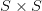

grid, shown in **Figure 5**, where 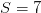. If the center of an object falls into one of the 49 grids, then that cell is responsible for detecting that object.

但是一个网格单元能负责检测多少物体呢？嗯，每个网格单元可以检测 B 个边界框和这些边界框的置信度得分，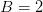

.

总之，该模型可以检测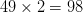

bounding boxes; however, later, we will see that during the training, the model tries to suppress one of the two boxes in each cell that has less Intersection over Union (IOU) with the ground-truth box.

置信度得分被分配给每个框，它告诉模型对于边界框包含对象的置信度。

置信度得分可以定义为:

 \times \text{IOU}^\text{truth}_\text{pred}")

其中")

is `1` if the object exists, and `0` otherwise; when an object is present, the confidence score equals the IOU between the ground truth and the predicted bounding box.

这是有意义的，因为当预测的框不完全与基本事实框对齐时，我们不希望置信度得分为 100% ( `1`)，这允许我们的网络为每个边界框预测更真实的置信度。

每个边界框输出五个预测: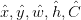

.

*   目标")坐标表示边界框的中心相对于网格单元的边界，意味着")的值将在`[0, 1]`之间变化。值为`(0.5, 0.5)`的")表示对象的中心是特定网格单元的中心。

*   目标")是边框相对于整个图像的宽度和高度。这意味着预测的")也会相对于整个图像。边界框的宽度和高度可以大于`1`。

*   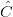是网络预测的置信度得分。

除了边界框坐标和置信度得分，每个网格单元预测

conditional class probabilities "), where 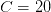for PASCAL VOC classes. 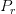is conditioned on the grid cell containing an object; hence, it only exists when there is an object.

我们了解到每个网格单元负责预测两个盒子。然而，只考虑具有最高 IOU 和地面真值的一个；因此，模型预测每个网格单元的一组类别概率，忽略盒子的数量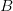

.

要培养更多的直觉，参考**图 6**；我们可以观察

grids, and each grid cell has output predictions for Box 1 and Box 2 and class probabilities.

每个边界框有五个值![[\text{confidence}, X, Y, \text{Width}, \text{Height}]](img/1f07f495d131496ae8e5a88f4aa2a745.png "[\text{confidence}, X, Y, \text{Width}, \text{Height}]")

in total ten values for both bounding boxes and 20 class probabilities. Hence, the final prediction is a 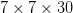tensor.

* * *

### **[比较 YOLOv1 与其他架构](#TOC)**

本节将 YOLO 检测架构与几个顶级检测框架进行比较，如 DPM、RCNN、Overfeat 等。

*   **DPM:** [Girshick，Iandola 等人(2014)](https://arxiv.org/abs/1409.5403) 使用滑动窗口方法，根据窗口的跨度对每个图像区域进行分类。管道是不相交的，涉及提取静态特征、对区域分类和预测高分区域。

    然而，在 YOLO， [Redmon 等人](https://www.cv-foundation.org/openaccess/content_cvpr_2016/papers/Redmon_You_Only_Look_CVPR_2016_paper.pdf)使用统一的方法，其中单个 CNN 模型提取特征来执行包围盒预测和非最大值抑制。同样重要的是要注意，YOLO 不依赖于静态特性；他们是通过网络培训学会的。此外，YOLO 侧重于全局上下文信息，而不仅仅是局部区域，如 DPM 中所见，这有助于减少误报。不幸的是，与基准相比，DPM 在速度和准确性上都远远落后于 YOLO 网络。

*   **RCNN (** [**Girshick，Donahue 等人，2014**](https://arxiv.org/abs/1311.2524) **):** 家庭使用区域建议在图像中寻找对象。RCNN 使用选择性搜索来生成潜在的包围盒。CNN 从每个区域提取特征，支持向量机(SVM)对盒子进行分类，并且完全连接的线性层校准边界盒子。它有如此多的组件，这使得它很难优化和缓慢的训练。RCNN 花费了超过 45 秒的时间，这对一个需要实时速度的应用来说太多了。此外，RCNN 的选择性搜索方法提出了 2000 个包围盒，而 YOLO 每幅图像有 98 个提议。YOLO 将所有这些不相关的步骤合并成一个单一的端到端联合优化模型。

*   **过吃:** [Sermanet 等人(2014)](https://arxiv.org/abs/1312.6229) 使用了与 DPM 类似的方法(即滑动窗口检测，但执行效率更高)。它训练 CNN 来执行定位，无法学习全球环境，并且需要大量的后处理来产生一致的检测。总的来说，这也是一个分离的架构。

*   **更快-RCNN (** [**任等，2016**](https://arxiv.org/abs/1506.01497)**):**比 RCNN 好得多。它消除了对建议区域的选择性搜索，但仍然有两个不同的对象检测网络。这很难优化，因为它有四个损失函数:两个用于区域建议网络，两个用于快速 R-CNN。

    使用了相当多的全连接层，增加了参数，减少了推理时间。因此，虽然 fast-RCNN 在地图上超过了 YOLO，但它的 FPS 比 YOLO 少了 5-6。

在将 YOLO 与四种不同的架构进行比较后，我们可以得出结论，这些架构中的大多数专注于学习本地信息，而不是全局信息。他们只看图像的一部分，而不是图像的整体。对象检测管道不是端到端的；各种组件可能会使这些网络难以优化，并且在测试时速度较慢。

另一方面，YOLO 通过设计用于同时执行检测和分类的单个卷积神经网络，在将对象检测作为回归或图像分类问题来处理方面做得非常好。

* * *

### **[YOLO 的网络架构](#TOC)**

相信我，YOLO 的网络架构很简单！它类似于您过去可能训练过的图像分类网络。但是，令您惊讶的是，这个架构的灵感来自于图像分类任务中使用的 GoogLeNet 模型。

它主要由三种类型的层组成:卷积层、最大池层和全连接层。YOLO 网络有 24 个卷积层，它们进行图像特征提取，然后是两个完全连接的层，用于预测边界框坐标和分类分数。

[Redmon 等人](https://www.cv-foundation.org/openaccess/content_cvpr_2016/papers/Redmon_You_Only_Look_CVPR_2016_paper.pdf)修改原 GoogLenet 架构。首先，他们使用了

convolutional layers instead of inception modules for reducing feature space, followed by a convolutional layer (see **Figure 7**).

YOLO 的第二种变体，称为快速 YOLO，具有 9 个卷积层而不是 24 个，并且使用更小的滤波器尺寸。它主要是设计来进一步推动推理速度到一个你永远无法想象的程度。通过这种设置，作者能够实现 **155 FPS** ！

* * *

### **[训练流程](#TOC)**

作为第一步， [Redmon 等人](https://www.cv-foundation.org/openaccess/content_cvpr_2016/papers/Redmon_You_Only_Look_CVPR_2016_paper.pdf)在 ImageNet 1000 类数据集上训练网络。然后，在预训练步骤中，他们考虑了前 20 个卷积层，随后是平均池和全连接层。

他们对这个模型进行了近 7 天的训练，并在 ImageNet 验证集上取得了 88%的前 5 名准确率。它是用的输入分辨率训练的

, half the resolution used for object detection. **Figure 8** shows the network summary of YOLOv1 that has the detection layer at the end.

PASCAL VOC 2007 和 2012 数据集用于训练检测任务的神经网络。该网络被训练了大约 135 个时期，批次大小为 64，动量为 0.9。从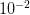开始，学习率随着培训的进行而变化

to 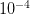. Standard data augmentation and dropout techniques were used to avoid overfitting.

作者用C 语言编写了他们的框架，用于训练和测试被称为**暗网**的模型。预训练的分类网络堆叠有四个卷积层和两个全连接层，具有用于检测任务的随机初始化。

由于检测是一项更具挑战性的任务，需要细粒度的上下文信息，因此输入被上采样到

.

地面实况边界框的高度和宽度被标准化为![[0, 1]](img/70c03e11df59f07f35779b889bcc19d4.png "[0, 1]")

by dividing it with the image height and width. All the layers except the last used LeakyReLU as the activation function with , and the final layer is linear.

* * *

### **[损失函数](#TOC)**

现在让我们剖析图 9 中所示的 YOLO 损失函数。乍一看，下面的等式可能看起来有点冗长和复杂，但是不要担心；很容易理解。

你会注意到，在这个损耗方程中，我们正在用误差平方和(SSE)优化网络， [Redmon 等人](https://www.cv-foundation.org/openaccess/content_cvpr_2016/papers/Redmon_You_Only_Look_CVPR_2016_paper.pdf)认为这很容易优化。然而，使用它有一些注意事项，他们试图通过增加一个叫做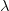的权重项来克服这些注意事项

.

让我们一部分一部分地理解上面的等式:

*   等式的第一部分计算预测边界框中点(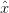，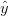)和地面真实边界框中点(，)之间的损失。

    对所有 49 个网格单元进行计算，损失中只考虑两个包围盒中的一个。请记住，它只会惩罚对地面实况框“负责”的预测值的边界框坐标误差(即，在该格网像元中具有任何预测值的最高 IOU)。

    简而言之，我们将找出与目标边界框具有最高 IOU 的两个边界框，并且这将被优先用于损失计算。

    最后，我们用一个常数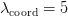来衡量损失，以确保我们的包围盒预测尽可能接近目标。最后，恒等式函数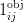表示单元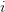中的第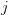个边界框预测器负责该预测。因此，如果目标对象存在，则为`1`，否则为`0`。

*   第二部分与第一部分颇为相似，让我们来了解一下不同之处。这里，我们计算预测的边界框宽度和高度")与目标宽度和高度")之间的损失。

    小盒子中的显著偏差会很小，而大盒子中的微小变化会很大，这将导致小盒子不那么重要。因此，作者增加了一个平方根，以反映大盒子中的轻微偏差小于小盒子中的偏差。

*   在等式的第三部分中，假设一个对象存在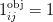，我们计算包围盒的预测置信度得分和目标置信度得分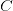之间的损失。

    这里，目标置信度得分等于预测包围盒与目标之间的 IOU。我们选择与目标具有较高 IOU 的盒子的置信度得分。

*   接下来，如果网格单元中不存在对象，那么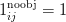和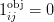将使方程的第三部分为零。在具有较高 IOU 的框和目标之间计算损失，目标为`0`，因为我们希望没有对象的单元格的置信度为`0`。

    我们也用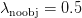来衡量这部分，因为可能有许多没有对象的网格单元，我们不希望这个术语压倒包含对象的单元的渐变。正如本文所强调的，这可能会导致模型不稳定，并且更难优化。

*   最后，对于每个单元，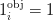，如果对象出现在单元中，我们计算所有 20 个类别的损失(条件类别概率)。这里，")是预测的条件类概率，")是目标条件类概率。

* * *

### 量化基准

现在，我们已经涵盖了 YOLO 架构的几乎所有方面，让我们看看 YOLO 及其变体快速 YOLO 与其他实时和非实时对象检测器相比所实现的一些量化基准。

**表 1** 有四个属性:实时检测器、训练数据、评估度量和 FPS 我们使用这四个属性进行定量比较。用于训练所有四个模型的训练数据是 Pascal VOC。我们可以看到，在平均精度(接近 2 倍)和 FPS 方面，YOLO 和快速 YOLO 都远远超过 DPM 的实时对象检测器变体。

具有九个卷积层的快速 YOLO 实现了`52.7`和`155` FPS 的映射。另一方面，YOLO 获得了`63.4`地图和`45` FPS。这两种型号在 2016 年都会改变游戏规则，是目标部署为嵌入式或移动设备的对象检测应用的明确选择，尤其是快速 YOLO 变体。

在**表 2** 中，我们将 YOLO 与其他非实时物体检测器进行了比较。更快-RCNN 在 mAP 方面表现最好，但仅达到 7 FPS，对于需要实时处理的应用来说太少；加上预处理和后处理，FPS 将进一步降低。而以 VGG-16 为骨干的 YOLO 比以谷歌网络为骨干的 YOLO 获得+3%的地图增益。

* * *

### **[对艺术形象的概括](#TOC)**

本节讨论 [Redmon 等人](https://www.cv-foundation.org/openaccess/content_cvpr_2016/papers/Redmon_You_Only_Look_CVPR_2016_paper.pdf)对 YOLO、RCNN、DPM 和其他两个模型的概化测试。结果很有意思，所以让我们快速了解一下。

作者提出了一个很好的观点，即测试数据通常不来自模型在现实世界中接受训练的同一分布，或者它可能与模型之前看到的有所不同。

**图 10** 显示了用 Pascal VOC 数据集训练时 YOLOv1 在艺术和自然图像上的定性结果。这个模型做得相当好，尽管它确实认为一个人是一架飞机。

类似地，考虑到 YOLO 是在 Pascal VOC 数据集上训练的，他们在另外两个数据集上测试了该模型:Picasso 和 People-Art 数据集，用于测试艺术品上的人物检测。

**表 3** 显示了 YOLO 和其他检测方法之间的比较。YOLO 在所有三个数据集上都优于 R-CNN 和 DPM。VOC 2007 AP 仅在 person 类上评估，所有三个模型都在 VOC 2007 数据集上训练。

对于毕加索评估，模型在 VOC 2012 上训练，对于人艺测试数据，在 VOC 2010 上训练。

观察到在 VOC 2007 上 RCNN 的 AP 很高，但是当在 Picasso 和 People-Art 数据上测试时，准确性显著下降。一个可能的原因是，RCNN 使用选择性搜索来生成建议，这是针对自然图像而言的，而这是艺术作品。此外，RCNN 中的分类器步骤只看到局部区域，需要更好的建议。

YOLO 在这三个数据集上都表现良好；与其他两种型号相比，它的 AP 没有显著下降。作者指出，YOLO 能很好地学习物体的大小和形状以及它们之间的关系。自然图像和艺术品在像素级别上可能是不同的，但是它们在语义上是相似的，并且对象的大小和形状也保持一致。

* * *

### **[YOLO 建筑的局限性](#TOC)**

在讨论 YOLO 的局限性之前，我们都应该花点时间来欣赏一下这种新的单级检测技术，它通过提供一种运行速度如此之快并设定新基准的架构，在对象检测领域取得了突破！

但没有什么是完美的，总有改进的余地，YOLOv1 也是如此。

一些限制是:

1.  该模型限制了在给定图像中检测到的对象的数量:最多只能检测 49 个对象。
2.  由于每个网格单元只能预测两个盒子，只能有一个类别，这就限制了 YOLO 可以预测的附近物体的**数量，尤其是成群出现的小物体，比如一群鸟。**
3.  它也很难探测到更小的物体。该模型使用相对粗糙的特征来预测对象，因为该架构具有来自输入图像的多个下采样层。因此，相对较小的对象在最后一层会变得更小，导致网络更难定位。
4.  [Redmon 等人](https://www.cv-foundation.org/openaccess/content_cvpr_2016/papers/Redmon_You_Only_Look_CVPR_2016_paper.pdf)认为错误的主要来源是不正确的定位，因为损失函数在小边界框和大边界框中对待错误是一样的。

这么多理论就行了。让我们继续配置 darknet 框架，并使用预训练的 YOLOv1 模型运行推理。

* * *

### **[配置暗网框架，用预先训练好的 YOLOv1 模型运行推理](#TOC)**

我们已经将 Darknet 框架配置划分为 8 个易于遵循的步骤，并使用 YOLOv1 对图像和视频进行了推理。所以，让我们开始吧！

***注意:*** *请确保您的机器上安装了匹配的 CUDA、CUDNN 和 NVIDIA 驱动程序。对于这个实验，我们使用 CUDA-10.2，CUDNN-8.0.3。但是如果你计划在 Google Colab 上运行这个实验，不要担心，因为所有这些库都预装了它。*

**第 1 步:**本实验使用 GPU，确保 GPU 正常运行。

```py
# Sanity check for GPU as runtime
$ nvidia-smi
```

**图 11** 显示了 machine(即 V100)、driver 和 CUDA 版本中可用的 GPU。

第二步:我们将安装一些库，比如 OpenCV，FFmpeg 等等。，这在编译和安装 darknet 之前是必需的。

```py
# Install OpenCV, ffmpeg modules
$ apt install libopencv-dev python-opencv ffmpeg
```

**步骤#3:** 接下来，我们从 AlexyAB 存储库中克隆 darknet 框架的修改版本。如前所述，Darknet 是由 Joseph Redmon 编写的开源神经网络。用 C 和 CUDA 编写，同时支持 CPU 和 GPU 计算。暗网的官方实现可在:【https://pjreddie.com/darknet/；我们会下载官网提供的 YOLOv1 砝码。

```py
# Clone AlexeyAB darknet repository
$ git clone https://github.com/AlexeyAB/darknet/
$ cd darknet/
```

确保将目录更改为 darknet，因为在下一步中，我们将配置`Makefile`并编译它。使用`!pwd`进行健全性检查；我们应该在`/content/darknet`目录里。

**步骤#4:** 使用流编辑器(`sed`)，我们将编辑 make 文件并启用标志:`GPU`、`CUDNN`、`OPENCV`和`LIBSO`。

**图 12** 显示了`Makefile`的一个片段，其内容将在后面讨论:

*   我们让`GPU=1`和`CUDNN=1`与`CUDA`一起构建暗网来执行和加速对`GPU`的推理。注意`CUDA`应该在`/usr/local/cuda`；否则，编译将导致错误，但如果您正在 Google Colab 上编译，请不要担心。
*   如果你的`GPU`有张量核，使`CUDNN_HALF=1`获得最多`3X`推理和`2X`训练加速。由于我们使用带张量内核的 Tesla V100 GPU，因此我们将启用此标志。
*   我们使`OPENCV=1`能够与`OpenCV`一起构建暗网。这将允许我们检测视频文件、IP 摄像头和其他 OpenCV 现成的功能，如读取、写入和在帧上绘制边界框。
*   最后，我们让`LIBSO=1`构建`darknet.so`库和使用这个库的二进制可执行文件`uselib`。允许该标志使用 Python 脚本对图像和视频进行推理将使我们能够在其中导入`darknet`。

现在，让我们编辑`Makefile`并编译它。

```py
# Enable the OpenCV, CUDA, CUDNN, CUDNN_HALF & LIBSO Flags and Compile Darknet
$ sed -i 's/OPENCV=0/OPENCV=1/g' Makefile
$ sed -i 's/GPU=0/GPU=1/g' Makefile
$ sed -i 's/CUDNN=0/CUDNN=1/g' Makefile
$ sed -i 's/CUDNN_HALF=0/CUDNN_HALF=1/g' Makefile
$ sed -i 's/LIBSO=0/LIBSO=1/g' Makefile
$ make
```

`make`命令将需要大约 90 秒来完成执行。既然编译已经完成，我们就可以下载 YOLOv1 权重并运行推理了。

你不兴奋吗？

**步骤#5:** 我们现在将从官方 [YOLOv1 文档中下载 YOLOv1 砝码](https://pjreddie.com/darknet/yolov1/)。

```py
# Download YOLOv1 Weights
$ wget http://pjreddie.com/media/files/yolov1/yolov1.weights
```

**步骤#6:** 现在，我们将运行`darknet_images.py`脚本来推断图像。

```py
# Run the darknet image inference script
$ python3 darknet_images.py --in hun put data --weights \ 
yolov1.weights --config_file cfg/yolov1/yolo.cfg \
--data_file cfg/voc.data --dont_show
```

让我们来看看传递给`darknet_images.py`的命令行参数:

*   `--input`:图像目录或文本文件的路径，带有图像路径或单个图像名称。支持`jpg`、`jpeg`和`png`图像格式。在本例中，我们将路径传递给名为`data`的图像文件夹。
*   `--weights` : YOLOv1 重量路径。
*   `--config_file`:yolo v1 的配置文件路径。在抽象层次上，该文件存储神经网络模型架构和一些其他参数，如`batch_size`、`classes, input_size`等。我们建议您通过在文本编辑器中打开该文件来快速阅读它。
*   这里，我们传递 Pascal VOC 标签文件。
*   这将禁止 OpenCV 显示推理结果，我们使用它是因为我们正在使用 colab。

以下是 YOLOv1 模型对一组图像的对象检测推断结果。

我们可以从**图 13** 中看到，该模型表现良好，因为它正确预测了狗、自行车和汽车。

在**图 14** 中，该模型通过将一匹马归类为一只羊来预测一个假阳性，同时正确预测了另外两个对象。

在**图 15** 中，该模型再次通过正确检测几匹马完成了不错的工作。但是定位不是很准，确实漏了几匹马。在我们的下一篇文章中，你会看到 YOLOv2 在预测下图方面做得稍微好一点。

**图 16** 是一只鹰的图像，被模型很好的定位，归类为鸟。不幸的是，Pascal VOC 数据集没有 Eagle 类，但该模型很好地预测了它是一只鸟。

**步骤#7:** 现在，我们将在电影《天降》的视频上运行预训练的 YOLOv1 模型；这是[雷德蒙等人](https://www.cv-foundation.org/openaccess/content_cvpr_2016/papers/Redmon_You_Only_Look_CVPR_2016_paper.pdf)在他们的一次 YOLOv1 实验中使用的同一段视频。

在运行`darknet_video.py`演示脚本之前，我们将首先使用`pytube`库从 YouTube 下载视频，并使用`moviepy`库裁剪视频。所以让我们快速安装这些模块并下载视频。

```py
# Install pytube and moviepy for downloading and cropping the video
$ pip install git+https://github.com/rishabh3354/pytube@master
$ pip install moviepy
```

```py
# Import the necessary packages
$ from pytube import YouTube
$ from moviepy.video.io.ffmpeg_tools import ffmpeg_extract_subclip

# Download the video in 720p and Extract a subclip
$ YouTube('https://www.youtube.com/watch?v=tHRLX8jRjq8'). \ streams.filter(res="720p").first().download()
$ ffmpeg_extract_subclip("/content/darknet/Skyfall.mp4", \ 
0, 30, targetname="/content/darknet/Skyfall-Sample.mp4")
```

**第 8 步:**最后，我们将运行`darknet_video.py`脚本来为天崩地裂的视频生成预测。我们打印输出视频每一帧的 FPS 信息。

如果使用 mp4 视频文件，将 darknet 文件夹中`darknet_video.py`脚本的**第 57 行**的`set_saved_video`功能中的视频编解码器由`MJPG`更改为`mp4v`；否则，播放推理视频时会出现解码错误。

```py
# Change the VideoWriter Codec
fourcc = cv2.VideoWriter_fourcc(*"mp4v")
```

既然所有必要的安装和修改都已完成，我们将运行`darknet_video.py`脚本:

```py
# Run the darknet video inference script
$ python darknet_video.py --input \ 
/content/darknet/Skyfall-Sample.mp4 \ 
--weights yolov1.weights --config_file \ 
cfg/yolov1/yolo.cfg --data_file ./cfg/voc.data \
--dont_show --out_filename pred-skyfall.mp4
```

让我们看看传递给`darknet_video.py`的命令行参数:

*   `--input`:视频文件的路径，如果使用网络摄像头，则为`0`
*   `--weights` : YOLO 重量路径
*   `--config_file`:配置文件路径
*   `--data_file`:通过 Pascal VOC 标签文件
*   `--dont_show`:禁止 OpenCV 显示推理结果
*   `--out_filename`:未保存空输出视频时输出视频名称的推断结果。

瞧啊。下面是天崩地裂动作场景视频上的推断结果，预测似乎不错。YOLOv1 网络在特斯拉 V100 上实现了平均 **140 FPS** 的混合精度。

<https://www.youtube.com/embed/p2dt4lljyLc>*