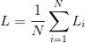

# 理解图像分类和机器学习的正则化

> 原文：<https://pyimagesearch.com/2016/09/19/understanding-regularization-for-image-classification-and-machine-learning/>

> 机器学习中使用的许多策略被明确地设计成减少测试误差，可能以增加训练误差为代价。这些策略统称为规则化。
> 
> *—*[Goodfellow, Bengio, and Courville (2016)](https://www.deeplearningbook.org/)

在之前的课程中，我们讨论了两个重要的损失函数:多类 SVM 损失和交叉熵损失。然后，我们讨论了梯度下降以及网络如何通过更新模型的权重参数来学习。虽然我们的损失函数允许我们确定我们的参数集在给定的分类任务上执行得有多好(或多差)，但是损失函数本身并不考虑权重矩阵的“外观”

我说的“长相”是什么意思？嗯，请记住，我们是在实值空间中工作，因此有一组*无限的参数*将在我们的数据集上获得合理的分类精度(对于“合理”的一些定义)。

我们如何着手选择一组参数来帮助确保我们的模型能够很好地推广？或者至少减轻过度拟合的影响。 ***答案是正规化。*** 仅次于你的学习速率，正则化是你可以调优的模型中最重要的参数。

有各种类型的正则化技术，如 L1 正则化、L2 正则化(通常称为“权重衰减”)和[弹性网](https://doi.org/10.1111/j.1467-9868.2005.00503.x)，它们通过更新损失函数本身来使用，添加一个附加参数来约束模型的容量。

我们也有可以明确地添加到网络架构中的正则化类型——dropout 就是这种正则化的典型例子。然后，我们有在训练过程中应用的*隐式*正则化形式。隐式正则化的例子包括数据扩充和提前停止。

### 什么是正规化，我们为什么需要正规化？

**正则化有助于我们控制我们的模型容量**，确保我们的模型更擅长于在数据点上做出(正确的)分类，这些数据点是*而不是*训练出来的，我们称之为 ***概括*** 的能力。如果我们不应用正则化，我们的分类器很容易变得过于复杂，并且*过度适应*我们的训练数据，在这种情况下，我们失去了归纳我们的测试数据的能力(以及测试集之外的数据点*，例如野外的新图像)。*

然而，过多的正规化可能是一件坏事。我们可能会冒*欠拟合*的风险，在这种情况下，我们的模型在训练数据上表现不佳，并且无法对输入数据和输出类标签之间的关系进行建模(因为我们对模型容量的限制太多)。例如，考虑下面的点图，以及适合这些点的各种函数(**图 1** )。

橙色线是*欠拟合*的一个例子——我们没有捕捉到点之间的关系。另一方面，蓝线是*过度拟合*的一个例子——我们的模型中有太多的参数，虽然它击中了数据集中的所有点，但它也在点之间变化很大。这不是我们想要的平滑、简单的拟合。然后我们有格林函数，它也命中数据集中的所有点，但是以一种更可预测、更简单的方式。

正则化的目标是获得这些类型的“格林函数”,它们很好地适应我们的训练数据，但避免过度适应我们的训练数据(蓝色)或未能对底层关系建模(橙色)。正则化是机器学习的一个重要方面，我们使用正则化来控制模型泛化。为了理解正则化及其对损失函数和权重更新规则的影响，让我们继续下一课。

### **更新我们的减肥和体重更新，以纳入正规化**

让我们从交叉熵损失函数开始:

**【①**

 **整个训练集的损失可以写成:

**②**

 **现在，假设我们已经获得了一个权重矩阵***【W】****，使得*我们训练集中的每一个数据点*都被正确分类，这意味着我们的 loss*L*= 0 for all*L**[I]*。*

 *太棒了，我们获得了 100%的准确性，但让我问你一个关于这个权重矩阵的问题— ***它是唯一的吗？*** **或者换句话说，有没有更好的********W*****的选择，可以提高我们模型的泛化能力，减少过拟合？*****

 ***如果真有这么一个 ***W*** ，我们怎么知道？我们怎样才能把这种惩罚纳入我们的损失函数呢？答案是定义一个**正则化惩罚**，一个作用于我们权重矩阵的函数。正则化罚函数一般写成函数， *R* ( ***W*** )。等式( **3)** 显示了最常见的正则化惩罚，L2 正则化(也称为**权重** **衰减**):

**(3)**  = \sum\limits_{i}\sum\limits_{j} W_{i,j}^{2}")

这个函数到底在做什么？就 Python 代码而言，它只是对数组求平方和:

```py
penalty = 0

for i in np.arange(0, W.shape[0]):
	for j in np.arange(0, W.shape[1]):
		penalty += (W[i][j] ** 2)
```

我们在这里做的是循环遍历矩阵中的所有条目，并计算平方和。L2 正则化惩罚中的平方和不鼓励我们的矩阵*中的大权重，而偏好较小的权重。为什么我们要阻止大的重量值？简而言之，通过惩罚大的权重，我们可以提高泛化能力，从而减少过度拟合。*

 *可以这样想，权重值越大，对输出预测的影响就越大。具有较大权重值的维度几乎可以单独控制分类器的输出预测(当然，假设权重值足够大)，这几乎肯定会导致过度拟合。

为了减轻各种维度对我们的输出分类的影响，我们应用正则化，从而寻求考虑到所有*维度而不是少数具有大值的维度的***【W】****值。在实践中，你可能会发现正规化会稍微损害你的训练精度，但实际上*会增加你的测试精度*。**

 *同样，我们的损失函数具有相同的基本形式，只是现在我们加入了正则化:

**(4)** ")

我们之前见过的第一项是我们训练集中所有样本的平均损失。

**第二个术语是新的——*****这是我们的正规化处罚*** **。***λ*变量是一个超参数，它控制我们正在应用的正则化的*数量*或*强度*。在实践中，学习率 *α* 和正则项 *λ* 都是您将花费最多时间调整的超参数。

扩展交叉熵损失以包括 L2 正则化产生以下等式:

**(5)** ![L = \displaystyle\frac{1}{N} \sum\limits^{N}_{i=1}\left [-\log\left(\displaystyle\frac{e^{s_{y_{i}}}}{\sum\limits_{j} e^{s_{j}}}\right)\right] +\lambda \sum\limits_{i} \sum\limits_{j} W_{i, j}^{2}](img/2abd0880de1a518c39fa194d21621dd5.png "L = \displaystyle\frac{1}{N} \sum\limits^{N}_{i=1}\left [-\log\left(\displaystyle\frac{e^{s_{y_{i}}}}{\sum\limits_{j} e^{s_{j}}}\right)\right] +\lambda \sum\limits_{i} \sum\limits_{j} W_{i, j}^{2}")

我们也可以扩展多级 SVM 损耗:

**(6)** ![L = \displaystyle\frac{1}{N} \sum\limits^{N}_{i=1} \sum\limits_{j \neq y_{i}} \left[\max\left(0, s_{j} - s_{y_{i}} + 1\right)\right] + \lambda \sum\limits_{i} \sum\limits_{j} W_{i, j}^{2}](img/9b99d3185e3b0cbef889c38793d21623.png "L = \displaystyle\frac{1}{N} \sum\limits^{N}_{i=1} \sum\limits_{j \neq y_{i}} \left[\max\left(0, s_{j} - s_{y_{i}} + 1\right)\right] + \lambda \sum\limits_{i} \sum\limits_{j} W_{i, j}^{2}")

现在，让我们来看看我们的标准权重更新规则:

**(7)***【w】*=*【w】-***[【w】]**

 *该方法基于梯度乘以学习速率 *α* 来更新我们的权重。考虑到正则化，权重更新规则变为:

**(8)***【w】*=*【w】-***[【w】]**

 *这里，我们将负线性项添加到我们的梯度(即梯度下降)，惩罚大权重，最终目标是使我们的模型更容易泛化。

### **正则化技术的类型**

一般来说，您会看到直接应用于损失函数的三种常见正则化类型。第一种，我们前面提到过，L2 正则化(又名“权重衰减”):

**(9)**  = \sum\limits_{i}\sum\limits_{j} W_{i,j}^{2}")

我们还有 L1 正则化，它采用绝对值而不是平方:

** = \sum\limits_{i}\sum\limits_{j} |W_{i,j}|")(10)**

 **[弹性网](https://doi.org/10.1111/j.1467-9868.2005.00503.x)正则化寻求结合 L1 正则化和 L2 正则化:

** = \sum\limits_{i}\sum\limits_{j} \beta W_{i,j}^{2} + \left|W_{i,j}\right|")(11)**

 **还存在其他类型的正则化方法，例如直接修改网络的架构以及网络的实际训练方式，我们将在后面的课程中回顾这些方法。

就您应该使用哪种正则化方法而言(包括根本不使用)，您应该将此选择视为一个超参数，您需要优化并执行实验来确定*是否应该应用*正则化，如果应该应用*正则化的哪种方法*，以及 *λ* 的适当值是多少。有关正则化的更多详细信息，请参考 Goodfellow 等人(2016) 的[第 7 章，DeepLearning.net 教程](https://www.deeplearningbook.org/)的[“正则化”部分，以及 Karpathy 的 cs231n 神经网络 II 讲座](https://www.deeplearningbook.org/slides/07_regularization.pdf)的[笔记。](https://cs231n.github.io/neural-networks-2/)

### **正则化应用于图像分类**

为了实际演示正则化，让我们编写一些 Python 代码，将其应用于我们的“Animals”数据集。打开一个新文件，将其命名为`regularization.py`，并插入以下代码:

```py
# import the necessary packages
from sklearn.linear_model import SGDClassifier
from sklearn.preprocessing import LabelEncoder
from sklearn.model_selection import train_test_split
from pyimagesearch.preprocessing import SimplePreprocessor
from pyimagesearch.datasets import SimpleDatasetLoader
from imutils import paths
import argparse
```

**第 2-8 行**导入我们需要的 Python 包。除了 scikit-learn `SGDClassifier`之外，我们以前见过所有这些导入。正如这个类的名字所暗示的，这个实现包含了我们在课程中复习过的所有概念，包括:

*   损失函数
*   时代数
*   学习率
*   正则项

从而使它成为在实践中展示所有这些概念的完美例子。

接下来，我们可以解析我们的命令行参数并从磁盘中获取图像列表:

```py
# construct the argument parse and parse the arguments
ap = argparse.ArgumentParser()
ap.add_argument("-d", "--dataset", required=True,
	help="path to input dataset")
args = vars(ap.parse_args())

# grab the list of image paths
print("[INFO] loading images...")
imagePaths = list(paths.list_images(args["dataset"]))
```

给定图像路径，我们将调整它们的大小为 32*×32 像素，将它们从磁盘加载到内存中，然后将它们展平为一个 3072 维的数组:*

```py
# initialize the image preprocessor, load the dataset from disk,
# and reshape the data matrix
sp = SimplePreprocessor(32, 32)
sdl = SimpleDatasetLoader(preprocessors=[sp])
(data, labels) = sdl.load(imagePaths, verbose=500)
data = data.reshape((data.shape[0], 3072))
```

我们还将标签编码为整数，并执行训练测试分割，使用 75%的数据进行训练，剩余的 25%进行测试:

```py
# encode the labels as integers
le = LabelEncoder()
labels = le.fit_transform(labels)

# partition the data into training and testing splits using 75% of
# the data for training and the remaining 25% for testing
(trainX, testX, trainY, testY) = train_test_split(data, labels,
	test_size=0.25, random_state=42)
```

让我们在训练我们的`SGDClassifier`时应用一些不同类型的正则化:

```py
# loop over our set of regularizers
for r in (None, "l1", "l2"):
	# train a SGD classifier using a softmax loss function and the
	# specified regularization function for 10 epochs
	print("[INFO] training model with '{}' penalty".format(r))
	model = SGDClassifier(loss="log", penalty=r, max_iter=10,
		learning_rate="constant", tol=1e-3, eta0=0.01, random_state=12)
	model.fit(trainX, trainY)

	# evaluate the classifier
	acc = model.score(testX, testY)
	print("[INFO] {} penalty accuracy: {:.2f}%".format(r,
		acc * 100))
```

第 37 行循环遍历我们的正则化函数，包括无正则化。然后我们初始化并训练第 41-43 号**线上的`SGDClassifier`。**

我们将使用交叉熵损失，正则化罚值为`r`，默认的 *λ* 为 0.0001。我们将使用 SGD 以 *α* = 0 *的学习率对模型进行 10 个历元的训练。* 01。然后，我们评估分类器，并在屏幕的第 46-48 行**显示准确度结果。**

要查看用各种正则化类型训练的 SGD 模型，只需执行以下命令:

```py
$ python regularization.py --dataset dataset/animals
[INFO] loading images...
...
[INFO] training model with 'None' penalty
[INFO] 'None' penalty accuracy: 50.13%
[INFO] training model with 'l1' penalty
[INFO] 'l1' penalty accuracy: 52.67%
[INFO] training model with 'l2' penalty
[INFO] 'l2' penalty accuracy: 57.20%
```

我们可以看到，在没有正则化的情况下，我们获得了 50.13%的精度**。使用 L1 正则化，我们的精度增加到 **52.67%** 。L2 正则化获得最高精度 **57.20%** 。**

***备注:*** 对`train_test_split`使用不同的`random_state`值会产生不同的结果。这里的数据集太小，分类器太简单，看不到正则化的全部影响，所以把它当作一个“工作示例”随着我们继续阅读这本书，你会看到正则化的更高级的应用，这将对你的准确性产生巨大的影响。

实际上，这个例子太小，无法显示应用正则化的所有优势——为此，我们必须等到我们开始训练卷积神经网络。然而，与此同时，简单地理解正则化可以提高我们的测试精度并减少过度拟合，*假设我们可以正确地调整超参数*。

## **总结**

在这些课程中，我们打开了深度学习的引擎盖，深入研究了为现代神经网络提供动力的引擎— *梯度下降*。我们研究了两种类型的梯度下降:

1.  标准的香草味。
2.  更常用的随机版本。

普通梯度下降每个历元只执行*一次*权重更新，这使得在大型数据集上收敛非常慢(如果不是不可能的话)。相反，随机版本通过计算小批量的梯度，在每个时期应用*多重*权重更新。通过使用 SGD，我们可以大大减少训练模型所需的时间，同时还可以享受更低的损失和更高的准确性。典型的批量大小包括 32、64、128 和 256。

梯度下降算法通过一个 ***学习速率*** 来控制:这是迄今为止在训练你自己的模型时要正确调整的最重要的参数。

如果你的学习速度太快，你只会在亏损的情况下徘徊，而不会从数据中“学习”到任何模式。另一方面，如果你的学习率太小，要达到一个合理的损失，将需要令人望而却步的迭代次数。为了得到正确的结果，你需要花大部分时间来调整学习速度。

然后我们讨论了 ***正则化*** ，正则化被定义为*“任何可能以训练精度为代价来提高测试精度的方法。”*正规化包含一系列广泛的技术。我们特别关注应用于损失函数和权重更新规则的正则化方法，包括 L1 正则化、L2 正则化和弹性网。

就深度学习和神经网络而言，你通常会看到 L2 正则化用于图像分类——技巧是调整 *λ* 参数，以包括适量的正则化。

在这一点上，我们有一个良好的机器学习基础，但我们还没有研究神经网络或从头训练一个定制的神经网络。在以后的课程中，这一切都将改变，我们将讨论神经网络、反向传播算法以及如何在自定义数据集上训练您自己的神经网络。****************