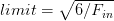
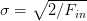

# 了解神经网络的权重初始化

> 原文：<https://pyimagesearch.com/2021/05/06/understanding-weight-initialization-for-neural-networks/>

在本教程中，我们将讨论*权重初始化*的概念，或者更简单地说，我们如何初始化我们的权重矩阵和偏差向量。

本教程并不意味着是一个全面的初始化技术；然而，它确实突出了流行的方法，但是来自神经网络文献和一般的经验法则。为了说明这些权重初始化方法是如何工作的，我在适当的时候加入了基本的类似 Python/NumPy 的伪代码。

### **常量初始化**

当应用常数初始化时，神经网络中的所有权重都用常数值 *C* 初始化。通常情况下， *C* 等于零或一。

为了用伪代码形象化这一点，让我们考虑具有 64 个输入和 32 个输出的神经网络的任意层(为了概念上的方便，排除任何偏差)。为了通过 NumPy 和 zero 初始化(Caffe 使用的默认设置，一个流行的深度学习框架)初始化这些权重，我们将执行:

```py
>>> W = np.zeros((64, 32))
```

类似地，可以通过以下方式完成一次初始化:

```py
>>> W = np.ones((64, 32))
```

我们可以使用任意的 *C* 应用常量初始化，使用:

```py
>>> W = np.ones((64, 32)) * C
```

虽然常量初始化很容易掌握和理解，但使用这种方法的问题是，我们几乎不可能打破激活的对称性( [**海因里希，2015**](https://github.com/NVIDIA/DIGITS/blob/master/examples/weight-init/README.md) )。所以很少用作神经网络权重初始化器。

### **均匀和正态分布**

一个*均匀分布*从范围`[lower, upper]`中抽取一个随机值，其中该范围内的每个值被抽取的概率*相等*。

再次，让我们假设对于神经网络中的给定层，我们有 64 个输入和 32 个输出。然后，我们希望在范围`lower=-0.05`和`upper=0.05`内初始化我们的权重。应用以下 Python + NumPy 代码将允许我们实现所需的规范化:

```py
>>> W = np.random.uniform(low=-0.05, high=0.05, size=(64, 32))
```

执行 NumPy 上面的代码将从范围*【0.05，0.05】，*中随机生成*64×32 = 2048*个值，其中该范围中的每个值具有相等的概率。

然后我们有一个*正态分布*，其中我们将高斯分布的概率密度定义为:

**【①**

 **这里最重要的参数是(均值)和*【σ】*(标准差)。标准差的平方，*σ*2，称为方差。

当使用 Keras 库时，`RandomNormal`类从正态分布中抽取随机值，其中 *= 0* ，而 *σ = 0.05* 。我们可以使用下面的 NumPy 来模拟这种行为:

```py
>>> W = np.random.normal(0.0, 0.05, size=(64, 32))
```

均匀分布和正态分布都可以用来初始化神经网络中的权重；然而，我们通常采用各种启发式方法来创建“更好的”初始化方案(我们将在剩余部分讨论)。

### **乐村制服和正常**

如果您曾经使用过 Torch7 或 PyTorch 框架，您可能会注意到默认的权重初始化方法被称为“高效反向投影”，它是由 [LeCun et al. (1998)](http://dl.acm.org/citation.cfm?id=645754.668382) 的工作派生而来的。

这里，作者在 T3 中定义了一个参数 *F[input]* (称为“扇入”，或者层的*输入*的数量)以及 *F[output]* (“扇出”，或者层的*输出*的数量)。使用这些值，我们可以通过以下方式应用统一初始化:

```py
>>> F_in = 64
>>> F_out = 32
>>> limit = np.sqrt(3 / float(F_in))
>>> W = np.random.uniform(low=-limit, high=limit, size=(F_in, F_out))
```

我们也可以使用正态分布。Keras 库在构建下限和上限时使用截尾正态分布以及零均值:

```py
>>> F_in = 64
>>> F_out = 32
>>> limit = np.sqrt(1 / float(F_in))
>>> W = np.random.normal(0.0, limit, size=(F_in, F_out))
```

### **Glorot/Xavier 制服和正常**

Keras 库中使用的默认权重初始化方法称为“Glorot 初始化”或“Xavier 初始化”，以论文第一作者 Xavier Glorot[*理解深度前馈神经网络*](http://proceedings.mlr.press/v9/glorot10a.html) 训练难度命名。

对于正态分布，`limit`值是通过将 中的*F[和*F*相加，然后求平方根( [Jones，2016](https://andyljones.tumblr.com/post/110998971763/an-explanation-of-xavier-initialization) )得到的。然后使用零中心(= 0):]*

```py
>>> F_in = 64
>>> F_out = 32
>>> limit = np.sqrt(2 / float(F_in + F_out))
>>> W = np.random.normal(0.0, limit, size=(F_in, F_out))
```

Glorot/Xavier 初始化也可以用均匀分布来完成，我们对`limit`设置了更强的限制:

```py
>>> F_in = 64
>>> F_out = 32
>>> limit = np.sqrt(6 / float(F_in + F_out))
>>> W = np.random.uniform(low=-limit, high=limit, size=(F_in, F_out))
```

使用这种初始化方法，学习往往是非常有效的，我推荐它用于大多数神经网络。

### **何等人/和的制服正常**

通常被称为“何等人初始化”、“明凯初始化”，或简称为“初始化”，这种技术是以论文第一作者何的名字命名的， [*深入研究整流器:在 ImageNet 分类上超越人类水平的性能*](http://arxiv.org/abs/1502.01852) 。

我们通常在训练使用类似 ReLU 的激活函数(特别是“PReLU”，或参数校正线性单元)的*非常深的*神经网络时使用这种方法。

为了使用 he 等人的具有*均匀分布*的初始化来初始化层中的权重，我们将`limit`设置为

, where *F**[in]* is the number of input units in the layer:

```py
>>> F_in = 64
>>> F_out = 32
>>> limit = np.sqrt(6 / float(F_in))
>>> W = np.random.uniform(low=-limit, high=limit, size=(F_in, F_out))
```

我们也可以通过设置= 0 和来使用*正态分布*

```py
>>> F_in = 64
>>> F_out = 32
>>> limit = np.sqrt(2 / float(F_in))
>>> W = np.random.normal(0.0, limit, size=(F_in, F_out))
```

### **初始化实现的差异**

LeCun 均匀/正常、Xavier 均匀/正常和 he 等人均匀/正常的实际`limit`值可能有所不同。比如在 Caffe 使用 Xavier 制服时，`limit = np.sqrt(3/n)` ( [Heinrich，2015](https://github.com/NVIDIA/DIGITS/blob/master/examples/weight-init/README.md) )，其中 *n* 要么是 中的 *F[input]*， *F[output]* ，要么是它们的平均值。

另一方面，Keras 的默认 Xaiver 初始化使用`np.sqrt(6/(F_in + F_out))` ( [Keras contributors，2016](https://keras.io/initializers/#glorot_uniform) )。没有一种方法比另一种方法“更正确”，但你应该阅读各自深度学习库的文档。

## **总结**

在本教程中，我们回顾了神经网络的基础知识。具体来说，我们关注神经网络的历史和与生物学的关系。

从那里，我们转移到*人工神经网络*，比如感知器算法。虽然从历史的角度来看很重要，但感知器算法有一个主要缺陷——它不能准确地分类非线性可分离点。为了处理更具挑战性的数据集，我们需要(1)非线性激活函数和(2)多层网络。

为了训练多层网络，我们必须使用反向传播算法。然后，我们手动实现了反向传播，并证明了当使用非线性激活函数训练多层网络时，我们可以对非线性可分离数据集进行建模，如 XOR。

当然，手工实现反向传播是一个艰苦的过程，容易出现错误——因此，我们经常依赖现有的库，如 Keras、Theano、TensorFlow 等。这使我们能够专注于实际的*架构*，而不是用于训练网络的底层算法。

最后，我们回顾了使用*任何*神经网络时的四个关键要素，包括*数据集*、*损失函数*、*模型/架构*，以及*优化方法*。

不幸的是，正如我们的一些结果所证明的(例如，CIFAR-10 ),当处理在平移、旋转、视点等方面表现出变化的挑战性图像数据集时，标准神经网络无法获得高分类精度。为了在这些数据集上获得合理的准确性，我们需要使用一种特殊类型的前馈神经网络，称为*卷积神经网络*(CNN)，我们将在单独的教程中介绍。**