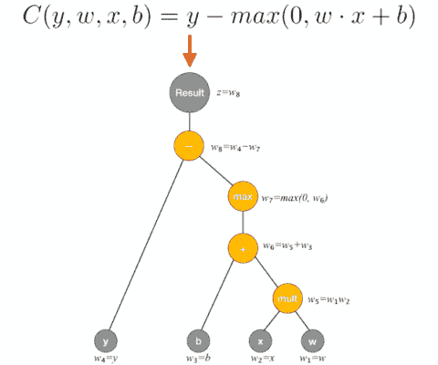

# 使用 tensorflow 和 gradienttype 训练 keras 模型

> 原文：<https://pyimagesearch.com/2020/03/23/using-tensorflow-and-gradienttape-to-train-a-keras-model/>


在本教程中，您将学习如何使用 TensorFlow 的`GradientTape`函数创建自定义训练循环来训练 Keras 模型。

今天的教程受到了 PyImageSearch 读者 Timothy 给我的一个问题的启发:

> 你好，阿德里安，[我刚刚看了你在 Grad-CAM](https://pyimagesearch.com/2020/03/09/grad-cam-visualize-class-activation-maps-with-keras-tensorflow-and-deep-learning/) 上的教程，注意到你在计算梯度时使用了一个名为`GradientTape`的函数。
> 
> 我听说`GradientTape`是 TensorFlow 2.0 中的一个全新功能，它可以用于**自动微分** **模拟**和**编写自定义训练循环**，但我在网上找不到太多这样的例子。
> 
> 你能解释一下如何使用`GradientTape`来定制训练循环吗？

蒂莫西在两方面都是正确的:

1.  `GradientTape`是 TensorFlow 2.0 中的全新功能
2.  它还可以用来编写定制的训练循环(适用于 Keras 模型和在“纯”TensorFlow 中实现的模型)

对 TensorFlow 1.x 低级 API 以及 Keras 高级 API 的最大批评之一是，它使深度学习研究人员编写定制训练循环变得非常具有挑战性，这些循环可以:

*   自定义数据批处理过程
*   处理具有不同空间尺寸的多个输入和/或输出
*   利用定制损失函数
*   访问特定图层的渐变，并以独特的方式更新它们

这并不是说你*不能*用 Keras 和 TensorFlow 1.x 创建定制的训练循环。你*可以；*这是一个棘手的问题，也是一些研究人员最终转向 PyTorch 的原因之一——他们只是不想再头疼了，希望有更好的方法来实施他们的培训程序。

在 TensorFlow 2.0 中，这一切都改变了。

随着 TensorFlow 2.0 版本的发布，我们现在有了`GradientTape`功能，这使得*比以往任何时候都更容易*为 TensorFlow 和 Keras 模型编写定制训练循环，这要归功于**自动微分。**

无论你是深度学习实践者还是经验丰富的研究人员，你都应该学习如何使用`GradientTape`函数——它允许你为 Keras 易用的 API 中实现的模型创建定制的训练循环，让你两全其美。你就是无法打败这种组合。

**要学习如何使用 TensorFlow 的`GradientTape`功能训练 Keras 模型，*继续阅读！***

## 使用 tensorflow 和 gradienttype 训练 keras 模型

在本教程的第一部分，我们将讨论**自动微分**，包括它与经典微分方法的不同，如符号微分和数值微分。

然后，我们将讨论创建自定义训练循环来训练深度神经网络所需的四个组件，最起码是这样。

之后，我们将向您展示如何使用 TensorFlow 的`GradientTape`函数来实现这样一个定制的训练循环。最后，我们将使用我们的自定义训练循环来训练一个 Keras 模型并检查结果。

### GradientTape:什么是自动微分？



**Figure 1:** Using TensorFlow and `GradientTape` to train a Keras model requires conceptual knowledge of automatic differentiation — a set of techniques to automatically compute the derivative of a function by applying the chain rule. ([image source](https://towardsdatascience.com/automatic-differentiation-explained-b4ba8e60c2ad))

**自动微分** **运算**(也叫**计算微分**)是指通过反复应用链式法则，自动计算函数导数的一套技术。

引用[维基百科关于自动微分的优秀文章](https://en.wikipedia.org/wiki/Automatic_differentiation):

> 自动微分利用了这样一个事实，即每个计算机程序，不管有多复杂，都执行一系列的基本算术运算(加、减、乘、除等)。)和初等函数(exp、log、sin、cos 等。).
> 
> 通过将链式法则反复应用于这些运算，可以自动计算任意阶导数，精确到工作精度，并且最多使用一个小的常数因子比原程序多进行算术运算。

与经典的微分算法如**符号微分**(效率低)和**数值微分****(容易出现离散化和舍入误差)不同，**自动微分**快速高效，最棒的是*可以计算关于多个输入*的偏导数(这正是*我们在应用梯度下降来训练我们的模型时所需要的)。***

 ***要了解更多关于自动微分算法的内部工作原理，我建议[回顾一下多伦多大学讲座](https://www.cs.toronto.edu/~rgrosse/courses/csc321_2018/slides/lec10.pdf)的幻灯片，以及[研究一下这个由奇-汪锋](https://towardsdatascience.com/automatic-differentiation-explained-b4ba8e60c2ad)做的例子。

### 具有 TensorFlow、GradientTape 和 Keras 的深度神经网络训练循环的 4 个组件

当使用 Keras 和 TensorFlow 实现自定义训练循环时，您至少需要定义四个组件:

1.  **组件 1:** 模型**架构**
2.  **组件 2:** 计算模型损失时使用的**损失函数**
3.  **组件 3:****优化器**用于更新模型权重
4.  **组件 4:****阶跃函数**，封装了网络的前向和后向通路

这些组件中的每一个都可能简单或复杂，但在为您自己的模型创建自定义训练循环时，您至少需要所有这四个组件。

一旦你定义了它们，`GradientTape`就会处理剩下的事情。

### 项目结构

继续抓取 ***【下载】*** 到今天的博文并解压代码。您将看到以下项目:

```py
$ tree
.
└── gradient_tape_example.py

0 directories, 1 file
```

今天的 zip 只包含一个 Python 文件——我们的`GradientTape`示例脚本。

我们的 Python 脚本将使用`GradientTape`在 MNIST 数据集上训练一个定制的 CNN(如果您的系统上还没有缓存 MNIST，TensorFlow 将下载它)。

接下来让我们跳到`GradientTape`的实现。

### 实施 TensorFlow 和 GradientTape 培训脚本

让我们学习如何使用 TensorFlow 的`GradientTape`函数来实现一个定制的训练循环来训练一个 Keras 模型。

打开项目目录结构中的`gradient_tape_example.py`文件，让我们开始吧:

```py
# import the necessary packages
from tensorflow.keras.models import Sequential
from tensorflow.keras.layers import BatchNormalization
from tensorflow.keras.layers import Conv2D
from tensorflow.keras.layers import MaxPooling2D
from tensorflow.keras.layers import Activation
from tensorflow.keras.layers import Flatten
from tensorflow.keras.layers import Dropout
from tensorflow.keras.layers import Dense
from tensorflow.keras.optimizers import Adam
from tensorflow.keras.losses import categorical_crossentropy
from tensorflow.keras.utils import to_categorical
from tensorflow.keras.datasets import mnist
import tensorflow as tf
import numpy as np
import time
import sys
```

我们从 TensorFlow 2.0 和 NumPy 的导入开始。

如果你仔细检查，你不会看到`GradientTape`；我们可以通过`tf.GradientTape`访问它。在本教程中，我们将使用 MNIST 数据集(`mnist`)作为示例。

让我们继续使用 [TensorFlow/Keras 的顺序 API](https://pyimagesearch.com/2019/10/28/3-ways-to-create-a-keras-model-with-tensorflow-2-0-sequential-functional-and-model-subclassing/) 构建我们的模型:

```py
def build_model(width, height, depth, classes):
	# initialize the input shape and channels dimension to be
	# "channels last" ordering
	inputShape = (height, width, depth)
	chanDim = -1

	# build the model using Keras' Sequential API
	model = Sequential([
		# CONV => RELU => BN => POOL layer set
		Conv2D(16, (3, 3), padding="same", input_shape=inputShape),
		Activation("relu"),
		BatchNormalization(axis=chanDim),
		MaxPooling2D(pool_size=(2, 2)),

		# (CONV => RELU => BN) * 2 => POOL layer set
		Conv2D(32, (3, 3), padding="same"),
		Activation("relu"),
		BatchNormalization(axis=chanDim),
		Conv2D(32, (3, 3), padding="same"),
		Activation("relu"),
		BatchNormalization(axis=chanDim),
		MaxPooling2D(pool_size=(2, 2)),

		# (CONV => RELU => BN) * 3 => POOL layer set
		Conv2D(64, (3, 3), padding="same"),
		Activation("relu"),
		BatchNormalization(axis=chanDim),
		Conv2D(64, (3, 3), padding="same"),
		Activation("relu"),
		BatchNormalization(axis=chanDim),
		Conv2D(64, (3, 3), padding="same"),
		Activation("relu"),
		BatchNormalization(axis=chanDim),
		MaxPooling2D(pool_size=(2, 2)),

		# first (and only) set of FC => RELU layers
		Flatten(),
		Dense(256),
		Activation("relu"),
		BatchNormalization(),
		Dropout(0.5),

		# softmax classifier
		Dense(classes),
		Activation("softmax")
	])

	# return the built model to the calling function
	return model
```

这里我们定义了用于构建模型架构的`build_model`函数(创建定制训练循环的**组件#1** )。该函数接受我们数据的形状参数:

*   `width`和`height`:每个输入图像的空间尺寸
*   `depth`:我们图像的通道数(灰度为 1，如 MNIST 的情况 RGB 彩色图像为 3)
*   `classes`:数据集中唯一类标签的数量

我们的模型是 VGG 式架构的代表(即，受 VGGNet 变体的启发)，因为它包含 *3×3* 卷积和在`POOL`之前堆叠`CONV => RELU => BN`层以减少体积大小。

50%的丢弃(随机断开神经元)被添加到一组`FC => RELU`层，因为它被证明可以提高模型的泛化能力。

一旦我们的`model`被构建，**行 67** 将它返回给调用者。

让我们来研究**组件 2、3 和 4:**

```py
def step(X, y):
	# keep track of our gradients
	with tf.GradientTape() as tape:
		# make a prediction using the model and then calculate the
		# loss
		pred = model(X)
		loss = categorical_crossentropy(y, pred)

	# calculate the gradients using our tape and then update the
	# model weights
	grads = tape.gradient(loss, model.trainable_variables)
	opt.apply_gradients(zip(grads, model.trainable_variables))
```

我们的`step`函数接受训练图像`X`和它们相应的类标签`y`(在我们的例子中，是 MNIST 图像和标签)。

现在让我们**通过以下方式记录我们的梯度**:

*   使用我们的`model` ( **第 74 行**)收集关于我们训练数据的预测
*   计算 **行 75** 上的`loss` ( **组件#2** 创建自定义训练循环)

然后**使用`tape.gradients`并通过传递我们的`loss`和可训练变量(**第 79 行**)来计算我们的梯度**。

我们使用我们的优化器，使用第 80 ( **组件#3** )行**上的梯度来更新模型权重。**

作为一个整体，`step`函数完成了**组件#4** ，使用我们的`GradientTape`封装了我们向前和向后传递的数据，然后更新了我们的模型权重。

定义了我们的`build_model`和`step`函数后，现在我们将准备数据:

```py
# initialize the number of epochs to train for, batch size, and
# initial learning rate
EPOCHS = 25
BS = 64
INIT_LR = 1e-3

# load the MNIST dataset
print("[INFO] loading MNIST dataset...")
((trainX, trainY), (testX, testY)) = mnist.load_data()

# add a channel dimension to every image in the dataset, then scale
# the pixel intensities to the range [0, 1]
trainX = np.expand_dims(trainX, axis=-1)
testX = np.expand_dims(testX, axis=-1)
trainX = trainX.astype("float32") / 255.0
testX = testX.astype("float32") / 255.0

# one-hot encode the labels
trainY = to_categorical(trainY, 10)
testY = to_categorical(testY, 10)
```

**第 84-86 行**初始化我们的训练时期、批量和初始学习率。

然后，我们加载 MNIST 数据(**第 90 行**)，并通过以下方式对其进行预处理:

*   添加单通道尺寸(**行 94 和 95** )
*   将像素强度缩放到范围*【0，1】*(**行 96 和 97** )
*   一键编码我们的标签(**行 100 和 101** )

***注:*** *由于`GradientTape`是一个高级概念，你应该熟悉这些预处理步骤。如果你需要温习这些基础知识，一定要考虑拿一本用 Python 编写的[计算机视觉深度学习。](https://pyimagesearch.com/deep-learning-computer-vision-python-book/)*

有了现成的数据，我们将构建我们的模型:

```py
# build our model and initialize our optimizer
print("[INFO] creating model...")
model = build_model(28, 28, 1, 10)
opt = Adam(lr=INIT_LR, decay=INIT_LR / EPOCHS)
```

在这里，我们利用我们的`build_model`函数构建我们的 CNN 架构，同时传递我们数据的形状。形状由单通道的 *28×28* 像素图像和 MNIST 数字 *0-9* 对应的`10`类组成。

然后我们用一个标准的[学习率衰减时间表](https://pyimagesearch.com/2019/07/22/keras-learning-rate-schedules-and-decay/)初始化我们的`Adam`优化器。

我们现在准备好**用我们的 GradientTape 训练我们的模型:**

```py
# compute the number of batch updates per epoch
numUpdates = int(trainX.shape[0] / BS)

# loop over the number of epochs
for epoch in range(0, EPOCHS):
	# show the current epoch number
	print("[INFO] starting epoch {}/{}...".format(
		epoch + 1, EPOCHS), end="")
	sys.stdout.flush()
	epochStart = time.time()

	# loop over the data in batch size increments
	for i in range(0, numUpdates):
		# determine starting and ending slice indexes for the current
		# batch
		start = i * BS
		end = start + BS

		# take a step
		step(trainX[start:end], trainY[start:end])

	# show timing information for the epoch
	epochEnd = time.time()
	elapsed = (epochEnd - epochStart) / 60.0
	print("took {:.4} minutes".format(elapsed))
```

第 109 行计算我们将在每个时期进行的批量更新的次数。

从那里，我们开始循环从第**行第 112** 开始的训练时期的数量。在内部，我们:

*   打印纪元编号并获取`epochStart`时间戳(**第 114-117 行**)
*   以批量增量循环我们的数据(**第 120 行**)。在内部，我们使用`step`函数来计算向前和向后传递，然后更新模型权重
*   显示训练周期所用的`elapsed`时间(**第 130-132 行**

最后，我们将计算测试集的损失和准确性:

```py
# in order to calculate accuracy using Keras' functions we first need
# to compile the model
model.compile(optimizer=opt, loss=categorical_crossentropy,
	metrics=["acc"])

# now that the model is compiled we can compute the accuracy
(loss, acc) = model.evaluate(testX, testY)
print("[INFO] test accuracy: {:.4f}".format(acc))
```

为了使用 Keras 的`evaluate`辅助函数在我们的测试集上评估`model`的准确性，我们首先需要`compile`我们的模型(**第 136 行和第 137 行**)。

**第 140 和 141 行**，然后`evaluate`，在我们的终端打印出我们模型的精度。

此时，我们已经用 GradientTape 训练和评估了一个模型。在下一节中，我们将让我们的脚本为我们服务。

### 用 TensorFlow 和 GradientTape 训练我们的 Keras 模型

要查看我们的`GradientTape`自定义训练循环，请确保使用本教程的 ***【下载】*** 部分下载源代码。

从那里，打开一个终端并执行以下命令:

```py
$ time python gradient_tape_example.py
[INFO] loading MNIST dataset...
[INFO] creating model...
[INFO] starting epoch 1/25...took 1.039 minutes
[INFO] starting epoch 2/25...took 1.039 minutes
[INFO] starting epoch 3/25...took 1.023 minutes
[INFO] starting epoch 4/25...took 1.031 minutes
[INFO] starting epoch 5/25...took 0.9819 minutes
[INFO] starting epoch 6/25...took 0.9909 minutes
[INFO] starting epoch 7/25...took 1.029 minutes
[INFO] starting epoch 8/25...took 1.035 minutes
[INFO] starting epoch 9/25...took 1.039 minutes
[INFO] starting epoch 10/25...took 1.019 minutes
[INFO] starting epoch 11/25...took 1.029 minutes
[INFO] starting epoch 12/25...took 1.023 minutes
[INFO] starting epoch 13/25...took 1.027 minutes
[INFO] starting epoch 14/25...took 0.9743 minutes
[INFO] starting epoch 15/25...took 0.9678 minutes
[INFO] starting epoch 16/25...took 0.9633 minutes
[INFO] starting epoch 17/25...took 0.964 minutes
[INFO] starting epoch 18/25...took 0.9634 minutes
[INFO] starting epoch 19/25...took 0.9638 minutes
[INFO] starting epoch 20/25...took 0.964 minutes
[INFO] starting epoch 21/25...took 0.9638 minutes
[INFO] starting epoch 22/25...took 0.9636 minutes
[INFO] starting epoch 23/25...took 0.9631 minutes
[INFO] starting epoch 24/25...took 0.9629 minutes
[INFO] starting epoch 25/25...took 0.9633 minutes
10000/10000 [==============================] - 1s 141us/sample - loss: 0.0441 - acc: 0.9927
[INFO] test accuracy: 0.9927

real	24m57.643s
user	72m57.355s
sys		115m42.568s
```

在我们使用我们的`GradientTape`定制训练程序训练它之后，我们的模型在我们的测试集上获得了 **99.27%的准确度**。

正如我在本教程前面提到的，本指南旨在温和地介绍如何使用`GradientTape`进行定制训练循环。

最起码，你需要定义一个训练程序的四个组成部分，包括模型架构、损失函数、优化器和阶跃函数——这些组成部分中的每一个都可能极其简单或极其复杂，但它们中的每一个*都必须*存在。

在未来的教程中，我将涵盖更多关于`GradientTape`的高级用例，但同时，如果你有兴趣了解更多关于`GradientTape`方法的知识，我建议你参考[官方 TensorFlow 文档](https://www.tensorflow.org/api_docs/python/tf/GradientTape)以及[塞巴斯蒂安·蒂勒的这篇优秀文章](https://medium.com/analytics-vidhya/tf-gradienttape-explained-for-keras-users-cc3f06276f22)。

## 摘要

在本教程中，您学习了如何使用 TensorFlow 的`GradientTape`函数，这是 TensorFlow 2.0 中的一种全新方法，用于实现自定义训练循环。

然后，我们使用自定义训练循环来训练 Keras 模型。

**使用`GradientTape`可以让我们两全其美:**

1.  我们可以实施我们自己的定制培训程序
2.  我们仍然可以享受易于使用的 Keras API

本教程涵盖了一个基本的定制训练循环——以后的教程将探索更高级的用例。

**要下载这篇文章的源代码(并在未来教程在 PyImageSearch 上发布时得到通知)，*只需在下面的表格中输入您的电子邮件地址！******