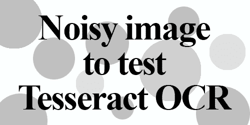
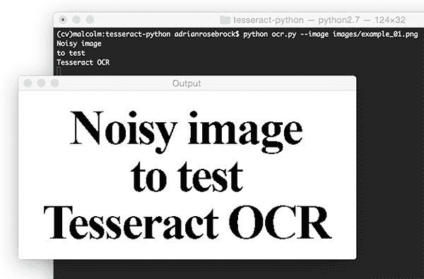
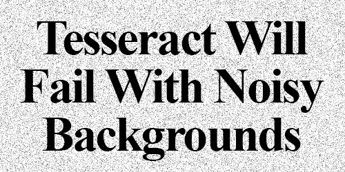
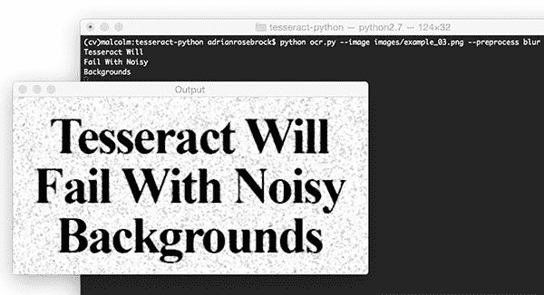
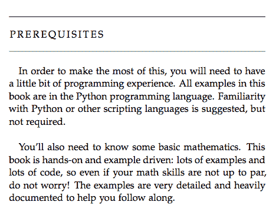

# 通过 Python 使用 Tesseract OCR

> 原文：<https://pyimagesearch.com/2017/07/10/using-tesseract-ocr-python/>

最后更新于 2021 年 7 月 2 日。

在上周的博客文章中，我们学习了[如何安装用于光学字符识别(OCR)的宇宙魔方二进制文件](https://pyimagesearch.com/2017/07/03/installing-tesseract-for-ocr/)。

然后，我们应用 Tesseract 程序来测试和评估 OCR 引擎在一个非常小的示例图像集上的性能。

正如我们的结果所表明的，当前景文本从背景中(非常)清晰地分割出来时，Tesseract 效果最好。在实践中，保证这些类型的分段是极具挑战性的。因此，我们倾向于训练特定领域的图像分类器和检测器。

然而，在我们需要将 OCR 应用到我们自己的项目的情况下，我们理解如何通过 Python 编程语言访问 Tesseract OCR 是很重要的(假设我们可以获得 Tesseract 所需的良好、干净的分段)。

涉及 OCR 的示例项目可能包括[构建一个移动文档扫描仪](https://pyimagesearch.com/2014/09/01/build-kick-ass-mobile-document-scanner-just-5-minutes/)，您希望从中提取文本信息，或者您正在运行一项扫描纸质医疗记录的服务，您希望将信息放入符合 HIPA 标准的数据库中。

在这篇博文的剩余部分，我们将学习如何安装 Tesseract OCR + Python“绑定”,然后编写一个简单的 Python 脚本来调用这些绑定。本教程结束时，您将能够将图像中的文本转换为 Python 字符串数据类型。

**要了解更多关于将 Tesseract 和 Python 与 OCR 一起使用的信息，*请继续阅读。***

*   【2021 年 7 月更新:添加了详细说明宇宙魔方版本如何对 OCR 准确性产生巨大影响的部分。

## 通过 Python 使用 Tesseract OCR

这篇博文分为三个部分。

首先，我们将学习如何安装[pyTesseract 包](https://github.com/madmaze/pytesseract),以便我们可以通过 Python 编程语言访问 tesserac。

接下来，我们将开发一个简单的 Python 脚本来加载图像，将其二进制化，并通过 Tesseract OCR 系统传递。

最后，我们将在一些示例图像上测试我们的 OCR 管道，并查看结果。

要下载这篇博文的源代码+示例图片，请务必使用下面的 ***“下载”*** 部分。

### 安装宇宙魔方+ Python“绑定”

让我们从安装`pytesseract`开始。为了安装`pytesseract`，我们将利用`pip`。

如果您正在使用一个虚拟环境(我强烈建议您这样做，以便您可以分离不同的项目)，使用`workon`命令，后跟适当的虚拟环境名称。在这种情况下，我们的 virtualenv 被命名为`cv`。

```py
$ workon cv

```

接下来让我们安装 [Pillow](https://python-pillow.org/) ，一个对 Python 更友好的 PIL(一个依赖项)端口，后面是`pytesseract`。

```py
$ pip install pillow
$ pip install pytesseract

```

***注意** : `pytesseract`不提供真正的 Python 绑定。相反，它只是提供了一个到`tesseract`二进制文件的接口。如果你在 GitHub 上看一下这个项目，你会看到这个库正在将图像写到磁盘上的一个临时文件中，然后调用文件上的`tesseract`二进制文件并捕获结果输出。这确实有点粗糙，但它为我们完成了工作。*

让我们通过查看一些将前景文本从背景中分割出来的代码，然后利用我们新安装的`pytesseract`来继续。

### 将 OCR 与 Tesseract 和 Python 结合使用

让我们首先创建一个名为`ocr.py`的新文件:

```py
# import the necessary packages
from PIL import Image
import pytesseract
import argparse
import cv2
import os

# construct the argument parse and parse the arguments
ap = argparse.ArgumentParser()
ap.add_argument("-i", "--image", required=True,
	help="path to input image to be OCR'd")
ap.add_argument("-p", "--preprocess", type=str, default="thresh",
	help="type of preprocessing to be done")
args = vars(ap.parse_args())

```

**2-6 号线**办理我们的进口业务。需要使用`Image`类，这样我们就可以以 PIL 格式从磁盘加载输入图像，这是使用`pytesseract`时的一个要求。

我们的命令行参数在第 9-14 行中解析。我们有两个命令行参数:

*   我们通过 OCR 系统发送的图像的路径。
*   `--preprocess`:预处理方法。对于本教程，该开关是可选的，可以接受两个值:`thresh`(阈值)或`blur`。

接下来，我们将加载图像，将其二进制化，并将其写入磁盘。

```py
# load the example image and convert it to grayscale
image = cv2.imread(args["image"])
gray = cv2.cvtColor(image, cv2.COLOR_BGR2GRAY)

# check to see if we should apply thresholding to preprocess the
# image
if args["preprocess"] == "thresh":
	gray = cv2.threshold(gray, 0, 255,
		cv2.THRESH_BINARY | cv2.THRESH_OTSU)[1]

# make a check to see if median blurring should be done to remove
# noise
elif args["preprocess"] == "blur":
	gray = cv2.medianBlur(gray, 3)

# write the grayscale image to disk as a temporary file so we can
# apply OCR to it
filename = "{}.png".format(os.getpid())
cv2.imwrite(filename, gray)

```

首先，我们将`--image`从磁盘载入内存(**第 17 行**)，然后将其转换为灰度(**第 18 行**)。

接下来，根据我们的命令行参数指定的预处理方法，我们将对图像进行阈值处理或模糊处理。这是您想要添加更多高级预处理方法的地方(取决于 OCR 的具体应用),这超出了本文的范围。

第 22-24 行上的`if`语句和主体执行一个阈值，以便将前景从背景中分割出来。我们同时使用了`cv2.THRESH_BINARY`和`cv2.THRESH_OTSU`标志。关于 Otsu 方法的详细信息，请参见[官方 OpenCV 文档](http://docs.opencv.org/trunk/d7/d4d/tutorial_py_thresholding.html)中的*“Otsu 的二值化”*。

我们将在后面的结果部分中看到，这种阈值方法对于读取覆盖在灰色形状上的深色文本很有用。

或者，可以应用模糊方法。**当`--preprocess`标志设置为`blur`时，第 28-29 行**执行中值模糊。应用中值模糊有助于减少椒盐噪声，再次使 Tesseract 更容易正确地对图像进行 OCR。

在对图像进行预处理之后，我们使用`os.getpid`来根据我们的 Python 脚本的进程 ID(**第 33 行**)导出一个临时图像`filename`。

使用`pytesseract`进行 OCR 之前的最后一步是将预处理后的图像`gray`写入磁盘，用上面的`filename`保存(**第 34 行**)。

我们最终可以使用 Tesseract Python“绑定”将 OCR 应用于我们的图像:

```py
# load the image as a PIL/Pillow image, apply OCR, and then delete
# the temporary file
text = pytesseract.image_to_string(Image.open(filename))
os.remove(filename)
print(text)

# show the output images
cv2.imshow("Image", image)
cv2.imshow("Output", gray)
cv2.waitKey(0)

```

使用**第 38 行**上的`pytesseract.image_to_string`，我们将图像的内容转换成我们想要的字符串`text`。请注意，我们传递了对驻留在磁盘上的临时映像文件的引用。

接下来是在第 39 行**的一些清理，我们删除了临时文件。**

第 40 行是我们将文本打印到终端的地方。在您自己的应用程序中，您可能希望在这里进行一些额外的处理，如 OCR 错误的拼写检查或自然语言处理，而不是像我们在本教程中所做的那样简单地将其打印到控制台。

最后，**行 43 和 44** 处理在单独的窗口中在屏幕上显示原始图像和预处理图像。第 34 行**上的`cv2.waitKey(0)`表示我们应该等到键盘上的一个键被按下后才退出脚本。**

让我们看看我们的手工作品。

### Tesseract OCR 和 Python 结果

现在已经创建了`ocr.py`,是时候应用 Python + Tesseract 对一些示例输入图像执行 OCR 了。

在本节中，我们将尝试使用以下过程对三个样本图像进行 OCR:

*   首先，我们将按原样运行每个图像。
*   然后我们将通过`ocr.py`运行每个图像(它在通过 Tesseract 发送之前执行预处理)。
*   最后，我们将比较这两种方法的结果，并记录任何错误。

我们的第一个例子是一个“嘈杂”的图像。该图像包含我们期望的前景黑色文本，背景部分是白色，部分散布着人工生成的圆形斑点。斑点充当我们简单算法的“干扰物”。



**Figure 1:** Our first example input for Optical Character Recognition using Python.

使用宇宙魔方二进制码，[正如我们上周学过的](https://pyimagesearch.com/2017/07/03/installing-tesseract-for-ocr/)，我们可以对原始的、未加工的图像应用 OCR:

```py
$ tesseract images/example_01.png stdout
Noisy image
to test
Tesseract OCR

```

在这种情况下，Tesseract 表现良好，没有错误。

现在让我们确认一下我们新制作的脚本`ocr.py`，也可以工作:

```py
$ python ocr.py --image images/example_01.png
Noisy image
to test
Tesseract OCR

```



**Figure 2:** Applying image preprocessing for OCR with Python.

从这张截图中可以看到，经过阈值处理的图像非常清晰，背景已经被移除。我们的脚本正确地将图像内容打印到控制台。

接下来，让我们在背景中带有“盐和胡椒”噪声的图像上测试 Tesseract 和我们的预处理脚本:



**Figure 3:** An example input image containing noise. This image will “confuse” our OCR algorithm, leading to incorrect OCR results.

我们可以看到下面的`tesseract`二进制输出:

```py
$ tesseract images/example_02.png stdout
Detected 32 diacritics
" Tesséra‘c't Will
Fail With Noisy
Backgrounds

```

不幸的是，Tesseract 没有成功地对图像中的文本进行 OCR。

然而，通过使用`ocr.py`中的`blur`预处理方法，我们可以获得更好的结果:

```py
$ python ocr.py --image images/example_02.png --preprocess blur
Tesseract Will
Fail With Noisy
Backgrounds

```



**Figure 4:** Applying image preprocessing with Python and OpenCV to improve OCR results.

成功！我们的模糊预处理步骤使 Tesseract 能够正确地进行 OCR 并输出我们想要的文本。

最后，让我们尝试另一个图像，这个有更多的文字:



**Figure 5:** Another example input to our Tesseract + Python OCR system.

上图是我的书*【先决条件】**[实用 Python 和 OpenCV](https://pyimagesearch.com/practical-python-opencv/)* 中的截图——我们来看看宇宙魔方二进制是如何处理这张图的:

```py
$ tesseract images/example_03.png stdout
PREREQUISITES

In order In make the rnosi of this, you will need (a have
a little bit of pregrarrmung experience. All examples in this
book are in the Python programming language. Familiarity
with Pyihon or other scriphng languages is suggesied, but
mm required.

You'll also need (a know some basic mathematics. This
book is handson and example driven: leis of examples and
lots of code, so even if your math skills are noi up to par.
do noi worry! The examples are very damned and heavily
documented (a help yuu follaw along.

```

接着用`ocr.py`测试图像:

```py
$ python ocr.py --image images/example_03.png
PREREQUISITES

Lu order to make the most ol this, you will need to have
a little bit ol programming experience. All examples in this
book are in the Python programming language. Familiarity
with Python or other scripting languages is suggested, but
not requixed.

You’ll also need to know some basic mathematics. This
book is handson and example driven: lots of examples and
lots ol code, so even ii your math skills are not up to par,
do not worry! The examples are very detailed and heavily
documented to help you tollow along.

```

注意两个输出中的拼写错误，包括但不限于“中的“*”、“*、*、【必需】、*、*、【编程】、*、*、【跟随】、*。

这两者的输出不匹配；然而，有趣的是，预处理版本只有 8 个单词错误，而非预处理图像有 17 个单词错误**(两倍多的错误)**。*我们的预处理甚至在干净的背景上也有帮助！*

Python + Tesseract 在这里做了合理的工作，但是我们再一次展示了库作为现成分类器的局限性。

对于 OCR，我们可能会获得*好的或可接受的*结果，但是*最佳准确度*将来自于在真实世界图像中出现的*特定*字体集上训练自定义字符分类器。

不要让 Tesseract OCR 的结果让你气馁——简单地管理你的期望，并对 Tesseract 的性能持现实态度。没有一个真正的“现成的”OCR 系统会给你完美的结果(肯定会有一些错误)。

***注意:**如果你的文本被旋转，你可能希望做额外的预处理，就像[这篇关于纠正文本倾斜的博文](https://pyimagesearch.com/2017/02/20/text-skew-correction-opencv-python/)中所做的那样。否则，如果您对构建一个[移动文档扫描仪](https://pyimagesearch.com/2014/09/01/build-kick-ass-mobile-document-scanner-just-5-minutes/)感兴趣，您现在已经有一个相当好的 OCR 系统可以集成到其中。*

### **提示:通过升级您的宇宙魔方版本** 来提高 OCR 准确度

确保使用`tesseract -v`命令:检查你机器上安装的宇宙魔方版本

```py
$ tesseract -v
tesseract 4.1.1
```

如果您在输出中看到 Tesseract v4 或更高版本，那么恭喜您，您使用的是长短期记忆(LSTM) OCR 模型，它的 *比之前版本的 Tesseract 更加精确* ！

如果您看到任何版本比 v4 少，那么您应该升级您的宇宙魔方安装——使用宇宙魔方 v4 LSTM 引擎将导致更准确的 OCR 结果。

## 摘要

在今天的博文中，我们学习了如何使用 Python 编程语言应用 Tesseract OCR 引擎。这使我们能够在 Python 脚本的中应用来自*的 OCR 算法。*

最大的缺点是宇宙魔方本身的局限性。当前景文本从背景中出现极其清晰的**分割时，镶嵌效果最佳。**

 **此外，这些分割需要尽可能高的分辨率(DPI)*和*输入图像中的字符在分割后不能出现“像素化”。如果字符确实出现像素化，那么 Tesseract 将很难正确识别文本——我们甚至在应用理想条件下捕获的图像时也发现了这一点(PDF 截图)。

OCR 虽然不再是一项新技术，但在计算机视觉文献中仍然是一个活跃的研究领域*尤其是在将 OCR 应用于现实世界中不受约束的图像时。深度学习和卷积神经网络(CNN)当然能够让我们获得更高的准确性，但我们距离看到“近乎完美”的 OCR 系统还有很长的路要走。此外，由于 OCR 在许多领域都有许多应用，因此一些用于 OCR 的最佳算法是商业化的，需要获得许可才能在您自己的项目中使用。*

我给读者的主要建议是，在将 OCR 应用于他们自己的项目时，首先尝试 Tesseract，如果结果不理想，就继续使用 Google Vision API。

*如果**宇宙魔方**和**谷歌视觉 API** 都没有获得合理的准确性*，你可能想要重新评估你的数据集，并决定是否值得训练你自己的自定义字符分类器——如果你的数据集有噪音和/或包含你希望检测和识别的非常特定的字体，这*尤其是*正确。特定字体的示例包括信用卡上的数字、支票底部的帐户和银行编号，或者图形设计中使用的风格化文本。

我希望你喜欢这一系列关于使用 Python 和 OpenCV 进行光学字符识别(OCR)的博文！

如果 PyImageSearch 上有新的博客文章发布，请务必在下面的表格中输入您的电子邮件地址！**