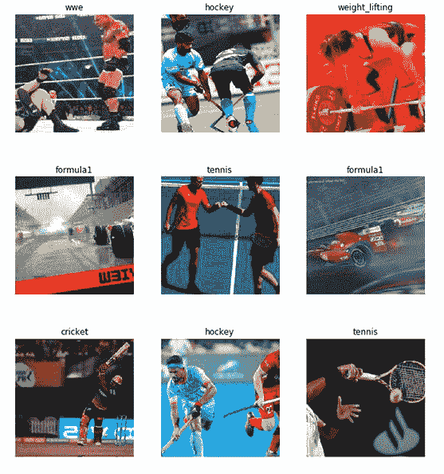

# 基于 Keras 和深度学习的视频分类

> 原文：<https://pyimagesearch.com/2019/07/15/video-classification-with-keras-and-deep-learning/>

在本教程中，您将学习如何使用 Keras、Python 和深度学习来执行**视频分类。**

具体来说，您将学习:

*   视频分类和标准图像分类的区别
*   如何使用 Keras 训练用于图像分类的卷积神经网络
*   如何获取 CNN 然后**用它进行视频分类**
*   如何**使用滚动预测平均来减少结果中的“闪烁”**

本教程将介绍在时间性质上使用深度学习的概念，为我们讨论长短期记忆网络(LSTMs)以及最终的人类活动识别铺平道路。

**要学习如何使用 Keras 和深度学习进行视频分类，*继续阅读！***

## 基于 Keras 和深度学习的视频分类

***2020-06-12 更新:**此博文现已兼容 TensorFlow 2+!*

视频可以理解为一系列单独的图像；因此，许多深度学习实践者会很快将视频分类视为执行总共 *N* 次图像分类，其中 *N* 是视频中的总帧数。

然而，这种方法有一个问题。

视频分类*比简单的图像分类更*—**对于视频，我们通常可以假设视频中的后续帧相对于它们的*语义内容*相关*。***

如果我们能够利用视频的时间特性，我们可以改善我们实际的视频分类结果。

长短期记忆(LSTMs)和递归神经网络(RNNs)等神经网络架构适用于时间序列数据，这是我们将在后面的教程中讨论的两个主题，但在某些情况下，它们可能有些过头了。正如你可以想象的那样，当训练成千上万的视频文件时，他们也是资源饥渴和耗时的。

相反，在一些应用中，你需要的只是预测的滚动平均*。*

 *在本教程的剩余部分，你将学习如何为*图像分类*(特别是体育分类)训练一个 CNN，然后通过使用滚动平均将它变成一个更准确的*视频分类器*。

### 视频分类和图像分类有什么不同？

**在执行图像分类时，我们:**

1.  给我们的 CNN 输入一张图片
2.  从 CNN 获得预测
3.  选择对应概率最大的标签

**由于视频只是一系列帧，一种简单的视频分类方法是:**

1.  循环播放视频文件中的所有帧
2.  对于每个帧，将该帧通过 CNN
3.  将每一帧*单独分类*和*相互独立*
4.  选择对应概率最大的标签
5.  标记帧并将输出帧写入磁盘

然而，这种方法有一个问题——如果你曾经试图将简单的图像分类应用于视频分类，你可能会遇到一种**“预测闪烁”**，如本节顶部的视频所示。请注意，在这个可视化中，我们看到 CNN 在两个预测之间切换:*【足球】*和正确的标签*【举重】*。

这个视频显然是关于举重的，我们希望我们的整个视频都被贴上举重的标签——但是我们如何防止 CNN 在这两个标签之间“闪烁”?

一个简单而优雅的解决方案是利用滚动预测平均值。

我们的算法现在变成了:

1.  循环播放视频文件中的所有帧
2.  对于每个帧，将该帧通过 CNN
3.  从 CNN 获得预测
4.  维护最近的 K 个预测的列表
5.  计算最后 *K* 个预测的平均值，并选择具有最大相应概率的标签
6.  标记帧并将输出帧写入磁盘

这个算法的结果可以在这篇文章顶部的视频中看到——注意预测闪烁是如何消失的，整个视频剪辑都被正确标记了！

在本教程的剩余部分，您将学习如何使用 Keras 实现这种视频分类算法。

### 运动分类数据集

[](https://pyimagesearch.com/wp-content/uploads/2019/07/keras_video_classification_sports_dataset.jpg)

**Figure 1:** A sports dataset curated by [GitHub user “anubhavmaity”](https://github.com/anubhavmaity) using [Google Image Search](https://pyimagesearch.com/2017/12/04/how-to-create-a-deep-learning-dataset-using-google-images/). We will use this image dataset for video classification with Keras. ([image source](https://github.com/anubhavmaity/Sports-Type-Classifier/blob/master/readme_images/sports.png))

我们今天将在这里使用的数据集用于运动/活动分类。这个数据集是由阿努巴夫·梅蒂通过从[谷歌图片](https://pyimagesearch.com/2017/12/04/how-to-create-a-deep-learning-dataset-using-google-images/) ( [你也可以使用必应](https://pyimagesearch.com/2018/04/09/how-to-quickly-build-a-deep-learning-image-dataset/))下载照片整理出来的，分为以下几类:

* * *

为了节省时间和计算资源，并演示实际的视频分类算法(本教程的实际要点)，我们将在体育类型数据集的子集上进行训练:

*   **足球(即英式足球):** 799 张图片
*   **网球:** 718 图片
*   **举重:** 577 图片

让我们开始下载我们的数据集吧！

### 下载运动分类数据集

继续从 ***“下载”*** 链接下载今天这篇博文的源代码。

提取。压缩并从您的终端导航到项目文件夹:

```py
$ unzip keras-video-classification.zip
$ cd keras-video-classification

```

我已经决定**在`Sports-Type-Classifier/data/`目录中用今天的 ***【下载】*** 包含数据集**的子集，因为 [Anubhav Maity 的](https://github.com/anubhavmaity)原始数据集在 GitHub 上不再可用(一个几乎相同的体育数据集在这里[可用](https://github.com/jurjsorinliviu/Sports-Type-Classifier))。

我们今天将使用的数据位于以下路径:

```py
$ cd keras-video-classification
$ ls Sports-Type-Classifier/data | grep -Ev "urls|models|csv|pkl"
football
tennis
weight_lifting

```

### 配置您的开发环境

要针对本教程配置您的系统，我建议您遵循以下任一教程:

*   *[如何在 Ubuntu 上安装 tensor flow 2.0](https://pyimagesearch.com/2019/12/09/how-to-install-tensorflow-2-0-on-ubuntu/)*
*   *[如何在 macOS 上安装 tensor flow 2.0](https://pyimagesearch.com/2019/12/09/how-to-install-tensorflow-2-0-on-macos/)*

这两个教程都将帮助您在一个方便的 Python 虚拟环境中，用这篇博文所需的所有软件来配置您的系统。

请注意 [PyImageSearch 不推荐也不支持 CV/DL 项目](https://pyimagesearch.com/faqs/single-faq/can-you-help-me-do-___-on-windows/)的窗口。

### 项目结构

现在我们已经有了项目文件夹和 [Anubhav Maity](https://github.com/anubhavmaity) 的回购，让我们回顾一下我们的项目结构:

```py
$ tree --dirsfirst --filelimit 50
.
├── Sports-Type-Classifier
│   ├── data
│   │   ├── football [799 entries]
│   │   ├── tennis [718 entries]
│   │   └── weight_lifting [577 entries]
├── example_clips
│   ├── lifting.mp4
│   ├── soccer.mp4
│   └── tennis.mp4
├── model
│   ├── activity.model
│   └── lb.pickle
├── output
├── plot.png
├── predict_video.py
└── train.py

8 directories, 8 files

```

我们的训练图像数据在`Sports-Type-Classifier/data/`目录下，按类组织。

我从 YouTube 上提取了三个`example_clips/`来测试我们的模型。三个剪辑的演职员表位于*“Keras 视频分类结果”*部分的底部。

我们的分类器文件在`model/`目录中。包括`activity.model`(训练好的 Keras 模型)和`lb.pickle`(我们的标签二值化器)。

一个空的`output/`文件夹是我们存储视频分类结果的地方。

在今天的教程中，我们将讨论两个 Python 脚本:

*   `train.py`:一个 Keras 训练脚本，抓取我们关心的数据集类图像，加载 **ResNet50** CNN，应用[ImageNet 权重的转移学习/微调](https://pyimagesearch.com/2019/06/03/fine-tuning-with-keras-and-deep-learning/)来训练我们的模型。训练脚本生成/输出三个文件:
    *   `model/activity.model`:基于 ResNet50 的用于识别运动的微调分类器。
    *   `model/lb.pickle`:一个序列化的标签二进制化器，包含我们唯一的类标签。
    *   `plot.png`:准确度/损失训练历史图。
*   `predict_video.py`:从`example_clips/`加载一个输入视频，并使用当今的滚动平均法对视频进行分类。

### 实施我们的 Keras 培训脚本

让我们继续执行用于训练 Keras CNN 识别每项体育活动的训练脚本。

打开`train.py`文件并插入以下代码:

```py
# set the matplotlib backend so figures can be saved in the background
import matplotlib
matplotlib.use("Agg")

# import the necessary packages
from tensorflow.keras.preprocessing.image import ImageDataGenerator
from tensorflow.keras.layers import AveragePooling2D
from tensorflow.keras.applications import ResNet50
from tensorflow.keras.layers import Dropout
from tensorflow.keras.layers import Flatten
from tensorflow.keras.layers import Dense
from tensorflow.keras.layers import Input
from tensorflow.keras.models import Model
from tensorflow.keras.optimizers import SGD
from sklearn.preprocessing import LabelBinarizer
from sklearn.model_selection import train_test_split
from sklearn.metrics import classification_report
from imutils import paths
import matplotlib.pyplot as plt
import numpy as np
import argparse
import pickle
import cv2
import os

```

在**第 2-24 行**，我们导入必要的包来训练我们的分类器:

*   `matplotlib`:用于绘图。**第 3 行**设置后端，这样我们可以将我们的训练图输出到一个. png 图像文件。
*   `tensorflow.keras`:用于深度学习。也就是说，我们将使用`ResNet50` CNN。我们还将和`ImageDataGenerator`一起工作，你可以在上周的[教程](https://pyimagesearch.com/2019/07/08/keras-imagedatagenerator-and-data-augmentation/)中读到。
*   从 scikit-learn 中，我们将使用他们实现的一个`LabelBinarizer`对我们的类标签进行一次性编码。`train_test_split`函数将把我们的数据集分割成训练和测试两部分。我们还将以传统格式打印一个`classification_report`。
*   `paths`:包含列出给定路径下所有图像文件的便捷函数。从那里我们可以将我们的图像加载到内存中。
*   `numpy` : Python 的*事实上的*数值加工库。
*   `argparse`:解析[命令行参数](https://pyimagesearch.com/2018/03/12/python-argparse-command-line-arguments/)。
*   `pickle`:用于将我们的标签二进制化器序列化到磁盘。
*   `cv2` : OpenCV。
*   操作系统模块将被用来确保我们获得正确的文件/路径分隔符，这是依赖于操作系统的。

现在让我们继续[解析我们的命令行参数](https://pyimagesearch.com/2018/03/12/python-argparse-command-line-arguments/):

```py
# construct the argument parser and parse the arguments
ap = argparse.ArgumentParser()
ap.add_argument("-d", "--dataset", required=True,
	help="path to input dataset")
ap.add_argument("-m", "--model", required=True,
	help="path to output serialized model")
ap.add_argument("-l", "--label-bin", required=True,
	help="path to output label binarizer")
ap.add_argument("-e", "--epochs", type=int, default=25,
	help="# of epochs to train our network for")
ap.add_argument("-p", "--plot", type=str, default="plot.png",
	help="path to output loss/accuracy plot")
args = vars(ap.parse_args())

```

我们的脚本接受五个命令行参数，其中前三个是必需的:

*   `--dataset`:输入数据集的路径。
*   我们输出的 Keras 模型文件的路径。
*   `--label-bin`:我们输出标签二进制化器 pickle 文件的路径。
*   `--epochs`:训练我们的网络多少个纪元——默认情况下，我们将训练`25`个纪元，但正如我将在本教程稍后展示的那样，`50`个纪元可以带来更好的结果。
*   `--plot`:我们的输出绘图图像文件的路径——默认情况下，它将被命名为`plot.png`,并放置在与该训练脚本相同的目录中。

有了解析的命令行参数，让我们继续初始化我们的`LABELS`并加载我们的`data`:

```py
# initialize the set of labels from the spots activity dataset we are
# going to train our network on
LABELS = set(["weight_lifting", "tennis", "football"])

# grab the list of images in our dataset directory, then initialize
# the list of data (i.e., images) and class images
print("[INFO] loading images...")
imagePaths = list(paths.list_images(args["dataset"]))
data = []
labels = []

# loop over the image paths
for imagePath in imagePaths:
	# extract the class label from the filename
	label = imagePath.split(os.path.sep)[-2]

	# if the label of the current image is not part of of the labels
	# are interested in, then ignore the image
	if label not in LABELS:
		continue

	# load the image, convert it to RGB channel ordering, and resize
	# it to be a fixed 224x224 pixels, ignoring aspect ratio
	image = cv2.imread(imagePath)
	image = cv2.cvtColor(image, cv2.COLOR_BGR2RGB)
	image = cv2.resize(image, (224, 224))

	# update the data and labels lists, respectively
	data.append(image)
	labels.append(label)

```

**第 42 行**包含类`LABELS`的集合，我们的数据集将由它组成。不在这个集合中的所有标签*将被*排除*成为我们数据集的一部分。为了节省训练时间，我们的数据集将只包含*举重、*和*足球/英式足球*。通过对`LABELS`集合进行修改，您可以随意使用其他类。*

所有数据集`imagePaths`都是通过**线 47** 和`args["dataset"]`中包含的值(来自我们的[命令行参数](https://pyimagesearch.com/2018/03/12/python-argparse-command-line-arguments/))收集的。

**第 48 和 49 行**初始化我们的`data`和`labels`列表。

从那里，我们将开始循环第 52 条线上的所有`imagePaths`。

在循环中，首先我们从`imagePath` ( **第 54 行**)中提取类`label`。**第 58 行和第 59 行**然后忽略任何不在`LABELS`集合中的`label`。

**第 63-65 行**加载并预处理一个`image`。预处理包括交换颜色通道以兼容 OpenCV 和 Keras，以及调整大小为 224×224 T4 像素。点击阅读更多关于[为 CNN 调整图像大小的信息。要了解更多关于预处理的重要性，请务必参考](https://pyimagesearch.com/2019/06/24/change-input-shape-dimensions-for-fine-tuning-with-keras/) [***使用 Python 进行计算机视觉的深度学习***](https://pyimagesearch.com/deep-learning-computer-vision-python-book/) 。

然后将`image`和`label`添加到`data`和`labels`列表中，分别在**行 68 和 69** 上。

接下来，我们将对我们的`labels`进行一次性编码，并对我们的`data`进行分区:

```py
# convert the data and labels to NumPy arrays
data = np.array(data)
labels = np.array(labels)

# perform one-hot encoding on the labels
lb = LabelBinarizer()
labels = lb.fit_transform(labels)

# partition the data into training and testing splits using 75% of
# the data for training and the remaining 25% for testing
(trainX, testX, trainY, testY) = train_test_split(data, labels,
	test_size=0.25, stratify=labels, random_state=42)

```

**第 72 行和第 73 行**将我们的`data`和`labels`列表转换成 NumPy 数组。

`labels`的一次加热编码发生在**行 76 和 77** 上。一键编码是一种通过二进制数组元素标记活动类标签的方法。例如，“足球”可能是`array([1, 0, 0])`，而“举重”可能是`array([0, 0, 1])`。请注意，在任何给定时间，只有一个类是“热门”的。

**第 81 行和第 82 行**然后将我们的`data`分割成训练和测试部分，使用 75%的数据进行训练，剩下的 25%用于测试。

让我们初始化我们的[数据扩充](https://pyimagesearch.com/2019/07/08/keras-imagedatagenerator-and-data-augmentation/)对象:

```py
# initialize the training data augmentation object
trainAug = ImageDataGenerator(
	rotation_range=30,
	zoom_range=0.15,
	width_shift_range=0.2,
	height_shift_range=0.2,
	shear_range=0.15,
	horizontal_flip=True,
	fill_mode="nearest")

# initialize the validation/testing data augmentation object (which
# we'll be adding mean subtraction to)
valAug = ImageDataGenerator()

# define the ImageNet mean subtraction (in RGB order) and set the
# the mean subtraction value for each of the data augmentation
# objects
mean = np.array([123.68, 116.779, 103.939], dtype="float32")
trainAug.mean = mean
valAug.mean = mean

```

第 85-96 行初始化两个数据扩充对象——一个用于训练，一个用于验证。在计算机视觉的深度学习中，几乎总是建议使用数据增强来提高模型的泛化能力。

`trainAug`对象对我们的数据进行随机旋转、缩放、移动、剪切和翻转。你可以在这里[阅读更多关于`ImageDataGenerator`和`fit`的内容。正如我们上周所强调的，请记住，使用 Keras 的](https://pyimagesearch.com/2018/12/24/how-to-use-keras-fit-and-fit_generator-a-hands-on-tutorial/)[，图像将动态生成](https://pyimagesearch.com/2019/07/08/keras-imagedatagenerator-and-data-augmentation/)(它不是加法运算)。

对验证数据(`valAug`)不进行增强，但我们将进行均值减法。

在**线 101** 上设置`mean`像素值。从那里，**行 102 和 103** 为`trainAug`和`valAug`设置`mean`属性，以便在训练/评估期间生成图像时进行均值相减。

现在我们将执行我称之为“网络手术”的操作，作为[微调](https://pyimagesearch.com/2019/06/03/fine-tuning-with-keras-and-deep-learning/)的一部分:

```py
# load the ResNet-50 network, ensuring the head FC layer sets are left
# off
baseModel = ResNet50(weights="imagenet", include_top=False,
	input_tensor=Input(shape=(224, 224, 3)))

# construct the head of the model that will be placed on top of the
# the base model
headModel = baseModel.output
headModel = AveragePooling2D(pool_size=(7, 7))(headModel)
headModel = Flatten(name="flatten")(headModel)
headModel = Dense(512, activation="relu")(headModel)
headModel = Dropout(0.5)(headModel)
headModel = Dense(len(lb.classes_), activation="softmax")(headModel)

# place the head FC model on top of the base model (this will become
# the actual model we will train)
model = Model(inputs=baseModel.input, outputs=headModel)

# loop over all layers in the base model and freeze them so they will
# *not* be updated during the training process
for layer in baseModel.layers:
	layer.trainable = False

```

**第 107 和 108 行**装载用 ImageNet 重量预先训练的`ResNet50`，同时切断网络的头部。

从那里，**线 112-121** 组装一个新的`headModel`并将其缝合到`baseModel`上。

我们现在将冻结`baseModel`，以便通过反向传播(**行 125 和 126** )来训练 ***而不是*** 。

让我们继续编译+训练我们的`model`:

```py
# compile our model (this needs to be done after our setting our
# layers to being non-trainable)
print("[INFO] compiling model...")
opt = SGD(lr=1e-4, momentum=0.9, decay=1e-4 / args["epochs"])
model.compile(loss="categorical_crossentropy", optimizer=opt,
	metrics=["accuracy"])

# train the head of the network for a few epochs (all other layers
# are frozen) -- this will allow the new FC layers to start to become
# initialized with actual "learned" values versus pure random
print("[INFO] training head...")
H = model.fit(
	x=trainAug.flow(trainX, trainY, batch_size=32),
	steps_per_epoch=len(trainX) // 32,
	validation_data=valAug.flow(testX, testY),
	validation_steps=len(testX) // 32,
	epochs=args["epochs"])

```

***2020-06-12 更新:*** *以前，TensorFlow/Keras 需要使用一种叫做`.fit_generator`的方法来完成数据扩充。现在，`.fit`方法也可以处理数据扩充，使代码更加一致。这也适用于从`.predict_generator`到`.predict`的迁移。请务必查看我关于 [fit 和 fit_generator](https://pyimagesearch.com/2018/12/24/how-to-use-keras-fit-and-fit_generator-a-hands-on-tutorial/) 以及[数据扩充](https://pyimagesearch.com/2019/07/08/keras-imagedatagenerator-and-data-augmentation/)的文章。*

**第 131-133 行** `compile`我们的`model`用随机梯度下降(`SGD`)优化器，初始学习速率为`1e-4`，学习速率衰减。我们使用`"categorical_crossentropy"`损失进行多类训练。如果您只处理两个类，请确保使用`"binary_crossentropy"` loss。

对我们的`model` ( **第 139-144 行**)上的`fit_generator`函数的调用用数据扩充和均值减法训练我们的网络。

请记住，我们的`baseModel`是冻结的，我们只是在训练头部。这就是所谓的“微调”。要快速了解微调，请务必阅读我的前一篇文章。为了更深入地进行微调，请使用 Python 选择*从业者捆绑 [***用于计算机视觉的***副本。](https://pyimagesearch.com/deep-learning-computer-vision-python-book/)*

我们将从评估我们的网络和绘制培训历史开始总结:

```py
# evaluate the network
print("[INFO] evaluating network...")
predictions = model.predict(x=testX.astype("float32"), batch_size=32)
print(classification_report(testY.argmax(axis=1),
	predictions.argmax(axis=1), target_names=lb.classes_))

# plot the training loss and accuracy
N = args["epochs"]
plt.style.use("ggplot")
plt.figure()
plt.plot(np.arange(0, N), H.history["loss"], label="train_loss")
plt.plot(np.arange(0, N), H.history["val_loss"], label="val_loss")
plt.plot(np.arange(0, N), H.history["accuracy"], label="train_acc")
plt.plot(np.arange(0, N), H.history["val_accuracy"], label="val_acc")
plt.title("Training Loss and Accuracy on Dataset")
plt.xlabel("Epoch #")
plt.ylabel("Loss/Accuracy")
plt.legend(loc="lower left")
plt.savefig(args["plot"])

```

***2020-06-12 更新:*** *为了使这个绘图片段与 TensorFlow 2+兼容，更新了`H.history`字典键，以完全拼出“acc”而没有“ACC”(即`H.history["val_accuracy"]`和`H.history["accuracy"]`)。“val”没有拼成“validation”，这有点令人困惑；我们必须学会热爱 API 并与之共存，并永远记住这是一项正在进行的工作，世界各地的许多开发人员都为此做出了贡献。*

在我们在测试集上评估我们的网络并打印出`classification_report` ( **第 148-150 行**)之后，我们继续用 matplotlib ( **第 153-163 行**)绘制我们的精度/损耗曲线。该图通过**线 164** 保存到磁盘。

总结将序列化我们的`model`和标签二进制化器(`lb`)到磁盘:

```py
# serialize the model to disk
print("[INFO] serializing network...")
model.save(args["model"], save_format="h5")

# serialize the label binarizer to disk
f = open(args["label_bin"], "wb")
f.write(pickle.dumps(lb))
f.close()

```

***2020-06-12 更新:**注意，对于 TensorFlow 2.0+我们建议明确设置`save_format="h5"` (HDF5 格式)。*

**168 线**拯救我们微调过的 Keras `model`。

最后，**第 171-173 行**以 Python 的 pickle 格式序列化并存储我们的标签二进制化器。

### 培训结果

在我们能够(1)用我们的 CNN 对视频中的帧进行分类，然后(2)利用我们的 CNN 进行视频分类之前，我们首先需要训练模型。

确保您已经使用本教程的 ***【下载】*** 部分将源代码下载到该图像(以及下载运动类型数据集)。

从那里，打开一个终端并执行以下命令:

```py
$ python train.py --dataset Sports-Type-Classifier/data --model model/activity.model \
	--label-bin output/lb.pickle --epochs 50
[INFO] loading images...
[INFO] compiling model...
[INFO] training head...
Epoch 1/50
48/48 [==============================] - 10s 209ms/step - loss: 1.4184 - accuracy: 0.4421 - val_loss: 0.7866 - val_accuracy: 0.6719
Epoch 2/50
48/48 [==============================] - 10s 198ms/step - loss: 0.9002 - accuracy: 0.6086 - val_loss: 0.5476 - val_accuracy: 0.7832
Epoch 3/50
48/48 [==============================] - 9s 198ms/step - loss: 0.7188 - accuracy: 0.7020 - val_loss: 0.4690 - val_accuracy: 0.8105
Epoch 4/50
48/48 [==============================] - 10s 203ms/step - loss: 0.6421 - accuracy: 0.7375 - val_loss: 0.3986 - val_accuracy: 0.8516
Epoch 5/50
48/48 [==============================] - 10s 200ms/step - loss: 0.5496 - accuracy: 0.7770 - val_loss: 0.3599 - val_accuracy: 0.8652
...
Epoch 46/50
48/48 [==============================] - 9s 192ms/step - loss: 0.2066 - accuracy: 0.9217 - val_loss: 0.1618 - val_accuracy: 0.9336
Epoch 47/50
48/48 [==============================] - 9s 193ms/step - loss: 0.2064 - accuracy: 0.9204 - val_loss: 0.1622 - val_accuracy: 0.9355
Epoch 48/50
48/48 [==============================] - 9s 192ms/step - loss: 0.2092 - accuracy: 0.9217 - val_loss: 0.1604 - val_accuracy: 0.9375
Epoch 49/50
48/48 [==============================] - 9s 195ms/step - loss: 0.1935 - accuracy: 0.9290 - val_loss: 0.1620 - val_accuracy: 0.9375
Epoch 50/50
48/48 [==============================] - 9s 192ms/step - loss: 0.2109 - accuracy: 0.9164 - val_loss: 0.1561 - val_accuracy: 0.9395
[INFO] evaluating network...
                precision    recall  f1-score   support

      football       0.93      0.96      0.95       196
        tennis       0.92      0.92      0.92       179
weight_lifting       0.97      0.92      0.95       143

      accuracy                           0.94       518
     macro avg       0.94      0.94      0.94       518
  weighted avg       0.94      0.94      0.94       518

[INFO] serializing network...
```

[](https://pyimagesearch.com/wp-content/uploads/2019/07/plot.png)

**Figure 2:** Sports video classification with Keras accuracy/loss training history plot.

如你所见，在体育数据集上对 ResNet50 进行微调后，我们获得了 **~94%的准确率**。

检查我们的模型目录，我们可以看到微调模型和标签二进制化器已经序列化到磁盘:

```py
$ ls model/
activity.model		lb.pickle

```

然后，我们将在下一节中使用这些文件来实现滚动预测平均。

### 基于 Keras 和滚动预测平均的视频分类

我们现在已经准备好通过滚动预测精度用 Keras 实现视频分类了！

为了创建这个脚本，我们将利用视频的*时间特性，特别是视频中的*后续帧将具有相似语义内容*的假设。*

通过执行滚动预测准确性，我们将能够“平滑”预测并避免“预测闪烁”。

让我们开始吧——打开`predict_video.py`文件并插入以下代码:

```py
# import the necessary packages
from tensorflow.keras.models import load_model
from collections import deque
import numpy as np
import argparse
import pickle
import cv2

# construct the argument parser and parse the arguments
ap = argparse.ArgumentParser()
ap.add_argument("-m", "--model", required=True,
	help="path to trained serialized model")
ap.add_argument("-l", "--label-bin", required=True,
	help="path to  label binarizer")
ap.add_argument("-i", "--input", required=True,
	help="path to our input video")
ap.add_argument("-o", "--output", required=True,
	help="path to our output video")
ap.add_argument("-s", "--size", type=int, default=128,
	help="size of queue for averaging")
args = vars(ap.parse_args())

```

**2-7 线**装载必要的包和模块。特别是，我们将使用 Python 的`collections`模块中的`deque`来辅助我们的滚动平均算法。

然后，**行 10-21** 解析五个[命令行参数](https://pyimagesearch.com/2018/03/12/python-argparse-command-line-arguments/)，其中四个是必需的:

*   `--model`:从我们之前的训练步骤生成的输入模型的路径。
*   `--label-bin`:前面脚本生成的序列化 pickle 格式标签二进制化器的路径。
*   `--input`:用于视频分类的输入视频的路径。
*   `--output`:我们将保存到磁盘的输出视频的路径。
*   `--size`:滚动平均队列的最大长度(默认为`128`)。对于我们后面的一些示例结果，我们将把大小设置为`1`，这样就不会执行平均。

有了导入和命令行`args`，我们现在准备执行初始化:

```py
# load the trained model and label binarizer from disk
print("[INFO] loading model and label binarizer...")
model = load_model(args["model"])
lb = pickle.loads(open(args["label_bin"], "rb").read())

# initialize the image mean for mean subtraction along with the
# predictions queue
mean = np.array([123.68, 116.779, 103.939][::1], dtype="float32")
Q = deque(maxlen=args["size"])

```

**线 25 和 26** 装载我们的`model`和标签二进制化器。

**第 30 行**然后设置我们的`mean`减数值。

**我们将使用一个`deque`来实现我们的滚动预测平均。**我们的队列`Q`，用等于`args["size"]`值的`maxlen`初始化(**行 31** )。

让我们初始化我们的`cv2.VideoCapture`对象，并开始循环视频帧:

```py
# initialize the video stream, pointer to output video file, and
# frame dimensions
vs = cv2.VideoCapture(args["input"])
writer = None
(W, H) = (None, None)

# loop over frames from the video file stream
while True:
	# read the next frame from the file
	(grabbed, frame) = vs.read()

	# if the frame was not grabbed, then we have reached the end
	# of the stream
	if not grabbed:
		break

	# if the frame dimensions are empty, grab them
	if W is None or H is None:
		(H, W) = frame.shape[:2]

```

第 35 行抓取了一个指向我们输入视频文件流的指针。我们使用 OpenCV 中的`VideoCapture`类从视频流中读取帧。

然后我们的视频`writer`和尺寸通过**线 36 和 37** 被初始化为`None`。

**第 40 行**开始我们的视频分类`while`循环。

首先，我们抓一个`frame` ( **第 42-47 行**)。如果`frame`是`not grabbed`，那么我们已经到达视频的结尾，此时我们将`break`从循环中退出。

**第 50-51 行**然后根据需要设置我们的框架尺寸。

让我们预处理一下我们的`frame`:

```py
	# clone the output frame, then convert it from BGR to RGB
	# ordering, resize the frame to a fixed 224x224, and then
	# perform mean subtraction
	output = frame.copy()
	frame = cv2.cvtColor(frame, cv2.COLOR_BGR2RGB)
	frame = cv2.resize(frame, (224, 224)).astype("float32")
	frame -= mean

```

我们框架的一个`copy`是为了`output`的目的(**线 56** )。

然后，我们使用与训练脚本相同的步骤对`frame`进行预处理，包括:

*   交换颜色通道(**第 57 行**)。
*   调整到 *224×224* px ( **线 58** )。
*   均值减法(**第 59 行**)。

**帧分类推断和*滚动预测平均*接下来:**

```py
	# make predictions on the frame and then update the predictions
	# queue
	preds = model.predict(np.expand_dims(frame, axis=0))[0]
	Q.append(preds)

	# perform prediction averaging over the current history of
	# previous predictions
	results = np.array(Q).mean(axis=0)
	i = np.argmax(results)
	label = lb.classes_[i]

```

**第 63 行**在*当前*帧上进行预测。**预测结果通过**线 64** 加到`Q`T6。**

从那里，**行 68-70** 对`Q` 历史执行**预测平均，产生滚动平均的等级`label`。分解后，这些线在平均预测中找到对应概率最大的标签。**

现在我们已经得到了结果`label`，让我们注释我们的`output`帧并将其写入磁盘:

```py
	# draw the activity on the output frame
	text = "activity: {}".format(label)
	cv2.putText(output, text, (35, 50), cv2.FONT_HERSHEY_SIMPLEX,
		1.25, (0, 255, 0), 5)

	# check if the video writer is None
	if writer is None:
		# initialize our video writer
		fourcc = cv2.VideoWriter_fourcc(*"MJPG")
		writer = cv2.VideoWriter(args["output"], fourcc, 30,
			(W, H), True)

	# write the output frame to disk
	writer.write(output)

	# show the output image
	cv2.imshow("Output", output)
	key = cv2.waitKey(1) & 0xFF

	# if the `q` key was pressed, break from the loop
	if key == ord("q"):
		break

# release the file pointers
print("[INFO] cleaning up...")
writer.release()
vs.release()

```

**第 73-75 行**在`output`帧上绘制预测。

**第 78-82 行**如有必要，初始化视频`writer`。`output`帧被写入文件(**第 85 行**)。点击阅读更多关于[使用 OpenCV 写入视频文件的信息。](https://pyimagesearch.com/2016/02/22/writing-to-video-with-opencv/)

通过**线 88-93**,`output`也显示在屏幕上，直到按下`q`键(或者直到如上所述到达视频文件的结尾)。

最后，我们将执行清理(**行 97 和 98** )。

### Keras 视频分类结果

现在我们已经用 Keras 实现了我们的视频分类器，让我们把它投入工作。

确保您已经使用本教程的 ***【下载】*** 部分下载了源代码。

接下来，让我们将视频分类应用于一个“网球”剪辑，但是让我们将队列的`--size`设置为`1`，将视频分类简单地转换为标准图像分类:

```py
$ python predict_video.py --model model/activity.model \
	--label-bin model/lb.pickle \
	--input example_clips/tennis.mp4 \
	--output output/tennis_1frame.avi \
	--size 1
Using TensorFlow backend.
[INFO] loading model and label binarizer...
[INFO] cleaning up...

```

如你所见，有相当多的标签闪烁——我们的 CNN 认为某些帧是“网球”(正确)，而其他帧是“足球”(不正确)。

现在让我们使用`128`的默认队列`--size`，从而利用我们的**预测平均算法**来平滑结果:

```py
$ python predict_video.py --model model/activity.model \
	--label-bin model/lb.pickle \
	--input example_clips/tennis.mp4 \
	--output output/tennis_128frames_smoothened.avi \
	--size 128
Using TensorFlow backend.
[INFO] loading model and label binarizer...
[INFO] cleaning up...

```

请注意我们是如何正确地将该视频标记为“网球”的！

让我们尝试一个不同的例子，这个“举重”的例子。同样，我们将从使用`1`的队列`--size`开始:

```py
$ python predict_video.py --model model/activity.model \
	--label-bin model/lb.pickle \
	--input example_clips/lifting.mp4 \
	--output output/lifting_1frame.avi \
	--size 1
Using TensorFlow backend.
[INFO] loading model and label binarizer...
[INFO] cleaning up...

```

我们再次遭遇预测闪烁。

然而，如果我们使用`128`的帧`--size`，我们的预测平均将获得期望的结果:

```py
$ python predict_video.py --model model/activity.model \
	--label-bin model/lb.pickle \
	--input example_clips/lifting.mp4 \
	--output output/lifting_128frames_smoothened.avi \
	--size 128
Using TensorFlow backend.
[INFO] loading model and label binarizer...
[INFO] cleaning up...

```

让我们试试最后一个例子:

```py
$ python predict_video.py --model model/activity.model \
	--label-bin model/lb.pickle \
	--input example_clips/soccer.mp4 \
	--output output/soccer_128frames_smoothened.avi \
	--size 128
Using TensorFlow backend.
[INFO] loading model and label binarizer...
[INFO] cleaning up...

```*