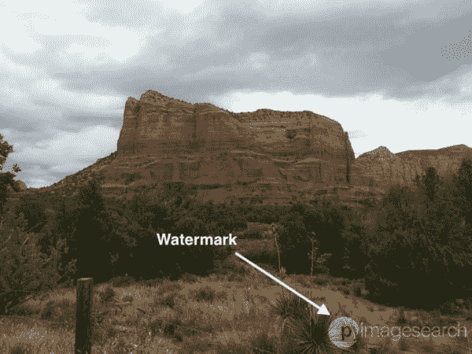
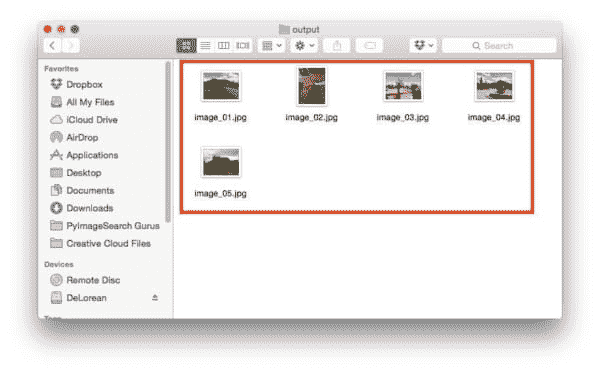
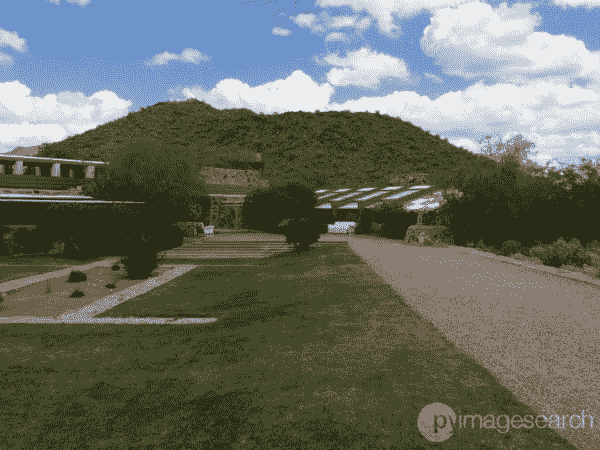
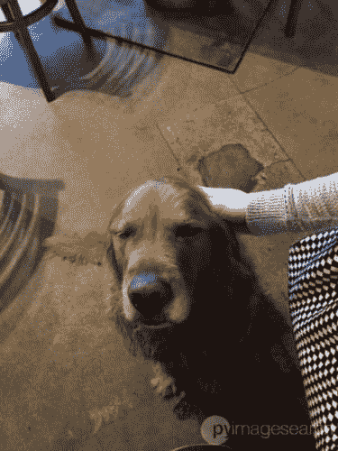
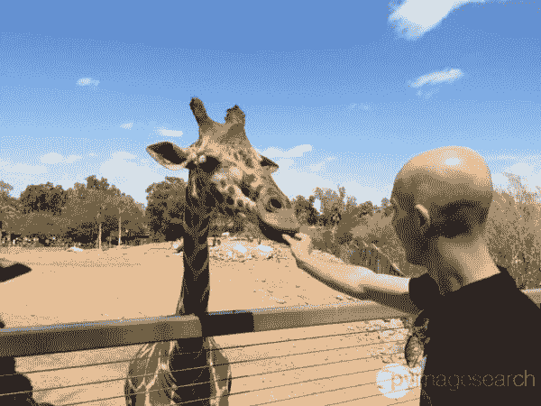
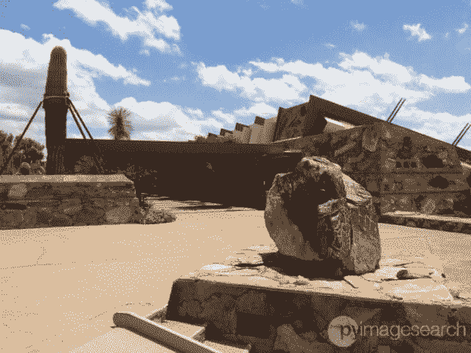
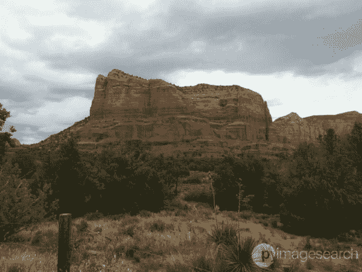
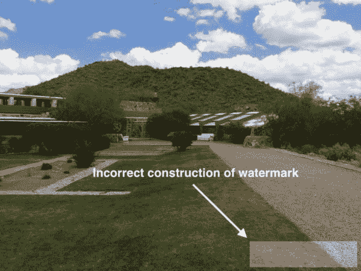

# 用 OpenCV 和 Python 实现图像水印

> 原文：<https://pyimagesearch.com/2016/04/25/watermarking-images-with-opencv-and-python/>



A few weeks ago, I wrote a blog post on **[creating transparent overlays with OpenCV](https://pyimagesearch.com/2016/03/07/transparent-overlays-with-opencv/)**. This post was meant to be a gentle introduction to a neat little trick you can use to improve the aesthetics of your processed image(s), such as creating a Heads-up Display (HUD) on live video streams.

但是还有另一个更实际的原因，我想向你介绍透明的覆盖图，即水印图像。 给一幅图像或视频加水印称为 *[数字水印](https://en.wikipedia.org/wiki/Digital_watermarking)* ，是在图像本身上嵌入一个*唯一的*和*识别图案*的过程。

例如，专业摄影师倾向于给发送给客户的数字样张(包括相关信息，如他们的姓名和/或设计工作室)加水印，直到客户同意购买照片，在此发布原始的、未经修改的图像。这使得摄影师可以分发他们作品的演示和样本，而不用真正“放弃”原始作品。

我们还在受版权保护的视频中看到数字水印——在这种情况下，水印被嵌入视频的每一帧，从而证明了作品的原始制作者。

在这两种情况下，水印的目标是在图像上创建一个独特的可识别的图案，将属性赋予原始创作者，但不破坏图像本身的内容。

要了解如何利用 OpenCV 为您自己的图像数据集添加水印，请继续阅读。

## 用 OpenCV 和 Python 实现图像水印

这篇博文的目的是演示如何使用 OpenCV 和 Python 为图像添加水印。首先，我们需要一个水印，出于本教程的目的，我选择它作为 PyImageSearch 徽标:


**Figure 1:** Our example watermark image — the PyImageSearch logo.

这个水印是一个 [PNG 图像](https://en.wikipedia.org/wiki/Portable_Network_Graphics)带有 ***四个通道*** :一个红色通道、一个绿色通道、一个蓝色通道和一个 ***Alpha 通道*** 用于控制图像中每个像素的*透明度。*

我们的 alpha 通道中的值可以在*【0，255】*范围内，其中 *255* 的值是 ***100%不透明*** (即根本不透明)，而 *0* 的值是 ***100%透明*** 。介于 0 和 255 之间的值具有不同的透明度级别，其中 alpha 值越小，*像素越透明。*

在上图中，*不是*白色*“PyImageSearch”标志的*部分的所有像素都是完全透明的，这意味着您可以“透过它们”看到图像所覆盖的背景。在本例中，我将图像设置为蓝色背景*，这样我们就可以看到徽标本身(显然，如果我将它放在白色背景上，您将看不到白色的 PyImageSearch 徽标——因此在本例中使用了蓝色背景)。*

 *一旦我们在图像上覆盖水印，水印将是半透明的，允许我们(部分)看到原始图像的背景。

现在我们已经了解了水印的过程，让我们开始吧。

### 用 OpenCV 创建水印

打开一个新文件，命名为`watermark_dataset.py`，让我们开始吧:

```py
# import the necessary packages
from imutils import paths
import numpy as np
import argparse
import cv2
import os

# construct the argument parse and parse the arguments
ap = argparse.ArgumentParser()
ap.add_argument("-w", "--watermark", required=True,
	help="path to watermark image (assumed to be transparent PNG)")
ap.add_argument("-i", "--input", required=True,
	help="path to the input directory of images")
ap.add_argument("-o", "--output", required=True,
	help="path to the output directory")
ap.add_argument("-a", "--alpha", type=float, default=0.25,
	help="alpha transparency of the overlay (smaller is more transparent)")
ap.add_argument("-c", "--correct", type=int, default=1,
	help="flag used to handle if bug is displayed or not")
args = vars(ap.parse_args())

```

**第 2-6 行**导入我们需要的 Python 包。我们将在这里使用 [imutils 包](https://github.com/jrosebr1/imutils)，所以如果你还没有安装它，让`pip`为你安装它:

```py
$ pip install imutils

```

**第 9-20 行**然后处理解析我们需要的命令行参数。我们需要三个命令行参数，并且可以提供两个额外的(可选的)参数。下面是每个命令行参数的完整分类:

*   在这里，我们提供我们希望用作水印的图像的路径。我们假设(1)这个图像是一个具有 *alpha 透明度*的 *PNG 图像*，以及(2)我们的水印比我们将要应用水印的数据集中的所有*图像小(就宽度和高度而言)。*
*   `--input`:这是我们要水印的图像的*输入目录*的路径。
*   `--output`:然后我们需要提供一个*输出目录*来存储我们的水印图像。
*   `--alpha`:可选的`--alpha`值控制水印的透明度。 *1.0* 的值表示水印应该 *100%不透明*(即不透明)。值 *0.0* 表示水印应该 *100%透明*。您可能希望为自己的数据集调整这个值，但是我发现 25%的值在大多数情况下都很好。
*   最后，这个开关用来控制我们是否应该保留一个 OpenCV 处理 alpha 透明度的“bug”。我包含这个开关的唯一原因是关于 OpenCV 库的教育问题。除非您想自己研究这个 bug，否则您很可能会忽略这个参数。

现在我们已经解析了我们的命令行参数，我们可以从磁盘加载我们的水印图像:

```py
# load the watermark image, making sure we retain the 4th channel
# which contains the alpha transparency
watermark = cv2.imread(args["watermark"], cv2.IMREAD_UNCHANGED)
(wH, wW) = watermark.shape[:2]

```

**第 24 行**使用`cv2.imread`函数从磁盘加载我们的`watermark`图像。注意我们是如何使用`cv2.IMREAD_UNCHANGED`标志的——提供这个值是为了让我们能够读取 PNG 图像的 alpha 透明通道(以及标准的红色、绿色和蓝色通道)。

**第 25 行**然后获取`watermark`图像的空间尺寸(即高度和宽度)。

下一个代码块解决了我在使用 alpha transparency 和 OpenCV 时遇到的一些奇怪的问题:

```py
# split the watermark into its respective Blue, Green, Red, and
# Alpha channels; then take the bitwise AND between all channels
# and the Alpha channels to construct the actaul watermark
# NOTE: I'm not sure why we have to do this, but if we don't,
# pixels are marked as opaque when they shouldn't be
if args["correct"] > 0:
	(B, G, R, A) = cv2.split(watermark)
	B = cv2.bitwise_and(B, B, mask=A)
	G = cv2.bitwise_and(G, G, mask=A)
	R = cv2.bitwise_and(R, R, mask=A)
	watermark = cv2.merge([B, G, R, A])

```

当我第一次实现这个例子时，我注意到在具有 alpha 透明度的`cv2.imread`和 PNG 文件类型上有一些*非常奇怪的行为*。

首先，我注意到*即使有了*的`cv2.IMREAD_UNCHANGED`标志，alpha 通道*中的透明度值也没有得到任何红色、绿色或蓝色通道*的*的*的尊重——这些通道看起来要么是*完全不透明的*要么是*半透明的*，但从来没有达到我假设的*正确的*透明度水平。

然而，在研究 alpha 通道本身时，我注意到 alpha 通道本身没有问题—**alpha 通道被加载并完美地呈现了*。***

因此，为了确保红色、绿色和蓝色通道尊重阿尔法通道，我在各个颜色通道和阿尔法通道之间进行了按位`AND`，将阿尔法通道视为一个遮罩(**第 33-37 行** ) — ***)，这解决了奇怪的行为，并允许我继续进行水印处理。***

我在这里加入了`--correct`标志，这样你就可以调查当没有应用这种类型的修正时*会发生什么(更多信息请见**“水印结果”部分**)。*

接下来，让我们继续处理我们的图像数据集:

```py
# loop over the input images
for imagePath in paths.list_images(args["input"]):
	# load the input image, then add an extra dimension to the
	# image (i.e., the alpha transparency)
	image = cv2.imread(imagePath)
	(h, w) = image.shape[:2]
	image = np.dstack([image, np.ones((h, w), dtype="uint8") * 255])

	# construct an overlay that is the same size as the input
	# image, (using an extra dimension for the alpha transparency),
	# then add the watermark to the overlay in the bottom-right
	# corner
	overlay = np.zeros((h, w, 4), dtype="uint8")
	overlay[h - wH - 10:h - 10, w - wW - 10:w - 10] = watermark

	# blend the two images together using transparent overlays
	output = image.copy()
	cv2.addWeighted(overlay, args["alpha"], output, 1.0, 0, output)

	# write the output image to disk
	filename = imagePath[imagePath.rfind(os.path.sep) + 1:]
	p = os.path.sep.join((args["output"], filename))
	cv2.imwrite(p, output)

```

在**第 40 行**我们开始循环浏览`--input`目录中的每一张图片。对于这些图像中的每一个，我们从磁盘中加载它并获取它的宽度和高度。

理解每个`image`被表示为一个形状为 *(h，w，3)* 的 NumPy 数组是很重要的，其中 *3* 是我们图像中通道的数量——红色、绿色和蓝色通道各一个。

然而，由于我们使用的是阿尔法透明度，我们需要给图像添加一个第四维度来存储阿尔法值(**第 45 行**)。该 alpha 通道与我们的原始图像具有相同的空间维度，并且 alpha 通道中的所有值都被设置为 *255* ，这表示像素*完全不透明*并且*不透明*。

**第 51 行和第 52 行**为我们的水印构造了`overlay`。同样，`overlay`与我们的输入图像具有完全相同的宽度和高度。

***注:**要了解更多关于透明叠加的信息，[请参考这篇博文](https://pyimagesearch.com/2016/03/07/transparent-overlays-with-opencv/)。*

最后，**第 55 行和第 56 行**通过应用`cv2.addWeighted`函数来构造我们的水印图像。

**第 59-61 行**然后获取我们的`output`图像并将其写入`--output`目录。

### 水印结果

为了试试我们的`watermark_dataset.py`脚本，使用本教程底部的*“下载”*表单下载与本文相关的源代码和图片。然后，导航到代码目录并执行以下命令:

```py
$ python watermark_dataset.py --watermark pyimagesearch_watermark.png \
	--input input --output output

```

脚本执行完毕后，您的`output`目录应该包含以下五个图像:



**Figure 2:** The output from our watermarking script.

您可以在下面看到每个带水印的图像:



**Figure 3:** Watermarking images with OpenCV and Python.

在上面的图像中，你可以看到白色的 PyImageSearch 标志已经作为水印添加到原始图像中。

下面是用 OpeCV 给图像加水印的第二个例子。同样，请注意 PyImageSearch 徽标是如何出现的(1)半透明和(2)在图像的右下角:



**Figure 4:** Creating watermarks with OpenCV and Python.

大约一年前，我去亚利桑那州欣赏红岩。一路上，我在凤凰动物园停下来，抚摸并喂养一只长颈鹿:



**Figure 5:** Feeding a giraffe…and watermarking the image with computer vision.

我也是一个中世纪现代建筑的狂热爱好者，所以我不得不去参观西方的 T2 塔里耶辛。



**Figure 6:** Watermarking images with OpenCV.

最后，这里有一张亚利桑那州风景的美丽照片(即使那天有点多云):



Figure 7: Creating watermarks with OpenCV is easy!

请注意在上面的每张图片中,“PyImageSearch”徽标是如何放置在输出图片的右下角的。再者，这个水印是*半透明*，让我们透过前景水印看到背景图像的内容。

### 具有 alpha 透明度的奇怪行为

所以，还记得我在**第 32-37 行**中提到的，如果我们不在每个相应的红色、绿色和蓝色通道与 alpha 通道之间进行按位`AND`运算，alpha 透明度会发生一些奇怪的行为吗？

让我们来看看这种陌生感。

再次执行`watermark_dataset.py`脚本，这次提供`--correct 0`标志来跳过逐位`AND`步骤:

```py
$ python watermark_dataset.py --correct 0 --watermark pyimagesearch_watermark.png \
	--input input --output output

```

然后，打开您选择的输出图像，您将看到如下内容:



**Figure 8:** (Incorrectly) creating a watermark with OpenCV.

请注意*整个水印图像*是如何被视为半透明的*，而不仅仅是相应的阿尔法像素值！*

莫名其妙吧？

老实说，我不确定为什么会发生这种情况，我在 OpenCV 文档中找不到任何关于这种行为的信息。如果任何人对这个问题有任何额外的细节，请在这篇文章底部的评论区留言。

否则，如果您在任何自己的 OpenCV 图像处理管道中使用 alpha 透明度，请确保您特别注意使用 alpha 遮罩单独遮罩每个红色、绿色和蓝色通道。

## 摘要

在这篇博文中，我们学习了如何使用 OpenCV 和 Python 为图像数据集添加水印。使用数字水印，您可以将自己的名字、徽标或公司品牌覆盖在您的原创作品上，从而保护内容并表明您是原创者。

为了用 OpenCV 创建这些数字水印，我们利用了具有 alpha 透明度的 PNG。利用 alpha 透明度可能非常棘手，*尤其是*，因为 OpenCV 似乎不会自动屏蔽每个通道的透明像素。

相反，你需要手动*通过在输入通道和 alpha 蒙版之间进行逐位`AND`来执行这个蒙版(如这篇博文中所示)。*

 *无论如何，我希望你喜欢这个教程！

在你离开之前，请务必在下面的表格中输入你的电子邮件地址，以便在有新的博文发表时得到通知！**