# 分水岭 OpenCV

> 原文：<https://pyimagesearch.com/2015/11/02/watershed-opencv/>

[](https://pyimagesearch.com/wp-content/uploads/2015/10/watershed_output_coins_02.jpg)

[分水岭算法](https://en.wikipedia.org/wiki/Watershed_(image_processing))是一种用于分割的经典算法，在提取图像中的*接触*或*重叠*物体时特别有用，比如上图中的硬币。

使用传统的图像处理方法，如阈值处理和轮廓检测，我们无法从图像中提取每枚*硬币，但通过利用分水岭算法，我们能够毫无问题地检测和提取每枚硬币。*

使用分水岭算法时，我们必须从*用户定义的标记*开始。这些标记既可以是通过点击手动定义的*，也可以是自动定义的*或启发式定义的。**

 **基于这些标记，分水岭算法将我们输入图像中的像素视为局部高程(称为 *[地形](https://en.wikipedia.org/wiki/Topography)* ) —该方法“淹没”山谷，从标记开始并向外移动，直到不同标记的山谷彼此相遇。为了获得准确的分水岭分割，必须正确放置标记。

在这篇文章的剩余部分，我将向您展示如何使用分水岭算法来分割和提取图像中既接触又重叠的对象。为此，我们将使用各种 Python 包，包括 [SciPy](http://www.scipy.org/) 、 [scikit-image](http://scikit-image.org/) 和 OpenCV。

## 分水岭 OpenCV

[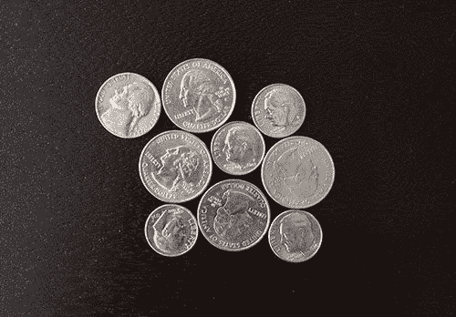](https://pyimagesearch.com/wp-content/uploads/2015/10/watershed_coins_01.jpg)

**Figure 1:** An example image containing touching objects. Our goal is to detect and extract each of these coins individually.

在上面的图像中，您可以看到使用简单的阈值处理和轮廓检测无法提取的对象示例，因为这些对象是接触的、重叠的或两者兼有，轮廓提取过程会将每组接触的对象视为一个*单个对象*而不是*多个对象*。

### 基本阈值和轮廓提取的问题

让我们继续演示简单阈值处理和轮廓检测的局限性。打开一个新文件，命名为`contour_only.py`，让我们开始编码:

```py
# import the necessary packages
from __future__ import print_function
from skimage.feature import peak_local_max
from skimage.segmentation import watershed
from scipy import ndimage
import argparse
import imutils
import cv2

# construct the argument parse and parse the arguments
ap = argparse.ArgumentParser()
ap.add_argument("-i", "--image", required=True,
	help="path to input image")
args = vars(ap.parse_args())

# load the image and perform pyramid mean shift filtering
# to aid the thresholding step
image = cv2.imread(args["image"])
shifted = cv2.pyrMeanShiftFiltering(image, 21, 51)
cv2.imshow("Input", image)

```

我们从**线 2-8** 开始，导入我们需要的包。**第 11-14 行**然后解析我们的命令行参数。这里我们只需要一个开关，`--image`，它是我们想要处理的图像的路径。

从那里，我们将在第 18 行**上从磁盘加载我们的图像，应用[金字塔均值漂移滤波](http://docs.opencv.org/modules/imgproc/doc/filtering.html#pyrmeanshiftfiltering) ( **第 19** 行)来帮助我们的阈值步骤的准确性，并最终在我们的屏幕上显示我们的图像。到目前为止，我们的输出示例如下:**

[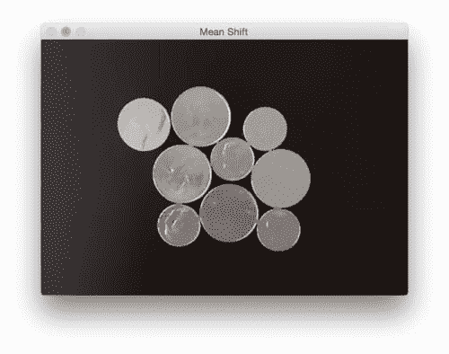](https://pyimagesearch.com/wp-content/uploads/2015/10/watershed_mean_shift.jpg)

**Figure 2:** Output from the pyramid mean shift filtering step.

现在，让我们对均值偏移图像进行阈值处理:

```py
# convert the mean shift image to grayscale, then apply
# Otsu's thresholding
gray = cv2.cvtColor(shifted, cv2.COLOR_BGR2GRAY)
thresh = cv2.threshold(gray, 0, 255,
	cv2.THRESH_BINARY | cv2.THRESH_OTSU)[1]
cv2.imshow("Thresh", thresh)

```

给定我们的输入`image`，然后我们将它转换为灰度，并应用 Otsu 的阈值处理将背景从前景中分割出来:

[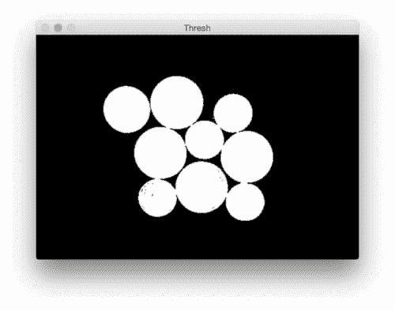](https://pyimagesearch.com/wp-content/uploads/2015/10/watershed_threshold.jpg)

**Figure 3:** Applying Otsu’s automatic thresholding to segment the foreground coins from the background.

最后，最后一步是检测阈值图像中的轮廓，并绘制每个单独的轮廓:

```py
# find contours in the thresholded image
cnts = cv2.findContours(thresh.copy(), cv2.RETR_EXTERNAL,
	cv2.CHAIN_APPROX_SIMPLE)
cnts = imutils.grab_contours(cnts)
print("[INFO] {} unique contours found".format(len(cnts)))

# loop over the contours
for (i, c) in enumerate(cnts):
	# draw the contour
	((x, y), _) = cv2.minEnclosingCircle(c)
	cv2.putText(image, "#{}".format(i + 1), (int(x) - 10, int(y)),
		cv2.FONT_HERSHEY_SIMPLEX, 0.6, (0, 0, 255), 2)
	cv2.drawContours(image, [c], -1, (0, 255, 0), 2)

# show the output image
cv2.imshow("Image", image)
cv2.waitKey(0)

```

下面我们可以看到我们的图像处理管道的输出:

[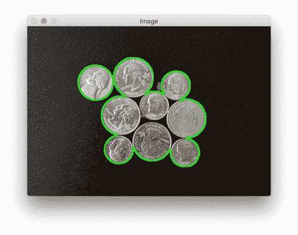](https://pyimagesearch.com/wp-content/uploads/2015/10/watershed_contours_only.jpg)

**Figure 4:** The output of our simple image processing pipeline. Unfortunately, our results are pretty poor — we are not able to detect each individual coin.

如你所见，我们的结果相当糟糕。使用简单的阈值和轮廓检测，我们的 Python 脚本报告说图像中只有*两个*硬币，尽管很明显有*九个*硬币。

这个问题的原因来自于硬币边界在图像中彼此接触的事实——因此，`cv2.findContours`函数仅将硬币组视为单个对象，而事实上它们是多个*独立的*硬币。

***注意:**一系列的形态学操作(具体来说，腐蚀)将帮助我们获得这个特定的图像。然而，对于*重叠*的物体来说，这些腐蚀是不够的。为了这个例子，让我们假设形态学操作不是一个可行的选择，以便我们可以探索分水岭算法。*

### 使用分水岭算法进行分割

既然我们已经了解了简单阈值处理和轮廓检测的局限性，让我们继续讨论分水岭算法。打开一个新文件，将其命名为`watershed.py`，并插入以下代码:

```py
# import the necessary packages
from skimage.feature import peak_local_max
from skimage.morphology import watershed
from scipy import ndimage
import numpy as np
import argparse
import imutils
import cv2

# construct the argument parse and parse the arguments
ap = argparse.ArgumentParser()
ap.add_argument("-i", "--image", required=True,
	help="path to input image")
args = vars(ap.parse_args())

# load the image and perform pyramid mean shift filtering
# to aid the thresholding step
image = cv2.imread(args["image"])
shifted = cv2.pyrMeanShiftFiltering(image, 21, 51)
cv2.imshow("Input", image)

# convert the mean shift image to grayscale, then apply
# Otsu's thresholding
gray = cv2.cvtColor(shifted, cv2.COLOR_BGR2GRAY)
thresh = cv2.threshold(gray, 0, 255,
	cv2.THRESH_BINARY | cv2.THRESH_OTSU)[1]
cv2.imshow("Thresh", thresh)

```

同样，我们将从**行 2-8** 开始，导入我们需要的包。我们将使用来自 [SciPy](http://www.scipy.org/) 、 [scikit-image](http://scikit-image.org/) 、 [imutils](https://github.com/jrosebr1/imutils) 和 OpenCV 的函数。如果您的系统上还没有安装 SciPy 和 scikit-image，您可以使用`pip`为您安装它们:

```py
$ pip install --upgrade scipy
$ pip install --upgrade scikit-image
$ pip install --upgrade imutils

```

**第 11-14 行**处理解析我们的命令行参数。就像前面的例子一样，我们只需要一个开关，即我们要应用分水岭算法的图像路径`--image`。

从那里，**行 18 和 19** 从磁盘加载我们的图像，并应用金字塔平均移动滤波。**第 24-26 行**执行灰度转换和阈值处理。

给定我们的阈值图像，我们现在可以应用分水岭算法:

```py
# compute the exact Euclidean distance from every binary
# pixel to the nearest zero pixel, then find peaks in this
# distance map
D = ndimage.distance_transform_edt(thresh)
localMax = peak_local_max(D, indices=False, min_distance=20,
	labels=thresh)

# perform a connected component analysis on the local peaks,
# using 8-connectivity, then appy the Watershed algorithm
markers = ndimage.label(localMax, structure=np.ones((3, 3)))[0]
labels = watershed(-D, markers, mask=thresh)
print("[INFO] {} unique segments found".format(len(np.unique(labels)) - 1))

```

应用分水岭算法进行分割的第一步是通过`distance_transform_edt`函数(**第 32 行**)计算欧几里德距离变换(EDT)。顾名思义，这个函数计算每个前景像素到最近的零(即背景像素)的欧几里德距离。我们可以在下图中看到 EDT:

[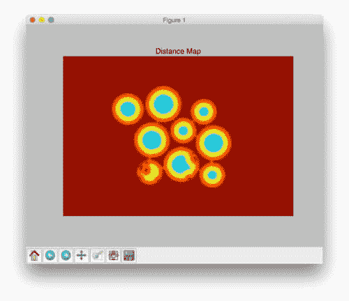](https://pyimagesearch.com/wp-content/uploads/2015/10/watershed_distance_map.jpg)

**Figure 5:** Visualizing the Euclidean Distance Transform.

在**线 33** 上，我们使用`D`，我们的距离地图，并在地图中找到峰值(即，局部最大值)。我们将确保每个峰值之间的距离至少为*20 像素。*

 ***线 38** 获取`peak_local_max`函数的输出，并使用 8-连通性应用[连通分量分析](https://en.wikipedia.org/wiki/Connected-component_labeling)。这个函数的输出给了我们`markers`，然后我们将它输入到**线 39** 上的`watershed`函数中。由于分水岭算法假设我们的标记代表我们的距离图中的局部最小值(即山谷)，所以我们取负值`D`。

`watershed`函数返回一个`labels`的矩阵，这是一个 NumPy 数组，其宽度和高度与我们的输入图像相同。每个像素值作为一个唯一的标签值。*标签值相同的像素属于同一个对象。*

最后一步是简单地遍历唯一标签值并提取每个唯一对象:

```py
# loop over the unique labels returned by the Watershed
# algorithm
for label in np.unique(labels):
	# if the label is zero, we are examining the 'background'
	# so simply ignore it
	if label == 0:
		continue

	# otherwise, allocate memory for the label region and draw
	# it on the mask
	mask = np.zeros(gray.shape, dtype="uint8")
	mask[labels == label] = 255

	# detect contours in the mask and grab the largest one
	cnts = cv2.findContours(mask.copy(), cv2.RETR_EXTERNAL,
		cv2.CHAIN_APPROX_SIMPLE)
	cnts = imutils.grab_contours(cnts)
	c = max(cnts, key=cv2.contourArea)

	# draw a circle enclosing the object
	((x, y), r) = cv2.minEnclosingCircle(c)
	cv2.circle(image, (int(x), int(y)), int(r), (0, 255, 0), 2)
	cv2.putText(image, "#{}".format(label), (int(x) - 10, int(y)),
		cv2.FONT_HERSHEY_SIMPLEX, 0.6, (0, 0, 255), 2)

# show the output image
cv2.imshow("Output", image)
cv2.waitKey(0)

```

在**第 44 行**我们开始循环每个独特的`labels`。如果`label`是零，那么我们正在检查“背景成分”，所以我们简单地忽略它。

否则，**行 52 和 53** 为我们的`mask`分配内存，并将属于当前标签的像素设置为 *255* (白色)。我们可以在下面的*右侧*看到一个这样的遮罩示例:

[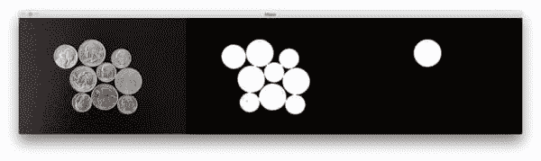](https://pyimagesearch.com/wp-content/uploads/2015/10/watershed_single_object.jpg)

**Figure 6:** An example mask where we are detecting and extracting only a single object from the image.

在**线 56-59** 上，我们检测`mask`中的轮廓并提取最大的一个——该轮廓将代表图像中给定对象的轮廓/边界。

最后，给定物体的轮廓，我们需要做的就是在第 62-65 行上画出围绕物体的圆圈边界。我们还可以计算对象的边界框，应用位运算，并提取每个单独的对象。

最后，**行 68 和 69** 向我们的屏幕显示输出图像:

[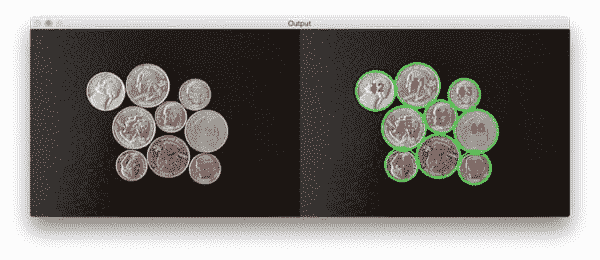](https://pyimagesearch.com/wp-content/uploads/2015/10/watershed_output_coins_01.jpg)

**Figure 7:** The final output of our watershed algorithm — we have been able to cleanly detect and draw the boundaries of each coin in the image, even though their edges are touching.

正如你所看到的，我们已经成功地检测到图像中的所有九个硬币。此外，我们还能够清晰地画出每枚硬币周围的边界。这与使用简单阈值和轮廓检测的先前示例形成鲜明对比，在先前示例中，仅*两个*对象被(不正确地)检测到。

## 将分水岭算法应用于图像

既然我们的`watershed.py`脚本已经完成，让我们将它应用到更多的图像并研究结果:

```py
$ python watershed.py --image images/coins_02.png

```

[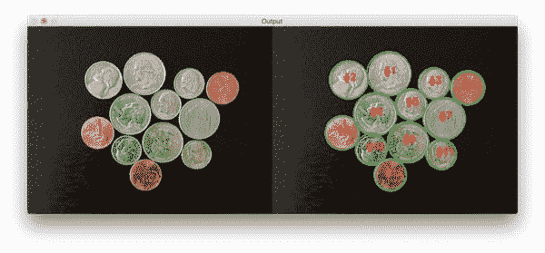](https://pyimagesearch.com/wp-content/uploads/2015/10/watershed_output_coins_021.jpg)

**Figure 8:** Again, we are able to cleanly segment each of the coins in the image.

让我们尝试另一个图像，这次是重叠的硬币:

```py
$ python watershed.py --image images/coins_03.png

```

[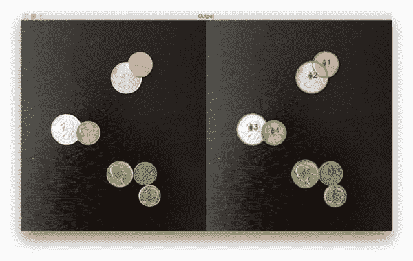](https://pyimagesearch.com/wp-content/uploads/2015/10/watershed_output_coins_03.jpg)

**Figure 9:** The watershed algorithm is able to segment the overlapping coins from each other.

在下图中，我决定将分水岭算法应用于药丸计数任务:

```py
$ python watershed.py --image images/pills_01.png

```

[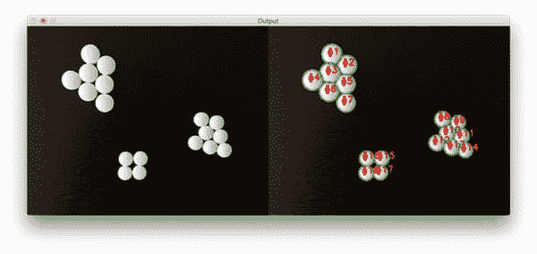](https://pyimagesearch.com/wp-content/uploads/2015/10/watershed_output_pills_01.jpg)

**Figure 10:** We are able to correctly count the number of pills in the image.

这张图片也是如此:

```py
$ python watershed.py --image images/pills_02.png

```

[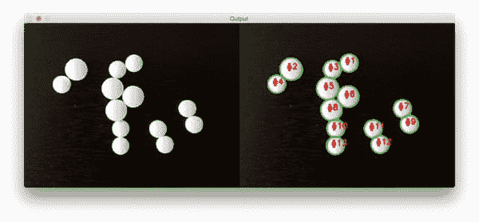](https://pyimagesearch.com/wp-content/uploads/2015/10/watershed_output_pills_02.jpg)

**Figure 11:** Applying the watershed algorithm with OpenCV to count the number of pills in an image.

## 摘要

在这篇博文中，我们学习了如何应用分水岭算法，这是一种经典的分割算法，用于检测和提取图像中*接触*和/或*重叠的对象。*

为了应用分水岭算法，我们需要定义与我们图像中的物体相对应的*标记*。这些标记可以是用户定义的，或者我们可以应用图像处理技术(如阈值处理)来为我们找到标记。当应用分水岭算法时，获得准确的标记是绝对关键的。

给定我们的标记，我们可以计算欧几里德距离变换并将距离图传递给分水岭函数本身，该函数在距离图中“淹没”山谷，从初始标记开始并向外移动。在分割过程中，水的“池”相遇的地方可以被认为是边界线。

分水岭算法的输出是一组标签，其中每个标签对应于图像中的一个唯一对象。从那里开始，我们需要做的就是分别遍历每个标签并提取每个对象。

无论如何，我希望你喜欢这篇文章！请务必下载代码并尝试一下。尝试使用各种参数，特别是`peak_local_max`函数的`min_distance`参数。请注意改变该参数的值会如何改变输出图像。***