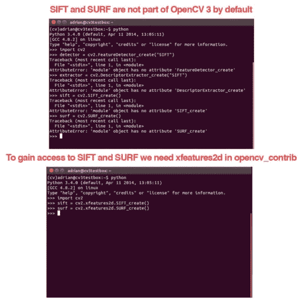

# OpenCV 3 中 SIFT 和 SURF 去哪了？

> 原文：<https://pyimagesearch.com/2015/07/16/where-did-sift-and-surf-go-in-opencv-3/>

[](https://pyimagesearch.com/wp-content/uploads/2015/07/sift_and_surf_side_by_side.jpg)

如果你有机会体验 OpenCV 3(并在关键点检测器和特征描述符方面做了大量工作)，你可能会注意到默认情况下，SIFT 和 SURF 实现不再包含在 OpenCV 3 库中。

不幸的是，您可能通过打开一个终端、导入 OpenCV，然后尝试实例化您最喜欢的关键点检测器(可能使用如下代码)来学习这一课:

```py
$ python
>>> import cv2
>>> detector = cv2.FeatureDetector_create("SIFT")
Traceback (most recent call last):
  File "<stdin>", line 1, in <module>
AttributeError: 'module' object has no attribute 'FeatureDetector_create'

```

哦不！再也没有`cv2.FeatureDetector_create`的方法了！

我们的`cv2.DescriptorExtractor_create`函数也是如此:

```py
>>> extractor = cv2.DescriptorExtractor_create("SIFT")
Traceback (most recent call last):
  File "<stdin>", line 1, in <module>
AttributeError: 'module' object has no attribute 'DescriptorExtractor_create'

```

此外，`cv2.SIFT_create`和`cv2.SURF_create`也将失败:

```py
>>> cv2.SIFT_create()
Traceback (most recent call last):
  File "<stdin>", line 1, in <module>
AttributeError: 'module' object has no attribute 'SIFT_create'
>>> cv2.SURF_create()
Traceback (most recent call last):
  File "<stdin>", line 1, in <module>
AttributeError: 'module' object has no attribute 'SURF_create'

```

老实说，这一开始让我挠头。如果删除了`cv2.FeatureDetector_create`和`cv2.DescriptorExtractor_create`，我该如何访问 SIFT、SURF 和我喜欢的其他关键点检测器和局部不变描述符？

`cv2.FeatureDetector_create`和`cv2.DescriptorExtractor_create`是(现在仍然是)我一直使用的方法。就我个人而言，我非常喜欢 OpenCV 2.4.X 的实现。您所需要做的就是传入一个字符串，工厂方法就会为您构建实例化。然后，您可以使用关键点检测器或特性描述符的 getter 和 setter 方法来调整参数。

此外，这些方法多年来一直是 OpenCV 2.4.X 的一部分。为什么他们会从默认安装中被删除？他们被转移到哪里了？

在这篇博文的剩余部分，我将详细说明为什么 OpenCV 3.0 默认删除了某些关键点检测器和局部不变描述符。我还将向您展示在 OpenCV 的新版本中哪里可以找到 SIFT、SURF 以及其他检测器和描述符。

# OpenCV 3.0 默认安装中为什么去掉了 SIFT 和 SURF？

SIFT 和 SURF 是 OpenCV 称之为“非自由”模块的算法的例子。这些算法由它们各自的创造者申请专利，虽然它们可以在学术和研究环境中免费使用，但如果你在商业(即盈利)应用中使用它们，你应该从技术上从创造者那里获得许可证/许可。

随着 OpenCV 3 的推出，许多“非自由”模块被移出默认的 OpenCV 安装，并被放入 [opencv_contrib](https://github.com/itseez/opencv_contrib) 包。`opencv_contrib`包包含算法的实现，这些算法要么是*获得专利的*，要么是*实验开发的*。

`opencv_contrib` ***中的算法和相关实现不是默认安装的****，您需要在编译和安装 OpenCV 时 ***显式启用它们以获得对它们的访问。****

 *就我个人而言，我对这一举措并不太感冒。

是的，我知道在开源库中包含专利算法可能会引起一些争议。但是像 SIFT 和 SURF 这样的算法在很多计算机视觉领域都很普遍。更重要的是，SIFT 和 SURF 的 OpenCV 实现每天都被学者和研究人员用来评估新的图像分类、基于内容的图像检索等。算法。默认不包含这些算法，弊大于利(至少在我看来是这样)。

# 如何在 OpenCV 3 中访问 SIFT 和 SURF？

要访问 OpenCV 2.4.X 中的原始 SIFT 和 SURF 实现，您需要从 GitHub 中下载*[OpenCV](https://github.com/Itseez/opencv)和 [opencv_contrib](https://github.com/itseez/opencv_contrib) 库，然后从源代码中编译并安装 OpenCV 3。*

 *幸运的是，从源代码编译 OpenCV 比以前更容易了。我在 [OpenCV 3 教程、资源和指南页面](https://pyimagesearch.com/opencv-tutorials-resources-guides/)上收集了许多流行操作系统的 Python 和 OpenCV 安装说明——只需向下滚动**安装 OpenCV 3 和 Python** 部分，找到适合您的操作系统的 Python 版本(Python 2.7+或 Python 3+)。

# 如何在 OpenCV 3 中使用 SIFT 和 SURF？

现在你已经用`opencv_contrib`包安装了 OpenCV 3，你应该可以访问 OpenCV 2.4.X 中最初的 SIFT 和 SURF 实现，**只是这次它们将通过`cv2.SIFT_create`和`cv2.SURF_create`函数在`xfeatures2d`子模块中。**

为了确认这一点，打开一个 shell，导入 OpenCV，并执行以下命令(当然，假设在当前目录中有一个名为`test_image.jpg`的图像):

```py
$ python
>>> import cv2
>>> image = cv2.imread("test_image.jpg")
>>> gray = cv2.cvtColor(image, cv2.COLOR_BGR2GRAY)
>>> sift = cv2.xfeatures2d.SIFT_create()
>>> (kps, descs) = sift.detectAndCompute(gray, None)
>>> print("# kps: {}, descriptors: {}".format(len(kps), descs.shape))
# kps: 274, descriptors: (274, 128)
>>> surf = cv2.xfeatures2d.SURF_create()
>>> (kps, descs) = surf.detectAndCompute(gray, None)
>>> print("# kps: {}, descriptors: {}".format(len(kps), descs.shape))
# kps: 393, descriptors: (393, 64)

```

如果一切顺利，您应该能够无误地实例化 SIFT 和 SURF 关键点检测器和局部不变描述符。

同样重要的是要注意，通过使用`opencv_contrib`，你将不会干扰 OpenCV 3 中包含的任何其他关键点检测器和局部不变描述符。您仍然可以访问 KAZE、AKAZE、BRISK 等。没有问题:

```py
>>> kaze = cv2.KAZE_create()
>>> (kps, descs) = kaze.detectAndCompute(gray, None)
>>> print("# kps: {}, descriptors: {}".format(len(kps), descs.shape))
# kps: 359, descriptors: (359, 64)
>>> akaze = cv2.AKAZE_create()
>>> (kps, descs) = akaze.detectAndCompute(gray, None)
>>> print("# kps: {}, descriptors: {}".format(len(kps), descs.shape))
# kps: 192, descriptors: (192, 61)
>>> brisk = cv2.BRISK_create()
>>> (kps, descs) = brisk.detectAndCompute(gray, None)
>>> print("# kps: {}, descriptors: {}".format(len(kps), descs.shape))
# kps: 361, descriptors: (361, 64)

```

# 摘要

在这篇博文中，我们了解到 OpenCV 已经从库中移除了`cv2.FeatureDetector_create`和`cv2.DescriptorExtractor_create`函数。此外，SIFT 和 SURF 实现也已经从默认的 OpenCV 3 安装中删除。

移除 SIFT 和 SURF 的原因是 OpenCV 所谓的“非自由”算法。SIFT 和 SURF 都是专利算法，这意味着从技术上讲，你应该获得许可，才能在商业算法中使用它们(尽管它们可以免费用于学术和研究目的)。

正因为如此，OpenCV 决定将专利算法(以及实验性实现)转移到 [opencv_contrib](https://github.com/Itseez/opencv_contrib) 包中。这意味着要访问 SIFT 和 SURF，您需要编译并安装 OpenCV 3，并启用`opencv_contrib`支持。幸运的是，在我的 [OpenCV 3 安装指南](https://pyimagesearch.com/opencv-tutorials-resources-guides/)的帮助下，这并不太具有挑战性。

一旦你安装了支持`opencv_contrib`的 OpenCV 3，你就可以通过`cv2.xfeatures2d.SIFT_create()`和`cv2.xfeatures2d.SURF_create()`功能在`xfeatures2d`包中找到你喜欢的 SIFT 和 SURF 实现。**