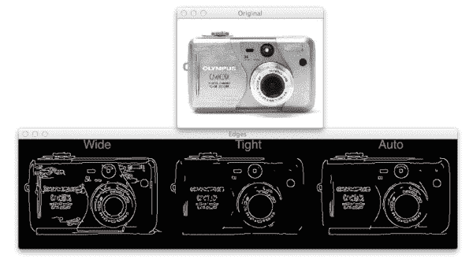
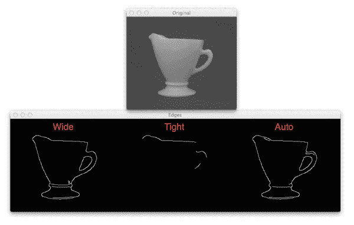

# 利用 Python 和 OpenCV 实现零参数自动 Canny 边缘检测

> 原文：<https://pyimagesearch.com/2015/04/06/zero-parameter-automatic-canny-edge-detection-with-python-and-opencv/>

今天我有一个小技巧给你，直接来自 PyImageSearch 库。

这个技巧真的很棒——在许多情况下，它 ***完全* *减轻了*** 为你精明的边缘检测器调整参数的需要。但在我们开始之前，让我们先讨论一下 Canny 边缘检测器。

**OpenCV 和 Python 版本:**
这个例子将运行在 **Python 2.7/Python 3.4+** 和 **OpenCV 2.4.X/OpenCV 3.0+** 上。

# 精明的边缘检测器

在以前的帖子中，我们已经多次使用了 Canny 边缘检测器。我们用它构建了一个[超棒的移动文档扫描仪](https://pyimagesearch.com/2014/09/01/build-kick-ass-mobile-document-scanner-just-5-minutes/)，我们还用它让[在一张照片中找到一个游戏机屏幕](https://pyimagesearch.com/2014/04/21/building-pokedex-python-finding-game-boy-screen-step-4-6/)，这只是两个例子。

Canny 边缘检测器是由 John F. Canny 在 1986 年开发的。它至今仍被广泛使用，是图像处理中默认的边缘检测器之一。

Canny 边缘检测算法可以分为 5 个步骤:

*   **步骤 1:** 使用高斯滤波器平滑图像，去除高频噪声。
*   **步骤 2:** 计算图像的梯度强度表示。
*   **步骤 3:** 应用非最大值抑制来消除对边缘检测的“错误”响应。
*   **步骤 4:** 使用梯度值的上下边界应用阈值处理。
*   **步骤 5:** 通过抑制不与强边缘相连的弱边缘，使用滞后来跟踪边缘。

如果您熟悉 Canny 边缘检测器的 OpenCV 实现，您会知道函数签名如下所示:

**cv2.canny(图像，下，上)**

其中`image`是我们想要检测边缘的图像；并且`lower`和`upper`分别是步骤 4 的整数阈值。

问题变成了确定这些下限和上限。

阈值的最佳值是多少？

当您处理在不同光照条件下拍摄的包含不同内容的多幅图像时，这个问题尤为重要。

在这篇博文的剩余部分，我将向你展示一个依赖于 ***基本统计*** 的小技巧，你可以应用它来消除对谨慎边缘检测的阈值的手动调整。

这个技巧可以节省你调整参数的时间——而且在应用这个函数后，你仍然可以得到一个漂亮的边缘图。

要了解有关这种零参数、自动 Canny 边缘检测技巧的更多信息，请继续阅读。

# 利用 Python 和 OpenCV 实现零参数自动 Canny 边缘检测

让我们开始吧。在您最喜欢的代码编辑器中打开一个新文件，命名为`auto_canny.py`，让我们开始吧:

```py
# import the necessary packages
import numpy as np
import argparse
import glob
import cv2

def auto_canny(image, sigma=0.33):
	# compute the median of the single channel pixel intensities
	v = np.median(image)

	# apply automatic Canny edge detection using the computed median
	lower = int(max(0, (1.0 - sigma) * v))
	upper = int(min(255, (1.0 + sigma) * v))
	edged = cv2.Canny(image, lower, upper)

	# return the edged image
	return edged

```

我们要做的第一件事是导入我们需要的包。我们将使用 NumPy 进行数值运算，`argparse`解析命令行参数，`glob`从磁盘获取图像路径，`cv2`用于 OpenCV 绑定。

然后我们定义`auto_canny`，我们在**线 7** 上的自动 Canny 边缘检测功能。这个函数需要一个参数`image`，它是我们想要检测图像的单通道图像。可选参数`sigma`可用于改变基于简单统计确定的百分比阈值。

**第 9 行**处理图像中像素强度的中值计算。

然后，我们取这个中间值，并在第 12 行**和第 13 行**上构造两个阈值`lower`和`upper`。这些阈值是基于由`sigma`参数控制的+/-百分比构建的。

较低的值`sigma`表示较紧的阈值，而较大的值`sigma`给出较宽的阈值。通常，您不必经常更改这个`sigma`值。只需选择一个默认的`sigma`值，并将其应用于整个图像数据集。

***注意:**在实践中，`sigma=0.33`在我处理的大部分数据集上往往给出好的结果，所以我选择提供 33%作为默认 sigma 值。*

现在我们已经有了我们的下限和上限，然后我们在**行 14** 上应用 Canny 边缘检测器，并将其返回到**行 17** 上的调用函数。

让我们继续看这个例子，看看如何将它应用到我们的图像中:

```py
# construct the argument parse and parse the arguments
ap = argparse.ArgumentParser()
ap.add_argument("-i", "--images", required=True,
	help="path to input dataset of images")
args = vars(ap.parse_args())

# loop over the images
for imagePath in glob.glob(args["images"] + "/*.jpg"):
	# load the image, convert it to grayscale, and blur it slightly
	image = cv2.imread(imagePath)
	gray = cv2.cvtColor(image, cv2.COLOR_BGR2GRAY)
	blurred = cv2.GaussianBlur(gray, (3, 3), 0)

	# apply Canny edge detection using a wide threshold, tight
	# threshold, and automatically determined threshold
	wide = cv2.Canny(blurred, 10, 200)
	tight = cv2.Canny(blurred, 225, 250)
	auto = auto_canny(blurred)

	# show the images
	cv2.imshow("Original", image)
	cv2.imshow("Edges", np.hstack([wide, tight, auto]))
	cv2.waitKey(0)

```

我们在第 20-23 行解析我们的命令行参数。这里我们只需要一个开关`--images`，它是包含我们想要处理的图像的目录的路径。

然后，我们在第 26 行的**上循环我们目录中的图像，在第 28** 行的**上从磁盘加载图像，在第 29** 行的**上将图像转换为灰度，并使用一个 *3 x 3* 内核应用高斯模糊来帮助去除第 30** 行的**高频噪声。**

**第 34-36 行**然后使用三种方法应用 Canny 边缘检测:

1.  一个*宽的*阈值。
2.  一个*紧*的门槛。
3.  使用我们的`auto_canny`函数自动确定一个阈值*。*

最后，我们得到的图像在第 39-41 行显示给我们。

# auto_canny 函数的作用

好了，关于代码的讨论到此为止。让我们看看我们的`auto_canny`功能是如何发挥作用的。

打开终端并执行以下命令:

```py
$ python auto_canny.py --images images

```

然后，您应该会看到以下输出:

[](https://pyimagesearch.com/wp-content/uploads/2015/01/auto_canny_dolphin.png)

**Figure 1:** Applying automatic Canny edge detection. *Left:* Wide Canny edge threshold. *Center:* Tight Canny edge threshold. *Right:* Automatic Canny edge threshold.

如你所见，*宽*的 Canny 边缘阈值不仅检测到海豚，还检测到图像中的许多云。*严格的*门槛没有探测到云层，但错过了海豚尾巴。最后，*自动*方法能够找到所有的海豚，同时去除许多云的边缘。

让我们尝试另一个图像:

[](https://pyimagesearch.com/wp-content/uploads/2015/01/auto_canny_camerapng.png)

**Figure 2:** Applying automatic Canny edge detection to a picture of a camera. *Left:* Wide Canny edge threshold. *Center:* Tight Canny edge threshold. *Right:* Automatic Canny edge threshold.

左边*的宽阈值包含了基于光线在相机金属刷面上反射的高频噪声，而 T2 中心*的窄阈值遗漏了相机上的许多结构边缘。最后，*右侧*的自动方法能够找到许多结构边缘，同时不包括高频噪声。

再举一个例子:

[](https://pyimagesearch.com/wp-content/uploads/2015/01/auto_canny_cup.png)

**Figure 3:** Applying automatic Canny edge detection to a picture of a cup. *Left:* Wide Canny edge threshold. *Center:* Tight Canny edge threshold. *Right:* Automatic Canny edge threshold.

这里的结果是相当戏剧性的。虽然宽*(左)*和自动*(右)* Canny 边缘检测方法表现相似，但紧阈值*(中心)*几乎错过了杯子的所有结构边缘。

根据上面的例子，很明显，Canny 边缘检测的自动、零参数版本以**最小的努力**获得了**最佳结果**。

***注:**这三幅示例图像取自加州理工学院-101 数据集。*

# 摘要

在这篇博文中，我向你展示了一个简单的技巧，使用 Canny 边缘检测器 ***，在不为函数*** *提供阈值的情况下，(可靠地)自动检测图像中的边缘。*

这种技巧只需取图像的中值，然后根据该中值的百分比构建上阈值和下阈值。在实践中，`sigma=0.33`往往会获得好的结果。

总的来说，您会发现 Canny 边缘检测的自动、零参数版本能够获得相当不错的结果，而您只需付出很少甚至不需要付出任何努力。

考虑到这一点，为什么不下载这篇文章的源代码，在你自己的图片上试一试呢？我很想知道你的结果！